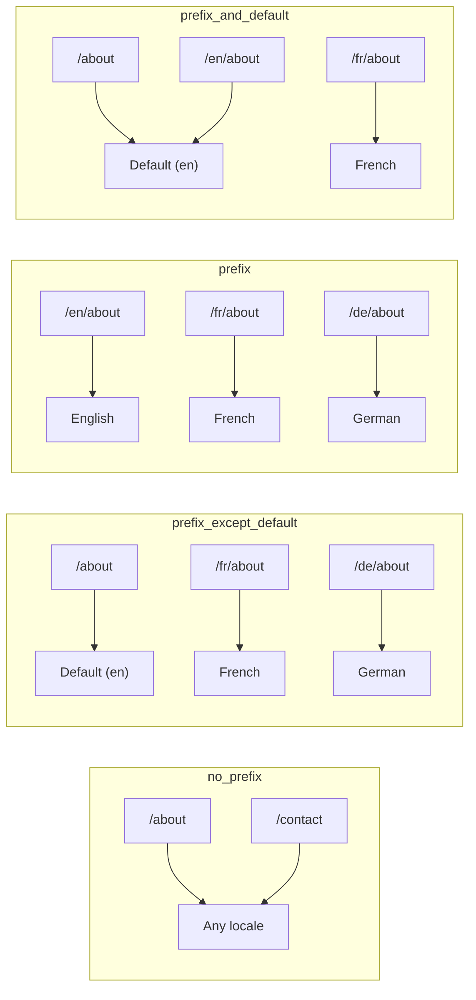
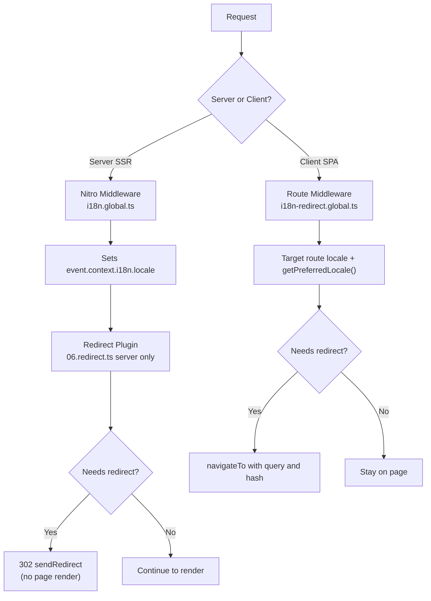

# 🗂️ Nuxt I18n Micro의 라우팅 전략

## 📖 개요

Nuxt I18n Micro는 `strategy` 옵션을 통해 URL에서 로케일 접두사가 나타나는 방식을 제어합니다. 내부적으로 두 개의 패키지가 이를 구현합니다:

- **`@i18n-micro/route-strategy`** — 빌드 타임 라우트 생성(지역화된 라우트로 Nuxt 페이지를 확장)
- **`@i18n-micro/path-strategy`** — 런타임 경로 해석, 리디렉션, SEO 속성 및 링크 생성

Nuxt 모듈은 빌드 타임에 올바른 전략 클래스를 선택하고 `#i18n-strategy`를 통해 별칭을 지정하므로 선택된 구현만 번들에 포함됩니다.

## 🚦 사용 가능한 전략

{/* generated:option:strategy — do not edit; run `pnpm run docs:generate` */}

**타입** `Strategies` · **기본값** `'prefix_except_default'`

로케일 접두사에 대한 URL 라우팅 전략입니다.

- `'no_prefix'` — URL에 로케일 없음; 로케일은 쿠키에 저장됨.
- `'prefix_except_default'` — 기본 로케일을 제외한 모든 로케일에 접두사 추가.
- `'prefix'` — 기본 로케일을 포함하여 항상 접두사 추가.
- `'prefix_and_default'` — `prefix`와 유사하지만 기본 로케일은 접두사 없이도 접근할 수 있음.

{/* /generated:option:strategy */}

### 전략 비교



### 🛑 `no_prefix`

URL에 로케일 세그먼트가 없습니다. 로케일은 쿠키, `useI18nLocale()` 상태 또는 브라우저 감지에 의해 결정됩니다.

- **라우트**: `/about`, `/contact` — 모든 로케일에서 동일한 URL 패턴(`/en/`, `/fr/` 접두사 없음)
- **로케일 지속성**: `localeCookie`를 통해(지정하지 않으면 자동으로 `'user-locale'`로 설정됨)
- **사용자 정의 경로**: [`globalLocaleRoutes`](/guides/configuration#globallocaleroutes) 및 [`defineI18nRoute`](/guides/custom-locale-routes)를 통해 지원됩니다 — 지역화된 슬러그가 URL에 로케일 접두사를 추가하지 않고 생성됩니다(예: `/about` 대 `/ueber-uns`). 중첩 라우트, 별칭 및 로케일별 제한은 `prefix_except_default`보다 더 간단합니다.

<Tip>
`no_prefix`를 사용할 때, `localeCookie`가 지정되지 않으면 자동으로 `'user-locale'`로 설정됩니다. URL에 로케일 정보가 포함되어 있지 않기 때문에 이는 필수입니다.
</Tip>

```typescript
i18n: {
  strategy: 'no_prefix'
  // localeCookie is automatically set to 'user-locale'
}
```

### 🚧 `prefix_except_default`

기본 로케일을 **제외한** 모든 라우트에 로케일 접두사가 있습니다.

- **기본 로케일**: `/about`, `/contact`
- **다른 로케일**: `/fr/about`, `/de/contact`
- **접두사가 있는 기본 로케일은 404 반환**: `/en/about` → 404 (`en`이 기본일 때)

```typescript
i18n: {
  strategy: 'prefix_except_default' // This is the default
}
```

### 🌍 `prefix`

기본 로케일을 포함한 모든 라우트에 로케일 접두사가 있습니다.

- **모든 로케일**: `/en/about`, `/fr/about`, `/de/about`
- **루트 `/`**: 사용자 환경 설정에 따라 `/\{locale\}/`로 리디렉션됩니다.

```typescript
i18n: {
  strategy: 'prefix'
}
```

### 🔄 `prefix_and_default`

기본 로케일은 접두사가 있는 형태와 없는 형태 모두 사용할 수 있습니다. 기본이 아닌 로케일은 항상 접두사가 있습니다.

- **기본 로케일**: `/about`과 `/en/about` 모두 유효
- **다른 로케일**: `/fr/about`, `/de/about`
- **`/`에서 리디렉션 없음**: `/`와 `/en/` 모두 기본 로케일을 제공

```typescript
i18n: {
  strategy: 'prefix_and_default'
}
```

## 🔀 리디렉션 아키텍처 (v3)

v3에서는 최적의 성능을 위해 리디렉션 로직이 두 계층으로 분리되었습니다:

### 동작 방식



### 서버 측(플래시 없음)

1. **Nitro 미들웨어**(`i18n.global.ts`)가 먼저 실행 — URL, 쿠키 또는 `Accept-Language` 헤더에서 로케일을 감지하고 `event.context.i18n.locale`을 설정합니다.
2. **리디렉션 플러그인**(`06.redirect.ts`, 서버 전용)이 `i18nStrategy.getClientRedirect()`를 사용하여 현재 경로가 리디렉션이 필요한지 확인하고 페이지 렌더링 **전에** 302를 발행합니다.
3. 이를 통해 사용자가 리디렉션 전에 잘못된 페이지를 잠깐 보게 되는 "오류 플래시"를 방지합니다.

### 클라이언트 측(SPA 내비게이션)

1. 전역 라우트 미들웨어(`i18n-redirect.global.ts`)는 `redirects`가 활성화된 경우 각 클라이언트 내비게이션에서 실행됩니다.
2. **대상 라우트**에서 먼저 환경 설정 로케일을 도출한 다음 `useI18nLocale().getPreferredLocale()`로 폴백합니다.
3. `i18nStrategy.getClientRedirect()`를 사용하여 리디렉션이 필요한지 결정합니다.
4. 리디렉션 시 `query`와 `hash`를 유지합니다.

### 로케일 우선순위 순서

서버에서 리디렉션 플러그인은 다음 순서로 환경 설정 로케일을 결정합니다:

1. **`useState('i18n-locale')`** — 최우선(프로그래매틱하게 `useI18nLocale().setLocale()`로 설정)
2. **쿠키** — `localeCookie`가 구성된 경우
3. **`Accept-Language` 헤더** — `autoDetectLanguage: true`인 경우
4. **`defaultLocale`** — 최종 폴백

클라이언트에서는 라우트 미들웨어가 대상 라우트의 로케일을 선호한 다음 동일한 상태/쿠키 폴백 체인을 사용합니다.

### 전략별 리디렉션 동작

| 전략                | `GET /` 동작                              | 쿠키 필요? |
| ----------------------- | --------------------------------------------- | ---------------- |
| `no_prefix`             | 리디렉션 없음(쿠키/상태에서 로케일 결정)        | 자동 설정         |
| `prefix`                | 302 → `/\{locale\}/`                            | 권장      |
| `prefix_except_default` | 로케일 ≠ 기본이면 302 → `/\{locale\}/`        | 권장      |
| `prefix_and_default`    | 리디렉션 없음(`/`와 `/\{locale\}/` 모두 유효) | 선택 사항         |

### 리디렉션 비활성화

```typescript
i18n: {
  redirects: false // Disables automatic locale redirects
}
```

`redirects: false`일 때 자동 로케일 리디렉션은 비활성화됩니다:

- **서버**: 리디렉션 플러그인(`06.redirect.ts`, 서버 전용)은 등록된 상태로 유지되지만 리디렉션 로직을 건너뜁니다. 잘못된 로케일 접두사(예: `xx`가 유효한 로케일이 아닌 `/xx/about`)에 대한 **404 검사**와 URL 접두사에서의 **쿠키 동기화**(예: `/fr/about`을 방문하면 쿠키가 `fr`로 동기화됨)는 계속 수행합니다.
- **클라이언트**: `i18n-redirect` 전역 라우트 미들웨어는 **등록되지 않습니다** — SPA 자동 리디렉션이 없습니다.

## 🍪 쿠키 기반 로케일 지속성

<Warning>
`redirects: true`(기본값)와 함께 `prefix` 또는 `prefix_except_default`를 사용할 때는 리디렉션이 올바르게 작동하려면 **반드시** `localeCookie`를 설정해야 합니다. 쿠키가 없으면 리디렉션 플러그인은 페이지 리로드 간에 사용자의 로케일 환경 설정을 기억할 수 없습니다.

```typescript
i18n: {
  strategy: 'prefix_except_default',
  localeCookie: 'user-locale' // Required for redirects to work properly
}
```
</Warning>

**v3에서 `localeCookie`가 작동하는 방식:**

- 내부적으로 `useI18nLocale()`이 관리합니다 — `useCookie()`를 통해 **수동으로 설정하지 마세요**.
- 사용자가 접두사가 있는 URL(예: `/fr/about`)을 방문하면 쿠키가 자동으로 `fr`로 동기화됩니다.
- 다음 방문 시 `/`에서는 쿠키 값이 `/\{locale\}/`로 리디렉션하는 데 사용됩니다.
- 쿠키에 유효하지 않은 로케일(로케일 목록에 없음)이 포함되어 있으면 `defaultLocale`로 폴백됩니다.

| 전략                | `localeCookie` 기본값 | 참고                                |
| ----------------------- | ---------------------- | ------------------------------------ |
| `no_prefix`             | 자동: `'user-locale'`  | 필수; 자동으로 설정됨          |
| `prefix`                | `null` (비활성화)      | 리디렉션을 위해 `'user-locale'`로 설정 |
| `prefix_except_default` | `null` (비활성화)      | 리디렉션을 위해 `'user-locale'`로 설정 |
| `prefix_and_default`    | `null` (비활성화)      | 선택 사항                             |

## 🔍 `autoDetectLanguage`와 `autoDetectPath`

### `autoDetectLanguage`

{/* generated:option:autoDetectLanguage — do not edit; run `pnpm run docs:generate` */}

**타입** `boolean` · **기본값** `true`

`Accept-Language` HTTP 헤더에서 사용자의 환경 설정 언어를 자동으로 감지합니다.
`autoDetectPath`와 함께 사용하여 감지가 발생하는 시점을 결정합니다.

{/* /generated:option:autoDetectLanguage */}

이 검사는 서버 미들웨어에서 실행되며 폴백입니다: 쿠키 또는 기존 상태가 우선합니다.

```typescript
i18n: {
  autoDetectLanguage: true
}
```

### `autoDetectPath`

{/* generated:option:autoDetectPath — do not edit; run `pnpm run docs:generate` */}

**타입** `string` · **기본값** `'/'`

쿠키 / Accept-Language 환경 설정 리디렉션이 실행될 수 있는 곳(`redirects`가 활성화된 경우).

- `'/'` — `/`에서만 실행(기본 로케일의 딥 링크는 계속 접근 가능; 기본값)
- `'no_prefix'` — 로케일 접두사가 없는 경로만
- `'*'` — 명시적인 로케일 접두사 재작성을 포함한 모든 경로
  (예: 쿠키가 `de`를 선호할 때 `/fr/about` → `/de/about`)

- 다른 문자열 — 정확한 경로 일치(예: `'/welcome'`)

접두사 전략 정리(예: `prefix_except_default`에서 `/en` → `/`)는 게이팅되지 않습니다.

{/* /generated:option:autoDetectPath */}

```typescript
i18n: {
  autoDetectPath: '/' // Default: only root
  // autoDetectPath: '*' // All paths — redirects even /fr/about to /de/about
}
```

<Warning>
`autoDetectPath: '*'`을 사용하면 명시적인 로케일 접두사(예: `/fr/about`)가 있는 URL이라도 사용자의 환경 설정 로케일이 다르면 리디렉션됩니다. 도메인 기반 설정에는 유용할 수 있지만 URL을 공유하는 사용자에게 혼란을 줄 수 있습니다.
</Warning>

기본 `autoDetectPath: '/'`와 로케일 쿠키를 사용하는 경우:

| 요청 | 쿠키 | 결과 |
| --- | --- | --- |
| `/` | `de` | 302 → `/de` |
| `/about` | `de` | 200, 기본 로케일(재작성 없음) |

```typescript
i18n: {
  localeCookie: 'user-locale',
  strategy: 'prefix_except_default',
  // Default — remember language on entry, keep deep links stable
  autoDetectPath: '/',
  // Or redirect on every unprefixed path (but not /de/… → /fr/…):
  // autoDetectPath: 'no_prefix',
}
```

## ⚠️ 알려진 문제 및 모범 사례

### 1. `no_prefix` 전략에서의 하이드레이션 불일치

`no_prefix`를 사용할 때 로케일은 동적으로 결정됩니다. 서버와 클라이언트가 로케일에 대해 일치하지 않으면 하이드레이션 불일치가 발생합니다.

**해결책**: i18n 초기화 전에 로케일을 설정하기 위해 서버 플러그인에서 `useI18nLocale().setLocale()`을 사용하세요(`order: -10` 사용):

```ts
// plugins/i18n-loader.server.ts
export default defineNuxtPlugin({
  name: 'i18n-custom-loader',
  enforce: 'pre',
  order: -10,
  setup() {
    const { setLocale } = useI18nLocale()
    setLocale('ja') // Your detection logic here
  },
})
```

자세한 예제는 [Custom Language Detection](/guides/custom-language-detection)을 참조하세요.

### 2. `localeRoute`에서 명명된 라우트 사용

경로 기반 라우팅은 라우트 해석 문제를 일으킬 수 있습니다:

```typescript
// May cause issues
$localeRoute('/page')

// Preferred approach
$localeRoute({ name: 'page' })
```

### 3. i18n과 함께 `pages: false` 사용하기

Nuxt에서 `pages: false`를 사용할 때:

```typescript
export default defineNuxtConfig({
  pages: false,
  i18n: {
    strategy: 'no_prefix', // Recommended
    disablePageLocales: true, // Required
    localeCookie: 'user-locale', // Required for persistence
  },
})
```

**`pages: false`의 제한 사항:**

- 자동 리디렉션 없음
- URL 기반 로케일 감지 없음
- 클라이언트 측 로케일 전환은 페이지 리로드 또는 수동 번역 로드가 필요합니다.

### 4. 잘못된 쿠키 처리

쿠키에 유효하지 않은 로케일(`locales` 목록에 없음)이 포함되어 있으면 모듈이 `defaultLocale`로 우아하게 폴백됩니다. 오류는 발생하지 않습니다.

## 📝 모범 사례 요약

| 권장 사항            | 세부 사항                                                                             |
| ------------------------- | ----------------------------------------------------------------------------------- |
| **`localeCookie` 설정**    | `redirects: true`가 있는 접두사 전략에 대해 항상 설정                             |
| **`useI18nLocale()` 사용** | 로케일 상태를 관리하는 중앙 집중식 방법(수동 `useState`/`useCookie` 대체) |
| **명명된 라우트 사용**      | `$localeRoute('/page')`보다 `$localeRoute(\{ name: 'page' \})` 사용                       |
| **프로그래매틱 로케일**   | `order: -10`인 서버 플러그인에서 `useI18nLocale().setLocale()` 사용              |
| **수동 쿠키 사용 금지**  | `useCookie('user-locale')`를 직접 사용하지 마세요 — `useI18nLocale()`이 이를 관리합니다.      |
