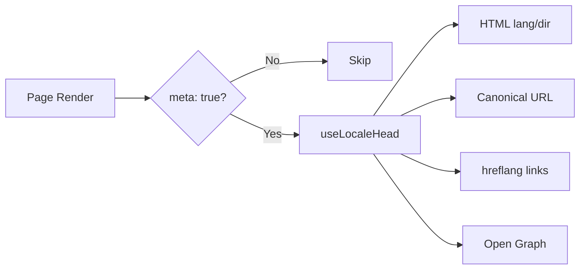

# 🌐 Nuxt I18n Micro SEO 가이드

## 📖 소개

효과적인 SEO(검색 엔진 최적화)는 다국어 사이트가 검색 엔진을 통해 전 세계 사용자에게 접근 가능하고 표시되도록 하는 데 필수적입니다. `Nuxt I18n Micro`는 사이트의 구조와 내용을 검색 엔진에 알리는 필수 메타 태그와 속성을 자동으로 생성함으로써 다국어 사이트의 SEO 관리 프로세스를 단순화합니다.

이 가이드는 `Nuxt I18n Micro`가 추가 구성 없이 사이트의 가시성과 사용자 경험을 향상시키기 위해 SEO를 어떻게 처리하는지 설명합니다.

## ⚙️ 자동 SEO 처리

### SEO 메타 생성 흐름



**생성되는 태그:**

| 태그             | 예제                                                  |
| --------------- | -------------------------------------------------------- |
| HTML 속성 | `<html lang="en" dir="ltr">`                             |
| Canonical       | `<link rel="canonical" href="...">`                      |
| hreflang        | `<link rel="alternate" hreflang="en" href="...">`        |
| x-default       | `<link rel="alternate" hreflang="x-default" href="...">` |
| Open Graph      | `<meta property="og:locale" content="en_US">`            |

#### 로케일별 `og` (`og:locale` vs BCP 47)

`<html lang>`과 `hreflang`은 `locale.iso`를 통해 **BCP 47**을 사용합니다(예: `ar-AE`).  
Open Graph는 [OG 프로토콜](https://ogp.me/)에 따라 **밑줄**이 있는 **`language_TERRITORY`**를 요구합니다(`ar_AE`).

기본적으로 매핑이 명확한 경우 `og:locale`은 `iso`에서 파생됩니다(`en-US` → `en_US`).  
사용자 정의 값이 필요할 때 명시적 **`og`** 문자열을 설정하세요(예: `zh-Hans` → `zh_CN`).  
`og`도 없고 변환 가능한 `iso`도 없다면 `og:locale` 태그는 생성되지 않습니다 — 개발 중에는 콘솔 경고를 볼 수 있습니다(`missingWarn` 존중).

```typescript
i18n: {
  meta: true,
  locales: [
    { code: 'ar', iso: 'ar-AE', og: 'ar_AE', dir: 'rtl' },
    { code: 'en', iso: 'en-US' }, // og:locale → en_US
    { code: 'zh', iso: 'zh-Hans', og: 'zh_CN' }, // script tags need explicit og
  ],
}
```

### 🔑 주요 SEO 기능

`Nuxt I18n Micro`에서 `meta` 옵션이 활성화되면 모듈이 다음 SEO 측면을 자동으로 관리합니다:

1. **🌍 언어 및 방향 속성**:
   - 모듈은 현재 로케일과 텍스트 방향(예: 영어의 경우 `ltr`, 아랍어의 경우 `rtl`)에 따라 `<html>` 태그의 `lang` 및 `dir` 속성을 설정합니다.

2. **🔗 Canonical URL**:
   - 모듈은 각 페이지에 대해 canonical 링크(`<link rel="canonical">`)를 생성하여 검색 엔진이 콘텐츠의 주요 버전을 인식하도록 합니다.

3. **🌐 대체 언어 링크 (`hreflang`)**:
   - 모듈은 사용 가능한 모든 로케일에 대해 `<link rel="alternate" hreflang="">` 태그를 자동으로 생성합니다. 이는 검색 엔진이 콘텐츠의 어떤 언어 버전을 사용할 수 있는지 이해하도록 도와 글로벌 사용자에게 더 나은 사용자 경험을 제공합니다.
   - 각 로케일은 **하나의** 태그를 생성합니다: `hreflang = iso || code`. `iso`가 설정되어 있을 때 라우팅 `code`는 절대 `hreflang`으로 사용되지 않습니다(따라서 `mx` 같은 시장 키가 유효하지 않은 언어 태그가 되지 않습니다).
   - 선택적 `hreflangBaseLanguage: true`는 `iso`에서 파생된 순수 언어 태그(예: `es-ES` → `es`)도 생성하며, `locales`의 첫 번째 지역 로케일이 이를 담당합니다.

4. **🌏 `x-default` Hreflang**:
   - 모듈은 기본 로케일의 URL을 가리키는 `<link rel="alternate" hreflang="x-default">` 태그를 자동으로 생성합니다. 이는 정의된 로케일 중 어떤 것과도 언어가 일치하지 않는 사용자에게 검색 엔진이 어떤 URL을 표시할지 알려줍니다. 추가 구성이 필요하지 않습니다 — `meta: true`가 설정되면 자동으로 작동합니다.

5. **🔖 Open Graph 메타데이터**:
   - 모듈은 각 로케일에 대해 Open Graph 메타 태그(`og:locale`, `og:url` 등)를 생성하며, 이는 특히 소셜 미디어 공유 및 검색 엔진 인덱싱에 유용합니다.

### 🛠️ 구성

이러한 SEO 기능을 활성화하려면 `nuxt.config.ts` 파일에서 `meta` 옵션을 `true`로 설정하세요:

```typescript
export default defineNuxtConfig({
  modules: ['nuxt-i18n-micro'],
  i18n: {
    locales: [
      { code: 'en', iso: 'en-US', dir: 'ltr' },
      { code: 'fr', iso: 'fr-FR', dir: 'ltr' },
      { code: 'ar', iso: 'ar-SA', dir: 'rtl' },
    ],
    defaultLocale: 'en',
    translationDir: 'locales',
    meta: true, // Enables automatic SEO management
  },
})
```

### 🌍 다중 도메인 배포를 위한 동적 `metaBaseUrl`

`metaBaseUrl`이 설정되지 않은 경우 절대 SEO URL은 다음 순서로 해석됩니다(#240):

1. [`nuxt-site-config`](https://nuxtseo.com/docs/site-config)의 `site.url`(해당 모듈이 있는 경우 — 예: `@nuxtjs/seo`를 통해)
2. 그렇지 않으면 현재 요청의 호스트명(`useRequestURL()` / `window.location.origin`)

요청 원본 폴백은 리버스 프록시 헤더(`X-Forwarded-Host`, `X-Forwarded-Proto`)를 존중하므로 nginx, Cloudflare, AWS ALB 및 유사한 프록시 뒤에서 올바르게 작동합니다.

이는 sitemap / robots / schema.org에 이미 `site.url`을 설정한 앱이 두 번째 `metaBaseUrl` 선언을 할 필요가 **없다는** 것을 의미합니다:

```typescript
export default defineNuxtConfig({
  site: {
    url: process.env.NUXT_SITE_URL, // also used by micro for canonical / og:url / hreflang
  },
  i18n: {
    meta: true,
    // metaBaseUrl omitted — picks up site.url, then request origin
  },
})
```

`site.url` 없이도 단일 애플리케이션 인스턴스는 요청 원본을 통해 각 도메인에 맞는 SEO 태그로 **여러 도메인**을 계속 제공할 수 있습니다:

```typescript
export default defineNuxtConfig({
  i18n: {
    meta: true,
    // metaBaseUrl is undefined by default — resolved dynamically from the request
  },
})
```

예를 들어, `https://site-a.com/en/about`에 대한 요청은 다음을 생성합니다:

```html
<link rel="canonical" href="https://site-a.com/en/about" /> <meta property="og:url" content="https://site-a.com/en/about" />
```

동일한 앱이 `https://site-b.com/en/about`을 제공할 때는 다음을 생성합니다:

```html
<link rel="canonical" href="https://site-b.com/en/about" /> <meta property="og:url" content="https://site-b.com/en/about" />
```

`site.url`보다 항상 우선하는 고정 base URL이 필요한 경우 정적 문자열을 전달하세요:

```typescript
metaBaseUrl: 'https://example.com'
```

### 🔍 Canonical 쿼리 화이트리스트

기본적으로 쿼리 매개변수는 중복 콘텐츠를 방지하기 위해 canonical과 `og:url`에서 제거됩니다. 유지해야 하는 특정 쿼리 매개변수를 화이트리스트로 지정할 수 있습니다:

```typescript
i18n: {
  canonicalQueryWhitelist: ['page', 'sort', 'filter', 'search', 'q', 'query', 'tag']
}
```

`canonicalQueryWhitelist`에 나열된 매개변수만 canonical URL에 표시됩니다. 다른 모든 쿼리 매개변수(예: 추적, 세션 ID)는 제거됩니다.

### 🚫 페이지별 메타 태그 비활성화

`defineI18nRoute()`를 사용하여 특정 페이지에 대해 SEO 메타 태그 생성을 비활성화할 수 있습니다:

```vue
<script setup>
// Disable all SEO meta tags for this page
defineI18nRoute({
  disableMeta: true,
})
</script>
```

특정 로케일에 대해서만 메타를 비활성화할 수도 있습니다:

```vue
<script setup>
// Disable meta tags only for English locale on this page
defineI18nRoute({
  disableMeta: ['en'],
})
</script>
```

`disableMeta`가 활성화되면 해당 페이지/로케일에 대해 `hreflang`, `canonical`, `og:locale`, `og:url`, `x-default` 태그가 생성되지 않습니다.

### 🔇 비활성화된 로케일

`disabled: true`인 로케일은 모든 SEO 태그 생성에서 자동으로 제외됩니다 — 해당 로케일에 대해 `hreflang`, `og:locale:alternate` 또는 대체 링크가 생성되지 않습니다:

```typescript
i18n: {
  locales: [
    { code: 'en', iso: 'en-US' },
    { code: 'fr', iso: 'fr-FR', disabled: true }, // excluded from SEO tags
  ]
}
```

### 🙈 옵트아웃 로케일 (`seo: false`)

라우팅과 번역이 가능하지만 로케일 간 발견 태그에 표시되어서는 안 되는 로케일의 경우 `seo: false`로 설정하세요. 이러한 로케일은 `hreflang` 대체와 `og:locale:alternate`에서 생략됩니다. 구성된 **기본** 로케일에 `seo: false`가 있으면 `x-default` 링크도 생성되지 않습니다.

```typescript
i18n: {
  locales: [
    { code: 'en', iso: 'en-US' },
    { code: 'ru', iso: 'ru-RU', seo: false }, // internal / non-indexed locale
  ]
}
```

### 📌 전략별 동작

| 전략                | hreflang 링크   | x-default             | canonical      | og:url |
| ----------------------- | ---------------- | --------------------- | -------------- | ------ |
| `prefix`                | ✅ 모든 로케일   | ✅ 기본 로케일 URL | ✅ 현재 URL | ✅     |
| `prefix_except_default` | ✅ 모든 로케일   | ✅ 접두사 없는 URL     | ✅ 현재 URL | ✅     |
| `prefix_and_default`    | ✅ 모든 로케일   | ✅ 기본 로케일 URL | ✅ 현재 URL | ✅     |
| `no_prefix`             | ❌ 생성 안 됨 | ❌ 생성 안 됨      | ✅ 현재 URL | ✅     |

`no_prefix` 전략의 경우 `canonical`, `og:url`, `og:locale`, `html` 속성(`lang`, `dir`)만 생성됩니다. 로케일마다 별개의 URL이 없기 때문에 대체 언어 링크(`hreflang`)와 `x-default`는 생성되지 않습니다.

## 페이지 수준 재정의 (`useI18nHead`)

**모든 로케일이 존재하지 않거나 URL이 API에서 오는 아티클, 가이드 또는 모든 CMS 콘텐츠**의 경우, 사용자 정의 i18n 헤드 플러그인 대신 페이지에서 [`useI18nHead`](/api/composables/use-i18n-head)를 사용하세요.

### 부분 번역이 있는 아티클

```vue
<script setup lang="ts">
const article = await loadArticle()
// article.locales = { en: '...', de: '...' } — only translated locales

useI18nHead({
  meta: [{ property: 'og:title', content: article.title }],
  replace: {
    hreflang: Object.entries(article.locales).map(([locale, href]) => ({
      rel: 'alternate',
      hreflang: locale,
      href,
    })),
    ogAlternates: Object.keys(article.locales),
  },
})
</script>
```

### `$setI18nRouteParams`를 사용한 로케일별 슬러그

슬러그가 언어별로 다를 때, 먼저 라우트 매개변수를 설정한 다음 실제 URL로 대체를 재정의합니다:

```vue
<script setup lang="ts">
const { $defineI18nRoute, $setI18nRouteParams } = useNuxtApp()
const { data: article } = await useFetch(`/api/articles/${slug}`)

$defineI18nRoute({
  localeRoutes: { en: '/blog/[slug]', de: '/de/blog/[slug]' },
})

$setI18nRouteParams({
  en: { slug: article.value.slugEn },
  de: { slug: article.value.slugDe },
})

useI18nHead({
  replace: {
    hreflang: ['en', 'de'].map((locale) => ({
      rel: 'alternate',
      hreflang: locale,
      href: article.value.urls[locale],
    })),
    ogAlternates: ['en', 'de'],
  },
})
</script>
```

### 프록시 뒤에서의 HTTPS 원본

사용자 정의 원본 컴포저블 없이 SSR에서 올바른 절대 URL을 얻으려면:

```ts
i18n: {
  meta: true,
  metaBaseUrl: undefined,
  metaTrustForwardedHost: true,
  metaTrustForwardedProto: true,
}
```

더 많은 예제(canonical 재정의, `x-default`, 반응형 fetch, 공유 헬퍼): [useI18nHead 컴포저블](/api/composables/use-i18n-head).

### ⚠️ 후행 슬래시

모듈은 `useRoute().fullPath`의 실제 경로를 기반으로 canonical과 `hreflang` URL을 생성합니다. 애플리케이션이 후행 슬래시를 사용하는 경우(예: Nuxt의 `router.options`를 통해), 생성된 URL이 이를 반영합니다. 그러나 `$switchLocalePath`는 경로를 정규화하고 후행 슬래시를 제거할 수 있습니다. 후행 슬래시 일관성이 SEO에 중요하다면 생성된 URL이 애플리케이션의 URL 구조와 일치하는지 확인하세요.

### 🎯 이점

`meta` 옵션을 활성화하면 다음과 같은 이점이 있습니다:

- **📈 검색 엔진 순위 향상**: 검색 엔진이 다양한 언어 버전 간의 관계를 이해하여 사이트를 더 잘 인덱싱할 수 있습니다.
- **👥 더 나은 사용자 경험**: 사용자에게 자신의 환경 설정에 맞는 올바른 언어 버전이 제공되어 더 개인화된 경험을 얻을 수 있습니다.
- **🔧 수동 구성 감소**: 모듈이 SEO 작업을 자동으로 처리하므로 SEO 관련 메타 태그와 속성을 수동으로 추가할 필요가 없습니다.

## 🔗 Nuxt SEO (`@nuxtjs/seo`)

[`@nuxtjs/seo`](https://nuxtseo.com/)는 sitemap, robots, schema.org, OG 이미지 및 관련 모듈을 번들로 제공합니다. [`nuxt-site-config`](https://nuxtseo.com/docs/site-config/guides/i18n)(v4+)를 통해 **nuxt-i18n-micro**와 통합됩니다.

### 요구 사항

- **`@nuxtjs/seo` 3+** (현재 릴리스는 micro용 `nuxt-site-config:i18n` 플러그인을 등록하는 `nuxt-site-config` 4+를 사용합니다)
- **`i18n.meta: true`** (권장 — micro는 로케일 인식 헤드 태그를 제공하고 Nuxt SEO는 sitemap, schema.org 등을 추가합니다)

### 모듈 순서

**nuxt-i18n-micro를 `@nuxtjs/seo`보다 앞에** 나열하여 사이트 구성이 로케일 설정을 읽을 수 있도록 합니다:

```typescript
export default defineNuxtConfig({
  modules: ['nuxt-i18n-micro', '@nuxtjs/seo'],
  site: {
    url: 'https://example.com',
    name: 'My Site',
  },
  i18n: {
    meta: true,
    defaultLocale: 'en',
    locales: [
      { code: 'en', iso: 'en-US' },
      { code: 'de', iso: 'de-DE' },
    ],
  },
})
```

### 번역된 사이트 이름 및 설명

Nuxt Site Config는 로케일 파일에서 선택적 번역 키를 읽습니다:

```json
{
  "nuxtSiteConfig": {
    "name": "My Site",
    "description": "My site description"
  }
}
```

`locales/en.json`, `locales/de.json` 등의 로케일별 값이 자동으로 선택됩니다.

### 문제 해결

`Plugin nuxt-seo:defaults depends on nuxt-site-config:i18n but they are not registered`를 볼 수 있다면 **`@nuxtjs/seo`를 3+로 업그레이드**하세요([이슈 #133](https://github.com/s00d/nuxt-i18n-micro/issues/133) 참조). 이전 `nuxt-site-config` 3.x는 micro가 아닌 `@nuxtjs/i18n`용으로만 i18n을 연결했습니다.

더 보기: [Sitemap i18n 가이드](https://nuxtseo.com/docs/sitemap/guides/i18n), [Site Config i18n 가이드](https://nuxtseo.com/docs/site-config/guides/i18n).
