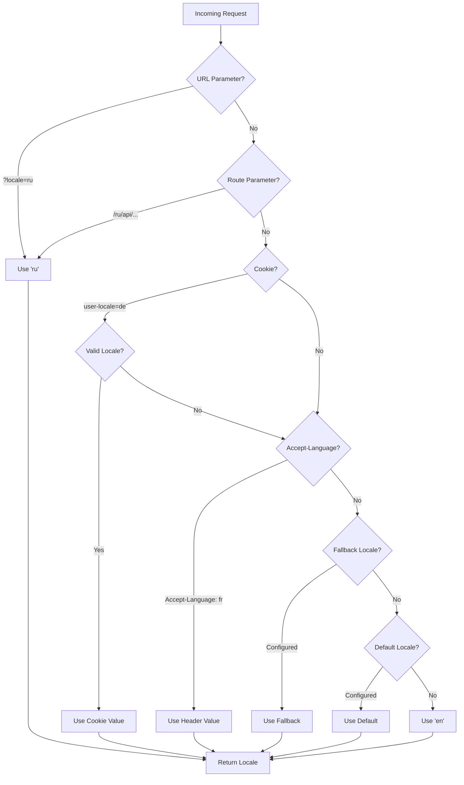

# 🌍 Nuxt I18n Micro의 서버 측 번역 및 로케일 정보

## 📖 개요

Nuxt I18n Micro는 서버 측 번역과 로케일 정보를 지원하여 서버에서 콘텐츠를 번역하고 로케일 세부 정보에 접근할 수 있게 합니다. 이는 클라이언트에 도달하기 전에 지역화가 필요한 API나 서버 렌더링 애플리케이션에 특히 유용합니다.

번역은 Nuxt I18n 구성에서 정의된 로케일 메시지를 사용하며 감지된 로케일에 따라 동적으로 해석됩니다.

기본적으로(`translationPayloads.mode: 'premerged'`) 루트 레벨 파일은 빌드 타임에 `\{page\}/\{locale\}/data.json`으로 모든 페이지 페이로드에 포함됩니다. 서버는 클라이언트가 `/\{apiBaseUrl\}/...` 아래에서 가져오는 것과 동일한 미리 빌드된 파일을 로드하므로, 서버 핸들러에서 모든 키(공유 및 페이지별)를 사용할 수 있습니다.

`translationPayloads.mode: 'source'`에서는 `loadTranslationsFromServer()`(또는 `/_locales` 라우트)가 호출될 때 컴팩트 소스 파일이 런타임에 병합됩니다 — **Edge**에서는 Nitro `serverAssets`를 통해, **Node**에서는 선택적 public 사본에서. 자세한 내용은 [Performance Guide — Serverless Payload Output](/guides/performance#serverless-payload-output)과 [Cache & Storage Architecture](/api/cache)를 참조하세요.

런타임 및 서버 API의 통합 목록은 [API 참조](/api/overview)를 확인하세요.

## 🛠️ 서버 측 미들웨어 설정

서버 측 번역과 로케일 정보를 활성화하려면 제공된 미들웨어 함수를 사용하세요:

- `useTranslationServerMiddleware` - 콘텐츠 번역용
- `useLocaleServerMiddleware` - 로케일 정보 액세스용

두 미들웨어 함수 모두 모든 서버 라우트에서 자동으로 사용할 수 있습니다.

로케일 감지 로직은 모듈 전체의 일관성을 보장하기 위해 `detectCurrentLocale` 유틸리티 함수를 통해 두 미들웨어 함수 간에 공유됩니다.

## ✨ 서버 핸들러에서 번역 사용하기

번역 미들웨어를 사용하여 모든 `eventHandler`에서 콘텐츠를 매끄럽게 번역할 수 있습니다.

### 예제: 기본 번역 사용법

```typescript
import { defineEventHandler } from 'h3'

export default defineEventHandler(async (event) => {
  const t = await useTranslationServerMiddleware(event)
  return {
    message: t('greeting'), // Returns the translated value for the key "greeting"
  }
})
```

이 예제에서:

- 사용자의 로케일은 쿼리 매개변수, 쿠키 또는 헤더에서 자동으로 감지됩니다.
- `t` 함수는 감지된 로케일에 대한 적절한 번역을 검색합니다.

## 🌍 서버 핸들러에서 로케일 정보 사용하기

### 기본 로케일 정보 사용법

```typescript
import { defineEventHandler } from 'h3'

export default defineEventHandler((event) => {
  const localeInfo = useLocaleServerMiddleware(event)

  return {
    success: true,
    data: localeInfo,
    timestamp: new Date().toISOString(),
  }
})
```

### 사용자 정의 로케일 매개변수 제공

```typescript
import { defineEventHandler } from 'h3'

export default defineEventHandler((event) => {
  // Force specific locale with custom default
  const localeInfo = useLocaleServerMiddleware(event, 'en', 'ru')

  return {
    success: true,
    data: localeInfo,
    timestamp: new Date().toISOString(),
  }
})
```

### 응답 구조

로케일 미들웨어는 다음 속성을 가진 `LocaleInfo` 객체를 반환합니다:

```typescript
interface LocaleInfo {
  current: string // Current detected locale code
  default: string // Default locale code
  fallback: string // Fallback locale code
  available: string[] // Array of all available locale codes
  locale: Locale | null // Full locale configuration object
  isDefault: boolean // Whether current locale is the default
  isFallback: boolean // Whether current locale is the fallback
}
```

### 예제 응답

```json
{
  "success": true,
  "data": {
    "current": "ru",
    "default": "en",
    "fallback": "en",
    "available": ["en", "ru", "de"],
    "locale": {
      "code": "ru",
      "iso": "ru-RU",
      "dir": "ltr",
      "displayName": "Русский"
    },
    "isDefault": false,
    "isFallback": false
  },
  "timestamp": "2024-01-15T10:30:00.000Z"
}
```

## 🌐 사용자 정의 로케일 제공하기

로케일을 수동으로 지정해야 하는 경우(예: 테스트 또는 특정 요청) 번역 미들웨어에 전달할 수 있습니다:

### 예제: 사용자 정의 로케일

```typescript
import { defineEventHandler } from 'h3'

function detectLocale(event): string | null {
  const urlSearchParams = new URLSearchParams(event.node.req.url?.split('?')[1])
  const localeFromQuery = urlSearchParams.get('locale')
  if (localeFromQuery) return localeFromQuery

  return 'en'
}

export default defineEventHandler(async (event) => {
  const t = await useTranslationServerMiddleware(event, 'en', detectLocale(event)) // Force French local, en - default locale
  return {
    message: t('welcome'), // Returns the French translation for "welcome"
  }
})
```

## 📋 로케일 감지 로직

두 미들웨어 함수 모두 다음 우선순위 순서를 사용하여 사용자의 로케일을 자동으로 결정합니다:



1. **URL 매개변수**: `?locale=ru`
2. **라우트 매개변수**: `/ru/api/endpoint`
3. **쿠키**: `user-locale` 쿠키
4. **HTTP 헤더**: `Accept-Language` 헤더
5. **폴백 로케일**: 모듈 옵션에 구성된 대로
6. **기본 로케일**: 모듈 옵션에 구성된 대로
7. **하드코딩된 폴백**: `'en'`

> **참고**: 로케일 감지 로직은 모듈 전체의 일관성을 보장하기 위해 `useLocaleServerMiddleware`와 `useTranslationServerMiddleware` 간에 공유됩니다.

## 📋 고급 사용 예제

### 로케일 기반 조건부 응답

```typescript
import { defineEventHandler } from 'h3'

export default defineEventHandler((event) => {
  const { current, isDefault, locale } = useLocaleServerMiddleware(event)

  // Return different content based on locale
  if (current === 'ru') {
    return {
      message: 'Привет, мир!',
      locale: current,
      isDefault,
    }
  }

  if (current === 'de') {
    return {
      message: 'Hallo, Welt!',
      locale: current,
      isDefault,
    }
  }

  // Default English response
  return {
    message: 'Hello, World!',
    locale: current,
    isDefault,
  }
})
```

### 사용자 정의 로케일 감지

```typescript
import { defineEventHandler } from 'h3'

export default defineEventHandler((event) => {
  // Force German locale with English as fallback
  const { current, isDefault, locale } = useLocaleServerMiddleware(event, 'en', 'de')

  return {
    message: 'Hallo, Welt!',
    locale: current,
    isDefault: false, // Will be false since we forced German
  }
})
```

### 검증을 포함한 로케일 인식 API

```typescript
import { defineEventHandler, createError } from 'h3'

export default defineEventHandler((event) => {
  const { current, available, locale } = useLocaleServerMiddleware(event)

  // Validate if the detected locale is supported
  if (!available.includes(current)) {
    throw createError({
      statusCode: 400,
      statusMessage: `Unsupported locale: ${current}. Available locales: ${available.join(', ')}`,
    })
  }

  // Return locale-specific configuration
  return {
    locale: current,
    direction: locale?.dir || 'ltr',
    displayName: locale?.displayName || current,
    availableLocales: available,
  }
})
```

### 번역 미들웨어와의 통합

로케일 정보를 번역 미들웨어와 결합하여 포괄적인 국제화를 구현할 수 있습니다:

```typescript
import { defineEventHandler } from 'h3'

export default defineEventHandler(async (event) => {
  const localeInfo = useLocaleServerMiddleware(event)
  const t = await useTranslationServerMiddleware(event)

  return {
    locale: localeInfo.current,
    message: t('welcome_message'),
    availableLocales: localeInfo.available,
    isDefault: localeInfo.isDefault,
  }
})
```

## 📝 모범 사례

1. **항상 로케일 검증**: 감지된 로케일이 사용 가능한 로케일 목록에 있는지 확인하세요.
2. **폴백 로직 사용**: 로케일 감지가 실패할 때 합리적인 기본값을 제공하세요.
3. **로케일 정보 캐시**: 성능이 중요한 애플리케이션의 경우 로케일 감지 결과를 캐시하는 것을 고려하세요.
4. **엣지 케이스 처리**: 지원되지 않는 로케일을 고려하고 적절한 오류 응답을 제공하세요.
5. **번역과 결합**: 완전한 i18n 지원을 위해 로케일 정보를 번역 미들웨어와 함께 사용하세요.

## 🚀 성능 고려 사항

- 두 미들웨어 함수 모두 가볍고 빠른 실행을 위해 설계되었습니다.
- 로케일 감지는 효율적인 폴백 체인을 사용합니다.
- 로케일 감지 중에 외부 API 호출이 이루어지지 않습니다.
- 최적의 성능을 위해 결과가 동기적으로 계산됩니다.
