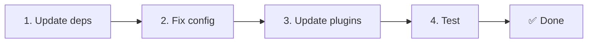

# 📦 v2.x에서 v3.x로 업그레이드

<Tip>
[nuxt-i18n에서 마이그레이션](/migration/from-nuxtjs-i18n)을 참고하세요. 해당 가이드는 vue-i18n 생태계에서의 이동을 다루며 nuxt-i18n-micro v2에서의 이동을 다루지 않습니다.
</Tip>

v3.0.0은 근본적인 아키텍처 변경을 도입합니다: 전략 패키지, 새 캐싱 시스템, `useI18nLocale()`을 통한 중앙 집중식 로케일 관리, 재설계된 리디렉션 파이프라인. 이 섹션은 모든 주요 변경 사항과 코드 업데이트 방법을 다룹니다.

## 마이그레이션 단계



## 주요 변경 사항 요약

- **로케일 상태** — 수동 `useState` / `useCookie` → `useI18nLocale()` 컴포저블
- **설정 접근** — `useRuntimeConfig().public.i18nConfig` → `#build/i18n.strategy.mjs`의 `getI18nConfig()`
- **리디렉션 컴포넌트** — `fallbackRedirectComponentPath` 옵션 → 서버 리디렉션 플러그인 + 클라이언트 라우트 미들웨어 (자동)
- **`includeDefaultLocaleRoute`** — 지원됨 (지원 중단) → 제거됨, `strategy` 옵션 사용
- **`experimental.hmr`** — `experimental` 아래에서 → 루트 수준 옵션으로
- **`previousPageFallback`** — 완전히 제거됨 (누적 병합 전략이 이를 자동으로 처리)
- **캐싱** — `useStorage('cache')` → `TranslationStorage` 싱글턴 (`globalThis`의 `Symbol.for`)
- **SSR 전송** — 런타임 설정 → Nuxt 페이로드 (v3에서 `useState` 사용, 청크는 이제 `payload.data`에 위치, [성능](/guides/performance#server-side-payload-transfer) 참고)
- **전략 클래스** — 내부 → 별도 패키지 (`@i18n-micro/route-strategy`, `@i18n-micro/path-strategy`)

## 제거됨: `fallbackRedirectComponentPath`

`fallbackRedirectComponentPath` 옵션과 `locale-redirect.vue` 대체 컴포넌트가 제거되었습니다. 리디렉션 로직은 이제 다음에 의해 처리됩니다:

1. **서버 미들웨어** (`i18n.global.ts`) — `event.context.i18n.locale`을 설정합니다.
2. **서버 리디렉션 플러그인** (`06.redirect.ts`, 서버 전용) — 렌더링 전 302 리디렉션.
3. **클라이언트 라우트 미들웨어** (`i18n-redirect.global.ts`) — 하이드레이션 후 SPA 리디렉션.

```diff
 i18n: {
   strategy: 'prefix_except_default',
-  fallbackRedirectComponentPath: '~/components/MyRedirect.vue',
 }
```

대체 컴포넌트에 사용자 정의 리디렉션 로직이 있었다면, 대신 서버 플러그인에서 구현하세요:

```ts
// plugins/i18n-loader.server.ts
export default defineNuxtPlugin({
  name: 'i18n-custom-redirect',
  enforce: 'pre',
  order: -10,
  setup() {
    const { setLocale } = useI18nLocale()
    // Your custom detection logic
    setLocale(detectedLocale)
  },
})
```

## 제거됨: `includeDefaultLocaleRoute`

대신 `strategy` 옵션을 사용하세요:

- `includeDefaultLocaleRoute: true` → `strategy: 'prefix'`
- `includeDefaultLocaleRoute: false` → `strategy: 'prefix_except_default'` (기본값)

```diff
 i18n: {
-  includeDefaultLocaleRoute: true,
+  strategy: 'prefix',
 }
```

## 설정 접근: `getI18nConfig()`가 `useRuntimeConfig`를 대체

```diff
- const config = useRuntimeConfig()
- const cookieName = config.public.i18nConfig?.localeCookie || 'user-locale'
+ import { getI18nConfig } from '#build/i18n.strategy.mjs'
+ const { localeCookie: configCookie } = getI18nConfig()
+ const cookieName = configCookie ?? 'user-locale'
```

## 로케일 관리: `useI18nLocale()`이 수동 상태를 대체

v2에서는 `useState('i18n-locale')`이나 `useCookie('user-locale')`을 직접 사용했을 수 있습니다. v3에서는 중앙 집중식 `useI18nLocale()` 컴포저블을 사용하세요:

```diff
- const locale = useState('i18n-locale')
- const cookie = useCookie('user-locale')
- locale.value = 'fr'
- cookie.value = 'fr'
+ const { setLocale } = useI18nLocale()
+ setLocale('fr') // Updates both state and cookie atomically
```

자세한 예제는 [사용자 정의 언어 감지](/guides/custom-language-detection)를 참고하세요.

## 실험적 옵션 이동됨 / 제거됨

`hmr`이 `experimental`에서 루트 수준으로 이동되었습니다. `previousPageFallback`은 완전히 제거되었습니다. 이제 모듈은 누적 깊은 병합 전략(2단계 깊이)을 사용하여, 페이지가 중첩된 키가 겹치는 경우에도 전환 애니메이션 중 이전 페이지의 번역을 자동으로 보존합니다. 전환 애니메이션이 완료되면 `page:transition:finish` 훅이 이전 페이지 키를 메모리에서 정리합니다.

```diff
 i18n: {
-  experimental: {
-    hmr: true,
-    previousPageFallback: true
-  }
+  hmr: true,
+  // previousPageFallback removed — handled automatically
 }
```

## 리디렉션 아키텍처 (v3)

리디렉션은 이제 두 컴포넌트에 의해 자동으로 처리됩니다:

1. **서버 사이드** (`06.redirect.ts`, 서버 전용): SSR 중 실행되며, 페이지 렌더링 전에 302 리디렉션 발행 — "오류 플래시" 없음.
2. **클라이언트 사이드** (`i18n-redirect.global.ts`): SPA 탐색 시 전역 라우트 미들웨어. 쿼리 문자열과 해시를 보존합니다.

리디렉션을 위한 로케일 우선순위:

1. `useState('i18n-locale')` — `useI18nLocale().setLocale()`을 통해 설정
2. 쿠키 — `localeCookie`가 설정된 경우
3. `Accept-Language` 헤더 — `autoDetectLanguage: true`인 경우
4. `defaultLocale` — 대체

표준 설정에는 코드 변경이 필요하지 않습니다.

<Warning>
`redirects: true`인 `prefix` 및 `prefix_except_default` 전략의 경우, 페이지 새로고침 간 로케일 지속성을 활성화하려면 `localeCookie: 'user-locale'`을 설정하세요. 이것이 없으면 리디렉션은 `Accept-Language` 또는 `defaultLocale`만 사용합니다.
</Warning>

## TypeScript: 내부 모듈 타입 (선택 사항)

`#i18n-internal/plural`, `#i18n-internal/strategy`, `#i18n-internal/config` 같은 내부 임포트와 관련된 타입 오류가 발생하면, 프로젝트의 `package.json`에 `imports` 섹션을 추가하세요:

```json
{
  "imports": {
    "#i18n-internal/plural": "nuxt-i18n-micro/internals",
    "#i18n-internal/strategy": "nuxt-i18n-micro/internals",
    "#i18n-internal/config": "nuxt-i18n-micro/internals"
  }
}
```
