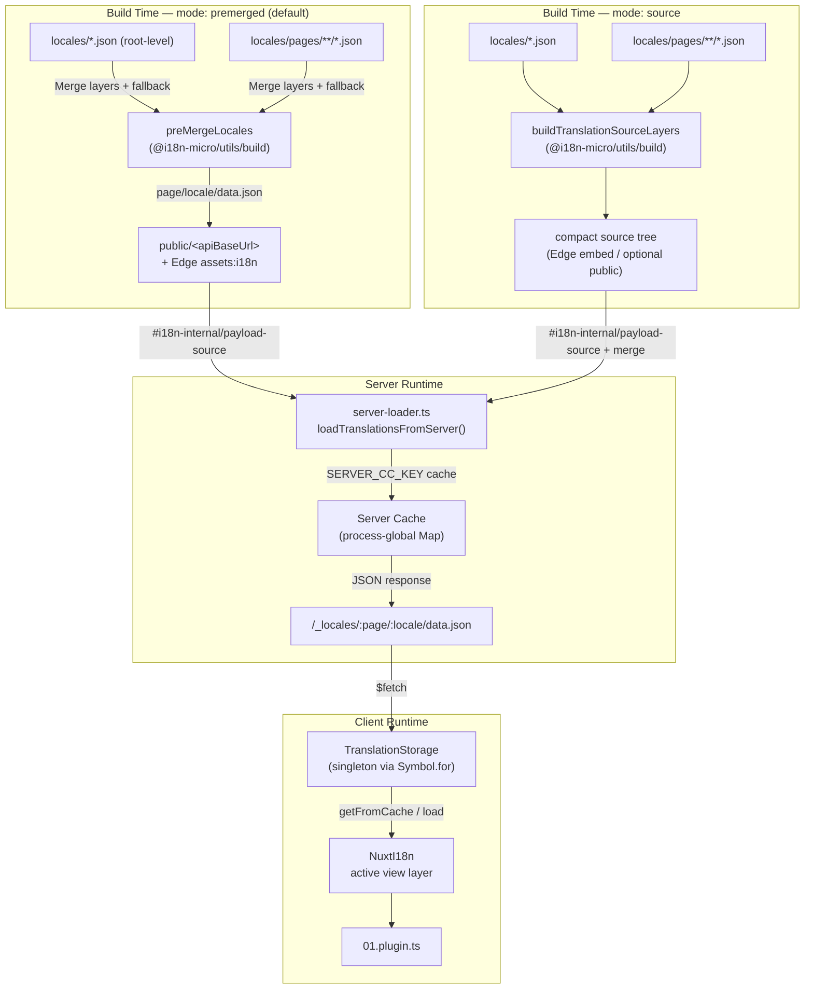

# 🗄️ Tulkojumu kešatmiņas un krātuves arhitektūra

## 📖 Pārskats

Nuxt I18n Micro v3 tulkojumiem izmanto daudzslāņu kešošanas arhitektūru. Slodzes ielāde atkarīga no `translationPayloads.mode`:

- **`premerged`** (noklusējums) — saknes, lapas, atkāpšanās un slāņu faili tiek sapludināti būvēšanas laikā, izmantojot `@i18n-micro/utils/build`, uz `\{page\}/\{locale\}/data.json`.
- **`source`** — kompakti avota faili tiek saglabāti izpildlaika sapludināšanai, izmantojot `@i18n-micro/utils/source-loader` un `@i18n-micro/utils/merge-source` (Edge tos iegulda Nitro `serverAssets`; Node tos nolasa no `public/`, kad tie ir nokopēti).

Šajā lapā aprakstīts, kā darbojas iebūvētā kešatmiņa un kā to paplašināt pielāgotiem lietošanas gadījumiem (administratora rīki, ārējie API, kešatmiņas atsvaidzināšana).

## 📊 Arhitektūras pārskats

### Datu plūsma



## 🧱 Galvenie komponenti

### 1. `TranslationStorage` (klients + serveris)

**Fails**: `src/runtime/utils/storage.ts`

Singletona klase, kas nodrošina vienotu tulkojumu krātuvi gan klientam, gan serverim. Izmanto `Symbol.for('__NUXT_I18N_STORAGE_CACHE__')` uz `globalThis`, lai nodrošinātu, ka pastāv tikai viens eksemplārs pat tad, ja ielādēti vairāki komplekti.

**Galvenās metodes:**

| Metode                              | Apraksts                                                            |
| ----------------------------------- | ---------------------------------------------------------------------- |
| `getFromCache(locale, routeName?)`  | Sinhrona pārbaude: atgriež kešoto atmiņā esošo datu vai `null`.            |
| `load(locale, routeName?, options)` | Asinhrona ielāde ar kešošanu: vispirms pārbauda kešatmiņu, tad ielādē caur `$fetch`. |
| `clear()`                           | Iztīra visu kešatmiņu.                                                |

**Kešatmiņas atslēgas formāts**: `\{locale\}:\{routeName\}` (piemēram, `en:index`, `fr:about`).

```typescript
import { translationStorage } from '../utils/storage'

// Synchronous cache check
const cached = translationStorage.getFromCache('en', 'index')

// Async load (with automatic caching)
const result = await translationStorage.load('en', 'index', {
  apiBaseUrl: '_locales',
  baseURL: '/',
  dateBuild: '2024-01-01',
})
// result.data — merged translations
// result.cacheKey — cache key used
```

### ⚙️ Deterministiska kešatmiņas atsvaidzināšana (`i18n.dateBuild`)

Pēc noklusējuma šis modulis būvēšanas laikā ģenerē `dateBuild`, izmantojot `Date.now()`. Tas pēc tam tiek iegults ģenerētajā `#build/i18n.strategy.mjs` un izmantots kā vaicājuma parametrs (`?v=...`), lai atsvaidzinātu tulkojumu ielādes kešatmiņas pēc atkārtotas būvēšanas.

Ja tev nepieciešami reproducējami būvējumi (piemēram, lai uzlabotu daļu kešatmiņas trāpījumu īpatsvaru pakāpeniskajos izvietojumos), iestati stabilu vērtību `nuxt.config`:

```ts
export default defineNuxtConfig({
  i18n: {
    // Any stable string/number (git SHA, CI build number, release tag, etc.)
    dateBuild: process.env.GIT_SHA ?? 'local-dev',
  },
})
```

### 2. `loadTranslationsFromServer()` (tikai serveris)

**Fails**: `src/runtime/server/utils/server-loader.ts`

Ielādē tulkojumus lokalizācijai/lapai un kešo sapludināto rezultātu procesam globālā `CacheControl` kartē, kas indeksēta pēc `@i18n-micro/hmr/cache-keys` (`SERVER_CC_KEY`).

Uzvedība: SSR ielādē no `#i18n-internal/payload-source` — **Node** `readFile` zem `public/<apiBaseUrl>` (`\{page\}/\{locale\}/data.json` premerged režīmā), **Edge** `assets:i18n`. `premerged` nolasa vienu failu; `source` sapludina saknes/lapas/atkāpšanās, izmantojot `@i18n-micro/utils/source-loader`.

```typescript
import { loadTranslationsFromServer } from '../server/utils/server-loader'

// Returns { data: Translations, json: string }
const { data, json } = await loadTranslationsFromServer('en', 'index')
```

### 3. Klienta ielāde (bez HTML iegultnes)

Vārdnīcas **netiek** ierakstītas `nuxtApp.payload`. Serveris tās tur atmiņā SSR renderēšanai; klienta spraudnis `await` gaida `switchContext`, kas ielādē `/\{apiBaseUrl\}/:page/:locale/data.json` (tāda pati noklusējuma pieeja kā `@nuxtjs/i18n` ar `experimental.preload: false`).

`NuxtI18n` tur aktīvā skata slāņa vārdnīcu, ko izmanto `$t()` un `$has()`. `NuxtTranslationLoader` pārslēdz lokalizācijas/maršruta kontekstu un sapludina daļas šajā slānī.

### 4. Servera API maršruts

**Maršruts**: `/_locales/\{page\}/\{locale\}/data.json`

**Fails**: `src/runtime/server/routes/i18n.ts`

Šis Nitro maršruts apkalpo sapludinātus tulkojumus aktīvajam slodzes režīmam. Tas izsauc `loadTranslationsFromServer()` un atgriež rezultātu kā JSON.

Ražošanā tas arī iestata:

```http
Cache-Control: public, max-age={httpCacheDuration}, immutable
```

Noklusējuma `httpCacheDuration` ir `31536000` (1 gads). Tas ir droši, jo klienti pieprasa slodzes ar `?v=\{dateBuild\}` kešatmiņas atsvaidzināšanu. Iestati `httpCacheDuration: 0`, lai izlaistu galveni. Izstrādes režīmā galvene netiek piemērota.

## 📥 Paplašināšana: Pielāgota tulkojumu ielāde

### Nolasi no kešatmiņas (servera maršruts)

```ts
// server/api/i18n/load-cache.[post].ts
import { defineEventHandler, readBody } from 'h3'
import { loadTranslationsFromServer } from '#imports'

export default defineEventHandler(async (event) => {
  const { page, locale } = await readBody<{ page: string; locale: string }>(event)
  const { data } = await loadTranslationsFromServer(locale, page)
  return { locale, page, data }
})
```

### Atjaunini tulkojumus (fails + atsvaidzini kešatmiņu)

```ts
// server/api/i18n/update.[post].ts
import { defineEventHandler, readBody, createError } from 'h3'
import { join } from 'node:path'
import { readFile, writeFile } from 'node:fs/promises'
import { deepMergeTranslations } from '@i18n-micro/utils/deep-merge'

export default defineEventHandler(async (event) => {
  const { path, updates } = await readBody<{ path: string; updates: Record<string, unknown> }>(event)

  if (!path || !updates) {
    throw createError({ statusCode: 400, statusMessage: 'Missing path or updates' })
  }

  const fullPath = join('locales', path)
  let existing: Record<string, unknown> = {}

  try {
    const content = await readFile(fullPath, 'utf-8')
    existing = JSON.parse(content) as Record<string, unknown>
  } catch {
    // File does not exist — create new
  }

  const merged = deepMergeTranslations(existing, updates)
  await writeFile(fullPath, JSON.stringify(merged, null, 2), 'utf-8')

  return { success: true, path, updated: merged }
})
```


## 🧹 Kešatmiņas iztīrīšana

### Programmatiska kešatmiņas iztīrīšana (klients)

Izmanto iebūvēto `$clearCache` metodi:

```vue
<script setup>
const { $clearCache } = useNuxtApp()

// Clears both TranslationStorage and plugin-level cache
$clearCache()
</script>
```

### Servera kešatmiņas uzvedība

Servera puses kešatmiņa (`loadTranslationsFromServer`) ir procesam globāla un pastāv, līdz:

- Servera process tiek pārstartēts.
- Tiek konstatēts jauns izvietojums (atšķirīga `dateBuild` vērtība).

Serverless vidēs katrs aukstais starts sākas ar tīru kešatmiņu.

## ⚙️ Serverless konfigurācija

Serverless vidēm (Cloudflare Workers, AWS Lambda) iebūvētā kešatmiņa izmanto atmiņā esošus `Map` objektus. Tulkojumu kešatmiņai pašai nav nepieciešama ārējās krātuves konfigurācija.

Tomēr Nitro krātuvei avota tulkojumu failiem var būt nepieciešama konfigurācija:

```ts
export default defineNuxtConfig({
  nitro: {
    storage: {
      // Only needed if default file-system storage is unavailable
      'assets:server': {
        driver: 'cloudflare-kv-binding',
        binding: 'MY_KV_NAMESPACE',
      },
    },
  },
})
```

## 💡 Galvenās atšķirības no v2

| Aspekts           | v2                            | v3                                                                       |
| ---------------- | ----------------------------- | ------------------------------------------------------------------------ |
| Klienta kešatmiņa     | `useStorage('cache')`         | `TranslationStorage` singletons (Symbol.for uz globalThis).                |
| SSR pārsūtīšana     | Izpildlaika konfigurācija                | Pilnas daļas caur `payload.data` (v3.0 izmantoja `useState`).                    |
| Servera kešatmiņa     | Nitro kešatmiņas krātuve           | Procesam globāla `Map` caur `Symbol.for`.                                    |
| Sapludināšanas loģika      | Klienta pusē                   | Būvēšanas laikā (`premerged`) vai izpildlaikā (`source`) caur `@i18n-micro/utils/*`. |
| Kešatmiņas atslēgas formāts | `i18n:merged:\{page\}:\{locale\}` | `\{locale\}:\{routeName\}`.                                                   |

## 📚 Saistītais

- [Veiktspējas ceļvedis](/guides/performance) — kā kešošana ietekmē veiktspēju.
- [Servera puses tulkojumi](/guides/server-side-translations) — tulkojumu izmantošana servera maršrutos.
- [Firebase izvietojums](/guides/firebase) — izvietošanai specifiski kešatmiņas apsvērumi.
