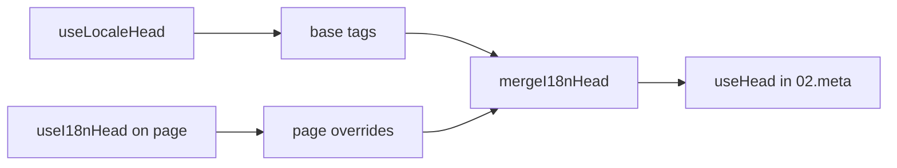

# `useI18nHead` komponējamā funkcija

`useI18nHead` ļauj pielāgot i18n SEO tagus **katrā lapā** bez pielāgota meta spraudņa. Kad `meta: true`, modulis sapludina jūsu ievadi virs [`useLocaleHead`](/api/composables/use-locale-head) izvades.

Tipiski gadījumi:

- **CMS / emuāra raksti** — tikai dažas lokāles ir tulkotas; alternatīvie URL atšķiras pa valodām (dažādi slugi vai ceļi).
- **Dinamisks kanoniskais** — kanoniskajam URL jāatbilst raksta URL no API, nevis no `$switchLocalePath`.
- **Papildu Open Graph** — `og:title`, `og:description`, `og:image` blakus automātiski ģenerētajiem `og:locale` / `og:url`.
- **Daļēja kontrole** — saglabāt moduļa ģenerēto kanonisko un `og:url`, bet aizvietot tikai `hreflang` un `og:locale:alternate`.

---

## Paraksts

{/* generated:symbol:useI18nHead — do not edit; run `pnpm run docs:generate` */}

```ts
useI18nHead(input?: MaybeRefOrGetter<I18nHeadInput | null>): { pageHead: any; resetPageHead: () => void }
```

Reģistrē lapas līmeņa pārrakstīšanas i18n SEO head tagiem.
Sapludināta virs `useLocaleHead` izvades ar `02.meta` spraudni.

| Parametrs | Tips | Apraksts |
| --- | --- | --- |
| `input` *(izvēles)* | `MaybeRefOrGetter<I18nHeadInput \| null>` |  |

{/* /generated:symbol:useI18nHead */}

## Kā tā iekļaujas konveijerā



Jūs izsaucat `useI18nHead` lapas komponentā. Spraudnis `02.meta` piemēro pārrakstīšanas pēc katras `updateMeta()` (maršruta izmaiņas, `$setI18nRouteParams`, `page:finish` klientā).

---

## 1. piemērs — raksts ar tulkojumiem tikai dažās lokālēs

Bieži izmantots modelis: API atgriež, kuras lokāles eksistē, un to absolūtos vai relatīvos URL.

```ts
interface Article {
  title: string
  slug: string
  /** Locale code → page URL (absolute or site-relative) */
  locales: Record<string, string>
}
```

```vue
<script setup lang="ts">
const route = useRoute()
const { data: article } = await useFetch<Article>(`/api/articles/${route.params.slug}`)

const localeCodes = computed(() => Object.keys(article.value?.locales ?? {}))

useI18nHead(() => {
  if (!article.value) return null

  return {
    meta: [
      { property: 'og:title', content: article.value.title },
      { property: 'og:type', content: 'article' },
    ],
    replace: {
      hreflang: localeCodes.value.map((locale) => ({
        rel: 'alternate',
        hreflang: locale,
        href: article.value!.locales[locale]!,
      })),
      ogAlternates: localeCodes.value,
    },
  }
})
</script>
```

`ogAlternates` ņem **lokāles kodus** no jūsu `i18n.locales` konfigurācijas. Vērtības priekš `og:locale:alternate` tiek atrisinātas caur `locale.og` vai `iso` (Open Graph `en_US` formātā).

---

## 2. piemērs — raksts ar lokāles specifiskiem slugiem (`$defineI18nRoute` + `$setI18nRouteParams`)

Kad URL tiek veidoti no lokalizētām maršruta veidnēm un dinamiskiem parametriem:

```vue
<script setup lang="ts">
const { $defineI18nRoute, $setI18nRouteParams } = useNuxtApp()
const route = useRoute()

const { data: article } = await useFetch(`/api/articles/${route.params.slug}`)

$defineI18nRoute({
  localeRoutes: {
    en: '/blog/[slug]',
    de: '/de/blog/[slug]',
    fr: '/fr/blog/[slug]',
  },
})

if (article.value) {
  $setI18nRouteParams({
    en: { slug: article.value.slugEn },
    de: { slug: article.value.slugDe },
    fr: { slug: article.value.slugFr },
  })

  const availableLocales = article.value.availableLocales as string[]

  useI18nHead({
    meta: [{ property: 'og:title', content: article.value.title }],
    replace: {
      hreflang: availableLocales.map((locale) => ({
        rel: 'alternate',
        hreflang: locale,
        href: article.value!.urls[locale],
      })),
      ogAlternates: availableLocales,
    },
  })
}
</script>
```

Moduļa ģenerētie alternatīvie tagi uzskaitītu **visas** konfigurētās lokāles. `replace.hreflang` ierobežo tagus līdz lokālēm, kurām faktiski ir tulkojums.

---

## 3. piemērs — pielāgots `x-default` noklusējuma lokāles raksta URL

Pēc noklusējuma `x-default` norāda uz noklusējuma lokāles URL no `$switchLocalePath`. Rakstiem norādiet to uz noklusējuma tulkojuma URL:

```vue
<script setup lang="ts">
const { $defaultLocale } = useNuxtApp()
const article = await loadArticle()

const defaultLocale = $defaultLocale() ?? 'en'
const defaultHref = article.locales[defaultLocale]

useI18nHead({
  replace: {
    hreflang: Object.entries(article.locales).map(([locale, href]) => ({
      rel: 'alternate',
      hreflang: locale,
      href,
    })),
    xDefault: defaultHref ? { rel: 'alternate', hreflang: 'x-default', href: defaultHref } : false,
    ogAlternates: Object.keys(article.locales),
  },
})
</script>
```

---

## 4. piemērs — kanoniskā un `og:url` aizvietošana ar API datiem

Kad kanoniskajam jāatbilst CMS sniegtajam URL (daudzu domēnu, pielāgots ceļš vai iepriekš izveidots absolūts URL):

```vue
<script setup lang="ts">
const article = await loadArticle()
const canonical = article.canonicalUrl // e.g. https://www.example.com/en/blog/my-post

useI18nHead({
  replace: {
    canonical,
    ogUrl: canonical,
    hreflang: buildAlternateLinks(article),
    ogAlternates: Object.keys(article.locales),
  },
  meta: [
    { property: 'og:title', content: article.title },
    { name: 'description', content: article.excerpt },
  ],
})
</script>
```

---

## 5. piemērs — saglabāt automātisko canonical / `og:url`, aizvietot tikai alternatīvos

Ja `$switchLocalePath` + `$setI18nRouteParams` jau rada pareizu canonical un `og:url`, aizvietojiet tikai atklāšanas tagus:

```vue
<script setup lang="ts">
const article = await loadArticle()

useI18nHead({
  replace: {
    hreflang: buildAlternateLinks(article),
    ogAlternates: Object.keys(article.locales),
  },
})
</script>
```

---

## 6. piemērs — pilns head satura detaļu lapai (meta + links)

Modelis, kas līdzīgs “lapas meta” un “alternatīvo saišu” sadalījumam atsevišķos palīgos — apvienots vienā izsaukumā:

```vue
<script setup lang="ts">
const article = await loadArticle()
const alternates = Object.entries(article.locales).map(([locale, href]) => ({
  rel: 'alternate' as const,
  hreflang: locale,
  href: normalizeSeoUrl(href), // strip ?query and #hash if needed
}))

useI18nHead({
  meta: [
    { property: 'og:title', content: article.title },
    { property: 'og:description', content: article.description },
    { property: 'og:image', content: article.imageUrl },
    { name: 'twitter:card', content: 'summary_large_image' },
    { name: 'twitter:title', content: article.title },
  ],
  replace: {
    canonical: article.canonicalUrl,
    ogUrl: article.canonicalUrl,
    hreflang: alternates,
    ogAlternates: Object.keys(article.locales),
  },
})
</script>
```

```ts
/** Remove query and hash — useful when CMS URLs must be clean for SEO */
function normalizeSeoUrl(href: string): string {
  try {
    const url = new URL(href, 'https://placeholder.local')
    url.search = ''
    url.hash = ''
    return href.startsWith('http') ? url.href : `${url.pathname}`
  } catch {
    return href.split(/[?#]/)[0] ?? href
  }
}
```

---

## 7. piemērs — divi satura tipi, tas pats modelis (jaunumi vs ceļveži)

Tā pati API forma, atšķirīgi maršrutu nosaukumi — atkārtoti izmantojiet nelielu palīgu:

```ts
// composables/useArticleHead.ts
import type { I18nHeadInput } from '@i18n-micro/types'

interface LocalizedContent {
  title: string
  locales: Record<string, string>
  canonicalUrl?: string
}

export function buildArticleHead(content: LocalizedContent): I18nHeadInput {
  const localeCodes = Object.keys(content.locales)
  const canonical = content.canonicalUrl ?? content.locales.en

  return {
    meta: [{ property: 'og:title', content: content.title }],
    replace: {
      canonical,
      ogUrl: canonical,
      hreflang: localeCodes.map((locale) => ({
        rel: 'alternate',
        hreflang: locale,
        href: content.locales[locale]!,
      })),
      ogAlternates: localeCodes,
    },
  }
}
```

```vue
<!-- pages/blog/[slug].vue -->
<script setup lang="ts">
const article = await loadArticle()
useI18nHead(buildArticleHead(article))
</script>
```

```vue
<!-- pages/guides/[slug].vue -->
<script setup lang="ts">
const guide = await loadGuide()
useI18nHead(buildArticleHead(guide))
</script>
```

---

## 8. piemērs — iebūvēto alternatīvo atspējošana, pielāgota saraksta piegāde

Ekvivalents moduļa hreflang ģeneratora atspējošanai un pielāgota saraksta nodošanai (bez dubultiem alternatīvo tagu komplektiem):

```vue
<script setup lang="ts">
const article = await loadArticle()

useI18nHead({
  disable: ['hreflang', 'x-default', 'og-alternates'],
  link: Object.entries(article.locales).map(([locale, href]) => ({
    rel: 'alternate',
    hreflang: locale,
    href,
  })),
  replace: {
    ogAlternates: Object.keys(article.locales),
  },
})
</script>
```

Vai priekšroku dodiet `replace.hreflang` bez `disable` — tas vienā solī aizvieto visas `rel="alternate"` saites.

---

## 9. piemērs — sākumlapa: tikai papildu OG, saglabājot visus i18n tagus

```vue
<script setup lang="ts">
const { t } = useI18n()

useI18nHead({
  meta: [
    { property: 'og:title', content: t('landing.ogTitle') },
    { property: 'og:description', content: t('landing.ogDescription') },
  ],
})
</script>
```

---

## 10. piemērs — produkta lapa: hreflang atspējošana vienam lokāles eksperimentam

```vue
<script setup lang="ts">
useI18nHead({
  disable: ['hreflang', 'x-default'],
  // canonical, og:locale, og:url still generated
})
</script>
```

---

## 11. piemērs — reaktīvi atjauninājumi pēc klienta puses ienesuma

```vue
<script setup lang="ts">
const article = ref<Article | null>(null)

onMounted(async () => {
  article.value = await $fetch('/api/articles/latest')
})

useI18nHead(() => {
  if (!article.value) return null
  return {
    meta: [{ property: 'og:title', content: article.value.title }],
    replace: {
      hreflang: Object.entries(article.value.locales).map(([locale, href]) => ({
        rel: 'alternate',
        hreflang: locale,
        href,
      })),
    },
  }
})
</script>
```

Head atjauninās uz `page:finish` un kad mainās `pageHead` stāvoklis.

---

## 12. piemērs — HTTPS izcelsme aiz reversā starpniekservera

Ja jūs iepriekš atrisinājāt “publiskās izcelsmes” komponējamo funkciju kanoniskajiem / alternatīvajiem absolūtajiem URL, tā vietā izmantojiet moduļa konfigurāciju:

```ts
// nuxt.config.ts
export default defineNuxtConfig({
  i18n: {
    meta: true,
    // undefined = origin from current request (multi-domain friendly)
    metaBaseUrl: undefined,
    metaTrustForwardedHost: true,
    metaTrustForwardedProto: true,
  },
})
```

Tad nododiet **ceļus vai pilnus URL** `replace.hreflang` / `replace.canonical` iekšpusē. Modulis SSR laikā izmanto `useRequestURL` ar `X-Forwarded-Host` / `X-Forwarded-Proto`.

---

## API atsauce

### `meta`

Papildu `<meta>` tagi. Deduplicēti pēc `id`, `property` vai `name`.

### `link`

Papildu `<link>` tagi. Deduplicēti pēc `id` vai `rel` + `hreflang`.

### `htmlAttrs`

Sapludināti `<html>` atribūtos no `useLocaleHead` (`lang`, `dir`).

### `replace`

| Atslēga            | Tips                      | Efekts                                         |
| -------------- | ------------------------- | ---------------------------------------------- |
| `canonical`    | `string \| false`         | Aizvietot vai noņemt kanonisko saiti               |
| `hreflang`     | `I18nHeadLink[] \| false` | Aizvietot vai noņemt visas `rel="alternate"` saites  |
| `xDefault`     | `I18nHeadLink \| false`   | Aizvietot vai noņemt `hreflang="x-default"`       |
| `ogLocale`     | `string \| false`         | Aizvietot vai noņemt `og:locale`                  |
| `ogUrl`        | `string \| false`         | Aizvietot vai noņemt `og:url`                     |
| `ogAlternates` | `string[] \| false`       | Atkārtoti izveidot `og:locale:alternate` lokāles kodiem |

### `disable`

| Vērtība           | Noņem                                  |
| --------------- | ---------------------------------------- |
| `hreflang`      | Lokāles alternatīvās saites (nevis `x-default`) |
| `x-default`     | `hreflang="x-default"` saite              |
| `canonical`     | Kanoniskā saite                           |
| `og`            | `og:locale` un `og:url`                 |
| `og-alternates` | `og:locale:alternate` tagi               |
| `html`          | `lang` / `dir` uz `<html>`               |

---

## `useLocaleHead` pret `useI18nHead`

| Komponējamā funkcija      | Darbības joma                | Kad izmantot                                |
| --------------- | -------------------- | ------------------------------------------ |
| `useLocaleHead` | Globāls / manuāls head | `meta: false`, pilnīgi pielāgota `useHead` iestatīšana |
| `useI18nHead`   | Lapas specifiskās pārrakstīšanas   | `meta: true`, konkrētu lapu pielāgošana     |

Kad `meta: true`, jums **nav** nepieciešams `useLocaleHead` lapās, kas izmanto tikai `useI18nHead`.

---

## Migrēšana no pielāgota i18n head spraudņa

Daudzi projekti uztur pielāgotu spraudni, kas:

- sapludina lapas specifiskās alternatīvās saites no koplietota stāvokļa;
- filtrē dublējošos reģionālos `hreflang` ierakstus;
- normalizē `og:locale` vērtības;
- noņem vaicājuma virknes no SEO URL.

To varat aizvietot ar `useI18nHead` katrā satura lapā un moduļa noklusējumiem.

| Iepriekšējā pieeja                                     | Ar `useI18nHead`                                   |
| ----------------------------------------------------- | ---------------------------------------------------- |
| Koplietots stāvoklis + “kuras lokāles eksistē šim rakstam” | `replace: \{ ogAlternates: localeCodes \}`             |
| Atsevišķs palīgs, kas veido `rel="alternate"` saites      | `replace: \{ hreflang: links \}`                       |
| Pielāgots spraudnis, kas sapludina lapas stāvokli head        | Iebūvēta sapludināšana `02.meta` iekšpusē                          |
| Pielāgota “publiskā izcelsme” absolūtiem URL              | `metaBaseUrl` + pārsūtītās galvenes (skatiet 12. piemēru)   |
| Īss `og:locale` (`en` nevis `en_US`)           | Iestatiet `locale.og` vai izmantojiet `iso` → `en_US` (OG protokols) |

**`hreflang` no `iso`:** katra lokāle izstaro vienu alternatīvo ar `hreflang = iso || code`. Maršrutēšanas `code` nekad netiek izmantots, kad `iso` ir iestatīts (izvairās no nederīgiem tagiem, piemēram, `hreflang="mx"`). Ieslēdziet tīras valodas rezerves opcijas (`es-ES` → arī `es`) ar `hreflangBaseLanguage: true` — iegūtu no `iso`, nevis `code`. Pilnīgi pielāgotiem sarakstiem izmantojiet `replace.hreflang`.

**JSON-LD:** `useI18nHead` neģenerē strukturētus datus. Uzturiet `useHead(\{ script: [...] \})` vai veltītu JSON-LD palīgu blakus tam.

---

## Skatiet arī

- [SEO ceļvedis](/guides/seo) — automātiska meta ģenerēšana un lapas līmeņa pārrakstīšanas
- [`useLocaleHead`](/api/composables/use-locale-head) — zema līmeņa head API
