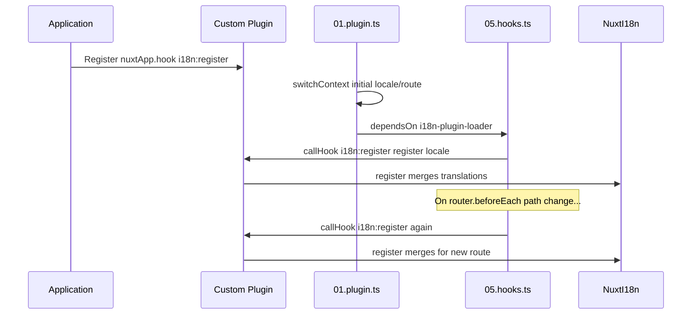

# 📢 Notikumi

## 🔄 `i18n:register`

Notikums `i18n:register` modulī `Nuxt I18n Micro` ļauj dinamiski pievienot tulkojumus lietotnes i18n kontekstam, padarot internacionalizācijas procesu vienmērīgu un elastīgu. Šis notikums ļauj pēc vajadzības integrēt jaunus tulkojumus, uzlabojot lietotnes lokalizācijas iespējas.

### 📝 Notikuma informācija

- **Mērķis**:
  - Ļauj dinamiski iekļaut papildu tulkojumus esošajā komplektā konkrētai lokalizācijai.

- **Slodze**:
  - **`register`**:
    - Notikuma sniegta funkcija, kas pieņem divus argumentus:
      - **`translations`** (`Translations`):
        - Objekts, kas satur atslēgu-vērtību pārus, kas pārstāv tulkojumus, sakārtoti saskaņā ar saskarni `Translations`.
      - **`locale`** (`string`, neobligāti):
        - Lokalizācijas kods (piemēram, `'en'`, `'ru'`), kuram tulkojumi tiek reģistrēti. Ja nav norādīts, tiek izmantota notikuma sniegtā lokalizācija.

- **Uzvedība**:
  - Kad tiek izraisīts, funkcija `register` sapludina jaunos tulkojumus norādītās lokalizācijas pašreizējā kontekstā, atjauninot pieejamos tulkojumus visā lietotnē.

### ⏱️ Kad tas tiek izsaukts

Moduļa āķu spraudnis (`05.hooks.ts`, `dependsOn: ['i18n-plugin-loader']`) izsauc `nuxtApp.callHook('i18n:register', …)`:

1. **Vienreiz startēšanas laikā** — pēc tam, kad galvenais i18n spraudnis (`01.plugin.ts`) ir ielādējis tulkojumus sākotnējam maršrutam.
2. **Navigācijas laikā** — `router.beforeEach`, kad ceļš mainās, vai katrā navigācijā, ja `strategy: 'no_prefix'`.

Reģistrē savu klausītāju parastā Nuxt spraudnī ar `nuxtApp.hook('i18n:register', …)`. Āķu spraudnis darbojas pēc ielādētāja gatavības, tāpēc tavs atzvans tiek izsaukts, kad tulkojumi jāpaplašina.

Iestati `hooks: false` failā `nuxt.config`, lai atspējotu automātiskus `i18n:register` izsaukumus (skati [Konfigurācija — `hooks`](/guides/configuration#hooks)).

### 💡 Lietošanas piemērs

Šis piemērs demonstrē, kā izmantot notikumu `i18n:register`, lai dinamiski pievienotu tulkojumus:

```typescript
nuxt.hook('i18n:register', async (register: (translations: unknown, locale?: string) => void, locale: string) => {
  register(
    {
      greeting: 'Hello',
      farewell: 'Goodbye',
    },
    locale,
  )
})
```

### 🛠️ Skaidrojums



- **Notikuma izraisīšana**:
  - Āķu spraudnis (`05.hooks.ts`) izsauc `i18n:register` pēc galvenā ielādētāja gatavības un attiecīgo navigāciju laikā.

- **Tulkojumu pievienošana**:
  - Piemērs reģistrē angļu tulkojumus atslēgām `"greeting"` un `"farewell"`.
  - Funkcija `register` sapludina šos tulkojumus esošajā komplektā norādītajai lokalizācijai.

### 🔗 Galvenās priekšrocības

- **Dinamiski atjauninājumi**:
  - Viegli atjaunini vai pievieno tulkojumus, neizvietojot atkārtoti visu lietotni.

- **Lokalizācijas elastība**:
  - Atbalsta reāllaika lokalizācijas pielāgojumus, pamatojoties uz lietotāja vai lietotnes vajadzībām.

Izmantojot notikumu `i18n:register`, vari nodrošināt, ka tavas lietotnes lokalizācijas stratēģija paliek elastīga un pielāgojama, uzlabojot kopējo lietotāja pieredzi.

---

## 🛠️ Tulkojumu modificēšana ar spraudņiem

Lai savā Nuxt lietotnē dinamiski modificētu tulkojumus, ieteicams izmantot spraudņus. Spraudņi nodrošina strukturētu veidu, kā apstrādāt lokalizācijas atjauninājumus, īpaši strādājot ar moduļiem vai ārējiem tulkojumu failiem.

### **Spraudņa reģistrēšana**

Ja izmanto moduli, reģistrē spraudni, kur notiks tulkojumu modificēšana, pievienojot to sava moduļa konfigurācijai:

```javascript
addPlugin({
  src: resolve('./plugins/extend_locales'),
})
```

Tas reģistrē spraudni, kas atrodas `./plugins/extend_locales`, kurš apstrādās tulkojumu dinamisku ielādi un reģistrāciju.

### **Spraudņa ieviešana**

Spraudnī vari pārvaldīt lokalizācijas modifikācijas. Šeit ir piemērs ieviešanai Nuxt spraudnī:

```typescript
import { defineNuxtPlugin } from '#app'

export default defineNuxtPlugin(async (nuxtApp) => {
  // Function to load translations from JSON files and register them
  const loadTranslations = async (lang: string) => {
    try {
      const translations = await import(`../locales/${lang}.json`)
      return translations.default
    } catch (error) {
      console.error(`Error loading translations for language: ${lang}`, error)
      return null
    }
  }

  // Hook into the 'i18n:register' event to dynamically add translations
  // eslint-disable-next-line @typescript-eslint/ban-ts-comment
  // @ts-expect-error
  nuxtApp.hook('i18n:register', async (register: (translations: unknown, locale?: string) => void, locale: string) => {
    const translations = await loadTranslations(locale)
    if (translations) {
      register(translations, locale)
    }
  })
})
```

### 📝 Detalizēts skaidrojums

1. **Tulkojumu ielāde**:

- Funkcija `loadTranslations` dinamiski importē tulkojumu failus, pamatojoties uz lokalizāciju. Faili ir gaidīti mapē `locales` un nosaukti atbilstoši lokalizācijas kodiem (piemēram, `en.json`, `de.json`).
- Veiksmīgas ielādes gadījumā tulkojumi tiek atgriezti; pretējā gadījumā tiek reģistrēta kļūda.

2. **Tulkojumu reģistrēšana**:

- Spraudnis pievienojas notikumam `i18n:register`, izmantojot `nuxtApp.hook`.
- Kad notikums tiek izraisīts, funkcija `register` tiek izsaukta ar ielādētajiem tulkojumiem un atbilstošo lokalizāciju.
- Tas sapludina jaunos tulkojumus i18n kontekstā norādītajai lokalizācijai, atjauninot pieejamos tulkojumus visā lietotnē.

### 🔗 Priekšrocības, izmantojot spraudņus tulkojumu modificēšanai

- **Atbildību nodalīšana**:
  - Iekapsulē lokalizācijas loģiku atsevišķi no galvenā lietotnes koda, atvieglojot pārvaldību un uzturēšanu.

- **Dinamisks un mērogojams**:
  - Dinamiski ielādējot un reģistrējot tulkojumus, vari atjaunināt saturu, neveicot pilnu lietotnes atkārtotu izvietošanu, kas ir īpaši noderīgi lietotnēm ar bieži atjauninātu vai daudzvalodu saturu.

- **Uzlabota lokalizācijas elastība**:
  - Spraudņi ļauj pēc vajadzības modificēt vai paplašināt tulkojumus, nodrošinot pielāgojamāku un atsaucīgāku lokalizācijas stratēģiju, kas atbilst lietotāja izvēlēm vai biznesa prasībām.

Pieņemot šo pieeju, vari efektīvi paplašināt un modificēt savas lietotnes lokalizāciju, izmantojot strukturētu un uzturamu procesu ar spraudņiem, saglabājot internacionalizāciju pielāgojamu mainīgām vajadzībām un uzlabojot kopējo lietotāja pieredzi.
