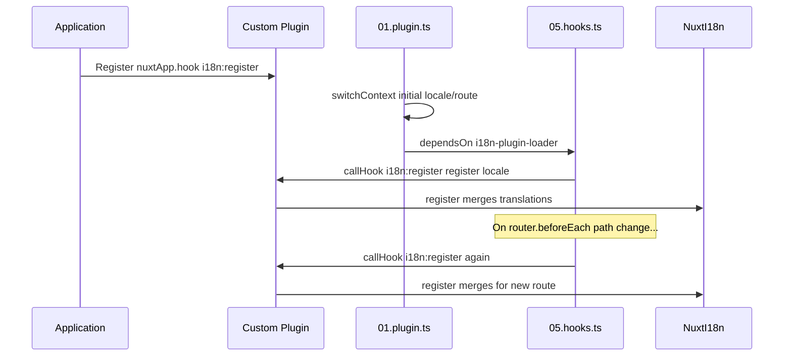

# 📢 Notikumi

## 🔄 `i18n:register`

Notikums `i18n:register` modulī `Nuxt I18n Micro` iespējo dinamisku tulkojumu pievienošanu jūsu lietotnes i18n kontekstam, padarot internacionalizācijas procesu nemanāmu un elastīgu. Šis notikums ļauj integrēt jaunus tulkojumus pēc nepieciešamības, uzlabojot jūsu lietotnes lokalizācijas iespējas.

### 📝 Notikuma detaļas

- **Nolūks**:
  - Ļauj dinamiski iekļaut papildu tulkojumus esošajā kopā konkrētai lokālei.

- **Payload**:
  - **`register`**:
    - Funkcija, ko nodrošina notikums, kas pieņem divus argumentus:
      - **`translations`** (`Translations`):
        - Objekts, kas satur atslēgu-vērtību pārus, kas pārstāv tulkojumus, sakārtoti atbilstoši `Translations` interfeisam.
      - **`locale`** (`string`, izvēles):
        - Lokāles kods (piemēram, `'en'`, `'ru'`), kuram tulkojumi tiek reģistrēti. Pēc noklusējuma tiek izmantota notikuma sniegtā lokāle, ja nav norādīta.

- **Uzvedība**:
  - Kad notikums tiek aktivizēts, funkcija `register` sapludina jaunos tulkojumus norādītās lokāles pašreizējā kontekstā, atjauninot pieejamos tulkojumus visā lietotnē.

### ⏱️ Kad tas notiek

Moduļa hooks spraudnis (`05.hooks.ts`, `dependsOn: ['i18n-plugin-loader']`) izsauc `nuxtApp.callHook('i18n:register', …)`:

1. **Vienreiz startā** — pēc tam, kad galvenais i18n spraudnis (`01.plugin.ts`) ir ielādējis tulkojumus sākotnējam maršrutam
2. **Pie navigācijas** — `router.beforeEach`, kad ceļš mainās, vai pie katras navigācijas, ja `strategy: 'no_prefix'`

Reģistrējiet savu klausītāju parastā Nuxt spraudnī ar `nuxtApp.hook('i18n:register', …)`. Hooks spraudnis darbojas pēc tam, kad ielādētājs ir gatavs, tāpēc jūsu atzvans tiek izsaukts, kad tulkojumi jāpaplašina.

Iestatiet `hooks: false` failā `nuxt.config`, lai atspējotu automātiskos `i18n:register` izsaukumus (skatiet [Konfigurācija — `hooks`](/guides/configuration#hooks)).

### 💡 Lietošanas piemērs

Šis piemērs parāda, kā izmantot notikumu `i18n:register`, lai dinamiski pievienotu tulkojumus:

```typescript
nuxt.hook('i18n:register', async (register: (translations: unknown, locale?: string) => void, locale: string) => {
  register(
    {
      greeting: 'Hello',
      farewell: 'Goodbye',
    },
    locale,
  )
})
```

### 🛠️ Skaidrojums



- **Notikuma aktivizēšana**:
  - Hooks spraudnis (`05.hooks.ts`) aktivizē `i18n:register` pēc tam, kad galvenais ielādētājs ir gatavs, un attiecīgajās navigācijās.

- **Tulkojumu pievienošana**:
  - Piemērs reģistrē angļu tulkojumus vārdiem `"greeting"` un `"farewell"`.
  - Funkcija `register` sapludina šos tulkojumus esošajā kopā norādītajai lokālei.

### 🔗 Galvenās priekšrocības

- **Dinamiski atjauninājumi**:
  - Viegli atjauniniet vai pievienojiet tulkojumus, nepārinstalējot visu jūsu lietotni.

- **Lokalizācijas elastība**:
  - Atbalsta reāllaika lokalizācijas pielāgojumus, balstoties uz lietotāja vai lietotnes vajadzībām.

Izmantojot notikumu `i18n:register`, jūs varat nodrošināt, ka jūsu lietotnes lokalizācijas stratēģija paliek elastīga un pielāgojama, uzlabojot kopējo lietotāja pieredzi.

---

## 🛠️ Tulkojumu modificēšana ar spraudņiem

Lai dinamiski modificētu tulkojumus jūsu Nuxt lietotnē, tiek ieteikts izmantot spraudņus. Spraudņi nodrošina strukturētu veidu, kā apstrādāt lokalizācijas atjauninājumus, īpaši strādājot ar moduļiem vai ārējiem tulkojumu failiem.

### **Spraudņa reģistrēšana**

Ja izmantojat moduli, reģistrējiet spraudni, kur notiks tulkojumu modificēšana, pievienojot to sava moduļa konfigurācijai:

```javascript
addPlugin({
  src: resolve('./plugins/extend_locales'),
})
```

Tas reģistrē spraudni, kas atrodas `./plugins/extend_locales`, kas apstrādās dinamisku tulkojumu ielādi un reģistrāciju.

### **Spraudņa ieviešana**

Spraudnī jūs varat pārvaldīt lokāles modificēšanu. Šeit ir piemērs realizācijai Nuxt spraudnī:

```typescript
import { defineNuxtPlugin } from '#app'

export default defineNuxtPlugin(async (nuxtApp) => {
  // Function to load translations from JSON files and register them
  const loadTranslations = async (lang: string) => {
    try {
      const translations = await import(`../locales/${lang}.json`)
      return translations.default
    } catch (error) {
      console.error(`Error loading translations for language: ${lang}`, error)
      return null
    }
  }

  // Hook into the 'i18n:register' event to dynamically add translations
  // eslint-disable-next-line @typescript-eslint/ban-ts-comment
  // @ts-expect-error
  nuxtApp.hook('i18n:register', async (register: (translations: unknown, locale?: string) => void, locale: string) => {
    const translations = await loadTranslations(locale)
    if (translations) {
      register(translations, locale)
    }
  })
})
```

### 📝 Detalizēts skaidrojums

1. **Tulkojumu ielāde**:

- Funkcija `loadTranslations` dinamiski importē tulkojumu failus, balstoties uz lokāli. Faili tiek gaidīti mapē `locales` un nosaukti atbilstoši lokāles kodiem (piemēram, `en.json`, `de.json`).
- Sekmīgas ielādes gadījumā tulkojumi tiek atgriezti; pretējā gadījumā tiek reģistrēta kļūda.

2. **Tulkojumu reģistrēšana**:

- Spraudnis pieslēdzas notikumam `i18n:register`, izmantojot `nuxtApp.hook`.
- Kad notikums tiek aktivizēts, funkcija `register` tiek izsaukta ar ielādētajiem tulkojumiem un atbilstošo lokāli.
- Tas sapludina jaunos tulkojumus i18n kontekstā norādītajai lokālei, atjauninot pieejamos tulkojumus visā lietotnē.

### 🔗 Spraudņu izmantošanas priekšrocības tulkojumu modificēšanai

- **Atbildību nodalīšana**:
  - Iekapsulējiet lokalizācijas loģiku atsevišķi no galvenā lietotnes koda, atvieglojot pārvaldību un uzturēšanu.

- **Dinamisks un mērogojams**:
  - Dinamiski ielādējot un reģistrējot tulkojumus, jūs varat atjaunināt saturu, neveicot pilnu lietotnes atkārtotu izvietošanu, kas ir īpaši noderīgi lietotnēm ar bieži atjauninātu vai daudzvalodu saturu.

- **Uzlabota lokalizācijas elastība**:
  - Spraudņi ļauj modificēt vai paplašināt tulkojumus pēc nepieciešamības, nodrošinot pielāgojamāku un atsaucīgāku lokalizācijas stratēģiju, kas atbilst lietotāja izvēlēm vai biznesa prasībām.

Pieņemot šo pieeju, jūs varat efektīvi paplašināt un modificēt savas lietotnes lokalizāciju, izmantojot strukturētu un uzturamu procesu ar spraudņiem, saglabājot internacionalizāciju pielāgojamu mainīgajām vajadzībām un uzlabojot kopējo lietotāja pieredzi.
