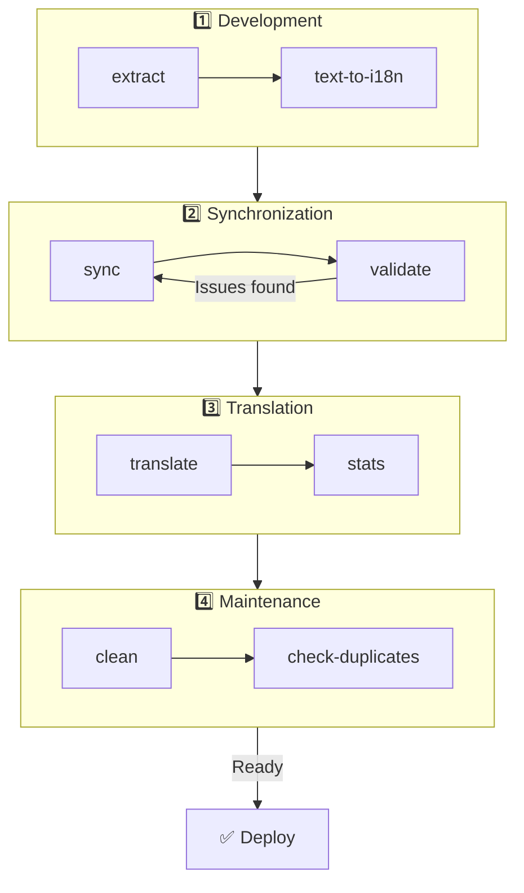

# 🌐 nuxt-i18n-micro-cli ceļvedis

## 📖 Ievads

`nuxt-i18n-micro-cli` ir komandrindas rīks, kas izstrādāts, lai racionalizētu lokalizācijas un internacionalizācijas procesu Nuxt.js projektos, izmantojot moduli `nuxt-i18n-micro` (Nuxt I18n Micro). Tas nodrošina utilītas, lai izgūtu tulkojumu atslēgas no tava koda, pārvaldītu tulkojumu failus, sinhronizētu tulkojumus starp lokalizācijām un automatizētu tulkošanas procesu, izmantojot ārējos tulkošanas servisus.

Šis ceļvedis izvedīs tevi cauri `nuxt-i18n-micro-cli` instalēšanai, konfigurēšanai un lietošanai, lai efektīvi pārvaldītu tava projekta tulkojumus. Pakete uz [npmjs.com](https://www.npmjs.com/package/nuxt-i18n-micro-cli).

## 🔧 Instalēšana un iestatīšana

### 📦 nuxt-i18n-micro-cli instalēšana

Instalē globāli vai kā izstrādes atkarību savā Nuxt projektā (ieteicams CI):

```bash
# global
npm install -g nuxt-i18n-micro-cli

# or per project
pnpm add -D nuxt-i18n-micro-cli
pnpm exec i18n-micro text-to-i18n --dryRun
```

Izmanto **`nuxt-i18n-micro-cli` ≥ 2.1.1**, ja tavs projekts izmanto Nuxt 4 `app/` mapi (`app/pages`, `app/components`, …). Vecākas CLI versijas skenēja tikai `pages/` projekta saknē.

### 🛠 Inicializēšana savā projektā

Pēc instalēšanas vari palaist `i18n-micro` komandas savā Nuxt.js projekta mapē.

Pārliecinies, ka tavs projekts ir iestatīts ar `nuxt-i18n-micro` un tam ir nepieciešamā konfigurācija failā `nuxt.config.ts` (vai `nuxt.config.js`).

### 📄 Izplatītie argumenti

- `--cwd`: norādi pašreizējo darba mapi (noklusējums ir `.`).
- `--logLevel`: iestati reģistrēšanas līmeni (`silent`, `info`, `verbose`).
- `--translationDir`: mape, kas satur JSON tulkojumu failus (noklusējums: `locales`).

## 📊 CLI darbplūsmas pārskats



### Darbplūsmas soļi

| Fāze           | Komandas                    | Mērķis                           |
| --------------- | --------------------------- | --------------------------------- |
| **Izstrāde** | `extract`, `text-to-i18n`   | Atrast un izgūt tulkojumu atslēgas. |
| **Sinhronizācija**        | `sync`, `validate`          | Nodrošināt, ka visām lokalizācijām ir tās pašas atslēgas. |
| **Tulkošana**   | `translate`, `stats`        | Automātiski tulkot trūkstošās atslēgas.       |
| **Apkope** | `clean`, `check-duplicates` | Uzturēt tulkojumus kārtībā.            |

## 📋 Komandas

### 🔄 `text-to-i18n` komanda

CLI pakete: [`nuxt-i18n-micro-cli`](https://www.npmjs.com/package/nuxt-i18n-micro-cli).

**Apraksts**: skenē Vue/TS/JS failus, meklējot cieti kodētas lietotājam vērstas virknes, aizvieto tās ar `$t('...')` un sapludina jaunas atslēgas tavā JSON tulkojumu failā. Palaid no **Nuxt projekta saknes** (kur atrodas `nuxt.config`).

**Lietojums**:

```bash
i18n-micro text-to-i18n [options]
```

**Opcijas**:

| Opcija                  | Noklusējums           | Apraksts                                                           |
| ----------------------- | ----------------- | --------------------------------------------------------------------- |
| `--translationFile`     | `locales/en.json` | JSON fails jaunām atslēgām (relatīvi projekta saknei).                    |
| `--path`                | —                 | Apstrādāt tikai vienu failu vai mapi (piemēram, `app/pages/about.vue`).      |
| `--context`             | —                 | Atslēgas prefikss (piemēram, `auth` → `auth.*`).                                  |
| `--dryRun`              | `false`           | Priekšskatīt bez failu rakstīšanas.                                        |
| `--verbose`             | `false`           | Papildu reģistrēšana.                                                        |
| `--interactive`         | `false`           | Apstiprināt vai rediģēt katru atslēgu pirms pielietošanas.                             |
| `--extractOnlyDirs`     | `plugins`         | Mapes, kur atslēgas tiek izgūtas, bet avota faili **netiek** pārrakstīti. |
| `--extractOnlyPatterns` | —                 | Glob līdzīgi tikai-izgūt modeļi (piemēram, `**/*.plugin.ts`).              |

**Piemērs**:

```bash
i18n-micro text-to-i18n --translationFile locales/en.json --context auth --dryRun
```

#### Kuras mapes tiek skenētas?

<Info>
Kopš CLI **v2.1.1** `text-to-i18n` skenē gan klasiskās saknes mapes, gan `app/*` ekvivalentus. Palaid komandu no **projekta saknes** — neveic `cd app`.
</Info>

Apkopo `*.vue`, `*.js` un `*.ts` zem:

| Nuxt 3 (projekta sakne) | Nuxt 4 (`app/` mape) |
| --------------------- | ------------------------- |
| `pages/`              | `app/pages/`              |
| `components/`         | `app/components/`         |
| `plugins/`            | `app/plugins/`            |
| `layouts/`            | `app/layouts/`            |

Citas mapes (`server/`, `composables/`, `middleware/`, …) tiek izlaistas, ja vien neizmanto `--path`. Nuxt 4 gadījumā palaid no projekta saknes (nav nepieciešams `cd app`). Saskaņo `i18n.translationDir` ar `--translationFile`, ja tas nav `locales/`.

```bash
i18n-micro text-to-i18n --path app/pages
```

#### Kā tas darbojas

1. Apkopo failus no iepriekš minētajām mapēm (vai no `--path`).
2. Aizvieto burtiskās/veidnes teksta virknes ar `$t('generated.key')` (`plugins/` pēc noklusējuma ir tikai izgūt).
3. Sapludina jaunas atslēgas iekš `--translationFile`, nenoņemot esošos ierakstus.

**Pārveidojumu piemēri**:

Pirms:

```vue
<template>
  <div>
    <h1>Welcome to our site</h1>
    <p>Please sign in to continue</p>
  </div>
</template>
```

Pēc:

```vue
<template>
  <div>
    <h1>{{ $t('pages.home.welcome_to_our_site') }}</h1>
    <p>{{ $t('pages.home.please_sign_in') }}</p>
  </div>
</template>
```

**Labākās prakses**: vispirms izmēģini sausa palaide; apstiprini pirms pilna palaidiena; saskaņo `--translationFile` ar `i18n.translationDir` iekš `nuxt.config`; paturi `--extractOnlyDirs plugins` sāknēšanas kodam.

**Ierobežojumi**: atsevišķa npm pakete (nav komplektēta ar moduli); automātiski nenolasa `nuxt.config`; izvada `$t(...)`; sarežģītām dinamiskām virknēm var būt nepieciešams `extract` / `search`.

### 📊 `stats` komanda

**Apraksts**: `stats` komanda tiek izmantota, lai attēlotu tulkojumu statistiku katrai lokalizācijai tavā Nuxt.js projektā. Tā palīdz saprast tulkojumu progresu, parādot, cik atslēgu ir tulkotas, salīdzinot ar kopējo pieejamo atslēgu skaitu.

**Lietojums**:

```bash
i18n-micro stats [options]
```

**Opcijas**:

- `--full`: attēlot tikai apvienotās tulkojumu statistikas (noklusējums: `false`).

**Piemērs**:

```bash
i18n-micro stats --full
```

### 🌍 `translate` komanda

**Apraksts**: `translate` komanda automātiski tulko trūkstošās atslēgas, izmantojot ārējos tulkošanas servisus. Šī komanda vienkāršo tulkošanas procesu, izmantojot API no servisiem, piemēram, Google Translate, DeepL un citiem, lai aizpildītu trūkstošos tulkojumus.

**Lietojums**:

```bash
i18n-micro translate [options]
```

**Opcijas**:

- `--service`: izmantojamais tulkošanas serviss (piemēram, `google`, `deepl`, `yandex`). Ja nav norādīts, komanda tev liks izvēlēties vienu.
- `--token`: izvēlētajam tulkošanas servisam atbilstoša API atslēga. Ja nav norādīta, tev tiks lūgts to ievadīt.
- `--options`: papildu opcijas tulkošanas servisam, kas nodrošinātas kā atslēgas:vērtības pāri, atdalīti ar komatiem (piemēram, `model:gpt-3.5-turbo,max_tokens:1000`).
- `--replace`: tulkot visas atslēgas, aizvietojot esošos tulkojumus (noklusējums: `false`).

**Piemērs**:

```bash
i18n-micro translate --service deepl --token YOUR_DEEPL_API_KEY
```

#### 🌐 Atbalstītie tulkošanas servisi

`translate` komanda atbalsta vairākus tulkošanas servisus. Daži no atbalstītajiem servisiem ir:

- **Google Translate** (`google`).
- **DeepL** (`deepl`).
- **Yandex Translate** (`yandex`).
- **OpenAI** (`openai`).
- **Azure Translator** (`azure`).
- **IBM Watson** (`ibm`).
- **Baidu Translate** (`baidu`).
- **LibreTranslate** (`libretranslate`).
- **MyMemory** (`mymemory`).
- **Lingva Translate** (`lingvatranslate`).
- **Papago** (`papago`).
- **Tencent Translate** (`tencent`).
- **Systran Translate** (`systran`).
- **Yandex Cloud Translate** (`yandexcloud`).
- **ModernMT** (`modernmt`).
- **Lilt** (`lilt`).
- **Unbabel** (`unbabel`).
- **Reverso Translate** (`reverso`).

#### ⚙️ Servisa konfigurācija

Dažiem servisiem ir nepieciešamas specifiskas konfigurācijas vai API atslēgas. Izmantojot `translate` komandu, vari norādīt servisu un nodrošināt nepieciešamo `--token` (API atslēgu) un papildu `--options`, ja nepieciešams.

Piemēram:

```bash
i18n-micro translate --service openai --token YOUR_OPENAI_API_KEY --options openaiModel:gpt-3.5-turbo,max_tokens:1000
```

### 🛠️ `extract` komanda

**Apraksts**: izgūst tulkojumu atslēgas no tava koda un organizē tās pēc tvēruma.

**Lietojums**:

```bash
i18n-micro extract [options]
```

**Opcijas**:

- `--prod, -p`: palaist ražošanas režīmā.

**Piemērs**:

```bash
i18n-micro extract
```

### 🔄 `sync` komanda

**Apraksts**: sinhronizē tulkojumu failus starp lokalizācijām, nodrošinot, ka visām lokalizācijām ir tās pašas atslēgas.

**Lietojums**:

```bash
i18n-micro sync [options]
```

**Piemērs**:

```bash
i18n-micro sync
```

### ✅ `validate` komanda

**Apraksts**: validē tulkojumu failus, meklējot trūkstošas vai lieko atslēgas, salīdzinot ar atsauces lokalizāciju.

**Lietojums**:

```bash
i18n-micro validate [options]
```

**Piemērs**:

```bash
i18n-micro validate
```

### 🧹 `clean` komanda

**Apraksts**: noņem neizmantotās tulkojumu atslēgas no tulkojumu failiem.

**Lietojums**:

```bash
i18n-micro clean [options]
```

**Piemērs**:

```bash
i18n-micro clean
```

### 📤 `import` komanda

**Apraksts**: pārvērš PO failus atpakaļ JSON formātā un saglabā tos tulkojumu mapē.

**Lietojums**:

```bash
i18n-micro import [options]
```

**Opcijas**:

- `--potsDir`: mape, kas satur PO failus (noklusējums: `pots`).

**Piemērs**:

```bash
i18n-micro import --potsDir pots
```

### 📥 `export` komanda

**Apraksts**: eksportē tulkojumus PO failos ārējai tulkojumu pārvaldībai.

**Lietojums**:

```bash
i18n-micro export [options]
```

**Opcijas**:

- `--potsDir`: mape PO failu saglabāšanai (noklusējums: `pots`).

**Piemērs**:

```bash
i18n-micro export --potsDir pots
```

### 🗂️ `export-csv` komanda

**Apraksts**: `export-csv` komanda eksportē tulkojumu atslēgas un vērtības no JSON failiem, tostarp to failu ceļus, CSV formātā. Šī komanda ir noderīga komandām, kuras dod priekšroku darbam ar tulkojumu datiem izklājlapu programmatūrā.

**Lietojums**:

```bash
i18n-micro export-csv [options]
```

**Opcijas**:

- `--csvDir`: mape, kur tiks saglabāti eksportētie CSV faili.
- `--delimiter`: norādi atdalītāju CSV failam (noklusējums: `,`).

**Piemērs**:

```bash
i18n-micro export-csv --csvDir csv_files
```

### 📑 `import-csv` komanda

**Apraksts**: `import-csv` komanda importē tulkojumu datus no CSV failiem, atjauninot atbilstošos JSON failus. Tas ir noderīgi masveida tulkojumu atjauninājumu piemērošanai no izklājlapām.

**Lietojums**:

```bash
i18n-micro import-csv [options]
```

**Opcijas**:

- `--csvDir`: mape, kas satur importējamos CSV failus.
- `--delimiter`: norādi CSV failā izmantoto atdalītāju (noklusējums: `,`).

**Piemērs**:

```bash
i18n-micro import-csv --csvDir csv_files
```

### 🧾 `diff` komanda

**Apraksts**: salīdzina tulkojumu failus starp noklusējuma lokalizāciju un citām lokalizācijām tajā pašā mapē (tostarp apakšmapēs). Komanda identificē trūkstošās atslēgas un to vērtības noklusējuma lokalizācijā, salīdzinot ar citām lokalizācijām, atvieglojot tulkojumu progresa vai neatbilstību izsekošanu.

**Lietojums**:

```bash
i18n-micro diff [options]
```

**Piemērs**:

```bash
i18n-micro diff
```

### 🔍 `check-duplicates` komanda

**Apraksts**: `check-duplicates` komanda pārbauda dublikātu tulkojumu vērtības katrā lokalizācijā visos tulkojumu failos, tostarp gan saknes līmeņa, gan lapām specifiskos tulkojumus. Tā nodrošina, ka dažādas atslēgas vienā valodā nedalās ar identiskām tulkojumu vērtībām, palīdzot saglabāt skaidrību un konsekvenci tavos tulkojumos.

**Lietojums**:

```bash
i18n-micro check-duplicates [options]
```

**Piemērs**:

```bash
i18n-micro check-duplicates
```

**Kā tas darbojas**:

- Komanda pārbauda gan saknes līmeņa, gan lapām specifiskus tulkojumu failus katrai lokalizācijai.
- Ja tulkojuma vērtība parādās vairākās vietās (vai nu saknes līmeņa tulkojumos, vai dažādās lapās), tā ziņo par dublētajām vērtībām kopā ar failu un atslēgu, kur tās ir atrodamas.
- Ja dublikāti nav atrasti, komanda apstiprina, ka lokalizācija ir bez dublēto tulkojumu vērtībām.

Šī komanda palīdz nodrošināt, ka tulkojumu atslēgas uztur unikālas vērtības, novēršot nejaušu atkārtošanos tajā pašā lokalizācijā.

### 🔄 `replace-values` komanda

**Apraksts**: `replace-values` komanda ļauj tev veikt masveida tulkojumu vērtību aizvietošanu visās lokalizācijās. Tā atbalsta gan vienkāršu teksta aizvietošanu, gan uzlabotu aizvietošanu, izmantojot regulārās izteiksmes (regex). Vari arī izmantot uztveršanas grupas regex modeļos un atsaukties uz tām aizvietošanas virknē, padarot to ideālu sarežģītākiem aizvietošanas scenārijiem.

**Lietojums**:

```bash
i18n-micro replace-values [options]
```

**Opcijas**:

- `--search`: teksts vai regex modelis, ko meklēt tulkojumos. Šī ir obligāta opcija.
- `--replace`: aizvietošanas teksts, ko izmantot atrastajiem tulkojumiem. Šī ir obligāta opcija.
- `--useRegex`: iespējot meklēšanu, izmantojot regulārās izteiksmes modeli (noklusējums: `false`).

**1. piemērs**: vienkārša aizvietošana

Aizvieto virkni "Hello" ar "Hi" visās lokalizācijās:

```bash
i18n-micro replace-values --search "Hello" --replace "Hi"
```

**2. piemērs**: regex aizvietošana

Iespējo regex meklēšanu un aizvieto jebkuru virkni, kas sākas ar "Hello", kam seko skaitļi (piemēram, "Hello123"), ar "Hi" visās lokalizācijās:

```bash
i18n-micro replace-values --search "Hello\\d+" --replace "Hi" --useRegex
```

**3. piemērs**: regex uztveršanas grupu izmantošana

Izmanto uztveršanas grupas, lai dinamiski ievietotu atbilstības virknes daļu aizvietošanā. Piemēram, aizvieto "Hello [name]" ar "Hi [name]", saglabājot vārdu neskartu:

```bash
i18n-micro replace-values --search "Hello (\\w+)" --replace "Hi $1" --useRegex
```

Šajā gadījumā `$1` atsaucas uz pirmo uztveršanas grupu, kas atbilst `[name]` daļai pēc "Hello". Aizvietošana paturēs vārdu no oriģinālās virknes.

**Kā tas darbojas**:

- Komanda skenē visus tulkojumu failus (gan globālos, gan lapām specifiskus).
- Kad tiek atrasta atbilstība, pamatojoties uz meklēšanas virkni vai regex modeli, tā aizvieto atbilstošo tekstu ar sniegto aizvietošanu.
- Izmantojot regex, aizvietošanas virknē var izmantot uztveršanas grupas, atsaucoties uz tām ar `$1`, `$2` un citiem.
- Visas izmaiņas tiek reģistrētas, parādot faila ceļu, tulkojuma atslēgu un tulkojuma vērtības stāvokli pirms/pēc.

**Reģistrēšana**:
Katrai aizvietošanai komanda reģistrē detaļas, tostarp:

- Lokalizāciju un faila ceļu.
- Modificējamo tulkojuma atslēgu.
- Veco vērtību un jauno vērtību pēc aizvietošanas.
- Ja izmanto regex ar uztveršanas grupām, žurnāli parādīs grupas atbilstības un to, kā tās tika aizvietotas.

Tas ļauj tev tieši izsekot, kur un kādas izmaiņas tika veiktas aizvietošanas operācijas laikā, nodrošinot skaidru modifikāciju vēsturi tavos tulkojumu failos.

## 🛠 Piemēri

- **Tulkojumu izgūšana**:

  ```bash
  i18n-micro extract
  ```

- **Trūkstošo atslēgu tulkošana, izmantojot Google Translate**:

  ```bash
  i18n-micro translate --service google --token YOUR_GOOGLE_API_KEY
  ```

- **Visu atslēgu tulkošana, aizvietojot esošos tulkojumus**:

  ```bash
  i18n-micro translate --service deepl --token YOUR_DEEPL_API_KEY --replace
  ```

- **Tulkojumu failu validēšana**:

  ```bash
  i18n-micro validate
  ```

- **Neizmantoto tulkojumu atslēgu tīrīšana**:

  ```bash
  i18n-micro clean
  ```

- **Tulkojumu failu sinhronizēšana**:

  ```bash
  i18n-micro sync
  ```

## ⚙️ Konfigurācijas ceļvedis

`nuxt-i18n-micro-cli` paļaujas uz tavu Nuxt.js i18n konfigurāciju failā `nuxt.config.ts` (vai `nuxt.config.js`). Pārliecinies, ka `nuxt-i18n-micro` modulis ir instalēts un konfigurēts.

### 🔑 nuxt.config.js piemērs

```ts
export default defineNuxtConfig({
  modules: ['nuxt-i18n-micro'],
  i18n: {
    locales: [
      { code: 'en', iso: 'en-US' },
      { code: 'fr', iso: 'fr-FR' },
    ],
    defaultLocale: 'en',
    fallbackLocale: 'en',
    translationDir: 'locales', // or 'app/locales' for Nuxt 4 colocation
  },
})
```

Pārliecinies, ka `translationDir` atbilst mapei, ko izmanto `nuxt-i18n-micro-cli` (noklusējums ir `locales`).

## 📝 Labākās prakses

### 🔑 Konsekventa atslēgu nosaukšana

Nodrošini, ka tulkojumu atslēgas ir konsekventas un aprakstošas, lai izvairītos no neskaidrībām un dublēšanās.

### 🧹 Regulāra apkope

Regulāri izmanto `clean` komandu, lai noņemtu neizmantotās tulkojumu atslēgas un uzturētu tavus tulkojumu failus tīrus.

### 🛠 Automatizē tulkošanas darbplūsmu

Integrē `nuxt-i18n-micro-cli` komandas savā izstrādes darbplūsmā vai CI/CD cauruļvadā, lai automatizētu tulkojumu failu izgūšanu, tulkošanu, validāciju un sinhronizāciju.

### 🛡️ Aizsargā API atslēgas

Izmantojot tulkošanas servisus, kas prasa API atslēgas, pārliecinies, ka tavas atslēgas ir aizsargātas un netiek pievienotas versiju kontroles sistēmām. Apsver iespēju izmantot vides mainīgos vai drošus atslēgu pārvaldības risinājumus.

## 📞 Atbalsts un ieguldījumi

Ja saskaries ar problēmām vai tev ir ieteikumi uzlabojumiem, jūties brīvi ieguldīt projektā vai atvērt problēmu projekta repozitorijā.

---

Sekojot šim ceļvedim, tu varēsi efektīvi pārvaldīt tulkojumus savā Nuxt.js projektā, izmantojot `nuxt-i18n-micro-cli`, racionalizējot savus internacionalizācijas centienus un nodrošinot vienmērīgu pieredzi lietotājiem dažādās lokalizācijās.
