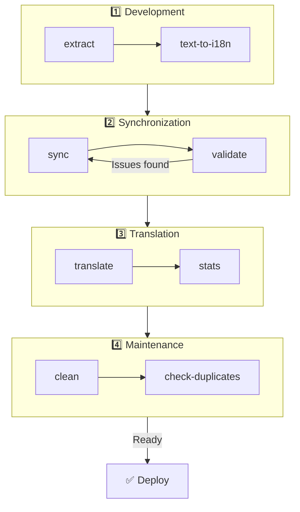

# 🌐 nuxt-i18n-micro-cli ceļvedis

## 📖 Ievads

`nuxt-i18n-micro-cli` ir komandrindas rīks, kas paredzēts, lai racionalizētu lokalizācijas un internacionalizācijas procesu Nuxt.js projektos, izmantojot moduli `nuxt-i18n-micro` (Nuxt I18n Micro). Tas nodrošina utilītas tulkojumu atslēgu izgūšanai no jūsu koda bāzes, tulkojumu failu pārvaldībai, tulkojumu sinhronizēšanai starp lokālēm un tulkošanas procesa automatizēšanai, izmantojot ārējus tulkošanas pakalpojumus.

Šis ceļvedis palīdzēs jums instalēt, konfigurēt un lietot `nuxt-i18n-micro-cli`, lai efektīvi pārvaldītu jūsu projekta tulkojumus. Pakotne pieejama [npmjs.com](https://www.npmjs.com/package/nuxt-i18n-micro-cli).

## 🔧 Instalēšana un iestatīšana

### 📦 nuxt-i18n-micro-cli instalēšana

Instalējiet globāli vai kā izstrādes atkarību savā Nuxt projektā (ieteicams CI vidē):

```bash
# global
npm install -g nuxt-i18n-micro-cli

# or per project
pnpm add -D nuxt-i18n-micro-cli
pnpm exec i18n-micro text-to-i18n --dryRun
```

Izmantojiet **`nuxt-i18n-micro-cli` ≥ 2.1.1**, ja jūsu projekts izmanto Nuxt 4 `app/` mapi (`app/pages`, `app/components`, …). Vecākas CLI versijas skenēja tikai `pages/` projekta saknē.

### 🛠 Inicializēšana projektā

Pēc instalēšanas jūs varat palaist `i18n-micro` komandas savā Nuxt.js projekta mapē.

Pārliecinieties, ka jūsu projekts ir iestatīts ar `nuxt-i18n-micro` un tam ir nepieciešamā konfigurācija failā `nuxt.config.ts` (vai `nuxt.config.js`).

### 📄 Bieži lietoti argumenti

- `--cwd`: norādiet pašreizējo darba mapi (noklusējums `.`).
- `--logLevel`: iestatiet žurnāla līmeni (`silent`, `info`, `verbose`).
- `--translationDir`: mape, kas satur JSON tulkojumu failus (noklusējums: `locales`).

## 📊 CLI darbplūsmas pārskats



### Darbplūsmas soļi

| Fāze           | Komandas                    | Nolūks                           |
| --------------- | --------------------------- | --------------------------------- |
| **Izstrāde** | `extract`, `text-to-i18n`   | Atrast un izgūt tulkojumu atslēgas |
| **Sinhronizācija**        | `sync`, `validate`          | Nodrošināt, ka visām lokālēm ir vienādas atslēgas |
| **Tulkošana**   | `translate`, `stats`        | Automātiski tulkot trūkstošās atslēgas       |
| **Uzturēšana** | `clean`, `check-duplicates` | Uzturēt tulkojumus kārtīgus            |

## 📋 Komandas

### 🔄 Komanda `text-to-i18n`

CLI pakotne: [`nuxt-i18n-micro-cli`](https://www.npmjs.com/package/nuxt-i18n-micro-cli)

**Apraksts**: skenē Vue/TS/JS failus, meklējot lietotājam redzamas cietkodētas virknes, aizvieto tās ar `$t('...')` un jaunās atslēgas sapludina jūsu JSON tulkojumu failā. Palaist no **Nuxt projekta saknes** (kur atrodas `nuxt.config`).

**Lietošana**:

```bash
i18n-micro text-to-i18n [options]
```

**Opcijas**:

| Opcija                  | Noklusējums           | Apraksts                                                           |
| ----------------------- | ----------------- | --------------------------------------------------------------------- |
| `--translationFile`     | `locales/en.json` | JSON fails jaunajām atslēgām (attiecībā pret projekta sakni).                    |
| `--path`                | —                 | Apstrādāt tikai vienu failu vai mapi (piemēram, `app/pages/about.vue`).      |
| `--context`             | —                 | Atslēgas priedēklis (piemēram, `auth` → `auth.*`).                                  |
| `--dryRun`              | `false`           | Priekšskatīt bez failu rakstīšanas.                                        |
| `--verbose`             | `false`           | Papildu reģistrēšana.                                                        |
| `--interactive`         | `false`           | Apstipriniet vai rediģējiet katru atslēgu pirms piemērošanas.                             |
| `--extractOnlyDirs`     | `plugins`         | Mapes, kur atslēgas tiek izgūtas, bet avota faili **netiek** pārrakstīti. |
| `--extractOnlyPatterns` | —                 | Glob veida tikai izgūšanas modeļi (piemēram, `**/*.plugin.ts`).              |

**Piemērs**:

```bash
i18n-micro text-to-i18n --translationFile locales/en.json --context auth --dryRun
```

#### Kuras mapes tiek skenētas?

<Info>
Kopš CLI **v2.1.1** `text-to-i18n` skenē gan klasiskās saknes mapes, gan `app/*` ekvivalentus. Palaidiet komandu no **projekta saknes** — nedodieties `cd app`.
</Info>

Apkopo `*.vue`, `*.js` un `*.ts` zem:

| Nuxt 3 (projekta sakne) | Nuxt 4 (`app/` mape) |
| --------------------- | ------------------------- |
| `pages/`              | `app/pages/`              |
| `components/`         | `app/components/`         |
| `plugins/`            | `app/plugins/`            |
| `layouts/`            | `app/layouts/`            |

Citas mapes (`server/`, `composables/`, `middleware/` u.c.) tiek izlaistas, ja vien neizmantojat `--path`. Nuxt 4 gadījumā palaidiet no projekta saknes (nav nepieciešams `cd app`). Ja `i18n.translationDir` nav `locales/`, saskaņojiet to ar `--translationFile`.

```bash
i18n-micro text-to-i18n --path app/pages
```

#### Kā tas darbojas

1. Apkopo failus no iepriekš minētajām mapēm (vai no `--path`).
2. Aizvieto literāļus / veidnes tekstu ar `$t('generated.key')` (`plugins/` pēc noklusējuma ir tikai izgūšanai).
3. Sapludina jaunās atslēgas `--translationFile`, nenoņemot esošos ierakstus.

**Transformāciju piemērs**:

Pirms:

```vue
<template>
  <div>
    <h1>Welcome to our site</h1>
    <p>Please sign in to continue</p>
  </div>
</template>
```

Pēc:

```vue
<template>
  <div>
    <h1>{{ $t('pages.home.welcome_to_our_site') }}</h1>
    <p>{{ $t('pages.home.please_sign_in') }}</p>
  </div>
</template>
```

**Labākā prakse**: vispirms veiciet dry run; iemetiet commit pirms pilna izpildījuma; saskaņojiet `--translationFile` ar `i18n.translationDir` failā `nuxt.config`; sākumkodam saglabājiet `--extractOnlyDirs plugins`.

**Ierobežojumi**: atsevišķa npm pakotne (nav iepakota ar moduli); automātiski nenolasa `nuxt.config`; izvada `$t(...)`; sarežģītām dinamiskām virknēm var būt nepieciešams `extract` / `search`.

### 📊 Komanda `stats`

**Apraksts**: komanda `stats` tiek izmantota, lai parādītu tulkojumu statistiku katrai lokālei jūsu Nuxt.js projektā. Tā palīdz saprast jūsu tulkojumu progresu, parādot, cik atslēgu ir tulkotas salīdzinājumā ar kopējo pieejamo atslēgu skaitu.

**Lietošana**:

```bash
i18n-micro stats [options]
```

**Opcijas**:

- `--full`: parāda tikai apvienoto tulkojumu statistiku (noklusējums: `false`).

**Piemērs**:

```bash
i18n-micro stats --full
```

### 🌍 Komanda `translate`

**Apraksts**: komanda `translate` automātiski tulko trūkstošās atslēgas, izmantojot ārējus tulkošanas pakalpojumus. Šī komanda vienkāršo tulkošanas procesu, izmantojot API no tādiem pakalpojumiem kā Google Translate, DeepL un citiem, lai aizpildītu trūkstošos tulkojumus.

**Lietošana**:

```bash
i18n-micro translate [options]
```

**Opcijas**:

- `--service`: izmantojamais tulkošanas pakalpojums (piemēram, `google`, `deepl`, `yandex`). Ja nav norādīts, komanda liks jums izvēlēties.
- `--token`: API atslēga, kas atbilst izvēlētajam tulkošanas pakalpojumam. Ja nav norādīta, jums tiks lūgts to ievadīt.
- `--options`: papildu opcijas tulkošanas pakalpojumam, sniegtas kā atslēgas:vērtības pāri, atdalīti ar komatiem (piemēram, `model:gpt-3.5-turbo,max_tokens:1000`).
- `--replace`: tulkot visas atslēgas, aizvietojot esošos tulkojumus (noklusējums: `false`).

**Piemērs**:

```bash
i18n-micro translate --service deepl --token YOUR_DEEPL_API_KEY
```

#### 🌐 Atbalstītie tulkošanas pakalpojumi

Komanda `translate` atbalsta vairākus tulkošanas pakalpojumus. Daži no atbalstītajiem pakalpojumiem ir:

- **Google Translate** (`google`)
- **DeepL** (`deepl`)
- **Yandex Translate** (`yandex`)
- **OpenAI** (`openai`)
- **Azure Translator** (`azure`)
- **IBM Watson** (`ibm`)
- **Baidu Translate** (`baidu`)
- **LibreTranslate** (`libretranslate`)
- **MyMemory** (`mymemory`)
- **Lingva Translate** (`lingvatranslate`)
- **Papago** (`papago`)
- **Tencent Translate** (`tencent`)
- **Systran Translate** (`systran`)
- **Yandex Cloud Translate** (`yandexcloud`)
- **ModernMT** (`modernmt`)
- **Lilt** (`lilt`)
- **Unbabel** (`unbabel`)
- **Reverso Translate** (`reverso`)

#### ⚙️ Pakalpojumu konfigurācija

Dažiem pakalpojumiem nepieciešamas specifiskas konfigurācijas vai API atslēgas. Izmantojot komandu `translate`, varat norādīt pakalpojumu un sniegt nepieciešamo `--token` (API atslēgu) un papildu `--options`, ja tas ir vajadzīgs.

Piemēram:

```bash
i18n-micro translate --service openai --token YOUR_OPENAI_API_KEY --options openaiModel:gpt-3.5-turbo,max_tokens:1000
```

### 🛠️ Komanda `extract`

**Apraksts**: izgūst tulkojumu atslēgas no jūsu koda bāzes un sakārto tās pēc darbības jomas.

**Lietošana**:

```bash
i18n-micro extract [options]
```

**Opcijas**:

- `--prod, -p`: darbojas produkcijas režīmā.

**Piemērs**:

```bash
i18n-micro extract
```

### 🔄 Komanda `sync`

**Apraksts**: sinhronizē tulkojumu failus starp lokālēm, nodrošinot, ka visām lokālēm ir vienādas atslēgas.

**Lietošana**:

```bash
i18n-micro sync [options]
```

**Piemērs**:

```bash
i18n-micro sync
```

### ✅ Komanda `validate`

**Apraksts**: validē tulkojumu failus, meklējot trūkstošas vai liekas atslēgas salīdzinājumā ar atsauces lokāli.

**Lietošana**:

```bash
i18n-micro validate [options]
```

**Piemērs**:

```bash
i18n-micro validate
```

### 🧹 Komanda `clean`

**Apraksts**: noņem neizmantotās tulkojumu atslēgas no tulkojumu failiem.

**Lietošana**:

```bash
i18n-micro clean [options]
```

**Piemērs**:

```bash
i18n-micro clean
```

### 📤 Komanda `import`

**Apraksts**: pārveido PO failus atpakaļ JSON formātā un saglabā tos tulkojumu mapē.

**Lietošana**:

```bash
i18n-micro import [options]
```

**Opcijas**:

- `--potsDir`: mape, kas satur PO failus (noklusējums: `pots`).

**Piemērs**:

```bash
i18n-micro import --potsDir pots
```

### 📥 Komanda `export`

**Apraksts**: eksportē tulkojumus PO failos ārējai tulkošanas pārvaldībai.

**Lietošana**:

```bash
i18n-micro export [options]
```

**Opcijas**:

- `--potsDir`: mape, kurā saglabāt PO failus (noklusējums: `pots`).

**Piemērs**:

```bash
i18n-micro export --potsDir pots
```

### 🗂️ Komanda `export-csv`

**Apraksts**: komanda `export-csv` eksportē tulkojumu atslēgas un vērtības no JSON failiem, iekļaujot to failu ceļus, CSV formātā. Šī komanda ir noderīga komandām, kuras dod priekšroku strādāt ar tulkojumu datiem izklājlapu programmatūrā.

**Lietošana**:

```bash
i18n-micro export-csv [options]
```

**Opcijas**:

- `--csvDir`: mape, kurā tiks saglabāti eksportētie CSV faili.
- `--delimiter`: norādiet CSV faila atdalītāju (noklusējums: `,`).

**Piemērs**:

```bash
i18n-micro export-csv --csvDir csv_files
```

### 📑 Komanda `import-csv`

**Apraksts**: komanda `import-csv` importē tulkojumu datus no CSV failiem, atjauninot atbilstošos JSON failus. Tas ir noderīgi masveida tulkojumu atjauninājumu piemērošanai no izklājlapām.

**Lietošana**:

```bash
i18n-micro import-csv [options]
```

**Opcijas**:

- `--csvDir`: mape, kas satur CSV failus, kurus importēt.
- `--delimiter`: norādiet CSV failā izmantoto atdalītāju (noklusējums: `,`).

**Piemērs**:

```bash
i18n-micro import-csv --csvDir csv_files
```

### 🧾 Komanda `diff`

**Apraksts**: salīdzina tulkojumu failus starp noklusējuma lokāli un citām lokālēm vienā mapē (tostarp apakšmapēs). Komanda identificē trūkstošās atslēgas un to vērtības noklusējuma lokālē salīdzinājumā ar citām lokālēm, atvieglojot tulkojumu progresa vai neatbilstību izsekošanu.

**Lietošana**:

```bash
i18n-micro diff [options]
```

**Piemērs**:

```bash
i18n-micro diff
```

### 🔍 Komanda `check-duplicates`

**Apraksts**: komanda `check-duplicates` pārbauda dublējošos tulkojumu vērtības katrā lokālē visos tulkojumu failos, tostarp gan saknes līmeņa, gan lapas specifiskajos tulkojumos. Tā nodrošina, ka dažādas atslēgas vienā valodā nedalās ar identiskām tulkojumu vērtībām, palīdzot uzturēt skaidrību un konsekvenci jūsu tulkojumos.

**Lietošana**:

```bash
i18n-micro check-duplicates [options]
```

**Piemērs**:

```bash
i18n-micro check-duplicates
```

**Kā tas darbojas**:

- Komanda katrai lokālei pārbauda gan saknes līmeņa, gan lapas specifiskos tulkojumu failus.
- Ja tulkojuma vērtība parādās vairākās vietās (vai nu saknes līmeņa tulkojumos, vai dažādās lapās), tā ziņo par dublējošajām vērtībām kopā ar failu un atslēgu, kur tās atrodas.
- Ja dublējumi nav atrasti, komanda apstiprina, ka lokālē nav dublējošu tulkojumu vērtību.

Šī komanda palīdz nodrošināt, ka tulkojumu atslēgas uztur unikālas vērtības, novēršot nejaušu atkārtošanos vienā lokālē.

### 🔄 Komanda `replace-values`

**Apraksts**: komanda `replace-values` ļauj veikt masveida tulkojumu vērtību aizvietošanu visās lokālēs. Tā atbalsta gan vienkāršus teksta aizvietojumus, gan padziļinātus aizvietojumus, izmantojot regulārās izteiksmes (regex). Regex modeļos varat izmantot arī uztveršanas grupas un atsaukties uz tām aizvietošanas virknē, padarot to ideālu sarežģītākiem aizvietošanas scenārijiem.

**Lietošana**:

```bash
i18n-micro replace-values [options]
```

**Opcijas**:

- `--search`: teksts vai regex modelis, ko meklēt tulkojumos. Šī ir nepieciešama opcija.
- `--replace`: aizvietošanas teksts, ko izmantot atrastajiem tulkojumiem. Šī ir nepieciešama opcija.
- `--useRegex`: iespējot meklēšanu, izmantojot regulārās izteiksmes modeli (noklusējums: `false`).

**1. piemērs**: vienkārša aizvietošana

Aizvietot virkni "Hello" ar "Hi" visās lokālēs:

```bash
i18n-micro replace-values --search "Hello" --replace "Hi"
```

**2. piemērs**: regex aizvietošana

Iespējot regex meklēšanu un aizvietot jebkuru virkni, kas sākas ar "Hello", kam seko cipari (piemēram, "Hello123") ar "Hi" visās lokālēs:

```bash
i18n-micro replace-values --search "Hello\\d+" --replace "Hi" --useRegex
```

**3. piemērs**: regex uztveršanas grupu izmantošana

Izmantojiet uztveršanas grupas, lai dinamiski ievietotu atbilstības daļu aizvietošanā. Piemēram, aizvietojiet "Hello [name]" ar "Hi [name]", saglabājot vārdu neskartu:

```bash
i18n-micro replace-values --search "Hello (\\w+)" --replace "Hi $1" --useRegex
```

Šajā gadījumā `$1` atsaucas uz pirmo uztveršanas grupu, kas atbilst `[name]` daļai pēc "Hello". Aizvietošana saglabās vārdu no oriģinālās virknes.

**Kā tas darbojas**:

- Komanda skenē visus tulkojumu failus (gan globālos, gan lapas specifiskos).
- Kad ir atrasta atbilstība, balstoties uz meklēšanas virkni vai regex modeli, tā aizvieto atbilstošo tekstu ar norādīto aizvietojumu.
- Izmantojot regex, uztveršanas grupas var izmantot aizvietošanas virknē, atsaucoties uz tām ar `$1`, `$2` u.c.
- Visas izmaiņas tiek reģistrētas, parādot faila ceļu, tulkojuma atslēgu un tulkojuma vērtības stāvokli pirms/pēc.

**Reģistrēšana**:
Katrai aizvietošanai komanda reģistrē detaļas, tostarp:

- Lokāli un faila ceļu
- Modificēto tulkojuma atslēgu
- Veco vērtību un jauno vērtību pēc aizvietošanas
- Ja izmanto regex ar uztveršanas grupām, žurnāli parādīs grupu atbilstības un to, kā tās tika aizvietotas.

Tas ļauj precīzi izsekot, kur un kādas izmaiņas tika veiktas aizvietošanas operācijas laikā, sniedzot skaidru modifikāciju vēsturi jūsu tulkojumu failos.

## 🛠 Piemēri

- **Tulkojumu izgūšana**:

  ```bash
  i18n-micro extract
  ```

- **Trūkstošo atslēgu tulkošana, izmantojot Google Translate**:

  ```bash
  i18n-micro translate --service google --token YOUR_GOOGLE_API_KEY
  ```

- **Visu atslēgu tulkošana, aizvietojot esošos tulkojumus**:

  ```bash
  i18n-micro translate --service deepl --token YOUR_DEEPL_API_KEY --replace
  ```

- **Tulkojumu failu validēšana**:

  ```bash
  i18n-micro validate
  ```

- **Neizmantoto tulkojumu atslēgu tīrīšana**:

  ```bash
  i18n-micro clean
  ```

- **Tulkojumu failu sinhronizēšana**:

  ```bash
  i18n-micro sync
  ```

## ⚙️ Konfigurācijas ceļvedis

`nuxt-i18n-micro-cli` paļaujas uz jūsu Nuxt.js i18n konfigurāciju failā `nuxt.config.ts` (vai `nuxt.config.js`). Pārliecinieties, ka jums ir instalēts un konfigurēts modulis `nuxt-i18n-micro`.

### 🔑 `nuxt.config.js` piemērs

```ts
export default defineNuxtConfig({
  modules: ['nuxt-i18n-micro'],
  i18n: {
    locales: [
      { code: 'en', iso: 'en-US' },
      { code: 'fr', iso: 'fr-FR' },
    ],
    defaultLocale: 'en',
    fallbackLocale: 'en',
    translationDir: 'locales', // or 'app/locales' for Nuxt 4 colocation
  },
})
```

Pārliecinieties, ka `translationDir` atbilst mapei, ko izmanto `nuxt-i18n-micro-cli` (noklusējums ir `locales`).

## 📝 Labākā prakse

### 🔑 Konsekventa atslēgu nosaukšana

Nodrošiniet, ka tulkojumu atslēgas ir konsekventas un aprakstošas, lai izvairītos no neskaidrībām un dublēšanās.

### 🧹 Regulāra uzturēšana

Regulāri izmantojiet komandu `clean`, lai noņemtu neizmantotās tulkojumu atslēgas un uzturētu jūsu tulkojumu failus tīrus.

### 🛠 Automatizējiet tulkošanas darbplūsmu

Integrējiet `nuxt-i18n-micro-cli` komandas savā izstrādes darbplūsmā vai CI/CD konveijerā, lai automatizētu tulkojumu failu izgūšanu, tulkošanu, validēšanu un sinhronizēšanu.

### 🛡️ Nodrošiniet API atslēgas

Izmantojot tulkošanas pakalpojumus, kuriem nepieciešamas API atslēgas, pārliecinieties, ka jūsu atslēgas tiek uzturētas drošas un netiek iesniegtas versiju kontroles sistēmās. Apsveriet iespēju izmantot vides mainīgos vai drošas atslēgu pārvaldības risinājumus.

## 📞 Atbalsts un ieguldījumi

Ja jūs saskaraties ar problēmām vai jums ir uzlabošanas ierosinājumi, brīvi dodiet ieguldījumu projektā vai atveriet issue projekta repozitorijā.

---

Sekojot šim ceļvedim, jūs varēsiet efektīvi pārvaldīt tulkojumus savā Nuxt.js projektā, izmantojot `nuxt-i18n-micro-cli`, racionalizējot savus internacionalizācijas centienus un nodrošinot vienmērīgu pieredzi lietotājiem dažādās lokālēs.
