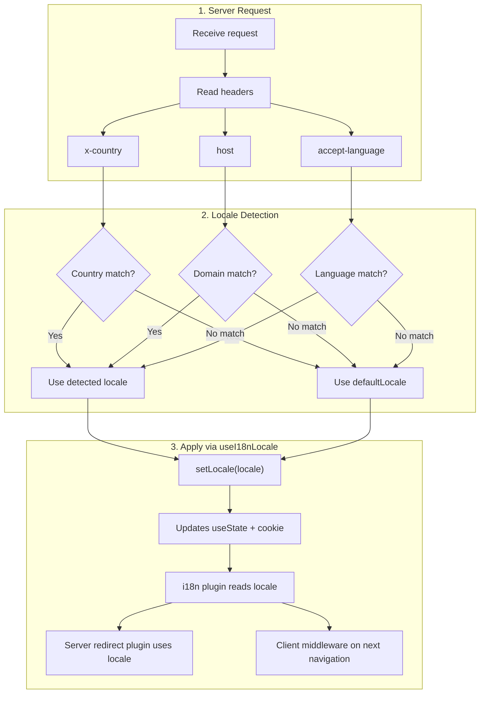

# 🔧 Pielāgota valodas noteikšana Nuxt I18n Micro

## 📖 Pārskats

Nuxt I18n Micro v3 nodrošina centralizētu kompozītu — `useI18nLocale()` — visai lokalizācijas pārvaldībai. Tas aizvieto manuālos `useState`/`useCookie` modeļus no v2. Izmantojot `useI18nLocale().setLocale()` servera spraudnī, vari ieviest jebkuru pielāgotu noteikšanas loģiku, saglabājot pilnu saderību ar moduļa pāradresācijas un sīkdatņu sistēmām.

## 🏗️ Arhitektūra

```mermaid
flowchart TB
    subgraph Plugins["Plugin Execution Order"]
        A["Your plugin<br/>order: -10"] -->|setLocale()| B["01.plugin.ts<br/>order: -5"]
        B --> C["06.redirect.ts server<br/>order: 10"]
    end

    subgraph Client["Client SPA Navigation"]
        D["i18n-redirect.global.ts<br/>route middleware"]
    end

    subgraph State["Locale State"]
        E["useState('i18n-locale')"]
        F["localeCookie"]
    end

    A -->|"setLocale() updates both"| E
    A -->|"setLocale() updates both"| F
    B -->|reads| E
    C -->|reads| E
    C -->|reads| F
    D -->|reads target route +| E
```

**Galvenais princips**: izsauc `useI18nLocale().setLocale()` servera spraudnī ar `order: -10`. Tas atomāri atjaunina gan `useState('i18n-locale')`, gan lokalizācijas sīkdatni, tāpēc i18n spraudnis (`order: -5`) un servera pāradresācijas spraudnis (`order: 10`) redz pareizo lokalizāciju pirmajā SSR pieprasījumā. Klienta puses automātiskās pāradresācijas darbojas globālajā maršruta starpprogrammatūrā turpmākajās navigācijās.

## 🛠️ Iebūvētās automātiskās noteikšanas atspējošana

Ja tu vēlies pilnu kontroli pār lokalizācijas noteikšanu, atspējo iebūvēto mehānismu:

```ts
export default defineNuxtConfig({
  i18n: {
    autoDetectLanguage: false,
  },
})
```

## ✨ Piemērs: servera puses noteikšana ar `useI18nLocale`

Šī ir **ieteicamā pieeja** visām stratēģijām.

### 1. solis: konfigurē `nuxt.config.ts`

```ts
export default defineNuxtConfig({
  modules: ['nuxt-i18n-micro'],
  i18n: {
    strategy: 'no_prefix', // Works with ANY strategy
    defaultLocale: 'en',
    localeCookie: 'user-locale',
    autoDetectLanguage: false,
    locales: [
      { code: 'en', iso: 'en-US' },
      { code: 'de', iso: 'de-DE' },
      { code: 'ja', iso: 'ja-JP' },
    ],
  },
})
```

### 2. solis: izveido `plugins/i18n-loader.server.ts`

```ts
import { defineNuxtPlugin, useRequestHeaders } from '#imports'

export default defineNuxtPlugin({
  name: 'i18n-custom-loader',
  enforce: 'pre',
  order: -10, // Execute BEFORE the i18n plugin (which has order -5)

  setup() {
    const { setLocale } = useI18nLocale()
    const headers = useRequestHeaders(['host', 'x-country', 'accept-language'])
    let detectedLocale = 'en'

    // --- YOUR DETECTION LOGIC ---

    // Example 1: By domain
    const host = headers['host']
    if (host?.includes('example.de')) {
      detectedLocale = 'de'
    }
    // Example 2: By custom header
    else if (headers['x-country'] === 'JP') {
      detectedLocale = 'ja'
    }
    // Example 3: By Accept-Language header
    else if (headers['accept-language']?.includes('de')) {
      detectedLocale = 'de'
    }

    // --- APPLY THE LOCALE ---
    setLocale(detectedLocale)
  },
})
```

### Kā tas darbojas



1. **Spraudnis darbojas vispirms** (`order: -10`) — nosaka lokalizāciju no galvenēm, domēna vai citiem avotiem.
2. **`setLocale()` atjaunina abus** — `useState('i18n-locale')` un sīkdatni — nodrošinot tūlītēju redzamību visiem turpmākajiem spraudņiem.
3. **i18n spraudnis** (`order: -5`) nolasa lokalizāciju un ielādē pareizos tulkojumus.
4. **Servera pāradresācijas spraudnis** (`order: 10`) izmanto lokalizāciju pāradresācijas lēmumiem SSR.
5. **Klienta maršruta starpprogrammatūra** (`i18n-redirect`) piemēro pāradresācijas SPA navigācijā, kad URL lokalizācija neatbilst preferencei.

## 🌐 Stratēģijai specifiska uzvedība

`useI18nLocale().setLocale()` darbojas ar **visām stratēģijām**. Pāradresācijas uzvedība ir atkarīga no stratēģijas:

<Tip>
| Stratēģija | `setLocale('de')` efekts |
|----------|---------------------------|
| `no_prefix` | Renderē vācu valodā, nav URL izmaiņu. |
| `prefix` | 302 → `/de/` (servera puses pāradresācija). |
| `prefix_except_default` | 302 → `/de/`, ja `de` ≠ noklusējums; nav pāradresācijas, ja `de` = noklusējums. |
| `prefix_and_default` | Nav pāradresācijas (gan `/`, gan `/de/` ir derīgi). |
</Tip>

**Svarīgas piezīmes:**

- Sīkdatnēs balstīta lokalizācijas noteikšana pēc noklusējuma ir atspējota (`localeCookie: null`).
- Iestati `localeCookie: 'user-locale'`, lai iespējotu sīkdatnes noturību.
- Ja sīkdatnes/stāvokļa vērtība nav `locales` sarakstā, tā atgriežas pie `defaultLocale`.

## 🏢 Uzlabota: domēnā balstīta noteikšana

Vairāku domēnu iestatījumiem, kur katrs domēns apkalpo citu lokalizāciju:

```ts
import { defineNuxtPlugin, useRequestHeaders } from '#imports'

export default defineNuxtPlugin({
  name: 'i18n-domain-loader',
  enforce: 'pre',
  order: -10,

  setup() {
    const { setLocale } = useI18nLocale()
    const headers = useRequestHeaders(['host'])
    const host = headers['host'] || ''

    let detectedLocale = 'en'

    if (host.endsWith('.de') || host.includes('german.')) {
      detectedLocale = 'de'
    } else if (host.endsWith('.fr') || host.includes('french.')) {
      detectedLocale = 'fr'
    } else if (host.endsWith('.jp') || host.includes('japanese.')) {
      detectedLocale = 'ja'
    }

    setLocale(detectedLocale)
  },
})
```

## 🔄 Uzlabota: lietotāja preferences ievērošana

Ja lietotāji var manuāli mainīt valodu, ievēro viņu izvēli, nevis automātisko noteikšanu:

```ts
import { defineNuxtPlugin, useRequestHeaders } from '#imports'

export default defineNuxtPlugin({
  name: 'i18n-smart-loader',
  enforce: 'pre',
  order: -10,

  setup() {
    const { getLocale, setLocale } = useI18nLocale()

    // If user already has a preference (from cookie), respect it
    if (getLocale()) {
      return
    }

    // Otherwise, detect locale from headers
    const headers = useRequestHeaders(['accept-language'])
    let detectedLocale = 'en'

    const acceptLanguage = headers['accept-language'] || ''
    if (acceptLanguage.includes('de')) {
      detectedLocale = 'de'
    } else if (acceptLanguage.includes('ja')) {
      detectedLocale = 'ja'
    }

    setLocale(detectedLocale)
  },
})
```

## ⚙️ Tikai servera vai tikai klienta spraudņi

Izmanto [Nuxt failu nosaukumu konvencijas](https://nuxt.com/docs/getting-started/directory-structure#plugins), lai kontrolētu, kur tavs spraudnis darbojas:

- **Tikai serveris**: `i18n-loader.server.ts` — darbojas tikai SSR laikā (ieteicams galvenēs balstītai noteikšanai).
- **Tikai klients**: `i18n-loader.client.ts` — darbojas tikai pārlūkā (`localStorage` vai DOM balstītai noteikšanai).


## ✅ Kopsavilkums

| Funkcija                                | Apraksts                                                       |
| -------------------------------------- | ----------------------------------------------------------------- |
| `useI18nLocale().setLocale()`          | Atomāri atjaunina `useState` + sīkdatni; darbojas ar visām stratēģijām. |
| `useI18nLocale().getLocale()`          | Atgriež pašreizējo lokalizāciju no stāvokļa vai sīkdatnes.                       |
| `useI18nLocale().getPreferredLocale()` | Atgriež vēlamo lokalizāciju (validētu pret `locales` sarakstu).       |
| Spraudņa `order: -10`                    | Nodrošina, ka tavs spraudnis darbojas pirms i18n inicializācijas.               |
| `enforce: 'pre'`                       | Darbojas "pre" spraudņu grupā.                                    |

**Neizmanto:**

- `useCookie('user-locale')` tieši — `useI18nLocale()` iekšēji pārvalda sīkdatnes.
- `useState('i18n-locale')` tieši — tā vietā izmanto `useI18nLocale().setLocale()`.
- `order` >= -5 — tavam spraudnim jādarbojas pirms i18n spraudņa.
