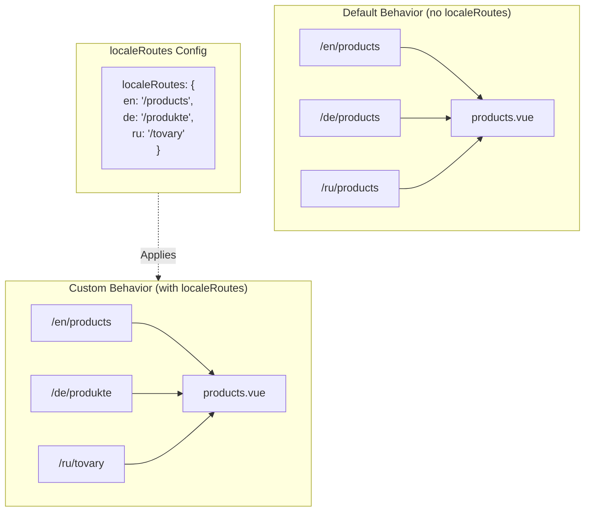

# 🔗 Pielāgoti lokalizēti maršruti ar `localeRoutes` modulī `Nuxt I18n Micro`

## 📖 Ievads par `localeRoutes`

Funkcija `localeRoutes` modulī `Nuxt I18n Micro` ļauj jums definēt pielāgotus maršrutus konkrētām lokālēm, piedāvājot elastību un kontroli pār jūsu lietotnes maršrutēšanas struktūru. Šī funkcija ir īpaši noderīga, kad noteiktām lokālēm nepieciešamas atšķirīgas URL struktūras, pielāgoti ceļi vai jāievēro specifiskas reģionālās vai lingvistiskās konvencijas.

## 🚀 `localeRoutes` primārais lietošanas gadījums

Primārais `localeRoutes` lietošanas gadījums ir sniegt atšķirīgus maršrutus dažādām lokālēm, uzlabojot lietotāja pieredzi, nodrošinot, ka URL ir intuitīvi un atbilstoši mērķauditorijai. Piemēram, jums var būt atšķirīgi ceļi lapas angļu un krievu versijām, kur krievu lokāle seko lokalizētam URL formātam.

### 📄 Piemērs: `localeRoutes` definēšana `$defineI18nRoute`

Šeit ir piemērs tam, kā jūs varat definēt pielāgotus maršrutus konkrētām lokālēm, izmantojot `localeRoutes` savā `$defineI18nRoute` funkcijā:

```typescript
import { useNuxtApp } from '#imports'

const { $defineI18nRoute } = useNuxtApp()

$defineI18nRoute({
  localeRoutes: {
    ru: '/localesubpage', // Custom route path for the Russian locale
    de: '/lokaleseite', // Custom route path for the German locale
  },
})
```

> [!IMPORTANT]
> `$defineI18nRoute` nav globāla funkcija. `script setup` sadaļā vispirms iegūstiet to no `useNuxtApp()`, tad izsauciet.

### 🔄 Kā darbojas `localeRoutes`



- **Noklusējuma uzvedība**: bez `localeRoutes` visas lokāles izmanto kopēju maršruta struktūru, ko definē primārais ceļš.
- **Pielāgotā uzvedība**: ar `localeRoutes` konkrētām lokālēm var būt savi maršruti, pārrakstot noklusējuma ceļu ar konfigurācijā definētajiem lokāles specifiskajiem maršrutiem.

## 🌱 `localeRoutes` lietošanas gadījumi

### 📄 Piemērs: `localeRoutes` izmantošana lapā

Šeit ir vienkāršs Vue komponents, kas demonstrē `$defineI18nRoute` izmantošanu ar `localeRoutes`:

```vue
<template>
  <div>
    <!-- Display greeting message based on the current locale -->
    <p>{{ $t('greeting') }}</p>

    <!-- Navigation links -->
    <div>
      <NuxtLink :to="$localeRoute({ name: 'index' })"> Go to Index </NuxtLink>
      |
      <NuxtLink :to="$localeRoute({ name: 'about' })"> Go to About Page </NuxtLink>
    </div>
  </div>
</template>

<script setup>
import { useNuxtApp } from '#imports'

const { $getLocale, $switchLocale, $getLocales, $localeRoute, $t, $defineI18nRoute } = useNuxtApp()

// Define translations and custom routes for specific locales
$defineI18nRoute({
  localeRoutes: {
    ru: '/localesubpage', // Custom route path for Russian locale
  },
})
</script>
```

### 🛠️ `localeRoutes` izmantošana dažādos kontekstos

- **Galvenās lapas (Landing Pages)**: izmantojiet pielāgotus maršrutus, lai lokalizētu URL galvenajām lapām, nodrošinot, ka tie atbilst mārketinga kampaņām.
- **Dokumentācijas vietnes**: nodrošiniet atšķirīgus maršrutus katrai lokālei, lai labāk atbilstu lokalizētajai satura struktūrai.
- **E-komercijas vietnes**: pielāgojiet produkta vai kategorijas URL katrai lokālei uzlabotai SEO un lietotāja pieredzei.

## Navigācijas izmantošana ar `localeRoutes`

Tā kā lokalizētie maršruti tieši neatbilst failu nosaukumiem lapu mapē, savā navigācijā uz tiem jāatsaucas ar objektu, nevis nosaukumu.

```vue
<template>
  /**
   * Exemple page: /pages/about-us.vue
   * EN /about-us
   * ES /sobre-nosotros
   * FR /a-propos
   */

  // Using NuxtLink
  <NuxtLink :to="$localeRoute({ name: 'about-us' })">
    Go to About Page
  </NuxtLink>

  // Using I18nLink
  <I18nLink :to="{ name: 'about-us' }">
    Go to About Page
  </NuxtLink>

  // The string literal navigation wouldn't work for any locale but english
  <I18nLink to="/about-us">
    Go to About Page
  </NuxtLink>
</template>
```

### Ligzdotu lapu nosaukšana

Pēc noklusējuma jūsu lapas tiek nosauktas, balstoties uz to faila un ceļa nosaukumu. Lūk, ko tas nozīmē:

- `/pages/about-us.vue` var piekļūt ar `$localeRoute(\{ name: 'about-us' \})`
- `/pages/about-us/physical-stores.vue` var piekļūt ar `$localeRoute(\{ name: 'about-us-physical-stores' \})`

Lai pārrakstītu šo uzvedību, skaidri nosauciet savu lapu ar `definePageMeta`.

```vue
// /pages/about-us/physical-stores.vue
<script setup>
definePageMeta({
  name: 'our-stores'
})
```

Uz šo lapu tagad var atsaukties gan ar `$localeRoute`, gan `I18nLink` pēc tās nosaukuma `:to='\{ name: "our-stores" \}'`.

## 🎯 Dinamiski maršruti ar slugiem un `$setI18nRouteParams`

Strādājot ar dinamiskiem maršrutiem, kas satur slugus vai parametrus, jūs varat izmantot `localeRoutes` ar dinamiskiem segmentiem un `$setI18nRouteParams`, lai nodrošinātu lokāles specifiskus slugus katrai lokālei.

### Dinamiski maršruta parametri `localeRoutes` iekšpusē

Jūs varat definēt dinamiskus maršrutus, izmantojot Nuxt maršruta parametru sintaksi (`[...slug]` catch-all maršrutiem, `[param]` viena parametra maršrutiem vai `:param()` nosauktiem parametriem):

```vue
<script setup lang="ts">
import { useNuxtApp, useRoute, useFetch, createError } from '#imports'

const { $defineI18nRoute, $setI18nRouteParams } = useNuxtApp()

// Define custom routes with dynamic segments
$defineI18nRoute({
  localeRoutes: {
    en: '/our-products/[...slug]',
    es: '/nuestros-productos/[...slug]',
  },
})
</script>
```

### Lokāles specifisku maršruta parametru iestatīšana

Funkcija `$setI18nRouteParams` ļauj iestatīt atšķirīgas parametru vērtības (piemēram, slugus) katrai lokālei. Tas ir īpaši noderīgi, kad jūsu saturam ir lokāles specifiski URL.

**Svarīgi**: `$setI18nRouteParams` jāizsauc pēc datu ienesuma, kas satur lokāles specifiskus slugus, parasti `useFetch` vai `useAsyncData` iekšpusē.

```vue
<script setup lang="ts">
import { useNuxtApp, useRoute, useFetch, createError } from '#imports'

interface Product {
  title: string
  price: string
  urlEn: string // English slug
  urlEs: string // Spanish slug
}

const { $defineI18nRoute, $setI18nRouteParams } = useNuxtApp()

const route = useRoute()
const slug = Array.isArray(route.params.slug) ? route.params.slug[0] : route.params.slug

// Fetch product data that includes locale-specific slugs
const { data: product, error } = await useFetch<Product>(`/api/product/${slug}`)
if (error.value)
  throw createError({
    statusCode: error.value?.statusCode,
    statusMessage: error.value?.statusMessage,
    fatal: true,
  })

// Define custom routes with dynamic segments
$defineI18nRoute({
  localeRoutes: {
    en: '/our-products/[...slug]',
    es: '/nuestros-productos/[...slug]',
  },
})

// Set different slugs for different locales
if (product.value) {
  $setI18nRouteParams({
    en: { slug: product.value.urlEn },
    es: { slug: product.value.urlEs },
  })
}
</script>
```

### Pilnīgs piemērs: produktu lapas ar lokāles specifiskiem slugiem

Šeit ir pilnīgs piemērs, kas parāda, kā izmantot `localeRoutes` un `$setI18nRouteParams` kopā produkta detaļu lapai:

```vue
<template>
  <div v-if="product">
    <h1>{{ product.title }}</h1>
    <p>{{ $t('price') }}: {{ product.price }}</p>
    <div class="locale-switcher">
      <a :href="$switchLocalePath('en')">English</a>
      <a :href="$switchLocalePath('es')">Español</a>
    </div>
  </div>
</template>

<script setup lang="ts">
import { useNuxtApp, useRoute, useFetch, createError } from '#imports'

interface Product {
  title: string
  price: string
  urlEn: string
  urlEs: string
}

const { $t, $defineI18nRoute, $setI18nRouteParams, $switchLocalePath } = useNuxtApp()

// Set page name for easier navigation
definePageMeta({ name: 'product-slug' })

const route = useRoute()
const slug = Array.isArray(route.params.slug) ? route.params.slug[0] : route.params.slug

// Fetch product data
const { data: product, error } = await useFetch<Product>(`/api/product/${slug}`)
if (error.value)
  throw createError({
    statusCode: error.value?.statusCode,
    statusMessage: error.value?.statusMessage,
    fatal: true,
  })

// Define locale-specific routes with dynamic segments
$defineI18nRoute({
  localeRoutes: {
    en: '/our-products/[...slug]',
    es: '/nuestros-productos/[...slug]',
  },
})

// Set locale-specific slugs so $switchLocalePath works correctly
if (product.value) {
  $setI18nRouteParams({
    en: { slug: product.value.urlEn },
    es: { slug: product.value.urlEs },
  })
}
</script>
```

### Piemērs: produktu saraksta lapa

Kad saites uz dinamiskiem maršrutiem tiek veidotas no saraksta lapas, izmantojiet maršruta nosaukumu ar parametriem:

```vue
<template>
  <div>
    <h1>{{ $t('title') }}</h1>
    <ul>
      <li v-for="product in products?.[$getLocale()] || []" :key="product.id">
        <I18nLink :to="{ name: 'product-slug', params: { slug: product.url } }"> {{ product.title }} – {{ product.price }} </I18nLink>
      </li>
    </ul>
  </div>
</template>

<script setup lang="ts">
import { useNuxtApp, useFetch, createError } from '#imports'

interface Product {
  id: string
  title: string
  price: string
  url: string
}

type ProductsByLocale = Record<string, Product[]>

const { $t, $defineI18nRoute, $getLocale } = useNuxtApp()

const { data: products, error } = await useFetch<ProductsByLocale>('/api/product')
if (error.value)
  throw createError({
    statusCode: error.value?.statusCode,
    statusMessage: error.value?.statusMessage,
    fatal: true,
  })

$defineI18nRoute({
  locales: {
    en: {
      title: 'Our Product Range',
      description: 'Discover our collection of high-quality products.',
    },
    es: {
      title: 'Nuestra Gama de Productos',
      description: 'Descubra nuestra colección de productos de alta calidad.',
    },
  },
  localeRoutes: {
    en: '/our-products',
    es: '/nuestros-productos',
  },
})
</script>
```

### Kā tas darbojas

1. **Maršruta definīcija**: `localeRoutes` definē bāzes ceļa struktūru katrai lokālei, iekļaujot dinamiskus segmentus, piemēram, `[...slug]` vai `[id]`.

2. **Parametru iestatīšana**: `$setI18nRouteParams` iestata faktiskās parametru vērtības katrai lokālei. Kad lietotājs pārslēdz lokāles, izmantojot `$switchLocalePath`, modulis izmanto šos parametrus, lai izveidotu pareizu URL.

3. **Parametru formāts**: parametru objektam jāatbilst struktūrai:

   ```typescript
   {
     [localeCode]: {
       [paramName]: paramValue
     }
   }
   ```

4. **Navigācija**: izmantojiet `I18nLink` vai `$localeRoute` ar maršruta nosaukumu un parametriem, lai pārvietotos starp dinamisko maršrutu lokalizētajām versijām.

### Svarīgas piezīmes

- **Laika izvēle**: `$setI18nRouteParams` jāizsauc pēc datu ienesuma, kas satur lokāles specifiskus slugus, parasti `useFetch` vai `useAsyncData` iekšpusē.

- **Parametru nosaukumi**: parametru nosaukumiem `$setI18nRouteParams` jāatbilst maršruta parametru nosaukumiem (piemēram, `slug` priekš `[...slug]` vai `id` priekš `[id]`).

- **Maršrutu nosaukumi**: izmantojot `definePageMeta(\{ name: 'route-name' \})`, izmantojiet šo nosaukumu, veidojot saiti uz maršrutu ar `I18nLink` vai `$localeRoute`.

- **Catch-all maršruti**: catch-all maršrutiem (`[...slug]`) slug parametram jābūt masīvam vai virknei, kas tiks pārveidota par masīvu.

## 🧩 Programmatiski maršruti (`pages:extend`) — #244

Maršrutiem, kas izveidoti `pages:extend` iekšpusē, nav vietas priekš `defineI18nRoute()`, un vairāki maršruti bieži koplieto vienu ietinošo SFC. Uz failu balstīta skenēšana tad tos apvieno vienā ierakstā.

**Neievietojiet** lokalizētus ceļus `route.meta` (tie tiktu nosūtīti klienta maršrutu tabulā). Uzturiet vienu reģistru un projicējiet to divreiz:

1. iekš `pages:extend` (izveido Nuxt maršrutus)
2. iekš `i18n.globalLocaleRoutes`, atslēdzot pēc maršruta **nosaukuma** (nevis faila ceļa)

Izmantojiet `splitLocaleRoutes` no `@i18n-micro/utils/split-locale-routes`:

```typescript
import { splitLocaleRoutes } from '@i18n-micro/utils/split-locale-routes'

const dynamic = splitLocaleRoutes([
  {
    name: 'products_tag',
    path: '/products/:tag',
    file: '~/pages/_dynamic.vue',
    paths: { fr: '/produits/:tag', de: '/produkte/:tag' },
  },
  {
    name: 'products_category',
    path: '/products/category/:category',
    file: '~/pages/_dynamic.vue',
    paths: { fr: '/produits/categorie/:category' },
  },
  // Disable localization for a programmatic route:
  // { name: 'internal', path: '/internal', file: '~/pages/_dynamic.vue', paths: false },
])

export default defineNuxtConfig({
  hooks: {
    'pages:extend'(pages) {
      pages.push(...dynamic.pages)
    },
  },
  i18n: {
    globalLocaleRoutes: dynamic.globalLocaleRoutes,
  },
})
```

Abas puses paliek sinhronizētas; koplietoti ietinošie komponenti vairs viens otru nepārraksta. Ar `globalLocaleRoutes` vien nepietiek — tas tikai pielāgo ceļus maršrutiem, kas jau eksistē Nuxt lapu tabulā.

## 📝 Labākā prakse `localeRoutes` lietošanai

- **🚀 Izmantojiet atbilstošām lokālēm**: piemērojiet `localeRoutes` galvenokārt tur, kur URL struktūra būtiski ietekmē lietotāja pieredzi vai SEO. Izvairieties no pārmērīgas lietošanas nelielām atšķirībām.
- **🔧 Uzturiet konsekvenci**: uzturiet konsekventu maršrutēšanas modeli pa lokālēm, ja vien nav pamatota iemesla atkāpties. Šī pieeja palīdz saglabāt skaidrību un samazināt sarežģītību.
- **📚 Dokumentējiet pielāgotos maršrutus**: skaidri dokumentējiet jebkurus pielāgotos maršrutus, ko definējat ar `localeRoutes`, īpaši moduļu lietotnēs, lai nodrošinātu, ka komandas dalībnieki saprot maršrutēšanas loģiku.
