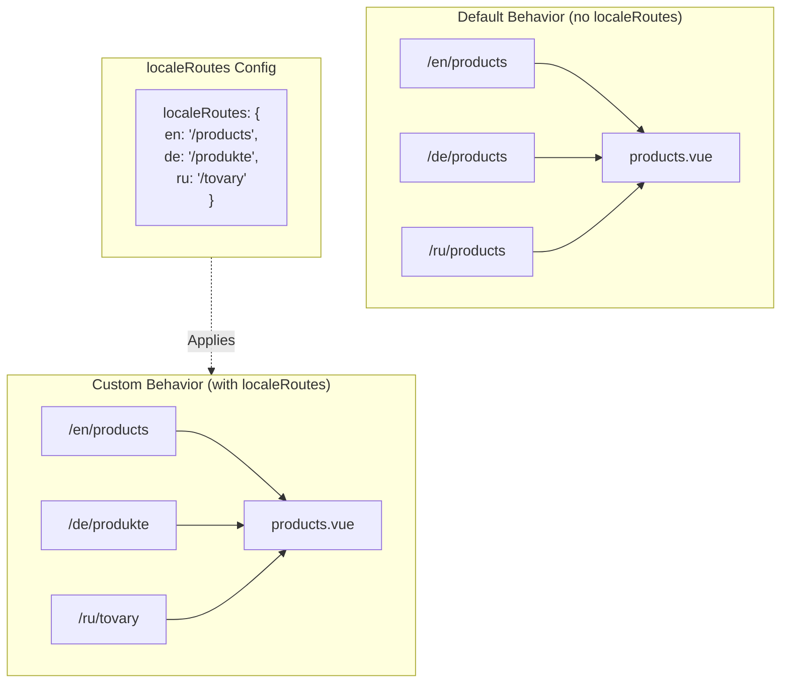

# 🔗 Pielāgoti lokalizēti maršruti ar `localeRoutes` modulī `Nuxt I18n Micro`

## 📖 Ievads `localeRoutes`

Funkcija `localeRoutes` modulī `Nuxt I18n Micro` ļauj tev definēt pielāgotus maršrutus konkrētām lokalizācijām, piedāvājot elastību un kontroli pār tavas lietotnes maršrutēšanas struktūru. Šī funkcija ir īpaši noderīga, kad noteiktām lokalizācijām nepieciešamas dažādas URL struktūras, pielāgoti ceļi vai jāievēro specifiskas reģionālās vai lingvistiskās konvencijas.

## 🚀 `localeRoutes` galvenais lietošanas gadījums

`localeRoutes` galvenais lietošanas gadījums ir nodrošināt atšķirīgus maršrutus dažādām lokalizācijām, uzlabojot lietotāja pieredzi, nodrošinot, ka URL ir intuitīvi un atbilstoši mērķauditorijai. Piemēram, tev var būt atšķirīgi ceļi lapas angļu un krievu versijām, kur krievu lokalizācija ievēro lokalizētu URL formātu.

### 📄 Piemērs: `localeRoutes` definēšana `$defineI18nRoute`

Šeit ir piemērs, kā tu varētu definēt pielāgotus maršrutus konkrētām lokalizācijām, izmantojot `localeRoutes` savā `$defineI18nRoute` funkcijā:

```typescript
import { useNuxtApp } from '#imports'

const { $defineI18nRoute } = useNuxtApp()

$defineI18nRoute({
  localeRoutes: {
    ru: '/localesubpage', // Custom route path for the Russian locale
    de: '/lokaleseite', // Custom route path for the German locale
  },
})
```

> [!IMPORTANT]
> `$defineI18nRoute` nav globāla funkcija. `script setup` iekšpusē vispirms iegūsti to no `useNuxtApp()`, tad izsauc.

### 🔄 Kā `localeRoutes` darbojas



- **Noklusējuma uzvedība**: bez `localeRoutes` visas lokalizācijas izmanto kopīgu maršruta struktūru, ko definē primārais ceļš.
- **Pielāgotā uzvedība**: ar `localeRoutes` konkrētām lokalizācijām var būt savi maršruti, kas pārraksta noklusējuma ceļu ar lokalizācijai specifiskiem maršrutiem, kas definēti konfigurācijā.

## 🌱 `localeRoutes` lietošanas gadījumi

### 📄 Piemērs: `localeRoutes` izmantošana lapā

Šeit ir vienkāršs Vue komponents, kas demonstrē `$defineI18nRoute` lietojumu ar `localeRoutes`:

```vue
<template>
  <div>
    <!-- Display greeting message based on the current locale -->
    <p>{{ $t('greeting') }}</p>

    <!-- Navigation links -->
    <div>
      <NuxtLink :to="$localeRoute({ name: 'index' })"> Go to Index </NuxtLink>
      |
      <NuxtLink :to="$localeRoute({ name: 'about' })"> Go to About Page </NuxtLink>
    </div>
  </div>
</template>

<script setup>
import { useNuxtApp } from '#imports'

const { $getLocale, $switchLocale, $getLocales, $localeRoute, $t, $defineI18nRoute } = useNuxtApp()

// Define translations and custom routes for specific locales
$defineI18nRoute({
  localeRoutes: {
    ru: '/localesubpage', // Custom route path for Russian locale
  },
})
</script>
```

### 🛠️ `localeRoutes` izmantošana dažādos kontekstos

- **Piezemēšanās lapas**: izmanto pielāgotus maršrutus, lai lokalizētu piezemēšanās lapu URL, nodrošinot, ka tie atbilst mārketinga kampaņām.
- **Dokumentācijas vietnes**: nodrošini atšķirīgus maršrutus katrai lokalizācijai, lai labāk atbilstu lokalizētajai satura struktūrai.
- **E-komercijas vietnes**: pielāgo produktu vai kategoriju URL katrai lokalizācijai uzlabotam SEO un lietotāja pieredzei.

## Navigācijas izmantošana ar `localeRoutes`

Tā kā lokalizētie maršruti tieši neatbilst failu nosaukumiem lapas mapē, tev jāatsaucas uz navigāciju ar objektu, nevis pēc nosaukuma.

```vue
<template>
  /**
   * Exemple page: /pages/about-us.vue
   * EN /about-us
   * ES /sobre-nosotros
   * FR /a-propos
   */

  // Using NuxtLink
  <NuxtLink :to="$localeRoute({ name: 'about-us' })">
    Go to About Page
  </NuxtLink>

  // Using I18nLink
  <I18nLink :to="{ name: 'about-us' }">
    Go to About Page
  </NuxtLink>

  // The string literal navigation wouldn't work for any locale but english
  <I18nLink to="/about-us">
    Go to About Page
  </NuxtLink>
</template>
```

### Ligzdotu lapu nosaukšana

Pēc noklusējuma tavas lapas tiek nosauktas, pamatojoties uz to faila un ceļa nosaukumu. Šeit ir, ko tas nozīmē:

- `/pages/about-us.vue` var piekļūt ar `$localeRoute(\{ name: 'about-us' \})`.
- `/pages/about-us/physical-stores.vue` var piekļūt ar `$localeRoute(\{ name: 'about-us-physical-stores' \})`.

Lai pārrakstītu šo uzvedību, skaidri nosauc savu lapu ar `definePageMeta`.

```vue
// /pages/about-us/physical-stores.vue
<script setup>
definePageMeta({
  name: 'our-stores'
})
```

Uz šo lapu tagad var atsaukties ar `$localeRoute` vai `I18nLink` pēc tās nosaukuma `:to='\{ name: "our-stores" \}'`.

## 🎯 Dinamiski maršruti ar slugs un `$setI18nRouteParams`

Strādājot ar dinamiskiem maršrutiem, kas satur slug vai parametrus, vari izmantot `localeRoutes` ar dinamiskiem segmentiem un `$setI18nRouteParams`, lai nodrošinātu lokalizācijai specifiskus slug katrai lokalizācijai.

### Dinamiski maršruta parametri iekš `localeRoutes`

Vari definēt dinamiskus maršrutus, izmantojot Nuxt maršruta parametru sintaksi (`[...slug]` catch-all maršrutiem, `[param]` vieniem parametriem vai `:param()` nosauktiem parametriem):

```vue
<script setup lang="ts">
import { useNuxtApp, useRoute, useFetch, createError } from '#imports'

const { $defineI18nRoute, $setI18nRouteParams } = useNuxtApp()

// Define custom routes with dynamic segments
$defineI18nRoute({
  localeRoutes: {
    en: '/our-products/[...slug]',
    es: '/nuestros-productos/[...slug]',
  },
})
</script>
```

### Lokalizācijai specifisku maršruta parametru iestatīšana

Funkcija `$setI18nRouteParams` ļauj tev iestatīt dažādas parametru vērtības (piemēram, slug) katrai lokalizācijai. Tas ir īpaši noderīgi, kad tavam saturam ir lokalizācijai specifiski URL.

**Svarīgi**: `$setI18nRouteParams` jāizsauc pēc datu ielādes, kas satur lokalizācijai specifiskus slug, parasti iekš `useFetch` vai `useAsyncData`.

```vue
<script setup lang="ts">
import { useNuxtApp, useRoute, useFetch, createError } from '#imports'

interface Product {
  title: string
  price: string
  urlEn: string // English slug
  urlEs: string // Spanish slug
}

const { $defineI18nRoute, $setI18nRouteParams } = useNuxtApp()

const route = useRoute()
const slug = Array.isArray(route.params.slug) ? route.params.slug[0] : route.params.slug

// Fetch product data that includes locale-specific slugs
const { data: product, error } = await useFetch<Product>(`/api/product/${slug}`)
if (error.value)
  throw createError({
    statusCode: error.value?.statusCode,
    statusMessage: error.value?.statusMessage,
    fatal: true,
  })

// Define custom routes with dynamic segments
$defineI18nRoute({
  localeRoutes: {
    en: '/our-products/[...slug]',
    es: '/nuestros-productos/[...slug]',
  },
})

// Set different slugs for different locales
if (product.value) {
  $setI18nRouteParams({
    en: { slug: product.value.urlEn },
    es: { slug: product.value.urlEs },
  })
}
</script>
```

### Pilns piemērs: produktu lapas ar lokalizācijai specifiskiem slug

Šeit ir pilns piemērs, kas parāda, kā izmantot `localeRoutes` un `$setI18nRouteParams` kopā produkta detaļu lapai:

```vue
<template>
  <div v-if="product">
    <h1>{{ product.title }}</h1>
    <p>{{ $t('price') }}: {{ product.price }}</p>
    <div class="locale-switcher">
      <a :href="$switchLocalePath('en')">English</a>
      <a :href="$switchLocalePath('es')">Español</a>
    </div>
  </div>
</template>

<script setup lang="ts">
import { useNuxtApp, useRoute, useFetch, createError } from '#imports'

interface Product {
  title: string
  price: string
  urlEn: string
  urlEs: string
}

const { $t, $defineI18nRoute, $setI18nRouteParams, $switchLocalePath } = useNuxtApp()

// Set page name for easier navigation
definePageMeta({ name: 'product-slug' })

const route = useRoute()
const slug = Array.isArray(route.params.slug) ? route.params.slug[0] : route.params.slug

// Fetch product data
const { data: product, error } = await useFetch<Product>(`/api/product/${slug}`)
if (error.value)
  throw createError({
    statusCode: error.value?.statusCode,
    statusMessage: error.value?.statusMessage,
    fatal: true,
  })

// Define locale-specific routes with dynamic segments
$defineI18nRoute({
  localeRoutes: {
    en: '/our-products/[...slug]',
    es: '/nuestros-productos/[...slug]',
  },
})

// Set locale-specific slugs so $switchLocalePath works correctly
if (product.value) {
  $setI18nRouteParams({
    en: { slug: product.value.urlEn },
    es: { slug: product.value.urlEs },
  })
}
</script>
```

### Piemērs: produktu saraksta lapa

Saistoties ar dinamiskiem maršrutiem no saraksta lapas, izmanto maršruta nosaukumu ar parametriem:

```vue
<template>
  <div>
    <h1>{{ $t('title') }}</h1>
    <ul>
      <li v-for="product in products?.[$getLocale()] || []" :key="product.id">
        <I18nLink :to="{ name: 'product-slug', params: { slug: product.url } }"> {{ product.title }} – {{ product.price }} </I18nLink>
      </li>
    </ul>
  </div>
</template>

<script setup lang="ts">
import { useNuxtApp, useFetch, createError } from '#imports'

interface Product {
  id: string
  title: string
  price: string
  url: string
}

type ProductsByLocale = Record<string, Product[]>

const { $t, $defineI18nRoute, $getLocale } = useNuxtApp()

const { data: products, error } = await useFetch<ProductsByLocale>('/api/product')
if (error.value)
  throw createError({
    statusCode: error.value?.statusCode,
    statusMessage: error.value?.statusMessage,
    fatal: true,
  })

$defineI18nRoute({
  locales: {
    en: {
      title: 'Our Product Range',
      description: 'Discover our collection of high-quality products.',
    },
    es: {
      title: 'Nuestra Gama de Productos',
      description: 'Descubra nuestra colección de productos de alta calidad.',
    },
  },
  localeRoutes: {
    en: '/our-products',
    es: '/nuestros-productos',
  },
})
</script>
```

### Kā tas darbojas

1. **Maršruta definēšana**: `localeRoutes` definē bāzes ceļa struktūru katrai lokalizācijai, tostarp dinamiskus segmentus, piemēram, `[...slug]` vai `[id]`.

2. **Parametru iestatīšana**: `$setI18nRouteParams` iestata faktiskās parametru vērtības katrai lokalizācijai. Kad lietotājs pārslēdz lokalizācijas, izmantojot `$switchLocalePath`, modulis izmanto šos parametrus, lai izveidotu pareizo URL.

3. **Parametru formāts**: parametru objektam jāatbilst struktūrai:

   ```typescript
   {
     [localeCode]: {
       [paramName]: paramValue
     }
   }
   ```

4. **Navigācija**: izmanto `I18nLink` vai `$localeRoute` ar maršruta nosaukumu un parametriem, lai navigētu starp lokalizētajām dinamisko maršrutu versijām.

### Svarīgas piezīmes

- **Laiks**: `$setI18nRouteParams` jāizsauc pēc datu ielādes, kas satur lokalizācijai specifiskus slug, parasti iekš `useFetch` vai `useAsyncData`.

- **Parametru nosaukumi**: parametru nosaukumiem iekš `$setI18nRouteParams` jāatbilst maršruta parametru nosaukumiem (piemēram, `slug` priekš `[...slug]` vai `id` priekš `[id]`).

- **Maršrutu nosaukumi**: izmantojot `definePageMeta(\{ name: 'route-name' \})`, izmanto šo nosaukumu, saistoties ar maršrutu ar `I18nLink` vai `$localeRoute`.

- **Catch-all maršruti**: catch-all maršrutiem (`[...slug]`) slug parametram jābūt masīvam vai virknei, kas tiks pārvērsta masīvā.

## 🧩 Programmatiski maršruti (`pages:extend`) — #244

Maršrutiem, kas izveidoti iekš `pages:extend`, nav vietas `defineI18nRoute()`, un vairāki maršruti bieži koplieto vienu ietvēruma SFC. Faila indeksētā skenēšana tad sabruknē tos vienā ierakstā.

**Neievieto** lokalizētos ceļus iekš `route.meta` (tie tiktu piegādāti klienta maršruta tabulā). Uzturi vienu reģistru un projicē to divreiz:

1. iekš `pages:extend` (izveido Nuxt maršrutus).
2. iekš `i18n.globalLocaleRoutes`, indeksēts pēc maršruta **nosaukuma** (nevis faila ceļa).

Izmanto `splitLocaleRoutes` no `@i18n-micro/utils/split-locale-routes`:

```typescript
import { splitLocaleRoutes } from '@i18n-micro/utils/split-locale-routes'

const dynamic = splitLocaleRoutes([
  {
    name: 'products_tag',
    path: '/products/:tag',
    file: '~/pages/_dynamic.vue',
    paths: { fr: '/produits/:tag', de: '/produkte/:tag' },
  },
  {
    name: 'products_category',
    path: '/products/category/:category',
    file: '~/pages/_dynamic.vue',
    paths: { fr: '/produits/categorie/:category' },
  },
  // Disable localization for a programmatic route:
  // { name: 'internal', path: '/internal', file: '~/pages/_dynamic.vue', paths: false },
])

export default defineNuxtConfig({
  hooks: {
    'pages:extend'(pages) {
      pages.push(...dynamic.pages)
    },
  },
  i18n: {
    globalLocaleRoutes: dynamic.globalLocaleRoutes,
  },
})
```

Abas puses paliek sinhronas; koplietotie ietvērumi vairs nepārrakstīs viens otru. `globalLocaleRoutes` viens pats nav pietiekams — tas tikai pielāgo ceļus maršrutiem, kas jau eksistē Nuxt lapas tabulā.

## 📝 Labākās prakses `localeRoutes` izmantošanai

- **🚀 Izmanto attiecīgām lokalizācijām**: piemēro `localeRoutes` galvenokārt tur, kur URL struktūra būtiski ietekmē lietotāja pieredzi vai SEO. Izvairies no pārmērīgas izmantošanas nelielām atšķirībām.
- **🔧 Uzturi konsekvenci**: uzturi konsekventu maršrutēšanas modeli visās lokalizācijās, ja vien nav spēcīga iemesla novirzīties. Šī pieeja palīdz uzturēt skaidrību un samazināt sarežģītību.
- **📚 Dokumentē pielāgotus maršrutus**: skaidri dokumentē visus pielāgotos maršrutus, ko definē ar `localeRoutes`, īpaši modulārās lietotnēs, lai nodrošinātu, ka komandas locekļi saprot maršrutēšanas loģiku.
