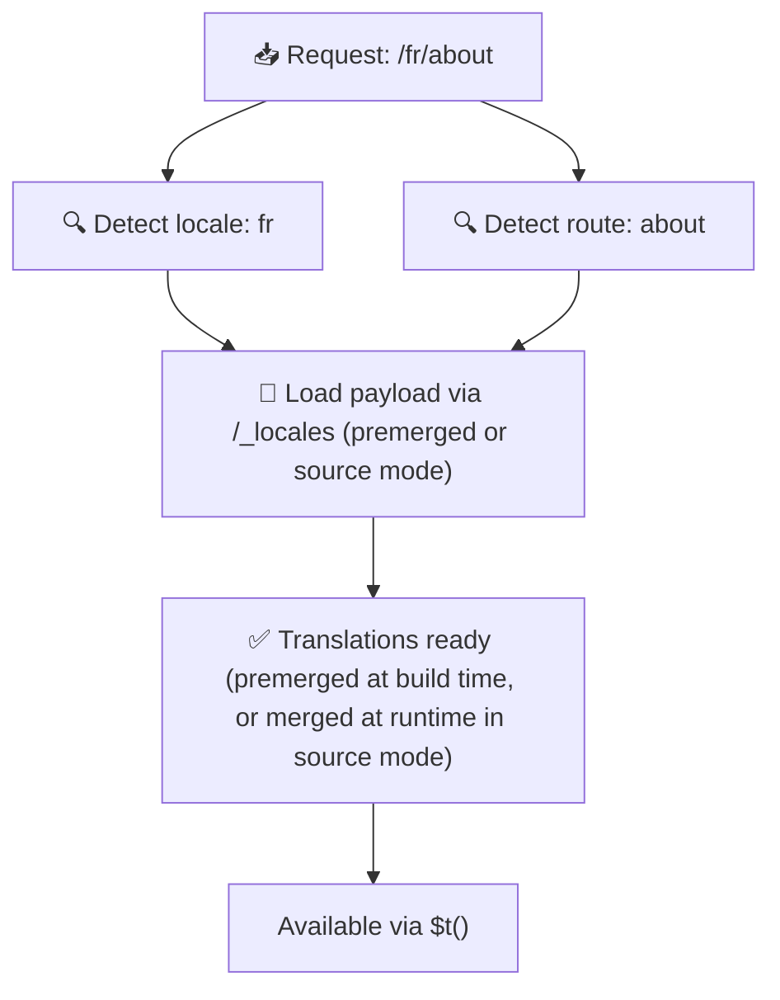

# 📂 Mapju struktūras ceļvedis

## 📖 Ievads

Tavu tulkojumu failu efektīva organizēšana ir būtiska mērogojamas un efektīvas internacionalizācijas (i18n) sistēmas uzturēšanai. `Nuxt I18n Micro` vienkāršo šo procesu, piedāvājot skaidru pieeju saknes līmeņa un lapām specifisku tulkojumu pārvaldībai. Šis ceļvedis izved tevi cauri ieteicamajai mapju struktūrai un izskaidros, kā `Nuxt I18n Micro` apstrādā šos tulkojumus.

## 🗂️ Ieteicamā mapju struktūra

`Nuxt I18n Micro` organizē tulkojumus saknes līmeņa failos un lapām specifiskos failos `pages` mapes iekšpusē. Ar `translationPayloads.mode: 'premerged'` (noklusējums) saknes līmeņa tulkojumi tiek automātiski sapludināti katrā lapas failā būvēšanas laikā, tāpēc katrai lapai ir pilns tulkojumu komplekts bez izpildlaika sapludināšanas slodzes.

Ar `mode: 'source'` avota faili paliek atsevišķi Nitro līdzekļos un tiek sapludināti izpildlaikā caur `/_locales` maršrutu. Skati [Serverless slodzes izvadi](/guides/performance#serverless-payload-output).

### 🔧 Pamatstruktūra

Šeit ir pamata piemērs mapju struktūrai, kurai tev jāseko:

```text
locales/
├── pages/
│   ├── index/
│   │   ├── en.json
│   │   ├── fr.json
│   │   └── ar.json
│   ├── about/
│   │   ├── en.json
│   │   ├── fr.json
│   │   └── ar.json
├── en.json
├── fr.json
└── ar.json

```

### 📄 Struktūras skaidrojums

#### 1. 🌍 Saknes līmeņa tulkojumu faili

- **Ceļš:** `/locales/\{locale\}.json` (piemēram, `/locales/en.json`).
- **Mērķis:** šie faili satur tulkojumus, kas tiek koplietoti visā lietotnē (navigācijas izvēlnes, galvenes, kājenes un citi). Ar `mode: 'premerged'` (noklusējums) tie tiek automātiski sapludināti ar katru lapām specifisko failu būvēšanas laikā, tāpēc serveris atgriež vienu iepriekš izveidotu failu katrai lapai.

  **Satura piemērs (`/locales/en.json`):**

  ```json
  {
    "menu": {
      "home": "Home",
      "about": "About Us",
      "contact": "Contact"
    },
    "footer": {
      "copyright": "© 2024 Your Company"
    }
  }
  ```

#### 2. 📄 Lapām specifiski tulkojumu faili

- **Ceļš:** `/locales/pages/\{routeName\}/\{locale\}.json` (piemēram, `/locales/pages/index/en.json`).
- **Mērķis:** šie faili satur tulkojumus, kas specifiski atsevišķām lapām. Ar `mode: 'premerged'` (noklusējums) saknes līmeņa tulkojumi tiek iesapludināti kā bāze būvēšanas laikā, tāpēc katrs lapas fails kļūst pašpietiekams.

  **Satura piemērs (`/locales/pages/index/en.json`):**

  ```json
  {
    "title": "Welcome to Our Website",
    "description": "We offer a wide range of products and services to meet your needs."
  }
  ```

  **Satura piemērs (`/locales/pages/about/en.json`):**

  ```json
  {
    "title": "About Us",
    "description": "Learn more about our mission, vision, and values."
  }
  ```

### 📂 Dinamisku maršrutu un ligzdotu ceļu apstrāde

`Nuxt I18n Micro` automātiski pārveido dinamiskos segmentus un ligzdotus ceļus maršrutos plakanā mapju struktūrā, izmantojot specifisku pārsaukšanas konvenciju. Tas nodrošina, ka visi tulkojumi tiek glabāti konsekventi un viegli pieejami.

#### Dinamiskā maršruta tulkojumu mapju struktūra

Strādājot ar dinamiskiem maršrutiem, piemēram, `/products/[id]`, modulis pārvērš dinamisko segmentu `[id]` statiskā formātā failu struktūrā.

**Dinamisko maršrutu mapju struktūras piemērs:**

Maršrutam, piemēram, `/products/[id]`, tulkojumu faili tiktu glabāti mapē ar nosaukumu `products-id`:

```text
locales/pages/
├── products-id/
│   ├── en.json
│   ├── fr.json
│   └── ar.json

```

**Ligzdotu dinamisko maršrutu mapju struktūras piemērs:**

Ligzdotam maršrutam, piemēram, `/products/key/[id]`, tulkojumu faili tiktu glabāti mapē ar nosaukumu `products-key-id`:

```text
locales/pages/
├── products-key-id/
│   ├── en.json
│   ├── fr.json
│   └── ar.json

```

**Vairāku līmeņu ligzdotu maršrutu mapju struktūras piemērs:**

Sarežģītākam ligzdotam maršrutam, piemēram, `/products/category/[id]/details`, tulkojumu faili tiktu glabāti mapē ar nosaukumu `products-category-id-details`:

```text
locales/pages/
├── products-category-id-details/
│   ├── en.json
│   ├── fr.json
│   └── ar.json

```

### 🛠 Mapju struktūras pielāgošana

Ja tu vēlies glabāt tulkojumus citā mapē, `Nuxt I18n Micro` ļauj pielāgot mapi, kurā tiek glabāti tulkojumu faili. To vari konfigurēt savā `nuxt.config.ts` failā.

**Piemērs: tulkojumu mapes pielāgošana**

```typescript
export default defineNuxtConfig({
  i18n: {
    translationDir: 'i18n', // Custom directory path
  },
})
```

Tas norādīs `Nuxt I18n Micro` meklēt tulkojumu failus mapē `/i18n`, nevis noklusējuma `/locales` mapē.

## ⚙️ Kā tulkojumi tiek ielādēti

### 🌍 Dinamiskie lokalizācijas maršruti

`Nuxt I18n Micro` izmanto dinamiskus lokalizācijas maršrutus, lai efektīvi ielādētu tulkojumus. Kad lietotājs apmeklē lapu, modulis nosaka atbilstošo lokalizāciju un ielādē attiecīgos tulkojumu failus, pamatojoties uz pašreizējo maršrutu un lokalizāciju.



Piemēram:

- Apmeklējot `/en/index`, tiks ielādēti tulkojumi no `/locales/pages/index/en.json`.
- Apmeklējot `/fr/about`, tiks ielādēti tulkojumi no `/locales/pages/about/fr.json`.

Šī metode nodrošina, ka tiek ielādēti tikai nepieciešamie tulkojumi, optimizējot gan servera slodzi, gan klienta puses veiktspēju.

### 💾 Kešošana un pirmsrenderēšana

Lai vēl vairāk uzlabotu veiktspēju, `Nuxt I18n Micro` atbalsta tulkojumu failu kešošanu un pirmsrenderēšanu:

- **Kešošana**: kad tulkojumu fails ir ielādēts, tas tiek kešots turpmākajiem pieprasījumiem, samazinot nepieciešamību atkārtoti ielādēt tos pašus datus.
- **Pirmsrenderēšana**: būvēšanas procesa laikā vari pirmsrenderēt tulkojumu failus visām konfigurētajām lokalizācijām un maršrutiem, ļaujot tos apkalpot tieši no servera bez izpildlaika aizkavēm.

## 📝 Labākās prakses

### 📂 Gudri izmanto lapām specifiskus failus

Izmanto lapām specifiskus failus, lai uzturētu tulkojumus sakārtotus. Tas uztur katras lapas tulkojumus liesus un ātri ielādējamus, kas ir īpaši svarīgi lapām ar sarežģītu vai lielu saturu.

### 🔑 Uzturi tulkojumu atslēgas konsekventas

Izmanto konsekventas nosaukšanas konvencijas savām tulkojumu atslēgām visos failos. Tas palīdz uzturēt skaidrību un novērš problēmas, pārvaldot tulkojumus, īpaši, kad tava lietotne aug.

### 🗂️ Organizē tulkojumus pēc konteksta

Grupē saistītos tulkojumus kopā savos failos. Piemēram, grupē visus pogu uzrakstus zem atslēgas `buttons` un visus ar formu saistītos tekstus zem atslēgas `forms`. Tas ne tikai uzlabo lasāmību, bet arī atvieglo tulkojumu pārvaldību dažādās lokalizācijās.

### ⚠️ Ligzdošanas dziļuma ierobežojums (ieteikti 2 līmeņi)

Klienta puses navigācijas laikā `Nuxt I18n Micro` izmanto optimizētu 2 līmeņu dziļu sapludināšanu, lai apvienotu tulkojumus no aizejošās un ienākošās lapas. Tas nodrošina, ka pārklājošās ligzdotās atslēgas (piemēram, abām lapām ir atslēgas zem `common.*`) tiek saglabātas pārejas animāciju laikā.

**Tas darbojas pareizi standarta `Sadaļa → Atslēga → Vērtība` struktūrai (2 līmeņi):**

```json
// Page A translations
{ "common": { "fromA": "Text A" } }

// Page B translations
{ "common": { "fromB": "Text B" } }

// During transition, both are available:
// { "common": { "fromA": "Text A", "fromB": "Text B" } }
```

**Tomēr, ja izmanto 3+ ligzdošanas līmeņus, dziļākas atslēgas pāreju laikā var tikt pārrakstītas:**

```json
// Page A translations
{ "auth": { "form": { "login": "Login" } } }

// Page B translations
{ "auth": { "form": { "register": "Register" } } }

// During transition: "login" key is lost
// { "auth": { "form": { "register": "Register" } } }
```


### 🧹 Regulāri iztīri neizmantotos tulkojumus

Laika gaitā tava lietotne var uzkrāt neizmantotas tulkojumu atslēgas, īpaši, ja funkcijas tiek noņemtas vai pārstrukturētas. Periodiski pārskati un iztīri savus tulkojumu failus, lai tie paliktu liesa un uzturama.
