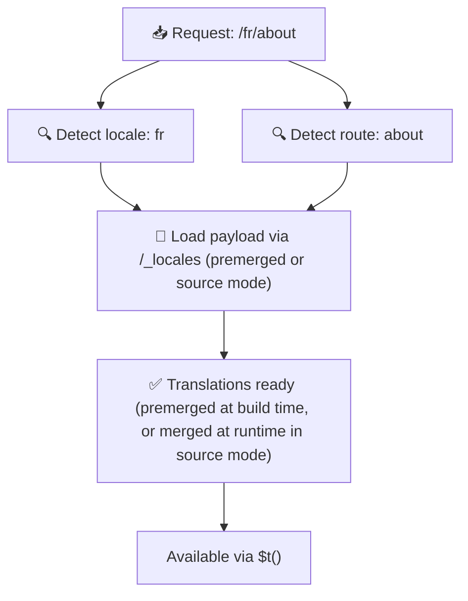

# 📂 Mapes struktūras ceļvedis

## 📖 Ievads

Efektīva jūsu tulkojumu failu organizēšana ir būtiska, lai uzturētu mērogojamu un efektīvu internacionalizācijas (i18n) sistēmu. `Nuxt I18n Micro` vienkāršo šo procesu, piedāvājot skaidru pieeju saknes līmeņa un lapas specifisku tulkojumu pārvaldībai. Šis ceļvedis palīdzēs jums iepazīt ieteicamo mapes struktūru un paskaidros, kā `Nuxt I18n Micro` apstrādā šos tulkojumus.

## 🗂️ Ieteicamā mapes struktūra

`Nuxt I18n Micro` sakārto tulkojumus saknes līmeņa failos un lapu specifiskajos failos mapē `pages`. Ar `translationPayloads.mode: 'premerged'` (noklusējums) saknes līmeņa tulkojumi būvēšanas laikā tiek automātiski sapludināti katrā lapas failā, tāpēc katrai lapai ir pilns tulkojumu komplekts bez izpildlaika sapludināšanas papildslodzes.

Ar `mode: 'source'` avota faili paliek atsevišķi Nitro aktīvos un tiek sapludināti izpildlaikā caur maršrutu `/_locales`. Skatiet [Bezservera payload izvade](/guides/performance#serverless-payload-output).

### 🔧 Pamata struktūra

Šeit ir pamata piemērs mapes struktūrai, kurai jāseko:

```text
locales/
├── pages/
│   ├── index/
│   │   ├── en.json
│   │   ├── fr.json
│   │   └── ar.json
│   ├── about/
│   │   ├── en.json
│   │   ├── fr.json
│   │   └── ar.json
├── en.json
├── fr.json
└── ar.json

```

### 📄 Struktūras skaidrojums

#### 1. 🌍 Saknes līmeņa tulkojumu faili

- **Ceļš:** `/locales/\{locale\}.json` (piemēram, `/locales/en.json`)
- **Nolūks:** šie faili satur tulkojumus, kas tiek koplietoti visā lietotnē (navigācijas izvēlnes, galvenes, kājenes u.c.). Ar `mode: 'premerged'` (noklusējums) tie būvēšanas laikā tiek automātiski sapludināti katrā lapas specifiskajā failā, tāpēc serveris katrai lapai atgriež vienu iepriekš izveidotu failu.

  **Piemēra saturs (`/locales/en.json`):**

  ```json
  {
    "menu": {
      "home": "Home",
      "about": "About Us",
      "contact": "Contact"
    },
    "footer": {
      "copyright": "© 2024 Your Company"
    }
  }
  ```

#### 2. 📄 Lapas specifiskie tulkojumu faili

- **Ceļš:** `/locales/pages/\{routeName\}/\{locale\}.json` (piemēram, `/locales/pages/index/en.json`)
- **Nolūks:** šie faili satur tulkojumus, kas ir specifiski atsevišķām lapām. Ar `mode: 'premerged'` (noklusējums) saknes līmeņa tulkojumi būvēšanas laikā tiek sapludināti kā pamats, tāpēc katrs lapas fails kļūst pašpietiekams.

  **Piemēra saturs (`/locales/pages/index/en.json`):**

  ```json
  {
    "title": "Welcome to Our Website",
    "description": "We offer a wide range of products and services to meet your needs."
  }
  ```

  **Piemēra saturs (`/locales/pages/about/en.json`):**

  ```json
  {
    "title": "About Us",
    "description": "Learn more about our mission, vision, and values."
  }
  ```

### 📂 Dinamisku maršrutu un ligzdotu ceļu apstrāde

`Nuxt I18n Micro` maršrutu dinamiskos segmentus un ligzdotus ceļus automātiski pārveido plakanā mapes struktūrā, izmantojot noteiktu pārdēvēšanas konvenciju. Tas nodrošina, ka visi tulkojumi tiek glabāti konsekventā un viegli pieejamā veidā.

#### Dinamisko maršrutu tulkojumu mapes struktūra

Apstrādājot dinamiskos maršrutus, piemēram, `/products/[id]`, modulis pārveido dinamisko segmentu `[id]` statiskā formātā failu struktūrā.

**Piemēra mapes struktūra dinamiskiem maršrutiem:**

Maršrutam kā `/products/[id]` tulkojumu faili tiktu glabāti mapē ar nosaukumu `products-id`:

```text
locales/pages/
├── products-id/
│   ├── en.json
│   ├── fr.json
│   └── ar.json

```

**Piemēra mapes struktūra ligzdotiem dinamiskajiem maršrutiem:**

Ligzdotam maršrutam kā `/products/key/[id]` tulkojumu faili tiktu glabāti mapē ar nosaukumu `products-key-id`:

```text
locales/pages/
├── products-key-id/
│   ├── en.json
│   ├── fr.json
│   └── ar.json

```

**Piemēra mapes struktūra daudzlīmeņu ligzdotiem maršrutiem:**

Sarežģītākam ligzdotam maršrutam kā `/products/category/[id]/details` tulkojumu faili tiktu glabāti mapē ar nosaukumu `products-category-id-details`:

```text
locales/pages/
├── products-category-id-details/
│   ├── en.json
│   ├── fr.json
│   └── ar.json

```

### 🛠 Mapes struktūras pielāgošana

Ja vēlaties tulkojumus glabāt citā mapē, `Nuxt I18n Micro` ļauj pielāgot mapi, kurā tiek glabāti tulkojumu faili. To varat konfigurēt savā `nuxt.config.ts` failā.

**Piemērs: tulkojumu mapes pielāgošana**

```typescript
export default defineNuxtConfig({
  i18n: {
    translationDir: 'i18n', // Custom directory path
  },
})
```

Tas dos norādi `Nuxt I18n Micro` meklēt tulkojumu failus mapē `/i18n`, nevis noklusējuma mapē `/locales`.

## ⚙️ Kā tulkojumi tiek ielādēti

### 🌍 Dinamiski lokāļu maršruti

`Nuxt I18n Micro` izmanto dinamiskus lokāļu maršrutus, lai efektīvi ielādētu tulkojumus. Kad lietotājs apmeklē lapu, modulis nosaka atbilstošo lokāli un ielādē attiecīgos tulkojumu failus, balstoties uz pašreizējo maršrutu un lokāli.



Piemēram:

- Apmeklējot `/en/index`, tiks ielādēti tulkojumi no `/locales/pages/index/en.json`.
- Apmeklējot `/fr/about`, tiks ielādēti tulkojumi no `/locales/pages/about/fr.json`.

Šī metode nodrošina, ka tiek ielādēti tikai nepieciešamie tulkojumi, optimizējot gan servera slodzi, gan klienta puses veiktspēju.

### 💾 Kešošana un iepriekšēja renderēšana

Lai vēl vairāk uzlabotu veiktspēju, `Nuxt I18n Micro` atbalsta tulkojumu failu kešošanu un iepriekšēju renderēšanu:

- **Kešošana**: kad tulkojumu fails ir ielādēts, tas tiek kešots turpmākiem pieprasījumiem, samazinot vajadzību atkārtoti iegūt tos pašus datus.
- **Iepriekšēja renderēšana**: būvēšanas procesa laikā jūs varat iepriekš renderēt tulkojumu failus visām konfigurētajām lokālēm un maršrutiem, ļaujot tos apkalpot tieši no servera bez izpildlaika kavējumiem.

## 📝 Labākā prakse

### 📂 Izmantojiet lapas specifiskus failus prātīgi

Izmantojiet lapas specifiskus failus, lai uzturētu tulkojumus organizētus. Tas uztur katras lapas tulkojumus vieglus un ātri ielādējamus, kas ir īpaši svarīgi lapām ar sarežģītu vai lielu saturu.

### 🔑 Uzturiet tulkojumu atslēgas konsekventas

Izmantojiet konsekventas nosaukumu konvencijas savām tulkojumu atslēgām visos failos. Tas palīdz saglabāt skaidrību un novērš problēmas, pārvaldot tulkojumus, īpaši, kad jūsu lietotne pieaug.

### 🗂️ Organizējiet tulkojumus pēc konteksta

Grupējiet saistītos tulkojumus kopā savos failos. Piemēram, grupējiet visas pogu etiķetes zem `buttons` atslēgas un visus ar formām saistītos tekstus zem `forms` atslēgas. Tas ne tikai uzlabo lasāmību, bet arī atvieglo tulkojumu pārvaldību dažādās lokālēs.

### ⚠️ Ligzdošanas dziļuma ierobežojums (ieteikti 2 līmeņi)

Klienta puses navigācijas laikā `Nuxt I18n Micro` izmanto optimizētu 2 līmeņu dziļu sapludināšanu, lai apvienotu tulkojumus no lapas, kas tiek pamesta, un tās, kurā tiek ieiets. Tas nodrošina, ka pārklājošās ligzdotās atslēgas (piemēram, abām lapām ir atslēgas zem `common.*`) tiek saglabātas pārejas animāciju laikā.

**Tas darbojas pareizi standarta `Section → Key → Value` struktūrai (2 līmeņi):**

```json
// Page A translations
{ "common": { "fromA": "Text A" } }

// Page B translations
{ "common": { "fromB": "Text B" } }

// During transition, both are available:
// { "common": { "fromA": "Text A", "fromB": "Text B" } }
```

**Tomēr, ja jūs izmantojat 3 vai vairāk līmeņu ligzdojumu, dziļākas atslēgas pāreju laikā var tikt pārrakstītas:**

```json
// Page A translations
{ "auth": { "form": { "login": "Login" } } }

// Page B translations
{ "auth": { "form": { "register": "Register" } } }

// During transition: "login" key is lost
// { "auth": { "form": { "register": "Register" } } }
```

<Tip>

</Tip>

### 🧹 Regulāri iztīriet neizmantotos tulkojumus

Laika gaitā jūsu lietotne var uzkrāt neizmantotas tulkojumu atslēgas, īpaši, ja funkcijas tiek noņemtas vai pārstrukturētas. Periodiski pārskatiet un iztīriet savus tulkojumu failus, lai tie paliktu viegli un uzturami.
