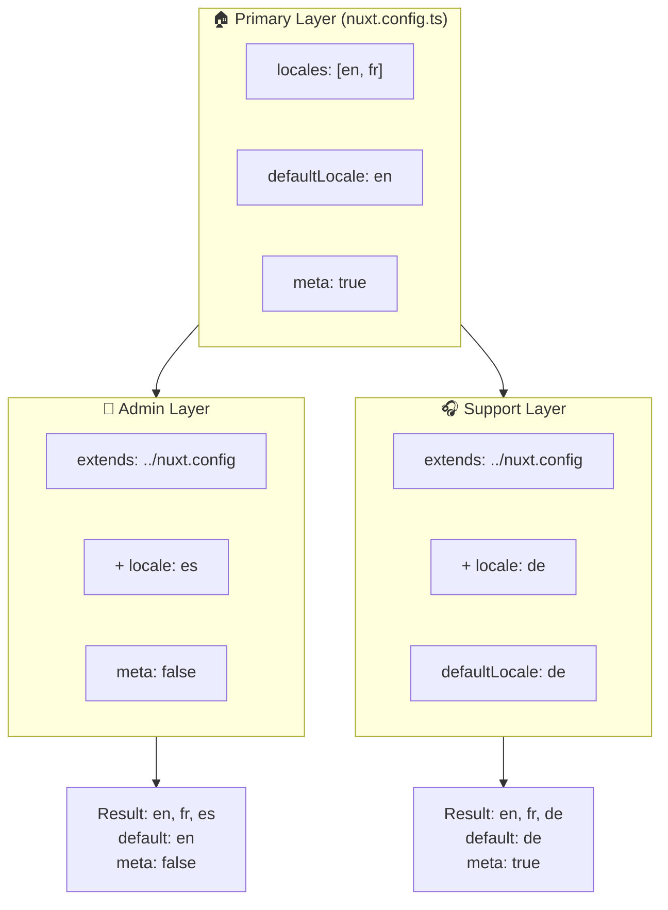

# 🗂️ Slāņi modulī `Nuxt I18n Micro`

## 📖 Ievads slāņos

Slāņi modulī `Nuxt I18n Micro` ļauj tev pārvaldīt un pielāgot lokalizācijas iestatījumus elastīgi dažādās tavas lietotnes daļās. Definējot dažādus slāņus, vari pielāgot konfigurāciju dažādiem kontekstiem, piemēram, pārrakstot iestatījumus konkrētām vietnes sadaļām vai izveidojot atkārtoti izmantojamas bāzes konfigurācijas, kuras var paplašināt citas tavas lietotnes daļas.

### Slāņu mantojuma plūsma



## 🛠️ Primārais konfigurācijas slānis

**Primārais konfigurācijas slānis** ir vieta, kur tu iestati noklusējuma lokalizācijas iestatījumus visai savai lietotnei. Šis slānis ir būtisks, jo tas definē globālo konfigurāciju, tostarp atbalstītās lokalizācijas, noklusējuma valodu un citus kritiskus i18n iestatījumus.

### 📄 Piemērs: primārā konfigurācijas slāņa definēšana

Šeit ir piemērs, kā tu varētu definēt primāro konfigurācijas slāni savā `nuxt.config.ts` failā:

```typescript
export default defineNuxtConfig({
  i18n: {
    locales: [
      { code: 'en', iso: 'en-EN', dir: 'ltr' },
      { code: 'fr', iso: 'fr-FR', dir: 'ltr' },
      { code: 'ar', iso: 'ar-SA', dir: 'rtl' },
    ],
    defaultLocale: 'en', // The default locale for the entire app
    translationDir: 'locales', // Directory where translations are stored
    meta: true, // Automatically generate SEO-related meta tags like `alternate`
    autoDetectLanguage: true, // Automatically detect and use the user's preferred language
  },
})
```

## 🌱 Bērnslāņi

Bērnslāņi tiek izmantoti, lai paplašinātu vai pārrakstītu primāro konfigurāciju konkrētām tavas lietotnes daļām. Piemēram, tu vari vēlēties pievienot papildu lokalizācijas vai modificēt noklusējuma lokalizāciju konkrētai vietnes sadaļai. Bērnslāņi ir īpaši noderīgi modulārās lietotnēs, kur dažādām lietotnes daļām var būt atšķirīgas lokalizācijas prasības.

### 📄 Piemērs: primārā slāņa paplašināšana bērnslānī

Pieņemsim, ka tev ir vietnes sadaļa, kurai jāatbalsta papildu lokalizācijas, vai tu vēlies atspējot konkrētu lokalizāciju noteiktā kontekstā. Šeit ir, kā to var sasniegt, paplašinot primāro konfigurācijas slāni:

```typescript
// basic/nuxt.config.ts (Primary Layer)
export default defineNuxtConfig({
  i18n: {
    locales: [
      { code: 'en', iso: 'en-EN', dir: 'ltr' },
      { code: 'fr', iso: 'fr-FR', dir: 'ltr' },
    ],
    defaultLocale: 'en',
    meta: true,
    translationDir: 'locales',
  },
})
```

```typescript
// extended/nuxt.config.ts (Child Layer)
export default defineNuxtConfig({
  extends: '../basic', // Inherit the base configuration from the 'basic' layer
  i18n: {
    locales: [
      { code: 'en', iso: 'en-EN', dir: 'ltr' }, // Inherited from the base layer
      { code: 'fr', iso: 'fr-FR', dir: 'ltr' }, // Inherited from the base layer
      { code: 'de', iso: 'de-DE', dir: 'ltr' }, // Added in the child layer
    ],
    defaultLocale: 'fr', // Override the default locale to French for this section
    autoDetectLanguage: false, // Disable automatic language detection in this section
  },
})
```

### 🌐 Slāņu izmantošana modulārā lietotnē

Lielākā, modulārā Nuxt lietotnē tev var būt vairākas sadaļas, no kurām katrai nepieciešami savi i18n iestatījumi. Izmantojot slāņus, vari uzturēt tīru un mērogojamu konfigurācijas struktūru.

### 📄 Piemērs: slāņota konfigurācija modulārā lietotnē

Iedomājies, ka tev ir e-komercijas vietne ar atšķirīgām sadaļām, piemēram, galvenā vietne, administratora panelis un klientu atbalsta portāls. Katrai sadaļai var būt nepieciešams atšķirīgs lokalizāciju komplekts vai citi i18n iestatījumi.

#### **Primārais slānis (globāla konfigurācija):**

```typescript
// nuxt.config.ts
export default defineNuxtConfig({
  i18n: {
    locales: [
      { code: 'en', iso: 'en-EN', dir: 'ltr' },
      { code: 'fr', iso: 'fr-FR', dir: 'ltr' },
    ],
    defaultLocale: 'en',
    meta: true,
    translationDir: 'locales',
    autoDetectLanguage: true,
  },
})
```

#### **Bērnslānis administratora panelim:**

```typescript
// admin/nuxt.config.ts
export default defineNuxtConfig({
  extends: '../nuxt.config', // Inherit the global settings
  i18n: {
    locales: [
      { code: 'en', iso: 'en-EN', dir: 'ltr' }, // Inherited
      { code: 'fr', iso: 'fr-FR', dir: 'ltr' }, // Inherited
      { code: 'es', iso: 'es-ES', dir: 'ltr' }, // Specific to the admin panel
    ],
    defaultLocale: 'en',
    meta: false, // Disable automatic meta generation in the admin panel
  },
})
```

#### **Bērnslānis klientu atbalsta portālam:**

```typescript
// support/nuxt.config.ts
export default defineNuxtConfig({
  extends: '../nuxt.config', // Inherit the global settings
  i18n: {
    locales: [
      { code: 'en', iso: 'en-EN', dir: 'ltr' }, // Inherited
      { code: 'fr', iso: 'fr-FR', dir: 'ltr' }, // Inherited
      { code: 'de', iso: 'de-DE', dir: 'ltr' }, // Specific to the support portal
    ],
    defaultLocale: 'de', // Default to German in the support portal
    autoDetectLanguage: false, // Disable automatic language detection
  },
})
```

Šajā modulārajā piemērā:

- Katrai sadaļai (administratora, atbalsta) ir savi i18n iestatījumi, bet tie visi manto bāzes konfigurāciju.
- Administratora panelis pievieno spāņu (`es`) kā lokalizāciju un atspējo meta tagu ģenerēšanu.
- Atbalsta portāls pievieno vācu (`de`) kā lokalizāciju un lietotāja saskarnei izmanto vācu valodu kā noklusējumu.

## 📝 Slāņu izmantošanas labākās prakses

- **🔧 Uzturi primāro slāni vienkāršu:** primārajam slānim jāsatur visbiežāk lietotie iestatījumi, kas piemērojami globāli visā tavā lietotnē. Uzturi to vienkāršu, lai nodrošinātu konsekvenci.
- **⚙️ Izmanto bērnslāņus konkrētiem pielāgojumiem:** bērnslāņos pārraksti vai paplašini iestatījumus tikai tad, kad nepieciešams. Šī pieeja izvairās no nevajadzīgas sarežģītības tavā konfigurācijā.
- **📚 Dokumentē savus slāņus:** skaidri dokumentē katra slāņa mērķi un specifiku savā projektā. Tas palīdzēs uzturēt skaidrību un atvieglos citu (vai nākotnes tevis) izpratni par konfigurāciju.
