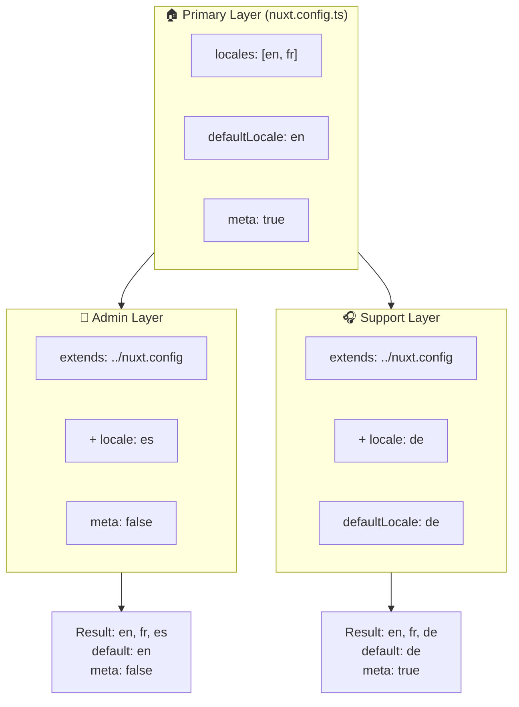

# 🗂️ Slāņi modulī `Nuxt I18n Micro`

## 📖 Ievads slāņos

Slāņi modulī `Nuxt I18n Micro` ļauj elastīgi pārvaldīt un pielāgot lokalizācijas iestatījumus dažādās jūsu lietotnes daļās. Definējot dažādus slāņus, jūs varat pielāgot konfigurāciju dažādiem kontekstiem, piemēram, pārrakstīt iestatījumus noteiktām jūsu vietnes sadaļām vai izveidot atkārtoti izmantojamas bāzes konfigurācijas, kuras var paplašināt citas jūsu lietotnes daļas.

### Slāņu mantošanas plūsma



## 🛠️ Primārais konfigurācijas slānis

**Primārais konfigurācijas slānis** ir tas, kurā jūs iestatāt noklusējuma lokalizācijas iestatījumus visai savai lietotnei. Šis slānis ir būtisks, jo tas definē globālo konfigurāciju, tostarp atbalstītās lokāles, noklusējuma valodu un citus svarīgus i18n iestatījumus.

### 📄 Piemērs: primārā konfigurācijas slāņa definēšana

Šeit ir piemērs tam, kā primārais konfigurācijas slānis varētu tikt definēts jūsu `nuxt.config.ts` failā:

```typescript
export default defineNuxtConfig({
  i18n: {
    locales: [
      { code: 'en', iso: 'en-EN', dir: 'ltr' },
      { code: 'fr', iso: 'fr-FR', dir: 'ltr' },
      { code: 'ar', iso: 'ar-SA', dir: 'rtl' },
    ],
    defaultLocale: 'en', // The default locale for the entire app
    translationDir: 'locales', // Directory where translations are stored
    meta: true, // Automatically generate SEO-related meta tags like `alternate`
    autoDetectLanguage: true, // Automatically detect and use the user's preferred language
  },
})
```

## 🌱 Bērnu slāņi

Bērnu slāņus izmanto, lai paplašinātu vai pārrakstītu primāro konfigurāciju konkrētām jūsu lietotnes daļām. Piemēram, jūs, iespējams, vēlaties pievienot papildu lokāles vai mainīt noklusējuma lokāli konkrētai jūsu vietnes sadaļai. Bērnu slāņi ir īpaši noderīgi moduļu lietotnēs, kur dažādām lietotnes daļām var būt atšķirīgas lokalizācijas prasības.

### 📄 Piemērs: primārā slāņa paplašināšana bērnu slānī

Pieņemsim, ka jums ir sadaļa jūsu vietnē, kurai jāatbalsta papildu lokāles, vai arī vēlaties konkrētā kontekstā atspējot noteiktu lokāli. Lūk, kā to var panākt, paplašinot primāro konfigurācijas slāni:

```typescript
// basic/nuxt.config.ts (Primary Layer)
export default defineNuxtConfig({
  i18n: {
    locales: [
      { code: 'en', iso: 'en-EN', dir: 'ltr' },
      { code: 'fr', iso: 'fr-FR', dir: 'ltr' },
    ],
    defaultLocale: 'en',
    meta: true,
    translationDir: 'locales',
  },
})
```

```typescript
// extended/nuxt.config.ts (Child Layer)
export default defineNuxtConfig({
  extends: '../basic', // Inherit the base configuration from the 'basic' layer
  i18n: {
    locales: [
      { code: 'en', iso: 'en-EN', dir: 'ltr' }, // Inherited from the base layer
      { code: 'fr', iso: 'fr-FR', dir: 'ltr' }, // Inherited from the base layer
      { code: 'de', iso: 'de-DE', dir: 'ltr' }, // Added in the child layer
    ],
    defaultLocale: 'fr', // Override the default locale to French for this section
    autoDetectLanguage: false, // Disable automatic language detection in this section
  },
})
```

### 🌐 Slāņu izmantošana moduļu lietotnē

Lielākā, moduļu Nuxt lietotnē jums var būt vairākas sadaļas, no kurām katrai nepieciešami savi i18n iestatījumi. Izmantojot slāņus, jūs varat uzturēt tīru un mērogojamu konfigurācijas struktūru.

### 📄 Piemērs: slāņota konfigurācija moduļu lietotnē

Iedomājieties, ka jums ir e-komercijas vietne ar atšķirīgām sadaļām, piemēram, galveno vietni, administratora paneli un klientu atbalsta portālu. Katrai sadaļai var būt nepieciešams atšķirīgs lokāļu vai citu i18n iestatījumu komplekts.

#### **Primārais slānis (globālā konfigurācija):**

```typescript
// nuxt.config.ts
export default defineNuxtConfig({
  i18n: {
    locales: [
      { code: 'en', iso: 'en-EN', dir: 'ltr' },
      { code: 'fr', iso: 'fr-FR', dir: 'ltr' },
    ],
    defaultLocale: 'en',
    meta: true,
    translationDir: 'locales',
    autoDetectLanguage: true,
  },
})
```

#### **Bērnu slānis administratora panelim:**

```typescript
// admin/nuxt.config.ts
export default defineNuxtConfig({
  extends: '../nuxt.config', // Inherit the global settings
  i18n: {
    locales: [
      { code: 'en', iso: 'en-EN', dir: 'ltr' }, // Inherited
      { code: 'fr', iso: 'fr-FR', dir: 'ltr' }, // Inherited
      { code: 'es', iso: 'es-ES', dir: 'ltr' }, // Specific to the admin panel
    ],
    defaultLocale: 'en',
    meta: false, // Disable automatic meta generation in the admin panel
  },
})
```

#### **Bērnu slānis klientu atbalsta portālam:**

```typescript
// support/nuxt.config.ts
export default defineNuxtConfig({
  extends: '../nuxt.config', // Inherit the global settings
  i18n: {
    locales: [
      { code: 'en', iso: 'en-EN', dir: 'ltr' }, // Inherited
      { code: 'fr', iso: 'fr-FR', dir: 'ltr' }, // Inherited
      { code: 'de', iso: 'de-DE', dir: 'ltr' }, // Specific to the support portal
    ],
    defaultLocale: 'de', // Default to German in the support portal
    autoDetectLanguage: false, // Disable automatic language detection
  },
})
```

Šajā moduļu piemērā:

- Katrai sadaļai (admin, support) ir savi i18n iestatījumi, bet tās visas manto bāzes konfigurāciju.
- Administratora panelis pievieno spāņu (`es`) kā lokāli un atspējo meta tagu ģenerēšanu.
- Atbalsta portāls pievieno vācu (`de`) kā lokāli un pēc noklusējuma lietotāja saskarnei izmanto vācu valodu.

## 📝 Labākā prakse slāņu lietošanai

- **🔧 Uzturiet primāro slāni vienkāršu:** primārajam slānim jāsatur visbiežāk izmantotie iestatījumi, kas piemērojami globāli visā jūsu lietotnē. Uzturiet to skaidru, lai nodrošinātu konsekvenci.
- **⚙️ Izmantojiet bērnu slāņus konkrētiem pielāgojumiem:** pārrakstiet vai paplašiniet iestatījumus bērnu slāņos tikai tad, kad tas ir nepieciešams. Šī pieeja novērš nevajadzīgu sarežģītību jūsu konfigurācijā.
- **📚 Dokumentējiet savus slāņus:** skaidri dokumentējiet katra slāņa mērķi un specifiku savā projektā. Tas palīdzēs saglabāt skaidrību un atvieglos konfigurācijas izpratni citiem (vai jums nākotnē).
