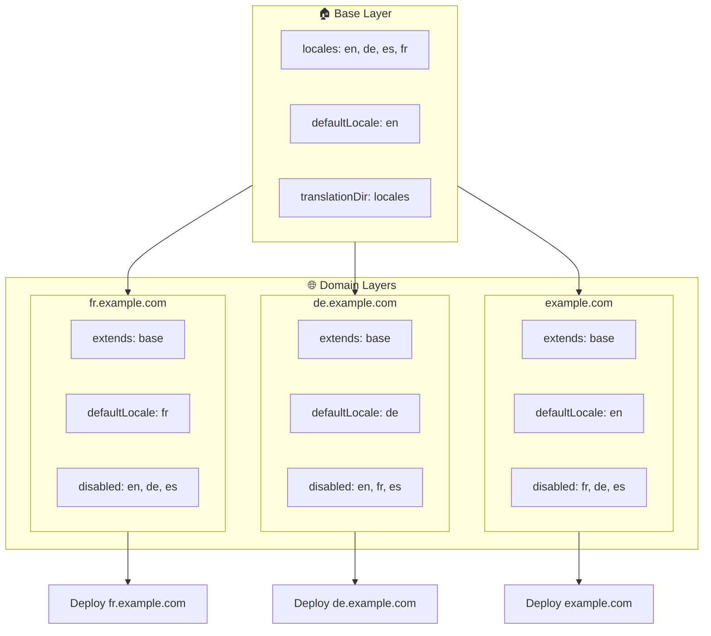

# 🌍 Vairāku domēnu lokalizāciju iestatīšana ar `Nuxt I18n Micro`, izmantojot slāņus

## 📝 Ievads

Izmantojot slāņus modulī `Nuxt I18n Micro`, vari izveidot elastīgu un uzturamu vairāku domēnu lokalizācijas iestatījumu. Šī pieeja ne tikai vienkāršo domēnu pārvaldību, novēršot nepieciešamību pēc sarežģītām funkcionalitātēm, bet arī ļauj efektīvi sadalīt slodzi un samazināt projekta sarežģītību. Palaidot atsevišķus projektus dažādām lokalizācijām, tava lietotne var viegli mērogot un pielāgoties dažādām lokalizācijas prasībām vairākos domēnos, piedāvājot stabilu un mērogojamu risinājumu globālām lietotnēm.

## 🎯 Mērķis

Izveidot iestatījumu, kur dažādi domēni apkalpo konkrētas lokalizācijas, pielāgojot konfigurācijas bērnslāņos. Šī metode izmanto Nuxt slāņu sistēmu, ļaujot tev uzturēt bāzes konfigurāciju, vienlaikus paplašinot vai modificējot to katram domēnam.

### Vairāku domēnu arhitektūra



## 🛠 Soļi vairāku domēnu lokalizāciju ieviešanai

### 1. **Izveido bāzes slāni**

Sāc, izveidojot bāzes konfigurācijas slāni, kas ietver visus izplatītos lokalizācijas iestatījumus tavai lietotnei. Šī konfigurācija kalpos par pamatu citām domēnam specifiskām konfigurācijām.

#### **Bāzes slāņa konfigurācija**

Izveido bāzes konfigurācijas failu `base/nuxt.config.ts`:

```typescript
// base/nuxt.config.ts

export default defineNuxtConfig({
  i18n: {
    locales: [
      { code: 'en', iso: 'en-US', dir: 'ltr' },
      { code: 'de', iso: 'de-DE', dir: 'ltr' },
      { code: 'es', iso: 'es-ES', dir: 'ltr' },
    ],
    defaultLocale: 'en',
    translationDir: 'locales',
    meta: true,
    autoDetectLanguage: true,
  },
})
```

### 2. **Izveido domēnam specifiskus bērnslāņus**

Katram domēnam izveido bērnslāni, kas modificē bāzes konfigurāciju, lai atbilstu šī domēna specifiskajām prasībām. Vari atspējot lokalizācijas, kas nav nepieciešamas konkrētam domēnam.

#### **Piemērs: konfigurācija franču domēnam**

Izveido bērnslāņa konfigurāciju franču domēnam failā `fr/nuxt.config.ts`:

```typescript
// fr/nuxt.config.ts

export default defineNuxtConfig({
  extends: '../base', // Inherit from the base configuration

  i18n: {
    locales: [
      { code: 'en', iso: 'en-US', dir: 'ltr', disabled: true }, // Disable English
      { code: 'fr', iso: 'fr-FR', dir: 'ltr' }, // Add and enable the French locale
      { code: 'de', iso: 'de-DE', dir: 'ltr', disabled: true }, // Disable German
      { code: 'es', iso: 'es-ES', dir: 'ltr', disabled: true }, // Disable Spanish
    ],
    defaultLocale: 'fr', // Set French as the default locale
    autoDetectLanguage: false, // Disable automatic language detection
  },
})
```

#### **Piemērs: konfigurācija vācu domēnam**

Līdzīgi izveido bērnslāņa konfigurāciju vācu domēnam failā `de/nuxt.config.ts`:

```typescript
// de/nuxt.config.ts

export default defineNuxtConfig({
  extends: '../base', // Inherit from the base configuration

  i18n: {
    locales: [
      { code: 'en', iso: 'en-US', dir: 'ltr', disabled: true }, // Disable English
      { code: 'fr', iso: 'fr-FR', dir: 'ltr', disabled: true }, // Disable French
      { code: 'de', iso: 'de-DE', dir: 'ltr' }, // Use the German locale
      { code: 'es', iso: 'es-ES', dir: 'ltr', disabled: true }, // Disable Spanish
    ],
    defaultLocale: 'de', // Set German as the default locale
    autoDetectLanguage: false, // Disable automatic language detection
  },
})
```

### 3. **Izvieto lietotni katram domēnam**

Izvieto lietotni ar atbilstošu konfigurāciju katram domēnam. Piemēram:

- Izvieto `fr` slāņa konfigurāciju uz `fr.example.com`.
- Izvieto `de` slāņa konfigurāciju uz `de.example.com`.

### 4. **Iestati vairākus projektus dažādām lokalizācijām**

Katrai lokalizācijai un domēnam tev būs jāpalaiž atsevišķs lietotnes eksemplārs. Tas nodrošina, ka katrs domēns apkalpo pareizo lokalizācijas konfigurāciju, optimizējot slodzes sadali un vienkāršojot projekta struktūru. Palaidot vairākus projektus, kas pielāgoti katrai lokalizācijai, vari uzturēt tīru konfigurāciju nodalīšanu un samazināt kopējā iestatījuma sarežģītību.

### 5. **Konfigurē maršrutēšanu pēc domēna**

Nodrošini, ka tava maršrutēšana ir konfigurēta, lai novirzītu lietotājus uz pareizo projektu, pamatojoties uz domēnu, kuram viņi piekļūst. Tas nodrošinās, ka katrs domēns apkalpo atbilstošu lokalizāciju, uzlabojot lietotāja pieredzi un uzturot konsekvenci dažādos reģionos.

### 6. **Izvieto un pārbaudi**

Pēc slāņu konfigurēšanas un to izvietošanas attiecīgajos domēnos pārliecinies, ka katrs domēns apkalpo pareizo lokalizāciju. Rūpīgi pārbaudi lietotni, lai apstiprinātu, ka atkarībā no domēna tiek ielādēta pareizā lokalizācija.

## 📝 Labākās prakses

- **Uzturi bāzes konfigurāciju vispārīgu**: bāzes konfigurācijai jāaptver vispārēji iestatījumi, kas piemērojami visiem domēniem.
- **Izolē domēnam specifisko loģiku**: uzturi domēnam specifiskās konfigurācijas to attiecīgajos slāņos, lai saglabātu skaidrību un atbildību nodalīšanu.

## 🎉 Secinājums

Izmantojot slāņus modulī `Nuxt I18n Micro`, vari izveidot elastīgu un uzturamu vairāku domēnu lokalizācijas iestatījumu. Šī pieeja ne tikai novērš nepieciešamību pēc sarežģītām domēna pārvaldības funkcionalitātēm, bet arī ļauj efektīvi sadalīt slodzi un samazināt projekta sarežģītību. Palaidot atsevišķus projektus dažādām lokalizācijām, tiek nodrošināts, ka tava lietotne var viegli mērogoties un pielāgoties dažādām lokalizācijas prasībām dažādos domēnos, piedāvājot stabilu un mērogojamu risinājumu globālām lietotnēm.
