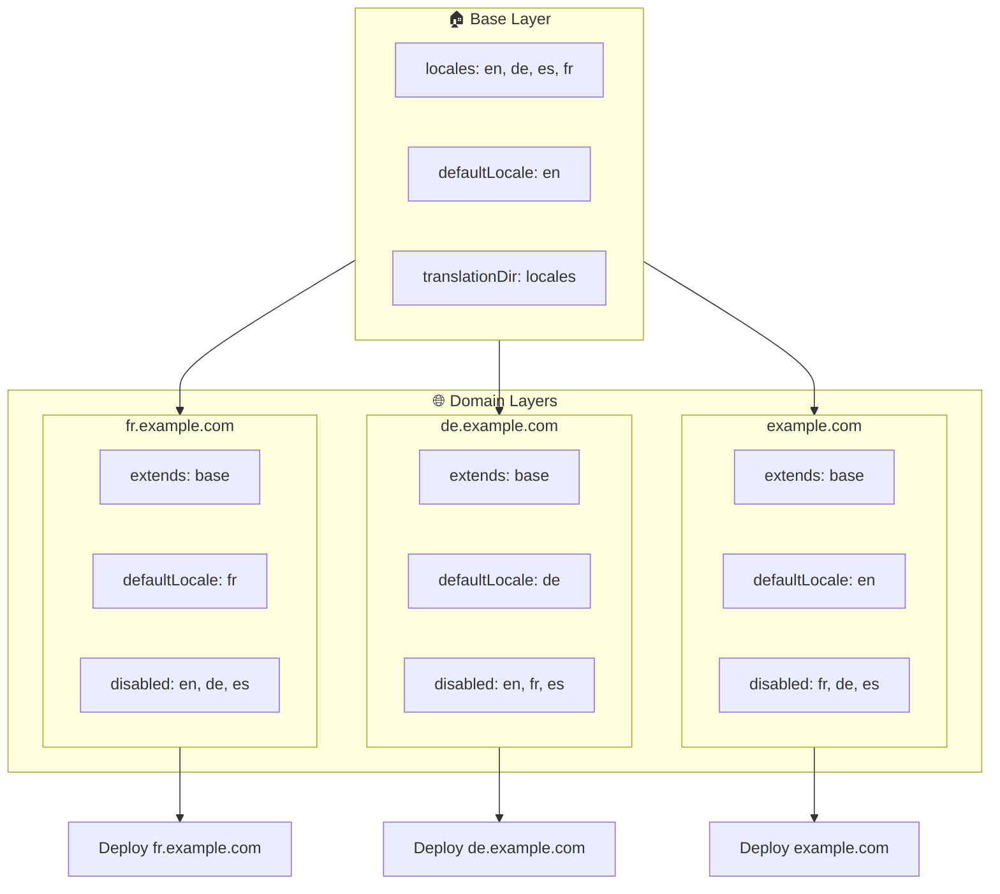

# 🌍 Vairāku domēnu lokāļu iestatīšana ar `Nuxt I18n Micro`, izmantojot slāņus

## 📝 Ievads

Izmantojot slāņus modulī `Nuxt I18n Micro`, jūs varat izveidot elastīgu un uzturamu vairāku domēnu lokalizācijas iestatījumu. Šī pieeja ne tikai vienkāršo domēnu pārvaldību, novēršot nepieciešamību pēc sarežģītām funkcionalitātēm, bet arī ļauj efektīvi sadalīt slodzi un samazināt projekta sarežģītību. Palaišot atsevišķus projektus dažādām lokālēm, jūsu lietotne var viegli mērogoties un pielāgoties dažādām lokāļu prasībām vairākos domēnos, piedāvājot izturīgu un mērogojamu risinājumu globālām lietotnēm.

## 🎯 Mērķis

Izveidot iestatījumu, kurā dažādi domēni apkalpo noteiktas lokāles, pielāgojot konfigurācijas bērnu slāņos. Šī metode izmanto Nuxt slāņu sistēmu, ļaujot jums uzturēt bāzes konfigurāciju un paplašināt vai modificēt to katram domēnam.

### Vairāku domēnu arhitektūra



## 🛠 Soļi vairāku domēnu lokāļu ieviešanai

### 1. **Izveidojiet bāzes slāni**

Sāciet, izveidojot bāzes konfigurācijas slāni, kas ietver visus jūsu lietotnes kopīgos lokāļu iestatījumus. Šī konfigurācija kalpos kā pamats citām domēna specifiskām konfigurācijām.

#### **Bāzes slāņa konfigurācija**

Izveidojiet bāzes konfigurācijas failu `base/nuxt.config.ts`:

```typescript
// base/nuxt.config.ts

export default defineNuxtConfig({
  i18n: {
    locales: [
      { code: 'en', iso: 'en-US', dir: 'ltr' },
      { code: 'de', iso: 'de-DE', dir: 'ltr' },
      { code: 'es', iso: 'es-ES', dir: 'ltr' },
    ],
    defaultLocale: 'en',
    translationDir: 'locales',
    meta: true,
    autoDetectLanguage: true,
  },
})
```

### 2. **Izveidojiet domēnam specifiskus bērnu slāņus**

Katram domēnam izveidojiet bērnu slāni, kas modificē bāzes konfigurāciju, lai atbilstu šī domēna specifiskajām prasībām. Jūs varat atspējot lokāles, kas konkrētam domēnam nav nepieciešamas.

#### **Piemērs: konfigurācija franču domēnam**

Izveidojiet bērnu slāņa konfigurāciju franču domēnam failā `fr/nuxt.config.ts`:

```typescript
// fr/nuxt.config.ts

export default defineNuxtConfig({
  extends: '../base', // Inherit from the base configuration

  i18n: {
    locales: [
      { code: 'en', iso: 'en-US', dir: 'ltr', disabled: true }, // Disable English
      { code: 'fr', iso: 'fr-FR', dir: 'ltr' }, // Add and enable the French locale
      { code: 'de', iso: 'de-DE', dir: 'ltr', disabled: true }, // Disable German
      { code: 'es', iso: 'es-ES', dir: 'ltr', disabled: true }, // Disable Spanish
    ],
    defaultLocale: 'fr', // Set French as the default locale
    autoDetectLanguage: false, // Disable automatic language detection
  },
})
```

#### **Piemērs: konfigurācija vācu domēnam**

Līdzīgi izveidojiet bērnu slāņa konfigurāciju vācu domēnam failā `de/nuxt.config.ts`:

```typescript
// de/nuxt.config.ts

export default defineNuxtConfig({
  extends: '../base', // Inherit from the base configuration

  i18n: {
    locales: [
      { code: 'en', iso: 'en-US', dir: 'ltr', disabled: true }, // Disable English
      { code: 'fr', iso: 'fr-FR', dir: 'ltr', disabled: true }, // Disable French
      { code: 'de', iso: 'de-DE', dir: 'ltr' }, // Use the German locale
      { code: 'es', iso: 'es-ES', dir: 'ltr', disabled: true }, // Disable Spanish
    ],
    defaultLocale: 'de', // Set German as the default locale
    autoDetectLanguage: false, // Disable automatic language detection
  },
})
```

### 3. **Izvietojiet lietotni katram domēnam**

Izvietojiet lietotni ar atbilstošu konfigurāciju katram domēnam. Piemēram:

- Izvietojiet `fr` slāņa konfigurāciju uz `fr.example.com`.
- Izvietojiet `de` slāņa konfigurāciju uz `de.example.com`.

### 4. **Iestatiet vairākus projektus dažādām lokālēm**

Katrai lokālei un domēnam jums jāpalaiž atsevišķa lietotnes instance. Tas nodrošina, ka katrs domēns apkalpo pareizu lokāles konfigurāciju, optimizējot slodzes sadalījumu un vienkāršojot projekta struktūru. Palaišot vairākus projektus, kas pielāgoti katrai lokālei, varat uzturēt tīru nodalīšanu starp konfigurācijām un samazināt kopējā iestatījuma sarežģītību.

### 5. **Konfigurējiet maršrutēšanu, balstoties uz domēnu**

Nodrošiniet, ka jūsu maršrutēšana ir konfigurēta tā, lai lietotājus novirzītu uz pareizo projektu atkarībā no piekļūtā domēna. Tas nodrošinās, ka katrs domēns apkalpo atbilstošu lokāli, uzlabojot lietotāja pieredzi un uzturot konsekvenci dažādos reģionos.

### 6. **Izvietojiet un pārbaudiet**

Pēc slāņu konfigurēšanas un to izvietošanas attiecīgajos domēnos pārliecinieties, ka katrs domēns apkalpo pareizo lokāli. Rūpīgi testējiet lietotni, lai apstiprinātu, ka atkarībā no domēna tiek ielādēta pareizā lokāle.

## 📝 Labākā prakse

- **Uzturiet bāzes konfigurāciju vispārīgu**: bāzes konfigurācijai jāaptver vispārīgi iestatījumi, kas piemērojami visiem domēniem.
- **Izolējiet domēnam specifisku loģiku**: uzturiet domēnam specifiskās konfigurācijas to attiecīgajos slāņos, lai saglabātu skaidrību un atbildību nodalījumu.

## 🎉 Secinājums

Izmantojot slāņus modulī `Nuxt I18n Micro`, jūs varat izveidot elastīgu un uzturamu vairāku domēnu lokalizācijas iestatījumu. Šī pieeja ne tikai novērš nepieciešamību pēc sarežģītām domēnu pārvaldības funkcionalitātēm, bet arī ļauj efektīvi sadalīt slodzi un samazināt projekta sarežģītību. Palaišot atsevišķus projektus dažādām lokālēm, jūsu lietotne var viegli mērogoties un pielāgoties dažādām lokāļu prasībām dažādos domēnos, nodrošinot izturīgu un mērogojamu risinājumu globālām lietotnēm.
