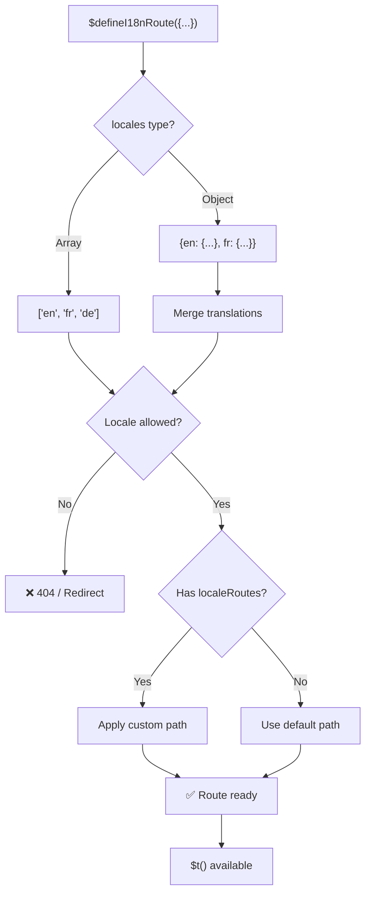
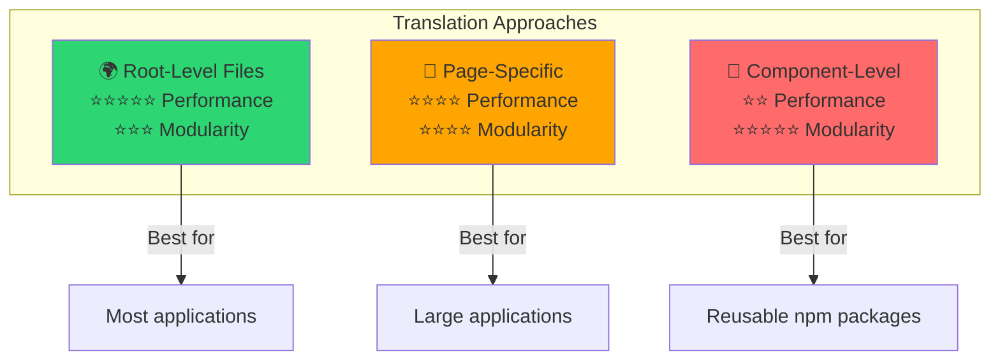

# 📖 Tulkojumi pēc komponentiem

Uzzini, kā definēt tulkojumus tieši Vue komponentu iekšpusē, izmantojot `$defineI18nRoute` modulārai un uzturamai lokalizācijai.

## 📖 Pārskats

Tulkojumi pēc komponentiem modulī `Nuxt I18n Micro` ļauj tev definēt tulkojumus tieši konkrētu komponentu vai lapu iekšpusē, izmantojot funkciju `$defineI18nRoute`. Šī pieeja ir ideāla lokalizēta satura pārvaldībai, kas ir unikāls atsevišķiem komponentiem, nodrošinot modulārāku un uzturamāku metodi tulkojumu apstrādei.

## 🚀 Ātrais starts

### Pamata lietojums

```vue
<template>
  <div>
    <h1>{{ $t('greeting') }}</h1>
    <p>{{ $t('farewell') }}</p>
  </div>
</template>

<script setup lang="ts">
import { useNuxtApp } from '#imports'

const { $defineI18nRoute, $t } = useNuxtApp()

$defineI18nRoute({
  locales: {
    en: { greeting: 'Hello', farewell: 'Goodbye' },
    fr: { greeting: 'Bonjour', farewell: 'Au revoir' },
    de: { greeting: 'Hallo', farewell: 'Auf Wiedersehen' },
  },
})
</script>
```

### Nepieciešamā iestatīšana (`script setup`)

`$defineI18nRoute` ir Nuxt lietotnes iestrāde, nevis globāls makro.
Vienmēr iegūsti to no `useNuxtApp()`, pirms izsauc.

```ts
import { useNuxtApp } from '#imports'

const { $defineI18nRoute } = useNuxtApp()
```

## 🏗️ Būvēšanas laika maršruta meta

Būvēšanas laikā Vite unplugin skenē lapas `.vue` failus, meklējot `defineI18nRoute(...)` / `$defineI18nRoute(...)` izsaukumus, un iegūst lokalizācijas ierobežojumus, `localeRoutes` un `disableMeta` maršruta metadatos, ko izmanto `@i18n-micro/route-strategy`.

- **Būvēšana**: unplugin (`src/unplugin-define-i18n-route.ts`) darbojas Vite transformācijas laikā un raksta `i18n-route-meta.json` zem Nuxt būvēšanas mapes.
- **Izpildlaiks**: define spraudnis (`03.define.ts`) joprojām atklāj `$defineI18nRoute` iekš `script setup` izstrādei un iekļautajai konfigurācijai.

Parasti tu izsauc `$defineI18nRoute` tikai lapās — modulis automātiski apstrādā būvēšanas laika izgūšanu.

## 🔧 `$defineI18nRoute` funkcija

Funkcija `$defineI18nRoute` konfigurē maršruta uzvedību, pamatojoties uz pašreizējo lokalizāciju, piedāvājot daudzpusīgu risinājumu, lai:

- Kontrolētu piekļuvi konkrētiem maršrutiem, pamatojoties uz pieejamajām lokalizācijām.
- Nodrošinātu tulkojumus konkrētām lokalizācijām.
- Iestatītu pielāgotus maršrutus dažādām lokalizācijām.
- Kontrolētu meta tagu ģenerēšanu.

### Kā tas darbojas



### Metodes paraksts

```typescript
const { $defineI18nRoute } = useNuxtApp();
$defineI18nRoute(routeDefinition: DefineI18nRouteConfig);
```

### Parametri

| Parametrs      | Tips                                       | Apraksts                        |
| -------------- | ------------------------------------------ | ---------------------------------- |
| `locales`      | `string[] \| Record<string, Translations>` | Pieejamās lokalizācijas maršrutam.    |
| `localeRoutes` | `Record<string, string>`                   | Pielāgoti maršruti konkrētām lokalizācijām. |
| `disableMeta`  | `boolean \| string[]`                      | Kontrolē i18n meta tagu ģenerēšanu.   |

### Detalizēti parametru apraksti

#### `locales`

Definē, kuras lokalizācijas ir pieejamas maršrutam:

<CodeGroup>
```typescript Array Format
$defineI18nRoute({
  locales: ['en', 'fr', 'de'], // Simple array of locale codes
})
```

```typescript Object Format
$defineI18nRoute({
  locales: {
    en: { greeting: 'Hello', farewell: 'Goodbye' },
    fr: { greeting: 'Bonjour', farewell: 'Au revoir' },
    de: { greeting: 'Hallo', farewell: 'Auf Wiedersehen' },
    ru: {}, // Russian locale allowed but no translations provided
  },
})
```
</CodeGroup>

#### `localeRoutes`

Ļauj pielāgotus maršrutus konkrētām lokalizācijām:

```typescript
$defineI18nRoute({
  localeRoutes: {
    en: '/welcome',
    fr: '/bienvenue',
    de: '/willkommen',
    ru: '/privet', // Custom route path for Russian locale
  },
})
```

#### `disableMeta`

Kontrolē i18n meta tagu ģenerēšanu:

<CodeGroup>
```typescript Disable All Meta
$defineI18nRoute({
  locales: ['en', 'fr', 'de'],
  disableMeta: true, // Disables all i18n meta tags
})
```

```typescript Disable Specific Locales
$defineI18nRoute({
  locales: ['en', 'fr', 'de'],
  disableMeta: ['en', 'fr'], // Only English and French won't have meta tags
})
```
</CodeGroup>

## 💡 Lietošanas gadījumi

### 1. Piekļuves kontrole, pamatojoties uz lokalizācijām

Definē, kuras lokalizācijas ir atļautas konkrētiem maršrutiem:

```typescript
$defineI18nRoute({
  locales: ['en', 'fr', 'de'], // Only these locales are allowed for this route
})
```

### 2. Komponentiem specifisku tulkojumu nodrošināšana

Izmanto `locales` objektu, lai nodrošinātu konkrētus tulkojumus katram maršrutam:

```typescript
$defineI18nRoute({
  locales: {
    en: {
      greeting: 'Hello',
      farewell: 'Goodbye',
      description: 'Welcome to our application',
    },
    fr: {
      greeting: 'Bonjour',
      farewell: 'Au revoir',
      description: 'Bienvenue dans notre application',
    },
    de: {
      greeting: 'Hallo',
      farewell: 'Auf Wiedersehen',
      description: 'Willkommen in unserer Anwendung',
    },
  },
})
```

### 3. Pielāgota maršrutēšana lokalizācijām

Definē pielāgotus ceļus konkrētām lokalizācijām:

```typescript
$defineI18nRoute({
  locales: ['en', 'fr', 'de'],
  localeRoutes: {
    en: '/welcome',
    fr: '/bienvenue',
    de: '/willkommen',
  },
})
```

### 4. Meta tagu atspējošana

Kontrolē SEO meta tagu ģenerēšanu konkrētiem maršrutiem vai lokalizācijām:

```typescript
// Disable meta tags for all locales
$defineI18nRoute({
  locales: ['en', 'fr', 'de'],
  disableMeta: true,
})

// Disable meta tags only for specific locales
$defineI18nRoute({
  locales: ['en', 'fr', 'de'],
  disableMeta: ['en', 'fr'],
})
```

## ✅ Atbalstītie konfigurāciju formāti

`$defineI18nRoute` parsētājs atbalsta dažādas JavaScript konfigurācijas:

### Statiskās konfigurācijas

<CodeGroup>
```typescript Static Arrays
$defineI18nRoute({
  locales: ['en', 'de', 'fr'],
})
```

```typescript Static Objects
$defineI18nRoute({
  locales: {
    en: { greeting: 'Hello' },
    de: { greeting: 'Hallo' },
  },
  localeRoutes: {
    en: '/welcome',
    de: '/willkommen',
  },
})
```
</CodeGroup>

### Dinamiskās konfigurācijas

<CodeGroup>
```typescript Variables and Functions
const locales = ['en', 'de', 'fr']
const routes = { en: '/welcome', de: '/willkommen' }

$defineI18nRoute({
  locales: locales,
  localeRoutes: routes,
})
```

```typescript Template Literals
const prefix = 'api'

$defineI18nRoute({
  locales: [`${prefix}-en`, `${prefix}-de`],
  localeRoutes: {
    [`${prefix}-en`]: `/api/welcome`,
    [`${prefix}-de`]: `/api/willkommen`,
  },
})
```
</CodeGroup>

### Uzlabotas konfigurācijas

<CodeGroup>
```typescript Spread Operator
const baseLocales = ['en', 'de']
const additionalLocales = ['fr', 'es']

$defineI18nRoute({
  locales: [...baseLocales, ...additionalLocales],
})
```

```typescript Array of Objects
$defineI18nRoute({
  locales: [
    { code: 'en', name: 'English' },
    { code: 'de', name: 'German' },
  ],
})
```
</CodeGroup>

### Nosacītā loģika

```typescript
$defineI18nRoute({
  locales: process.env.NODE_ENV === 'production' ? ['en', 'de'] : ['en', 'de', 'fr', 'es'],
})
```

### Sarežģīti ligzdoti objekti

```typescript
$defineI18nRoute({
  locales: {
    'en-us': {
      region: 'US',
      currency: 'USD',
      format: {
        date: 'MM/DD/YYYY',
        time: '12h',
      },
    },
    'de-de': {
      region: 'DE',
      currency: 'EUR',
      format: {
        date: 'DD.MM.YYYY',
        time: '24h',
      },
    },
  },
})
```

### Komentāri un formatēšana

```typescript
$defineI18nRoute({
  // Supported locales for this component
  locales: [
    'en', // English
    'de', // German
    'fr', // French
  ],
  // Custom routes for each locale
  localeRoutes: {
    en: '/welcome',
    de: '/willkommen',
    fr: '/bienvenue',
  },
})
```

## ❌ Netiek atbalstīts

Parsētājam ir ierobežojumi un tas nevar apstrādāt:

- **Ārējus importus** (`import` deklarācijas).
- **Async/await funkcijas**.
- **Klases metodes**.
- **Sarežģītu plūsmas kontroli** (cikli, try-catch, switch).
- **Arrow funkcijas** konfigurācijā.
- **Ģeneratora funkcijas**.

## 📝 Pilns piemērs

Šeit ir visaptverošs piemērs, kas parāda visas funkcijas:

```vue
<template>
  <div class="welcome-page">
    <header>
      <h1>{{ $t('title') }}</h1>
      <p>{{ $t('subtitle') }}</p>
    </header>

    <main>
      <section>
        <h2>{{ $t('features.title') }}</h2>
        <ul>
          <li v-for="feature in $t('features.list')" :key="feature">
            {{ feature }}
          </li>
        </ul>
      </section>

      <section>
        <h2>{{ $t('contact.title') }}</h2>
        <p>{{ $t('contact.description') }}</p>
        <a :href="$t('contact.email')">{{ $t('contact.email') }}</a>
      </section>
    </main>

    <footer>
      <p>{{ $t('footer.copyright') }}</p>
    </footer>
  </div>
</template>

<script setup lang="ts">
import { useNuxtApp } from '#imports'

const { $defineI18nRoute, $t } = useNuxtApp()

// Define comprehensive i18n route configuration
$defineI18nRoute({
  locales: {
    en: {
      title: 'Welcome to Our Platform',
      subtitle: 'The best solution for your needs',
      features: {
        title: 'Key Features',
        list: ['High Performance', 'Easy to Use', 'Scalable Architecture'],
      },
      contact: {
        title: 'Get in Touch',
        description: "We'd love to hear from you",
        email: 'mailto:contact@example.com',
      },
      footer: {
        copyright: '© 2024 Example Company. All rights reserved.',
      },
    },
    fr: {
      title: 'Bienvenue sur Notre Plateforme',
      subtitle: 'La meilleure solution pour vos besoins',
      features: {
        title: 'Fonctionnalités Clés',
        list: ['Haute Performance', 'Facile à Utiliser', 'Architecture Évolutive'],
      },
      contact: {
        title: 'Contactez-Nous',
        description: 'Nous aimerions avoir de vos nouvelles',
        email: 'mailto:contact@example.com',
      },
      footer: {
        copyright: '© 2024 Example Company. Tous droits réservés.',
      },
    },
    de: {
      title: 'Willkommen auf Unserer Plattform',
      subtitle: 'Die beste Lösung für Ihre Bedürfnisse',
      features: {
        title: 'Hauptfunktionen',
        list: ['Hohe Leistung', 'Einfach zu Verwenden', 'Skalierbare Architektur'],
      },
      contact: {
        title: 'Kontaktieren Sie Uns',
        description: 'Wir würden gerne von Ihnen hören',
        email: 'mailto:contact@example.com',
      },
      footer: {
        copyright: '© 2024 Example Company. Alle Rechte vorbehalten.',
      },
    },
  },
  localeRoutes: {
    en: '/welcome',
    fr: '/bienvenue',
    de: '/willkommen',
  },
  disableMeta: false, // Enable SEO meta tags
})
</script>

<style scoped>
.welcome-page {
  max-width: 800px;
  margin: 0 auto;
  padding: 2rem;
}

header {
  text-align: center;
  margin-bottom: 3rem;
}

section {
  margin-bottom: 2rem;
}

footer {
  text-align: center;
  margin-top: 3rem;
  padding-top: 2rem;
  border-top: 1px solid #eee;
}
</style>
```

## ⚡ Veiktspējas apsvērumi

Tulkojumu iekļaušana atsevišķu failu komponentos (SFC) var ietekmēt veiktspēju:

### Iespējamas problēmas

- **Palielināts faila izmērs**: visas lokalizācijas atrodas SFC, atšķirībā no atsevišķiem tulkojumu failiem, kas iespējo uz lokalizāciju vērstu ielādi.
- **Lēnāka renderēšana**: failā esošie tulkojumi tiek apstrādāti izpildlaikā.
- **Atmiņas patēriņš**: visi tulkojumi tiek ielādēti neatkarīgi no pašreizējās lokalizācijas.

### Labākās prakses

- **Izmanto tulkojumus pēc lapām** optimālai veiktspējai.
- **Rezervē komponentu līmeņa tulkojumus** konkrētiem gadījumiem, piemēram:
  - Atkārtoti izmantojami komponenti, kas publicēti npm.
  - Tulkojumi, kas nav piemēroti saknes līmeņa failiem.
  - Komponenti, kuriem jābūt pašpietiekamiem.

### Veiktspēja pret modularitāti

Izvēloties pieeju, līdzsvaro sava projekta vajadzības:



| Pieeja             | Veiktspēja | Modularitāte | Lietošanas gadījums            |
| -------------------- | ----------- | ---------- | ------------------- |
| **Saknes līmeņa faili** | ⭐⭐⭐⭐⭐  | ⭐⭐⭐     | Lielākā daļa lietotņu.   |
| **Lapām specifiski**    | ⭐⭐⭐⭐    | ⭐⭐⭐⭐   | Lielas lietotnes.  |
| **Komponentu līmeņa**  | ⭐⭐        | ⭐⭐⭐⭐⭐ | Atkārtoti izmantojami komponenti. |

## 🎯 Labākās prakses

### 1. Uzturi tulkojumus tuvu komponentiem

Definē tulkojumus tieši attiecīgā komponenta iekšpusē, lai saglabātu lokalizētu saturu sakārtotu un uzturamu.

### 2. Izmanto lokalizācijas objektus elastībai

Izmanto objekta formātu `locales` īpašumam, kad nepieciešami konkrēti tulkojumi vai piekļuves kontrole, pamatojoties uz lokalizācijām.

### 3. Dokumentē pielāgotus maršrutus

Skaidri dokumentē visus pielāgotos maršrutus, kas iestatīti dažādām lokalizācijām, lai uzturētu skaidrību un vienkāršotu izstrādi un uzturēšanu.

### 4. Ņem vērā ietekmi uz veiktspēju

Novērtē, vai komponentu līmeņa tulkojumi ir nepieciešami tavā lietošanas gadījumā, ņemot vērā veiktspējas ietekmi.

### 5. Izmanto TypeScript

Izmanto TypeScript labākai tipa drošībai un IntelliSense atbalstam:

```typescript
interface ComponentTranslations {
  title: string
  subtitle: string
  features: {
    title: string
    list: string[]
  }
}

$defineI18nRoute({
  locales: {
    en: {
      title: 'Welcome',
      subtitle: 'Subtitle',
      features: {
        title: 'Features',
        list: ['Feature 1', 'Feature 2'],
      },
    } as ComponentTranslations,
  },
})
```

## 📚 Saistītās tēmas

- **[Sākumā](/quickstart)** — pamata iestatīšana un konfigurācija.
- **[API atsauce](/api/methods)** — pilna metožu dokumentācija.
- **[Piemēri](/examples)** — reālas lietošanas piemēri.

## Kopsavilkums

Tulkojumu pēc komponentiem funkcija, ko darbina funkcija `$defineI18nRoute`, piedāvā jaudīgu un elastīgu veidu, kā pārvaldīt lokalizāciju tavā Nuxt lietotnē. Ļaujot lokalizētu saturu un maršrutēšanu definēt komponenta līmenī, tā palīdz izveidot ļoti pielāgotu un lietotājam draudzīgu pieredzi, kas pielāgota tavas auditorijas valodas un reģionālajām preferencēm.

Izvēlies pieeju, kas vislabāk atbilst tava projekta vajadzībām, ņemot vērā gan veiktspējas prasības, gan uzturēšanas problēmas.
