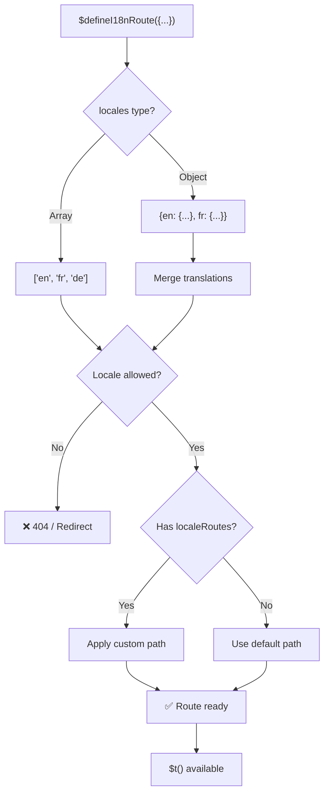
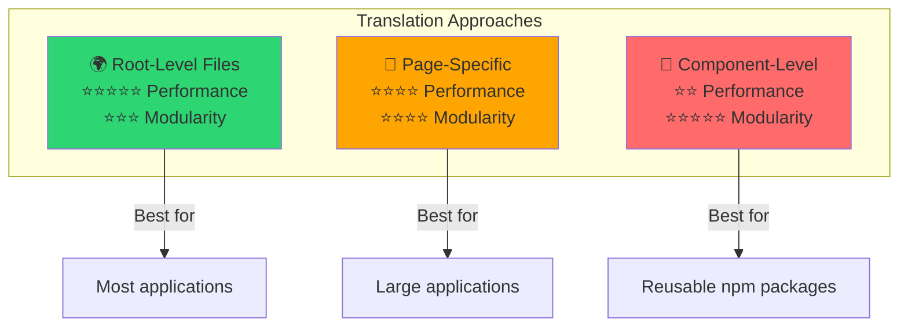

# 📖 Tulkojumi pa komponentiem

Uzziniet, kā definēt tulkojumus tieši Vue komponentu iekšpusē, izmantojot `$defineI18nRoute`, moduļu un uzturamai lokalizācijai.

## 📖 Pārskats

Tulkojumi pa komponentiem modulī `Nuxt I18n Micro` ļauj definēt tulkojumus tieši konkrētu komponentu vai lapu iekšpusē, izmantojot funkciju `$defineI18nRoute`. Šī pieeja ir ideāla, lai pārvaldītu lokalizētu saturu, kas ir unikāls atsevišķiem komponentiem, sniedzot moduļu un uzturamāku metodi tulkojumu apstrādei.

## 🚀 Ātrā uzsākšana

### Pamata lietošana

```vue
<template>
  <div>
    <h1>{{ $t('greeting') }}</h1>
    <p>{{ $t('farewell') }}</p>
  </div>
</template>

<script setup lang="ts">
import { useNuxtApp } from '#imports'

const { $defineI18nRoute, $t } = useNuxtApp()

$defineI18nRoute({
  locales: {
    en: { greeting: 'Hello', farewell: 'Goodbye' },
    fr: { greeting: 'Bonjour', farewell: 'Au revoir' },
    de: { greeting: 'Hallo', farewell: 'Auf Wiedersehen' },
  },
})
</script>
```

### Nepieciešamā iestatīšana (`script setup`)

`$defineI18nRoute` ir Nuxt lietotnes injekcija, nevis globāls makro.  
Vienmēr iegūstiet to no `useNuxtApp()` pirms izsaukšanas.

```ts
import { useNuxtApp } from '#imports'

const { $defineI18nRoute } = useNuxtApp()
```

## 🏗️ Būvēšanas laika maršruta meta

Būvēšanas laikā Vite unplugin skenē lapas `.vue` failus, meklējot `defineI18nRoute(...)` / `$defineI18nRoute(...)` izsaukumus, un izgūst lokāļu ierobežojumus, `localeRoutes` un `disableMeta` maršruta metadatos, ko izmanto `@i18n-micro/route-strategy`.

- **Būvējums**: unplugin (`src/unplugin-define-i18n-route.ts`) darbojas Vite transformācijas laikā un raksta `i18n-route-meta.json` zem Nuxt būvējuma mapes
- **Izpildlaiks**: definēšanas spraudnis (`03.define.ts`) izstrādei un iekļautajai konfigurācijai `script setup` iekšpusē joprojām nodrošina `$defineI18nRoute`

Parasti `$defineI18nRoute` izsaukumu veiciet tikai lapās — modulis automātiski apstrādā būvēšanas laika izgūšanu.

## 🔧 Funkcija `$defineI18nRoute`

Funkcija `$defineI18nRoute` konfigurē maršruta uzvedību, balstoties uz pašreizējo lokāli, piedāvājot daudzpusīgu risinājumu, lai:

- Kontrolētu piekļuvi konkrētiem maršrutiem, balstoties uz pieejamām lokālēm
- Nodrošinātu tulkojumus konkrētām lokālēm
- Iestatītu pielāgotus maršrutus dažādām lokālēm
- Kontrolētu meta tagu ģenerēšanu

### Kā tas darbojas



### Metodes paraksts

```typescript
const { $defineI18nRoute } = useNuxtApp();
$defineI18nRoute(routeDefinition: DefineI18nRouteConfig);
```

### Parametri

| Parametrs      | Tips                                       | Apraksts                        |
| -------------- | ------------------------------------------ | ---------------------------------- |
| `locales`      | `string[] \| Record<string, Translations>` | Maršrutam pieejamās lokāles    |
| `localeRoutes` | `Record<string, string>`                   | Pielāgoti maršruti konkrētām lokālēm |
| `disableMeta`  | `boolean \| string[]`                      | Kontrolē i18n meta tagu ģenerēšanu   |

### Detalizēts parametru apraksts

#### `locales`

Definē, kuras lokāles ir pieejamas maršrutam:

<CodeGroup>
```typescript Array Format
$defineI18nRoute({
  locales: ['en', 'fr', 'de'], // Simple array of locale codes
})
```

```typescript Object Format
$defineI18nRoute({
  locales: {
    en: { greeting: 'Hello', farewell: 'Goodbye' },
    fr: { greeting: 'Bonjour', farewell: 'Au revoir' },
    de: { greeting: 'Hallo', farewell: 'Auf Wiedersehen' },
    ru: {}, // Russian locale allowed but no translations provided
  },
})
```
</CodeGroup>

#### `localeRoutes`

Ļauj definēt pielāgotus maršrutus konkrētām lokālēm:

```typescript
$defineI18nRoute({
  localeRoutes: {
    en: '/welcome',
    fr: '/bienvenue',
    de: '/willkommen',
    ru: '/privet', // Custom route path for Russian locale
  },
})
```

#### `disableMeta`

Kontrolē i18n meta tagu ģenerēšanu:

<CodeGroup>
```typescript Disable All Meta
$defineI18nRoute({
  locales: ['en', 'fr', 'de'],
  disableMeta: true, // Disables all i18n meta tags
})
```

```typescript Disable Specific Locales
$defineI18nRoute({
  locales: ['en', 'fr', 'de'],
  disableMeta: ['en', 'fr'], // Only English and French won't have meta tags
})
```
</CodeGroup>

## 💡 Lietošanas gadījumi

### 1. Piekļuves kontrolēšana, balstoties uz lokālēm

Definējiet, kuras lokāles ir atļautas konkrētiem maršrutiem:

```typescript
$defineI18nRoute({
  locales: ['en', 'fr', 'de'], // Only these locales are allowed for this route
})
```

### 2. Komponentam specifisku tulkojumu nodrošināšana

Izmantojiet `locales` objektu, lai nodrošinātu konkrētus tulkojumus katram maršrutam:

```typescript
$defineI18nRoute({
  locales: {
    en: {
      greeting: 'Hello',
      farewell: 'Goodbye',
      description: 'Welcome to our application',
    },
    fr: {
      greeting: 'Bonjour',
      farewell: 'Au revoir',
      description: 'Bienvenue dans notre application',
    },
    de: {
      greeting: 'Hallo',
      farewell: 'Auf Wiedersehen',
      description: 'Willkommen in unserer Anwendung',
    },
  },
})
```

### 3. Pielāgota maršrutēšana lokālēm

Definējiet pielāgotus ceļus konkrētām lokālēm:

```typescript
$defineI18nRoute({
  locales: ['en', 'fr', 'de'],
  localeRoutes: {
    en: '/welcome',
    fr: '/bienvenue',
    de: '/willkommen',
  },
})
```

### 4. Meta tagu atspējošana

Kontrolējiet SEO meta tagu ģenerēšanu konkrētiem maršrutiem vai lokālēm:

```typescript
// Disable meta tags for all locales
$defineI18nRoute({
  locales: ['en', 'fr', 'de'],
  disableMeta: true,
})

// Disable meta tags only for specific locales
$defineI18nRoute({
  locales: ['en', 'fr', 'de'],
  disableMeta: ['en', 'fr'],
})
```

## ✅ Atbalstītie konfigurācijas formāti

`$defineI18nRoute` parsētājs atbalsta dažādas JavaScript konfigurācijas:

### Statiskas konfigurācijas

<CodeGroup>
```typescript Static Arrays
$defineI18nRoute({
  locales: ['en', 'de', 'fr'],
})
```

```typescript Static Objects
$defineI18nRoute({
  locales: {
    en: { greeting: 'Hello' },
    de: { greeting: 'Hallo' },
  },
  localeRoutes: {
    en: '/welcome',
    de: '/willkommen',
  },
})
```
</CodeGroup>

### Dinamiskas konfigurācijas

<CodeGroup>
```typescript Variables and Functions
const locales = ['en', 'de', 'fr']
const routes = { en: '/welcome', de: '/willkommen' }

$defineI18nRoute({
  locales: locales,
  localeRoutes: routes,
})
```

```typescript Template Literals
const prefix = 'api'

$defineI18nRoute({
  locales: [`${prefix}-en`, `${prefix}-de`],
  localeRoutes: {
    [`${prefix}-en`]: `/api/welcome`,
    [`${prefix}-de`]: `/api/willkommen`,
  },
})
```
</CodeGroup>

### Padziļinātas konfigurācijas

<CodeGroup>
```typescript Spread Operator
const baseLocales = ['en', 'de']
const additionalLocales = ['fr', 'es']

$defineI18nRoute({
  locales: [...baseLocales, ...additionalLocales],
})
```

```typescript Array of Objects
$defineI18nRoute({
  locales: [
    { code: 'en', name: 'English' },
    { code: 'de', name: 'German' },
  ],
})
```
</CodeGroup>

### Nosacījumu loģika

```typescript
$defineI18nRoute({
  locales: process.env.NODE_ENV === 'production' ? ['en', 'de'] : ['en', 'de', 'fr', 'es'],
})
```

### Sarežģīti ligzdoti objekti

```typescript
$defineI18nRoute({
  locales: {
    'en-us': {
      region: 'US',
      currency: 'USD',
      format: {
        date: 'MM/DD/YYYY',
        time: '12h',
      },
    },
    'de-de': {
      region: 'DE',
      currency: 'EUR',
      format: {
        date: 'DD.MM.YYYY',
        time: '24h',
      },
    },
  },
})
```

### Komentāri un formatēšana

```typescript
$defineI18nRoute({
  // Supported locales for this component
  locales: [
    'en', // English
    'de', // German
    'fr', // French
  ],
  // Custom routes for each locale
  localeRoutes: {
    en: '/welcome',
    de: '/willkommen',
    fr: '/bienvenue',
  },
})
```

## ❌ Nav atbalstīts

Parsētājam ir ierobežojumi, un tas nevar apstrādāt:

- **Ārējus importus** (`import` paziņojumi)
- **Async/await funkcijas**
- **Klases metodes**
- **Sarežģītu vadības plūsmu** (cikli, try-catch, switch)
- **Bultiņas funkcijas** konfigurācijā
- **Ģeneratora funkcijas**

## 📝 Pilnīgs piemērs

Šeit ir vispusīgs piemērs, kas parāda visas funkcijas:

```vue
<template>
  <div class="welcome-page">
    <header>
      <h1>{{ $t('title') }}</h1>
      <p>{{ $t('subtitle') }}</p>
    </header>

    <main>
      <section>
        <h2>{{ $t('features.title') }}</h2>
        <ul>
          <li v-for="feature in $t('features.list')" :key="feature">
            {{ feature }}
          </li>
        </ul>
      </section>

      <section>
        <h2>{{ $t('contact.title') }}</h2>
        <p>{{ $t('contact.description') }}</p>
        <a :href="$t('contact.email')">{{ $t('contact.email') }}</a>
      </section>
    </main>

    <footer>
      <p>{{ $t('footer.copyright') }}</p>
    </footer>
  </div>
</template>

<script setup lang="ts">
import { useNuxtApp } from '#imports'

const { $defineI18nRoute, $t } = useNuxtApp()

// Define comprehensive i18n route configuration
$defineI18nRoute({
  locales: {
    en: {
      title: 'Welcome to Our Platform',
      subtitle: 'The best solution for your needs',
      features: {
        title: 'Key Features',
        list: ['High Performance', 'Easy to Use', 'Scalable Architecture'],
      },
      contact: {
        title: 'Get in Touch',
        description: "We'd love to hear from you",
        email: 'mailto:contact@example.com',
      },
      footer: {
        copyright: '© 2024 Example Company. All rights reserved.',
      },
    },
    fr: {
      title: 'Bienvenue sur Notre Plateforme',
      subtitle: 'La meilleure solution pour vos besoins',
      features: {
        title: 'Fonctionnalités Clés',
        list: ['Haute Performance', 'Facile à Utiliser', 'Architecture Évolutive'],
      },
      contact: {
        title: 'Contactez-Nous',
        description: 'Nous aimerions avoir de vos nouvelles',
        email: 'mailto:contact@example.com',
      },
      footer: {
        copyright: '© 2024 Example Company. Tous droits réservés.',
      },
    },
    de: {
      title: 'Willkommen auf Unserer Plattform',
      subtitle: 'Die beste Lösung für Ihre Bedürfnisse',
      features: {
        title: 'Hauptfunktionen',
        list: ['Hohe Leistung', 'Einfach zu Verwenden', 'Skalierbare Architektur'],
      },
      contact: {
        title: 'Kontaktieren Sie Uns',
        description: 'Wir würden gerne von Ihnen hören',
        email: 'mailto:contact@example.com',
      },
      footer: {
        copyright: '© 2024 Example Company. Alle Rechte vorbehalten.',
      },
    },
  },
  localeRoutes: {
    en: '/welcome',
    fr: '/bienvenue',
    de: '/willkommen',
  },
  disableMeta: false, // Enable SEO meta tags
})
</script>

<style scoped>
.welcome-page {
  max-width: 800px;
  margin: 0 auto;
  padding: 2rem;
}

header {
  text-align: center;
  margin-bottom: 3rem;
}

section {
  margin-bottom: 2rem;
}

footer {
  text-align: center;
  margin-top: 3rem;
  padding-top: 2rem;
  border-top: 1px solid #eee;
}
</style>
```

## ⚡ Veiktspējas apsvērumi

Tulkojumu iestrāde vienotos komponentu failos (SFC) var ietekmēt veiktspēju:

### Iespējamas problēmas

- **Palielināts faila izmērs**: visas lokāles atrodas SFC iekšpusē, atšķirībā no atsevišķiem tulkojumu failiem, kas nodrošina lokāli apzinošu ielādi
- **Lēnāka renderēšana**: iekš faila esošie tulkojumi tiek apstrādāti izpildlaikā
- **Atmiņas patēriņš**: visi tulkojumi tiek ielādēti neatkarīgi no pašreizējās lokāles

### Labākā prakse

- **Optimālai veiktspējai izmantojiet pa lapām sadalītus tulkojumus**
- **Komponentu līmeņa tulkojumus rezervējiet** konkrētiem gadījumiem, piemēram:
  - Atkārtoti izmantojamiem komponentiem, kas publicēti npm
  - Tulkojumiem, kas nav piemēroti saknes līmeņa failiem
  - Komponentiem, kuriem jābūt pašpietiekamiem

### Veiktspēja pret moduļu principu

Izvēloties pieeju, sabalansējiet jūsu projekta vajadzības:



| Pieeja             | Veiktspēja | Moduļu princips | Lietošanas gadījums            |
| -------------------- | ----------- | ---------- | ------------------- |
| **Saknes līmeņa faili** | ⭐⭐⭐⭐⭐  | ⭐⭐⭐     | Vairums lietotņu   |
| **Lapas specifiskie**    | ⭐⭐⭐⭐    | ⭐⭐⭐⭐   | Lielas lietotnes  |
| **Komponentu līmeņa**  | ⭐⭐        | ⭐⭐⭐⭐⭐ | Atkārtoti izmantojami komponenti |

## 🎯 Labākā prakse

### 1. Uzturiet tulkojumus komponentiem tuvu

Definējiet tulkojumus tieši atbilstošā komponenta iekšpusē, lai lokalizētais saturs paliktu organizēts un uzturams.

### 2. Elastībai izmantojiet lokāles objektus

Kad nepieciešami konkrēti tulkojumi vai piekļuves kontrole, balstoties uz lokālēm, izmantojiet objekta formātu `locales` īpašībai.

### 3. Dokumentējiet pielāgotos maršrutus

Skaidri dokumentējiet jebkurus pielāgotos maršrutus, kas iestatīti dažādām lokālēm, lai saglabātu skaidrību un vienkāršotu izstrādi un uzturēšanu.

### 4. Ņemiet vērā veiktspējas ietekmi

Izvērtējiet, vai komponentu līmeņa tulkojumi ir nepieciešami jūsu lietošanas gadījumam, ņemot vērā veiktspējas sekas.

### 5. Izmantojiet TypeScript

Labākai tipu drošībai un IntelliSense atbalstam izmantojiet TypeScript:

```typescript
interface ComponentTranslations {
  title: string
  subtitle: string
  features: {
    title: string
    list: string[]
  }
}

$defineI18nRoute({
  locales: {
    en: {
      title: 'Welcome',
      subtitle: 'Subtitle',
      features: {
        title: 'Features',
        list: ['Feature 1', 'Feature 2'],
      },
    } as ComponentTranslations,
  },
})
```

## 📚 Saistītās tēmas

- **[Ātrā uzsākšana](/quickstart)** — pamata iestatīšana un konfigurācija
- **[API atsauce](/api/methods)** — pilna metožu dokumentācija
- **[Piemēri](/examples)** — reāli lietošanas piemēri

## Kopsavilkums

Funkcija Tulkojumi pa komponentiem, ko darbina funkcija `$defineI18nRoute`, piedāvā jaudīgu un elastīgu veidu, kā pārvaldīt lokalizāciju jūsu Nuxt lietotnē. Ļaujot lokalizētu saturu un maršrutēšanu definēt komponenta līmenī, tā palīdz izveidot ļoti pielāgotu un lietotājam draudzīgu pieredzi, kas pielāgota jūsu auditorijas valodai un reģionālajām izvēlēm.

Izvēlieties pieeju, kas vislabāk atbilst jūsu projekta vajadzībām, ņemot vērā gan veiktspējas prasības, gan uzturamības apsvērumus.
