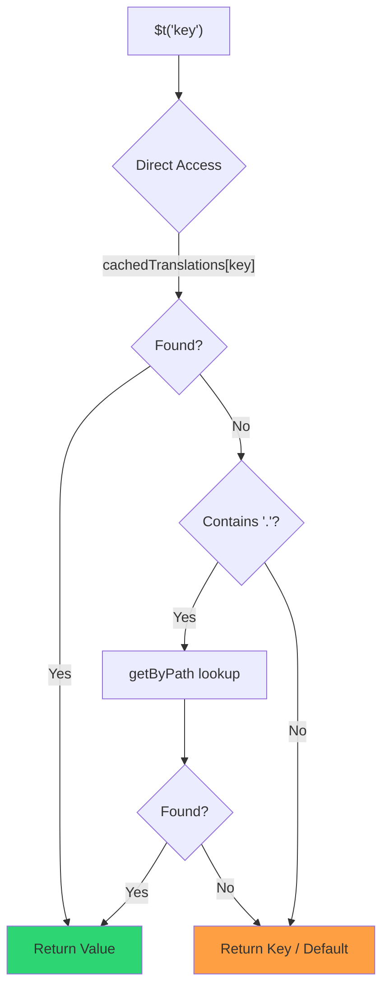

# 🚀 Veiktspējas ceļvedis

## 📖 Ievads

`Nuxt I18n Micro` ir izstrādāts, domājot par veiktspēju, piedāvājot ievērojamu uzlabojumu salīdzinājumā ar tradicionāliem internacionalizācijas (i18n) moduļiem, piemēram, `nuxt-i18n`. Šis ceļvedis sniedz padziļinātu ieskatu `Nuxt I18n Micro` izmantošanas veiktspējas priekšrocībās un tā salīdzinājumā ar citiem risinājumiem.

## 🤔 Kāpēc pievērst uzmanību veiktspējai?

Liela mēroga projektos un vidēs ar lielu apmeklētību veiktspējas šauras vietas var izraisīt lēnu būvēšanas laiku, palielinātu atmiņas patēriņu un sliktus servera atbildes laikus. Šīs problēmas kļūst izteiktākas ar sarežģītiem i18n iestatījumiem, kas ietver lielus tulkojumu failus. `Nuxt I18n Micro` tika izveidots, lai šos izaicinājumus risinātu tieši, optimizējot ātrumu, atmiņas efektivitāti un minimālu ietekmi uz jūsu lietotnes pakotnes izmēru.

## 📊 Veiktspējas salīdzinājums

Mēs veicām testu sēriju uz identiskiem fixture, izmantojot `pnpm test:performance` (`pnpm -C scripts cli performance`), pret **`@nuxtjs/i18n@10.6.0`**. Pilna metodoloģija un diagrammas: [Veiktspējas testu rezultāti](/guides/performance-results).

Noklusējuma CLI profils: **4 lokāles** × **2 lapas** (`index`, `page`) × ~10k index lapu atslēgas. Paceliet `--locales` / `--keys` smagākai regresijas radara slodzei. Pārskats sadala **kodu**, **tulkojumus** (tostarp `@nuxtjs/i18n` `chunks/raw/*`) un **kopējo** izvietojamo izvadi.

```bash
pnpm test:performance
pnpm -C scripts cli performance --only micro --skip-stress
pnpm -C scripts cli performance --locales 12 --keys 100000 --runs 3
```

### ⏱️ Būvēšanas laiks un resursu patēriņš

<Accordion title="**@nuxtjs/i18n v10.6**">
- **Koda pakotne**: 2,16 MB
- **Tulkojumi**: 7,21 MB (ziņojumu gabali + lokāles payload)
- **Kopā izvietojams**: 9,37 MB
- **Maks. atmiņas patēriņš**: 1 821 MB
- **Pagājušais laiks**: 8,34s (3 vidējais)
</Accordion>

<Tip>
- **Koda pakotne**: 1,74 MB — **~19% mazāks kods nekā `@nuxtjs/i18n` v10.6**
- **Tulkojumi**: 6,8 MB (lēni ielādēts JSON)
- **Kopā izvietojams**: 8,54 MB
- **Maks. atmiņas patēriņš**: 1 065 MB — **~41% mazāk atmiņas nekā `@nuxtjs/i18n` v10.6**
- **Pagājušais laiks**: 5,34s — **~36% ātrāks nekā `@nuxtjs/i18n` v10.6** (≈ plain-nuxt bāzlīnija)
</Tip>

> Vecāki dokumenti, kas rādīja `@nuxtjs/i18n` “code ≈ 15 MB / translations 0 B”, `chunks/raw` ziņojumu failus skaitīja kā lietotnes kodu. Pašreizējais klasifikators tos atdala; atšķirība **kodā** ir mazāka, un micro joprojām vada būvēšanas laikā, maksimālajā RSS un slodzes testos.

Diagrammas, Autocannon rezultātus un fixture detaļas skatiet [pilnajā etalonu pārskatā](/guides/performance-results).

### 🌐 Servera veiktspēja zem slodzes

Artillery (6s@6 + 60s@60) un Autocannon (10c / 10s), 3 secīgu izpildījumu vidējais rādītājs uz fixture.

<Accordion title="**@nuxtjs/i18n v10.6**">
- **Pieprasījumi sekundē (Artillery)**: 143 [#/sek]
- **Vidējais atbildes laiks**: 956 ms
- **Autocannon RPS / vid. latentums**: 72 / 139 ms
</Accordion>

<Tip>
- **Pieprasījumi sekundē (Artillery)**: 275 [#/sek] — **~93% vairāk nekā `@nuxtjs/i18n` v10.6**
- **Vidējais atbildes laiks**: 483 ms — **~49% ātrāks nekā `@nuxtjs/i18n` v10.6**
- **Autocannon RPS / vid. latentums**: 162 / 62 ms
</Tip>

### 📈 Vizuāls salīdzinājums

<Note>
Interaktīvā diagramma Mintlify dokumentācijā izlaista. Skatiet etalonu tabulas šajā lapā vai [VitePress dokumentāciju](https://s00d.github.io/nuxt-i18n-micro/guide/performance-results) diagrammai: `chart`.
</Note>

<Note>
Interaktīvā diagramma Mintlify dokumentācijā izlaista. Skatiet etalonu tabulas šajā lapā vai [VitePress dokumentāciju](https://s00d.github.io/nuxt-i18n-micro/guide/performance-results) diagrammai: `chart`.
</Note>

| Rādītājs          | @nuxtjs/i18n v10.6 | i18n-micro | Uzlabojums        |
| --------------- | ------------------ | ---------- | ------------------ |
| Būvēšanas laiks      | 8,34s              | 5,34s      | **~36% ātrāk**    |
| Atmiņa (būvējums)  | 1 821 MB           | 1 065 MB   | **~41% mazāk**      |
| Koda pakotne     | 2,16 MB            | 1,74 MB    | **~19% mazāka**   |
| Atbildes laiks   | 956 ms             | 483 ms     | **~49% ātrāk**    |
| RPS (Artillery) | 143                | 275        | **~93% vairāk**      |

### 🔍 Rezultātu interpretācija

Pret pašreizējo `@nuxtjs/i18n` **v10.6** (noklusējuma CLI profils, 3 vidējais):

- 🗜️ **Mazāks koda grafs**: ~1,74 MB pret ~2,16 MB, kad ziņojumu gabali nav nepareizi apzīmēti kā “code”.
- 🧠 **Zemāks būvēšanas RSS**: ~1,1 GB maksimums pret ~1,8 GB.
- 🕒 **Ātrāki būvējumi**: ~5,3s pret ~8,3s (micro šajā profilā atbilst plain-Nuxt bāzlīnijai).
- ⚡ **Daudz labāk zem slodzes**: ~275 pret ~143 Artillery RPS, ~162 pret ~72 Autocannon RPS, zemāks vidējais latentums.

Absolūtie skaitļi atšķiras no vecākām publicētajām tabulām (mazākas vārdnīcas, vecāks Nuxt un negodīgs “0 B translations” dalījums priekš `@nuxtjs/i18n`). Virziens ir tas pats: micro paliek priekšā būvēšanas cenā un pieprasījumu caurlaidspējā.

## ⚙️ Galvenās optimizācijas

### 🛠️ Minimālistisks dizains

`Nuxt I18n Micro` ir uzbūvēts ap minimālistisku arhitektūru ar nelielu kodolu un veltītām stratēģiju pakotnēm. Tas samazina papildslodzi un vienkāršo iekšējo loģiku, uzlabojot veiktspēju.

### 🚦 Efektīva maršrutēšana

Versijā v3 maršrutu ģenerēšana un izpildlaika ceļu loģika ir sadalīta veltītās pakotnēs optimālai tree-shaking:

- **`@i18n-micro/route-strategy`** — būvēšanas laika maršrutu ģenerēšana: paplašina Nuxt lapas ar lokalizētiem maršrutiem. Tiek iekļauta tikai atlasītā stratēģija (`no_prefix`, `prefix`, `prefix_except_default`, `prefix_and_default`).
- **`@i18n-micro/path-strategy`** — izpildlaika ceļu atrisināšana, pāradresācijas un saišu ģenerēšana. Izmanto tīras funkcijas un iepriekš aprēķinātus konteksta karogus, lai samazinātu piešķīrumus karstajos ceļos. Apakšceļu eksporti (`/prefix`, `/no-prefix` u.c.) nodrošina, ka tiek iepakota tikai izvēlētā realizācija.

Šī pieeja uztur maršrutēšanas konfigurāciju vieglu un nodrošina ātru maršrutu atrisināšanu neatkarīgi no lokāļu skaita.

### 📂 Racionalizēta tulkojumu ielāde

Modulis tulkojumiem atbalsta tikai JSON failus ar skaidru nodalījumu starp globālajiem un lapas specifiskajiem failiem. Tas nodrošina, ka jebkurā laikā tiek ielādēti tikai nepieciešamie tulkojumu dati, vēl vairāk uzlabojot veiktspēju.

### 🔒 GlobalThis singleton kešs

Sākot ar v3.0.0, modulis izmanto `globalThis` singleton modeli ar `Symbol.for`, lai garantētu vienu kešatmiņas instanci visā Node.js procesā. Tas novērš:

- Kešatmiņas dublēšanos, kad tas pats modulis tiek iepakots vairākas reizes
- Objektu atkārtotu izveidi katram pieprasījumam, kas rada atkritumu savākšanas spiedienu
- Atmiņas noplūdes no bāreņu kešatmiņas instancēm

```mermaid
flowchart LR
    subgraph Process["Node.js Process"]
        G["globalThis[Symbol.for('CACHE')]"]

        subgraph R1["SSR Request 1"]
            P1[Plugin Instance] --> G
        end

        subgraph R2["SSR Request 2"]
            P2[Plugin Instance] --> G
        end

        subgraph R3["SSR Request 3"]
            P3[Plugin Instance] --> G
        end
    end

    G --> Cache["Single Map Instance"]
    Cache --> D1["en:index → translations"]
    Cache --> D2["en:about → translations"
```

```typescript
// Internal implementation pattern
const CACHE_KEY = Symbol.for('__NUXT_I18N_STORAGE_CACHE__')
if (!globalThis[CACHE_KEY]) {
  globalThis[CACHE_KEY] = new Map()
}
```

### ⚡ Optimizēta tulkojuma funkcija (tFast)

Funkcija `$t()` izmanto ātrumam optimizētu tiešas meklēšanas stratēģiju:

1. **Iepriekš aprēķināts konteksts**: lokāle un maršruta nosaukums tiek aprēķināti vienu reizi navigācijas laikā, nevis pie katra `$t()` izsaukuma
2. **Vienotā avota meklēšana**: visi tulkojumi (sakne + lapas specifiskie + rezerves) tiek iepriekš sapludināti būvēšanas laikā vienā failā uz lapu — nav nepieciešama slāņota meklēšana
3. **Kumulatīvā dziļā sapludināšana navigācijā**: pārvietojoties tās pašas lokāles ietvaros, jaunas lapas tulkojumi tiek dziļi sapludināti (2 līmeņu dziļumā) aktīvajā vārdnīcā, tāpēc iepriekšējās lapas atslēgas paliek redzamas pārejas animāciju laikā — pat tad, kad lapām ir pārklājoši ligzdoti priedēkļi (piemēram, abām lapām ir atslēgas zem `common.*`)
4. **Atkritumu savākšana caur `page:transition:finish`**: pēc tam, kad pārejas animācija ir pilnībā pabeigta, sapludinātā vārdnīca tiek aizvietota ar tīriem tulkojumiem tikai jaunajai lapai, atbrīvojot atmiņu no vecās lapas atslēgām
5. **Tieša īpašību piekļuve**: karstajos ceļos izmanto `obj[key]`, nevis Map meklējumus



```typescript
// Simplified lookup logic — single active dictionary
let val = cachedTranslations[key]
if (val === undefined && key.includes('.')) {
  val = getByPath(cachedTranslations, key)
}
```

### 💉 Servera puses ielāde (bez HTML iestrādes)

SSR laikā ielādētie tulkojumi paliek **servera atmiņā** priekš `$t` renderēšanas laikā. Tie **netiek** kopēti `nuxtApp.payload` / HTML dokumentā (tā pati ideja kā `@nuxtjs/i18n` ar `experimental.preload: false`).

Klienta pusē `01.plugin.ts` `await`o `switchContext`, kas ielādē `/\{apiBaseUrl\}/:page/:locale/data.json` pirms lietotne turpina — viens pieprasījums, nevis 8 MB iestrādāts objekts.

`NuxtI18n` joprojām tur aktīvo sapludināto vārdnīcu (`cachedTranslations`) priekš `$t()` / `$has()`. Tās pašas lokāles navigācijas dziļi sapludina lapas gabalus, līdz `page:transition:finish` notīra novecojušas atslēgas.

#### Kur tas atrodas šodien

Zemāk esošie skaitļi tiek nolasīti no budžeta faila, ko mēra un ievieš `pnpm run budget:payload`.

{/* generated:payload-budget — do not edit; run `pnpm run docs:generate` */}

Mērīts uz `playground` `/`, `/de`:

| Mērījums | Izmērs |
| --- | --- |
| Tulkojumu avoti diskā | 15,2 MB |
| Apkalpoti kā atsevišķi payload faili | 76,3 MB |
| Lielākais iekļautais `__NUXT_DATA__` | 6,9 MB |
| Klienta aktīvi | 449,5 KB |

Playground nēsā apzināti pārmērīgu vārdnīcu, tāpēc šie nav skaitļi, ko gaidīt no reālas
lietotnes — tie ir fiksēts punkts, pret kuru mērīt. Budžets neizdodas, kad tie negaidīti pieaug,
un tā pamana nejaušu izmaiņu tam, ko payload nes.

{/* /generated:payload-budget */}

### 💾 Kešošana un iepriekšēja renderēšana

Tulkojumi iziet cauri vairākiem kešiem, un zināšana par to, kurš atbildēja uz pieprasījumu, ir
atšķirība starp piecu minūšu un piecu stundu atkļūdošanas sesiju. Ir četri, tajā
secībā, kādā pieprasījums tos satiek:

| Slānis | Kur | Dzīves ilgums | Notīrīts ar |
| --- | --- | --- | --- |
| Pārlūks / CDN | `Cache-Control` uz `/\{apiBaseUrl\}/**` | `httpCacheDuration`, `immutable` | jauns `?v=` — t.i., izvietošana, kas mainīja tulkojumus |
| Nitro maršruta kešs | `routeRules['/\{apiBaseUrl\}/**'].cache` | 60 s, stale-while-revalidate | servera restarts |
| Servera ielādētājs | procesā esošs `CacheControl`, ar atslēgu `locale:routeName` | procesa dzīves ilgums vai `cacheTtl` | servera restarts, HMR izstrādē |
| Klienta krātuve | `translationStorage` + aktīvais gabals `NuxtI18n` | lapas dzīves ilgums | pārlāde |

Divi noteikumi neļauj tiem viens otram pretrunāties:

- **Nitro maršruta kešs eksistē tikai tad, kad eksistē `?v=`.** Ar kešatmiņas laušanas parametru katrs URL ir
  unikāls savam saturam, tāpēc tā kešošana servera pusē ir bez novecošanas riska. Iestatiet
  `dateBuild: 0`, un šis slānis ir izslēgts, jo URL tad ir stabils un
  atbilde saka `must-revalidate` — servera puses kešs atbildētu no novecojuša ieraksta
  līdz minūtei un klusi to sabotētu.
- **`immutable` arī prasa `?v=`.** Bez laušanas parametra galvene ir
  `public, max-age=0, must-revalidate`, neatkarīgi no tā, ko saka `httpCacheDuration`: garš
  `max-age` uz URL, kas nekad nemainās, piestiprina pirmo atbildi, kādu pārlūks jebkad redzējis.

<Warning>
Ar `translationPayloads.publicAssets` (noklusējums premerged režīmā) payload tiek kopēti uz
`public/<apiBaseUrl>/\{page\}/\{locale\}/data.json`. Platforma, kas pati apkalpo šo mapi
(Cloudflare Pages, Firebase Hosting, `npx serve`), piemēro savas galvenes — Nitro
`routeRules` galvene sasniedz tikai atbildes, kas iet caur serveri. Iestatiet kešošanas politiku
šiem statiskajiem failiem pašas platformas konfigurācijā.
</Warning>

🏁 **Iepriekšēja renderēšana**: premerged režīmā `publicAssets` jau raksta klienta URL koku
`public/`. Iesaistiet `prerenderRoutes` tikai tad, ja jums nepieciešams, lai Nitro materializētu apstrādātāja maršrutus, kad
šī kopija ir atspējota.

### 🗜️ Saspiestas publiskās payload

Kad `nitro.compressPublicAssets` ir iespējots, tulkojumu payload, kas kopēti publiskajā
mapē, iegūst arī `.gz` un `.br` brāļus:

```ts
export default defineNuxtConfig({
  nitro: { compressPublicAssets: true },
})
```

Nitro saspiež publiskos aktīvus pirms hook, kas kopē payload, tāpēc bez tā tie būtu
vienīgā nesaspiestā daļa statiskajā būvējumā. Modulis pats ne ieslēdz saspiešanu —
tas tikai piemēro jūsu izvēlēto iestatījumu. Per-encoding atlase (`\{ gzip: true, brotli: false \}`)
tiek ievērota.

Playground index payload: 6 651 984 B neapstrādāts, 1 012 831 B gzip, 821 617 B brotli.

### ☁️ Bezservera payload izvade

Uz **Node** SSR nolasa tulkojumu JSON no `public/<apiBaseUrl>` (`readFile`, bez Nitro `serverAssets` / Rollup `raw:`). Uz **Edge** Nitro `serverAssets` iestrādā to pašu koku (lieliem katalogiem priekšroku dodiet `mode: 'source'`).

```typescript
export default defineNuxtConfig({
  i18n: {
    translationPayloads: {
      serverAssets: true, // default — Node → public copy; Edge → serverAssets embed
      publicAssets: true, // default in premerged mode
    },
  },
})
```

Izmantojiet `translationPayloads.mode: 'source'` kompaktiem Edge iestrādājumiem (un izvēles kompaktām publiskām kopijām):

```typescript
export default defineNuxtConfig({
  i18n: {
    translationPayloads: {
      mode: 'source',
    },
  },
})
```

`mode: 'source'` uztur slāņu sapludinātus avota failus kompaktus un sapludina sakni/lapu/rezervi izpildlaikā caur iebūvēto maršrutu `/_locales` (vai Edge `assets:i18n`). Pēc noklusējuma tas atspējo publisko aktīvu kopijas un iepriekš renderētus payload maršrutus.

<Warning>
`prerenderRoutes` pēc noklusējuma ir `false`. Ar `mode: 'source'` arī `publicAssets` pēc noklusējuma ir `false`. Tāpēc tīri statisks mitināšana bez Nitro/edge izpildlaika nevar ielādēt tulkojumus klienta pusē, ja vien neiespējojat vienu no šīm izvadēm, `serverHandler` paliek pieejams izpildlaikā vai payload tiek mitināti ārēji.

Noklusējuma premerged + `publicAssets` jau ievieto `/\{apiBaseUrl\}/\{page\}/\{locale\}/data.json` zem `public/`, tāpēc statiskie hosti var apkalpot klienta ienesumus bez Nitro.
</Warning>

<Warning>
`apiBaseServerHost` vai `apiBaseClientHost` iestatīšana pārvieto payload apkalpošanu uz šo izcelsmi, kas nāk ar savām prasībām — skatiet [Konfigurācija → Ārējie CDN hosti](/guides/configuration#external-cdn-hosts).
</Warning>

Vai atspējojiet atsevišķas HTTP/publiskās izvades un mitiniet payload ārēji:

```typescript
export default defineNuxtConfig({
  i18n: {
    apiBaseClientHost: 'https://cdn.example.com',
    apiBaseServerHost: 'https://cdn.example.com',
    translationPayloads: {
      serverHandler: false,
      publicAssets: false,
      prerenderRoutes: false,
    },
  },
})
```

Saglabājiet `serverHandler` iespējotu, kad paļaujaties uz iebūvēto lokālo `/\{apiBaseUrl\}/:page/:locale/data.json` maršrutu. Atspējojiet to, kad payload tiek mitināti ārēji un `apiBaseServerHost` norāda uz šo ārējo izcelsmi. Iespējojiet `prerenderRoutes` tikai tad, kad jums nepieciešams, lai Nitro materializētu statiskos payload maršrutus, un `publicAssets` tos jau nav uzrakstījusi.

Būvēšanas laikā modulis brīdina, kad ģenerētā payload izvade pārsniedz `translationPayloads.warnFileCount` (noklusējums 500) vai `translationPayloads.warnSizeBytes` (noklusējums 10 MB). Tas brīdina arī tad, kad visas lokālās izvades ir atspējotas bez konfigurētiem ārējiem payload hostiem.

## 📝 Padomi veiktspējas maksimizēšanai

Šeit ir daži padomi, lai nodrošinātu, ka jūs iegūstat labāko veiktspēju no `Nuxt I18n Micro`:

- 📉 **Ierobežojiet lokāles datus**: iekļaujiet savā projektā tikai tās lokāles, kas jums nepieciešamas, lai pakotnes izmērs paliktu mazs.
- 🗂️ **Izmantojiet lapas specifiskus tulkojumus**: organizējiet savus tulkojumu failus pēc lapas, lai izvairītos no nevajadzīgu datu ielādes.
- 💾 **Iespējojiet kešošanu**: izmantojiet kešošanas funkcijas, lai samazinātu servera slodzi un uzlabotu atbildes laikus.
- 🏁 **Izmantojiet iepriekšēju renderēšanu**: iepriekš renderējiet savus tulkojumus, lai paātrinātu lapu ielādi un samazinātu izpildlaika papildslodzi.

Detalizētus veiktspējas testu rezultātus skatiet [Veiktspējas testu rezultāti](/guides/performance-results).
