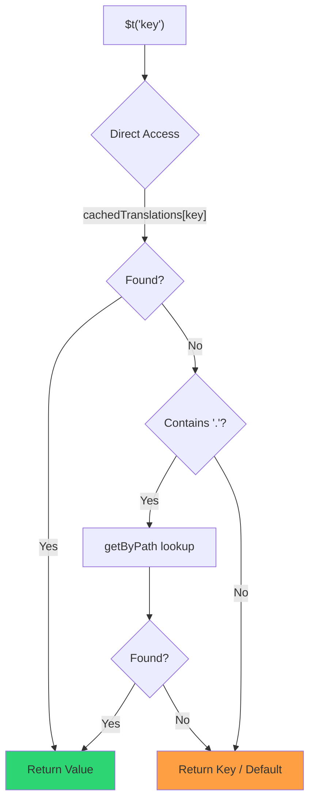

# 🚀 Veiktspējas ceļvedis

## 📖 Ievads

`Nuxt I18n Micro` ir izstrādāts, ņemot vērā veiktspēju, piedāvājot ievērojamu uzlabojumu salīdzinājumā ar tradicionāliem internacionalizācijas (i18n) moduļiem, piemēram, `nuxt-i18n`. Šis ceļvedis sniedz padziļinātu ieskatu `Nuxt I18n Micro` veiktspējas priekšrocībās un tā salīdzinājumā ar citiem risinājumiem.

## 🤔 Kāpēc koncentrēties uz veiktspēju?

Liela mēroga projektos un lielas satiksmes vidēs veiktspējas šauras vietas var novest pie lēna būvēšanas laika, palielināta atmiņas patēriņa un sliktiem servera atbildes laikiem. Šīs problēmas kļūst izteiktākas ar sarežģītiem i18n iestatījumiem, kas ietver lielus tulkojumu failus. `Nuxt I18n Micro` tika izveidots, lai šīs problēmas risinātu tieši, optimizējot ātrumu, atmiņas efektivitāti un minimālu ietekmi uz tavas lietotnes bandulīša izmēru.

## 📊 Veiktspējas salīdzinājums

Mēs veicām testu sēriju uz identiskām fixtures caur `pnpm test:performance` (`pnpm -C scripts cli performance`) pret **`@nuxtjs/i18n@10.6.0`**. Pilna metodoloģija un diagrammas: [Veiktspējas testu rezultāti](/guides/performance-results).

Noklusējuma CLI profils: **4 lokalizācijas** × **2 lapas** (`index`, `page`) × ~10k indeksa lapu atslēgas. Palielini `--locales` / `--keys` smagākai regresijas radara slodzei. Atskaite sadala **kodu**, **tulkojumus** (tostarp `@nuxtjs/i18n` `chunks/raw/*`) un **kopējo** izvietojamo izvadi.

```bash
pnpm test:performance
pnpm -C scripts cli performance --only micro --skip-stress
pnpm -C scripts cli performance --locales 12 --keys 100000 --runs 3
```

### ⏱️ Būvēšanas laiks un resursu patēriņš

<Accordion title="**@nuxtjs/i18n v10.6**">
- **Koda bandulītis**: 2.16 MB.
- **Tulkojumi**: 7.21 MB (ziņojumu daļas + lokalizācijas slodzes).
- **Kopējais izvietojamais**: 9.37 MB.
- **Maks. atmiņas patēriņš**: 1 821 MB.
- **Pagājušais laiks**: 8.34s (vidēji no 3).
</Accordion>

<Tip>
- **Koda bandulītis**: 1.74 MB — **~19% mazāks kods nekā `@nuxtjs/i18n` v10.6**.
- **Tulkojumi**: 6.8 MB (slinki ielādēts JSON).
- **Kopējais izvietojamais**: 8.54 MB.
- **Maks. atmiņas patēriņš**: 1 065 MB — **~41% mazāk atmiņas nekā `@nuxtjs/i18n` v10.6**.
- **Pagājušais laiks**: 5.34s — **~36% ātrāk nekā `@nuxtjs/i18n` v10.6** (≈ parasta Nuxt bāzes līnija).
</Tip>

> Vecāki dokumenti, kas rādīja `@nuxtjs/i18n` "kods ≈ 15 MB / tulkojumi 0 B", uzskaitīja `chunks/raw` ziņojumu failus kā lietotnes kodu. Pašreizējais klasifikators tos atdala; atšķirība **kodā** ir mazāka, un micro joprojām vada būvēšanas laikā, virsotnes RSS un slodzes testos.

Skati [pilnu etalonu atskaiti](/guides/performance-results) diagrammām, Autocannon rezultātiem un fixture detaļām.

### 🌐 Servera veiktspēja zem slodzes

Artillery (6s@6 + 60s@60) un Autocannon (10c / 10s), vidēji no 3 secīgiem palaidieniem katrai fixture.

<Accordion title="**@nuxtjs/i18n v10.6**">
- **Pieprasījumi sekundē (Artillery)**: 143 [#/sec].
- **Vidējais atbildes laiks**: 956 ms.
- **Autocannon RPS / vid. latence**: 72 / 139 ms.
</Accordion>

<Tip>
- **Pieprasījumi sekundē (Artillery)**: 275 [#/sec] — **~93% vairāk nekā `@nuxtjs/i18n` v10.6**.
- **Vidējais atbildes laiks**: 483 ms — **~49% ātrāk nekā `@nuxtjs/i18n` v10.6**.
- **Autocannon RPS / vid. latence**: 162 / 62 ms.
</Tip>

### 📈 Vizuāls salīdzinājums

<Note>
Interaktīvā diagramma izlaista Mintlify dokumentos. Skati etalonu tabulas šajā lapā vai [VitePress dokumentos](https://s00d.github.io/nuxt-i18n-micro/guide/performance-results) diagrammai: `chart`.
</Note>

<Note>
Interaktīvā diagramma izlaista Mintlify dokumentos. Skati etalonu tabulas šajā lapā vai [VitePress dokumentos](https://s00d.github.io/nuxt-i18n-micro/guide/performance-results) diagrammai: `chart`.
</Note>

| Metrika          | @nuxtjs/i18n v10.6 | i18n-micro | Uzlabojums        |
| --------------- | ------------------ | ---------- | ------------------ |
| Būvēšanas laiks      | 8.34s              | 5.34s      | **~36% ātrāk**    |
| Atmiņa (būvē)  | 1 821 MB           | 1 065 MB   | **~41% mazāk**      |
| Koda bandulītis     | 2.16 MB            | 1.74 MB    | **~19% mazāks**   |
| Atbildes laiks   | 956 ms             | 483 ms     | **~49% ātrāk**    |
| RPS (Artillery) | 143                | 275        | **~93% vairāk**      |

### 🔍 Rezultātu interpretācija

Pret pašreizējo `@nuxtjs/i18n` **v10.6** (noklusējuma CLI profils, vidēji no 3):

- 🗜️ **Mazāks koda grafs**: ~1.74 MB pret ~2.16 MB, kad ziņojumu daļas netiek nepareizi apzīmētas kā "kods".
- 🧠 **Zemāka būvējuma RSS**: ~1.1 GB virsotne pret ~1.8 GB.
- 🕒 **Ātrāki būvējumi**: ~5.3s pret ~8.3s (micro atbilst parasta Nuxt bāzes līnijai šajā profilā).
- ⚡ **Daudz labāk zem slodzes**: ~275 pret ~143 Artillery RPS, ~162 pret ~72 Autocannon RPS, zemāka vidējā latence.

Absolūtie skaitļi atšķiras no vecākajām publicētajām tabulām (mazākas vārdnīcas, vecāks Nuxt un negodīgs "0 B tulkojumi" sadalījums priekš `@nuxtjs/i18n`). Virziens tas pats: micro paliek priekšā būvēšanas izmaksās un pieprasījumu caurlaidē.

## ⚙️ Galvenās optimizācijas

### 🛠️ Minimālistisks dizains

`Nuxt I18n Micro` ir izveidots ap minimālistisku arhitektūru ar mazu kodolu un īpašām stratēģiju paketēm. Tas samazina slodzi un vienkāršo iekšējo loģiku, kā rezultātā uzlabojas veiktspēja.

### 🚦 Efektīva maršrutēšana

V3 maršruta ģenerēšana un izpildlaika ceļa loģika ir sadalītas īpašās paketēs optimālai koka kratīšanai:

- **`@i18n-micro/route-strategy`** — būvēšanas laika maršrutu ģenerēšana: paplašina Nuxt lapas ar lokalizētiem maršrutiem. Iekļauta tikai izvēlētā stratēģija (`no_prefix`, `prefix`, `prefix_except_default`, `prefix_and_default`).
- **`@i18n-micro/path-strategy`** — izpildlaika ceļa atrisināšana, pāradresācijas un saišu ģenerēšana. Izmanto tīras funkcijas un iepriekš aprēķinātus konteksta karogus, lai minimizētu piešķiršanu karstajos ceļos. Apakšceļa eksporti (`/prefix`, `/no-prefix` un citi) nodrošina, ka komplektā tiek iekļauta tikai izvēlētā implementācija.

Šī pieeja saglabā maršrutēšanas konfigurāciju vieglu un nodrošina ātru maršruta atrisināšanu neatkarīgi no lokalizāciju skaita.

### 📂 Racionalizēta tulkojumu ielāde

Modulis atbalsta tikai JSON failus tulkojumiem ar skaidru globālu un lapām specifisku failu nodalīšanu. Tas nodrošina, ka jebkurā brīdī tiek ielādēti tikai nepieciešamie tulkojumu dati, vēl vairāk uzlabojot veiktspēju.

### 🔒 GlobalThis singletona kešatmiņa

Sākot ar v3.0.0, modulis izmanto `globalThis` singletona modeli ar `Symbol.for`, lai garantētu vienu kešatmiņas eksemplāru visā Node.js procesā. Tas novērš:

- Kešatmiņas dublēšanos, kad viens un tas pats modulis tiek komplektēts vairākas reizes.
- Objekta atkārtotu izveidi katrā pieprasījumā, kas rada atkritumu savākšanas spiedienu.
- Atmiņas noplūdes no palikušajiem kešatmiņas eksemplāriem.

```mermaid
flowchart LR
    subgraph Process["Node.js Process"]
        G["globalThis[Symbol.for('CACHE')]"]

        subgraph R1["SSR Request 1"]
            P1[Plugin Instance] --> G
        end

        subgraph R2["SSR Request 2"]
            P2[Plugin Instance] --> G
        end

        subgraph R3["SSR Request 3"]
            P3[Plugin Instance] --> G
        end
    end

    G --> Cache["Single Map Instance"]
    Cache --> D1["en:index → translations"]
    Cache --> D2["en:about → translations"
```

```typescript
// Internal implementation pattern
const CACHE_KEY = Symbol.for('__NUXT_I18N_STORAGE_CACHE__')
if (!globalThis[CACHE_KEY]) {
  globalThis[CACHE_KEY] = new Map()
}
```

### ⚡ Optimizēta tulkošanas funkcija (tFast)

Funkcija `$t()` izmanto tiešas meklēšanas stratēģiju, kas optimizēta ātrumam:

1. **Iepriekš aprēķināts konteksts**: lokalizācija un maršruta nosaukums tiek aprēķināti vienreiz navigācijas laikā, nevis katrā `$t()` izsaukumā.
2. **Viena avota meklēšana**: visi tulkojumi (saknes + lapām specifiskie + atkāpšanās) tiek iepriekš sapludināti būvēšanas laikā vienā failā katrai lapai — nav vajadzīga slāņota meklēšana.
3. **Kumulatīva dziļa sapludināšana navigācijas laikā**: navigējot vienas lokalizācijas ietvaros, jaunās lapas tulkojumi tiek dziļi sapludināti (2 līmeņu dziļumā) aktīvajā vārdnīcā, tāpēc iepriekšējās lapas atslēgas paliek redzamas pārejas animāciju laikā — pat ja lapām ir pārklājoši ligzdoti prefiksi (piemēram, abām lapām ir atslēgas zem `common.*`).
4. **Atkritumu savākšana caur `page:transition:finish`**: pēc tam, kad pārejas animācija ir pilnībā pabeigta, sapludinātā vārdnīca tiek aizvietota ar tīriem tulkojumiem tikai jaunajai lapai, atbrīvojot atmiņu no vecās lapas atslēgām.
5. **Tieša īpašību piekļuve**: karstajos ceļos izmanto `obj[key]`, nevis Map meklēšanu.



```typescript
// Simplified lookup logic — single active dictionary
let val = cachedTranslations[key]
if (val === undefined && key.includes('.')) {
  val = getByPath(cachedTranslations, key)
}
```

### 💉 Servera puses ielāde (bez HTML iegultnes)

SSR laikā ielādētie tulkojumi paliek **servera atmiņā** priekš `$t` renderēšanas laikā. Tie **netiek** kopēti `nuxtApp.payload` / HTML dokumentā (tāda pati ideja kā `@nuxtjs/i18n` ar `experimental.preload: false`).

Klientā `01.plugin.ts` `await` gaida `switchContext`, kas ielādē `/\{apiBaseUrl\}/:page/:locale/data.json` pirms lietotne turpinās — viens pieprasījums, nevis 8 MB iekļauts bloks.

`NuxtI18n` joprojām saglabā aktīvo sapludināto vārdnīcu (`cachedTranslations`) priekš `$t()` / `$has()`. Vienas lokalizācijas navigācijas dziļi sapludina lapas daļas, līdz `page:transition:finish` iztīra novecojušas atslēgas.

#### Kur tas atrodas šodien

Zemāk esošie skaitļi tiek nolasīti no budžeta faila, ko `pnpm run budget:payload` mēra un ievieš.

{/* generated:payload-budget — do not edit; run `pnpm run docs:generate` */}

Mērīts uz `playground` pa `/`, `/de`:

| Mērījums | Izmērs |
| --- | --- |
| Tulkojumu avoti diskā | 15.2 MB |
| Apkalpoti kā atsevišķi slodzes faili | 76.3 MB |
| Lielākais iekļautais `__NUXT_DATA__` | 6.9 MB |
| Klienta līdzekļi | 449.5 KB |

Playground nes apzināti pārmērīgi lielu vārdnīcu, tāpēc šie nav skaitļi, ko gaidīt no reālas lietotnes — tie ir fiksēts punkts, pret ko mērīt. Budžets neizdodas, kad tie negaidīti pieaug, un tā tiek pamanīts nejaušs izmaiņas, ko slodze nes.

{/* /generated:payload-budget */}

### 💾 Kešošana un pirmsrenderēšana

Tulkojumi iziet cauri vairākām kešatmiņām, un zināt, kura atbildēja uz pieprasījumu, ir starpība starp piecu minūšu un piecu stundu atkļūdošanas sesiju. Tās ir četras, secībā, kādā pieprasījums ar tām satiekas:

| Slānis | Kur | Dzīves ilgums | Iztīrīts ar |
| --- | --- | --- | --- |
| Pārlūks / CDN | `Cache-Control` uz `/\{apiBaseUrl\}/**` | `httpCacheDuration`, `immutable` | jauns `?v=` — tas ir, izvietojums, kas mainījis tulkojumus. |
| Nitro maršruta kešatmiņa | `routeRules['/\{apiBaseUrl\}/**'].cache` | 60 s, stale-while-revalidate | servera pārstartēšana. |
| Servera ielādētājs | procesā `CacheControl`, indeksēts `locale:routeName` | procesa dzīves laiks vai `cacheTtl` | servera pārstartēšana, HMR izstrādē. |
| Klienta krātuve | `translationStorage` + aktīvā daļa iekš `NuxtI18n` | lapas dzīves laiks | pārlādēšana. |

Divi noteikumi neļauj tām savstarpēji nesaskatīties:

- **Nitro maršruta kešatmiņa pastāv tikai tad, kad `?v=` pastāv.** Ar kešatmiņas atsvaidzinātāju katrs URL ir unikāls savam saturam, tāpēc tā kešošana servera pusē ir bez novecošanas. Iestati `dateBuild: 0`, un šis slānis ir izslēgts, jo URL tad ir stabils, un atbilde saka `must-revalidate` — servera puses kešatmiņa atbildētu no novecojošas ieraksta līdz minūtei un klusi to sagrautu.
- **`immutable` arī prasa `?v=`.** Bez atsvaidzinātāja galvene ir `public, max-age=0, must-revalidate`, neatkarīgi no tā, ko saka `httpCacheDuration`: ilgs `max-age` URL, kas nekad nemainās, piesprauž pirmo atbildi, ko pārlūks jebkad ir redzējis.

<Warning>
Ar `translationPayloads.publicAssets` (noklusējums premerged režīmā) slodzes tiek kopētas uz `public/<apiBaseUrl>/\{page\}/\{locale\}/data.json`. Platforma, kas apkalpo šo mapi pati (Cloudflare Pages, Firebase Hosting, `npx serve`), piemēro savas galvenes — Nitro `routeRules` galvene sasniedz tikai atbildes, kas iziet caur serveri. Iestati kešatmiņas politiku šiem statiskajiem failiem platformas pašas konfigurācijā.
</Warning>

🏁 **Pirmsrenderēšana**: premerged režīmā `publicAssets` jau raksta klienta URL koku iekš `public/`. Piesakies `prerenderRoutes` tikai tad, ja tev nepieciešams, lai Nitro materializē apstrādātāja maršrutus, kad šī kopija ir atspējota.

### 🗜️ Saspiestas publiskās slodzes

Kad `nitro.compressPublicAssets` ir iespējots, tulkojumu slodzes, kas nokopētas publiskajā mapē, saņem arī `.gz` un `.br` brāļus:

```ts
export default defineNuxtConfig({
  nitro: { compressPublicAssets: true },
})
```

Nitro saspiež publiskos līdzekļus pirms āķa, kas kopē slodzes, tāpēc bez tā tās būtu vienīgā nesaspiestā daļa statiskajā būvējumā. Modulis pats neieslēdz saspiešanu — tas tikai piemēro tavu izvēlēto iestatījumu. Katra kodējuma izvēle (`\{ gzip: true, brotli: false \}`) tiek ievērota.

Playground indeksa slodze: 6 651 984 B neapstrādāta, 1 012 831 B gzip, 821 617 B brotli.

### ☁️ Serverless slodzes izvade

Uz **Node** SSR lasa tulkojumu JSON no `public/<apiBaseUrl>` (`readFile`, nav Nitro `serverAssets` / Rollup `raw:`). Uz **Edge** Nitro `serverAssets` iegulda to pašu koku (dod priekšroku `mode: 'source'` lieliem katalogiem).

```typescript
export default defineNuxtConfig({
  i18n: {
    translationPayloads: {
      serverAssets: true, // default — Node → public copy; Edge → serverAssets embed
      publicAssets: true, // default in premerged mode
    },
  },
})
```

Izmanto `translationPayloads.mode: 'source'` kompaktām Edge iegultnēm (un neobligātām kompaktām publiskajām kopijām):

```typescript
export default defineNuxtConfig({
  i18n: {
    translationPayloads: {
      mode: 'source',
    },
  },
})
```

`mode: 'source'` saglabā slāņu sapludinātos avota failus kompaktus un sapludina saknes/lapas/atkāpšanās izpildlaikā caur iebūvēto `/_locales` maršrutu (vai Edge `assets:i18n`). Pēc noklusējuma tas atspējo publiskās līdzekļu kopijas un pirmsrenderētos slodzes maršrutus.

<Warning>
`prerenderRoutes` noklusējums ir `false`. Ar `mode: 'source'` arī `publicAssets` noklusējums ir `false`. Tīri statisks mitināšanas bez Nitro/edge izpildlaika tāpēc nevar ielādēt tulkojumus klientā, ja vien tu nepiespējo vienu no šīm izvadēm, saglabā `serverHandler` pieejamu izpildlaikā vai mitini slodzes ārēji.

Noklusējuma premerged + `publicAssets` jau ievieto `/\{apiBaseUrl\}/\{page\}/\{locale\}/data.json` zem `public/`, tāpēc statiskie mitinātāji var apkalpot klienta ielādes bez Nitro.
</Warning>

<Warning>
Iestatot `apiBaseServerHost` vai `apiBaseClientHost`, slodzes apkalpošana tiek pārvietota uz šo izcelsmi, kas nāk ar savām prasībām — skati [Konfigurācija → Ārējie CDN resursdatori](/guides/configuration#external-cdn-hosts).
</Warning>

Vai atspējo atsevišķas HTTP/publiskās izvades un mitini slodzes ārēji:

```typescript
export default defineNuxtConfig({
  i18n: {
    apiBaseClientHost: 'https://cdn.example.com',
    apiBaseServerHost: 'https://cdn.example.com',
    translationPayloads: {
      serverHandler: false,
      publicAssets: false,
      prerenderRoutes: false,
    },
  },
})
```

Uzturi `serverHandler` iespējotu, kad paļaujies uz iebūvēto vietējo `/\{apiBaseUrl\}/:page/:locale/data.json` maršrutu. Atspējo to, kad slodzes tiek mitinātas ārēji un `apiBaseServerHost` norāda uz šo ārējo izcelsmi. Iespējo `prerenderRoutes` tikai tad, kad tev nepieciešams, lai Nitro materializē statiskos slodzes maršrutus, un `publicAssets` tos jau nav ierakstījis.

Būvēšanas laikā modulis brīdina, kad ģenerētā slodzes izvade pārsniedz `translationPayloads.warnFileCount` (noklusējums 500) vai `translationPayloads.warnSizeBytes` (noklusējums 10 MB). Tas arī brīdina, kad visas vietējās izvades ir atspējotas bez konfigurētiem ārējiem slodzes resursdatoriem.

## 📝 Padomi veiktspējas maksimizēšanai

Šeit ir daži padomi, lai nodrošinātu, ka tu iegūsti vislabāko veiktspēju no `Nuxt I18n Micro`:

- 📉 **Ierobežo lokalizācijas datus**: iekļauj tikai tās lokalizācijas, kas nepieciešamas tavā projektā, lai bandulīša izmērs paliktu mazs.
- 🗂️ **Izmanto lapām specifiskus tulkojumus**: organizē savus tulkojumu failus pēc lapas, lai izvairītos no nevajadzīgu datu ielādes.
- 💾 **Iespējo kešošanu**: izmanto kešošanas funkcijas, lai samazinātu servera slodzi un uzlabotu atbildes laikus.
- 🏁 **Izmanto pirmsrenderēšanu**: pirmsrenderē savus tulkojumus, lai paātrinātu lapu ielādi un samazinātu izpildlaika slodzi.

Detalizētiem veiktspējas testu rezultātiem skati [Veiktspējas testu rezultātus](/guides/performance-results).
