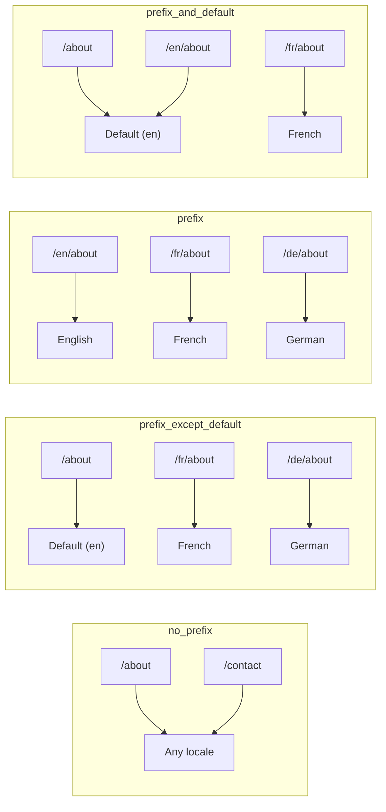
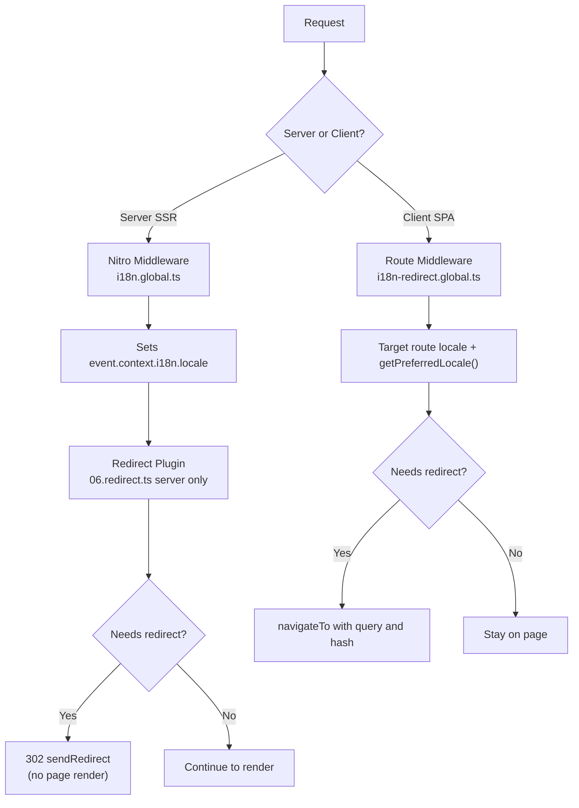

# 🗂️ Maršrutēšanas stratēģijas Nuxt I18n Micro

## 📖 Pārskats

Nuxt I18n Micro kontrolē, kā lokalizācijas prefiksi parādās URL, izmantojot opciju `strategy`. Zem virsmas to ievieš divas paketes:

- **`@i18n-micro/route-strategy`** — būvēšanas laika maršrutu ģenerēšana (paplašina Nuxt lapas ar lokalizētiem maršrutiem).
- **`@i18n-micro/path-strategy`** — izpildlaika ceļa atrisināšana, pāradresācijas, SEO atribūti un saišu ģenerēšana.

Nuxt modulis būvēšanas laikā izvēlas pareizo stratēģijas klasi un aliasē to caur `#i18n-strategy`, tāpēc komplektā tiek iekļauta tikai izvēlētā implementācija.

## 🚦 Pieejamās stratēģijas

{/* generated:option:strategy — do not edit; run `pnpm run docs:generate` */}

**Tips** `Strategies` · **Noklusējums** `'prefix_except_default'`

URL maršrutēšanas stratēģija lokalizācijas prefiksiem.

- `'no_prefix'` — URL nav lokalizācijas; lokalizācija tiek saglabāta sīkdatnē.
- `'prefix_except_default'` — prefikss visām lokalizācijām, izņemot noklusējuma.
- `'prefix'` — vienmēr prefikss, tostarp noklusējuma lokalizācijai.
- `'prefix_and_default'` — līdzīgi kā `prefix`, bet noklusējuma lokalizācija ir pieejama arī bez prefiksa.

{/* /generated:option:strategy */}

### Stratēģiju salīdzinājums



### 🛑 `no_prefix`

URL nav lokalizācijas segmenta. Lokalizācija tiek noteikta pēc sīkdatnēm, `useI18nLocale()` stāvokļa vai pārlūka noteikšanas.

- **Maršruti**: `/about`, `/contact` — tas pats URL modelis visām lokalizācijām (nav `/en/`, `/fr/` prefiksa).
- **Lokalizācijas noturība**: caur `localeCookie` (automātiski iestatīta uz `'user-locale'`, ja nav norādīts).
- **Pielāgoti ceļi**: atbalstīti caur [`globalLocaleRoutes`](/guides/configuration#globallocaleroutes) un [`defineI18nRoute`](/guides/custom-locale-routes) — lokalizēti slugi tiek ģenerēti, nepievienojot lokalizācijas prefiksu URL (piemēram, `/about` pret `/ueber-uns`). Ligzdotie maršruti, aizstājvārdi un ierobežojumi pēc lokalizācijas ir vienkāršāki nekā `prefix_except_default`.

<Tip>
Izmantojot `no_prefix`, `localeCookie` automātiski tiek iestatīta uz `'user-locale'`, ja nav norādīts. Tas ir nepieciešams, jo URL nesatur lokalizācijas informāciju.
</Tip>

```typescript
i18n: {
  strategy: 'no_prefix'
  // localeCookie is automatically set to 'user-locale'
}
```

### 🚧 `prefix_except_default`

Visiem maršrutiem ir lokalizācijas prefikss **izņemot** noklusējuma lokalizāciju.

- **Noklusējuma lokalizācija**: `/about`, `/contact`.
- **Citas lokalizācijas**: `/fr/about`, `/de/contact`.
- **Noklusējuma lokalizācija ar prefiksu atgriež 404**: `/en/about` → 404 (kad `en` ir noklusējums).

```typescript
i18n: {
  strategy: 'prefix_except_default' // This is the default
}
```

### 🌍 `prefix`

Katram maršrutam ir lokalizācijas prefikss, tostarp noklusējuma lokalizācijai.

- **Visas lokalizācijas**: `/en/about`, `/fr/about`, `/de/about`.
- **Sakne `/`**: pāradresē uz `/\{locale\}/`, pamatojoties uz lietotāja preferenci.

```typescript
i18n: {
  strategy: 'prefix'
}
```

### 🔄 `prefix_and_default`

Noklusējuma lokalizācija ir pieejama gan ar, gan bez prefiksa. Nenoklusējuma lokalizācijām vienmēr ir prefikss.

- **Noklusējuma lokalizācija**: gan `/about`, gan `/en/about` ir derīgi.
- **Citas lokalizācijas**: `/fr/about`, `/de/about`.
- **Nav pāradresācijas no `/`**: gan `/`, gan `/en/` apkalpo noklusējuma lokalizāciju.

```typescript
i18n: {
  strategy: 'prefix_and_default'
}
```

## 🔀 Pāradresācijas arhitektūra (v3)

V3 pāradresācijas loģika ir sadalīta divos slāņos optimālai veiktspējai:

### Kā tas darbojas



### Servera pusē (bez zibšņa)

1. **Nitro starpprogrammatūra** (`i18n.global.ts`) darbojas vispirms — nosaka lokalizāciju no URL, sīkdatnes vai `Accept-Language` galvenes un iestata `event.context.i18n.locale`.
2. **Pāradresācijas spraudnis** (`06.redirect.ts`, tikai serveris) pārbauda, vai pašreizējam ceļam nepieciešama pāradresācija, izmantojot `i18nStrategy.getClientRedirect()`, un izsniedz 302 **pirms** jebkādas lapas renderēšanas.
3. Tas novērš "kļūdas zibsni", kur lietotāji īsi redz nepareizu lapu pirms pāradresācijas.

### Klienta pusē (SPA navigācija)

1. Globālā maršruta starpprogrammatūra (`i18n-redirect.global.ts`) darbojas katrā klienta navigācijā, kad `redirects` ir iespējots.
2. Vispirms atvasina vēlamo lokalizāciju no **mērķa maršruta**, tad atgriežas pie `useI18nLocale().getPreferredLocale()`.
3. Izmanto `i18nStrategy.getClientRedirect()`, lai izlemtu, vai nepieciešama pāradresācija.
4. Pāradresācijas laikā saglabā `query` un `hash`.

### Lokalizāciju prioritātes secība

Uz servera pāradresācijas spraudnis nosaka vēlamo lokalizāciju šādā secībā:

1. **`useState('i18n-locale')`** — augstākā prioritāte (iestatīta programmatiski caur `useI18nLocale().setLocale()`).
2. **Sīkdatne** — ja `localeCookie` ir konfigurēta.
3. **`Accept-Language` galvene** — ja `autoDetectLanguage: true`.
4. **`defaultLocale`** — galīgā atkāpšanās.

Klientā maršruta starpprogrammatūra dod priekšroku lokalizācijai no mērķa maršruta, tad izmanto to pašu stāvokļa/sīkdatnes atkāpšanās ķēdi.

### Pāradresācijas uzvedība katrā stratēģijā

| Stratēģija                | `GET /` uzvedība                              | Nepieciešama sīkdatne? |
| ----------------------- | --------------------------------------------- | ---------------- |
| `no_prefix`             | Nav pāradresācijas (lokalizācija no sīkdatnes/stāvokļa).        | Automātiski iestatīta.         |
| `prefix`                | 302 → `/\{locale\}/`.                            | Ieteikts.      |
| `prefix_except_default` | 302 → `/\{locale\}/`, ja lokalizācija ≠ noklusējums.        | Ieteikts.      |
| `prefix_and_default`    | Nav pāradresācijas (gan `/`, gan `/\{locale\}/` derīgi). | Neobligāti.         |

### Pāradresāciju atspējošana

```typescript
i18n: {
  redirects: false // Disables automatic locale redirects
}
```

Kad `redirects: false`, automātiskās lokalizācijas pāradresācijas ir atspējotas:

- **Serveris**: pāradresācijas spraudnis (`06.redirect.ts`, tikai serveris) paliek reģistrēts, bet izlaiž pāradresācijas loģiku. Tas joprojām veic **404 pārbaudes** nederīgiem lokalizācijas prefiksiem (piemēram, `/xx/about`, kur `xx` nav derīga lokalizācija) un **sīkdatnes sinhronizāciju** no URL prefiksa (piemēram, apmeklējot `/fr/about`, sīkdatne tiek sinhronizēta uz `fr`).
- **Klients**: `i18n-redirect` globālā maršruta starpprogrammatūra **netiek reģistrēta** — nav SPA automātisko pāradresāciju.

## 🍪 Sīkdatnēs balstīta lokalizācijas noturība

<Warning>
Izmantojot `prefix` vai `prefix_except_default` ar `redirects: true` (noklusējums), tev **jāiestata** `localeCookie`, lai pāradresācijas darbotos pareizi. Bez sīkdatnes pāradresācijas spraudnis nevar atcerēties lietotāja lokalizācijas preferenci starp lapas atsvaidzināšanām.

```typescript
i18n: {
  strategy: 'prefix_except_default',
  localeCookie: 'user-locale' // Required for redirects to work properly
}
```
</Warning>

**Kā `localeCookie` darbojas v3:**

- Iekšēji pārvalda `useI18nLocale()` — **neiestati to manuāli** caur `useCookie()`.
- Kad lietotājs apmeklē prefiksētu URL (piemēram, `/fr/about`), sīkdatne tiek automātiski sinhronizēta uz `fr`.
- Nākamā apmeklējuma laikā uz `/` sīkdatnes vērtība tiek izmantota, lai pāradresētu uz `/\{locale\}/`.
- Ja sīkdatne satur nederīgu lokalizāciju (nav `locales` sarakstā), tā atgriežas pie `defaultLocale`.

| Stratēģija                | `localeCookie` noklusējums | Piezīmes                                |
| ----------------------- | ---------------------- | ------------------------------------ |
| `no_prefix`             | Automātiski: `'user-locale'`.  | Nepieciešams; iestatīts automātiski.          |
| `prefix`                | `null` (atspējots).      | Iestati uz `'user-locale'` pāradresācijām. |
| `prefix_except_default` | `null` (atspējots).      | Iestati uz `'user-locale'` pāradresācijām. |
| `prefix_and_default`    | `null` (atspējots).      | Neobligāti.                             |

## 🔍 `autoDetectLanguage` un `autoDetectPath`

### `autoDetectLanguage`

{/* generated:option:autoDetectLanguage — do not edit; run `pnpm run docs:generate` */}

**Tips** `boolean` · **Noklusējums** `true`

Automātiski nosaka lietotāja vēlamo valodu no `Accept-Language` HTTP galvenes. Izmanto kopā ar `autoDetectPath`, lai izlemtu, kad notiek noteikšana.

{/* /generated:option:autoDetectLanguage */}

Pārbaude darbojas servera starpprogrammatūrā un ir atkāpšanās: sīkdatne vai esošais stāvoklis uzvar.

```typescript
i18n: {
  autoDetectLanguage: true
}
```

### `autoDetectPath`

{/* generated:option:autoDetectPath — do not edit; run `pnpm run docs:generate` */}

**Tips** `string` · **Noklusējums** `'/'`

Kur sīkdatnes / Accept-Language preferences pāradresācijas var darboties (kad `redirects` ir iespējots).

- `'/'` — tikai `/` (dziļās saites noklusējuma lokalizācijā paliek sasniedzamas; noklusējums).
- `'no_prefix'` — tikai ceļi bez lokalizācijas prefiksa.
- `'*'` — katrs ceļš, tostarp pārrakstot skaidru lokalizācijas prefiksu (piemēram, `/fr/about` → `/de/about`, kad sīkdatne dod priekšroku `de`).

- jebkura cita virkne — precīza ceļa atbilstība (piemēram, `'/welcome'`).

Prefiksētās stratēģijas tīrīšana (piemēram, `/en` → `/` zem `prefix_except_default`) nav ierobežota.

{/* /generated:option:autoDetectPath */}

```typescript
i18n: {
  autoDetectPath: '/' // Default: only root
  // autoDetectPath: '*' // All paths — redirects even /fr/about to /de/about
}
```

<Warning>
Ar `autoDetectPath: '*'` pat URL ar skaidru lokalizācijas prefiksu (piemēram, `/fr/about`) tiks pāradresēti, ja lietotāja vēlamā lokalizācija atšķiras. Tas var būt noderīgi domēnā balstītiem iestatījumiem, bet var mulsināt lietotājus, kuri koplieto URL.
</Warning>

Ar noklusējuma `autoDetectPath: '/'` un lokalizācijas sīkdatni:

| pieprasījums | sīkdatne | rezultāts |
| --- | --- | --- |
| `/` | `de` | 302 → `/de` |
| `/about` | `de` | 200, noklusējuma lokalizācija (nav pārrakstīšanas). |

```typescript
i18n: {
  localeCookie: 'user-locale',
  strategy: 'prefix_except_default',
  // Default — remember language on entry, keep deep links stable
  autoDetectPath: '/',
  // Or redirect on every unprefixed path (but not /de/… → /fr/…):
  // autoDetectPath: 'no_prefix',
}
```

## ⚠️ Zināmās problēmas un labākās prakses

### 1. Hidratācijas neatbilstība `no_prefix` stratēģijā

Izmantojot `no_prefix`, lokalizācija tiek noteikta dinamiski. Ja serveris un klients nesaskan par lokalizāciju, redzēsi hidratācijas neatbilstību.

**Risinājums**: izmanto `useI18nLocale().setLocale()` servera spraudnī (ar `order: -10`), lai iestatītu lokalizāciju pirms i18n inicializācijas:

```ts
// plugins/i18n-loader.server.ts
export default defineNuxtPlugin({
  name: 'i18n-custom-loader',
  enforce: 'pre',
  order: -10,
  setup() {
    const { setLocale } = useI18nLocale()
    setLocale('ja') // Your detection logic here
  },
})
```

Detalizētus piemērus skati [Pielāgotā valodas noteikšanā](/guides/custom-language-detection).

### 2. Izmanto nosauktus maršrutus ar `localeRoute`

Uz ceļa balstīta maršrutēšana var izraisīt problēmas ar maršruta atrisināšanu:

```typescript
// May cause issues
$localeRoute('/page')

// Preferred approach
$localeRoute({ name: 'page' })
```

### 3. `pages: false` izmantošana ar i18n

Izmantojot Nuxt ar `pages: false`:

```typescript
export default defineNuxtConfig({
  pages: false,
  i18n: {
    strategy: 'no_prefix', // Recommended
    disablePageLocales: true, // Required
    localeCookie: 'user-locale', // Required for persistence
  },
})
```

**Ierobežojumi ar `pages: false`:**

- Nav automātisku pāradresāciju.
- Nav URL balstītas lokalizācijas noteikšanas.
- Klienta puses lokalizācijas maiņai nepieciešama lapas atsvaidzināšana vai manuāla tulkojumu ielāde.

### 4. Nederīgu sīkdatņu apstrāde

Ja sīkdatne satur nederīgu lokalizāciju (nav `locales` sarakstā), modulis eleganti atgriežas pie `defaultLocale`. Netiek izmestas kļūdas.

## 📝 Labāko prakšu kopsavilkums

| Ieteikums            | Detaļas                                                                             |
| ------------------------- | ----------------------------------------------------------------------------------- |
| **Iestati `localeCookie`**    | Vienmēr iestati prefiksu stratēģijām ar `redirects: true`.                             |
| **Izmanto `useI18nLocale()`** | Centralizēts veids, kā pārvaldīt lokalizācijas stāvokli (aizvieto manuālo `useState`/`useCookie`). |
| **Izmanto nosauktus maršrutus**      | `$localeRoute(\{ name: 'page' \})` pār `$localeRoute('/page')`.                       |
| **Programmatiska lokalizācija**   | Izmanto `useI18nLocale().setLocale()` servera spraudnī ar `order: -10`.              |
| **Izvairies no manuālām sīkdatnēm**  | Neizmanto `useCookie('user-locale')` tieši — `useI18nLocale()` to pārvalda.      |
