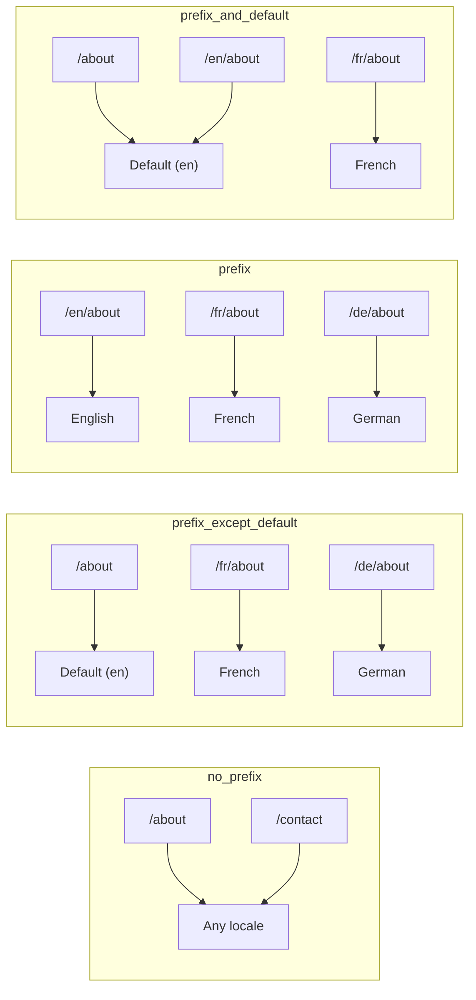
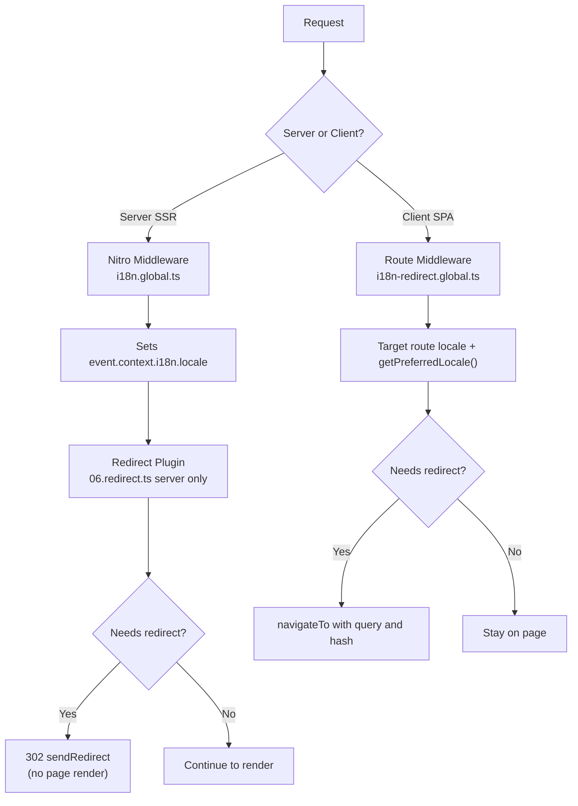

# 🗂️ Maršrutēšanas stratēģijas Nuxt I18n Micro

## 📖 Pārskats

Nuxt I18n Micro kontrolē, kā lokāles priedēkļi parādās URL, izmantojot opciju `strategy`. Iekšēji to realizē divas pakotnes:

- **`@i18n-micro/route-strategy`** — būvēšanas laika maršrutu ģenerēšana (paplašina Nuxt lapas ar lokalizētiem maršrutiem)
- **`@i18n-micro/path-strategy`** — izpildlaika ceļu atrisināšana, pāradresācijas, SEO atribūti un saišu ģenerēšana

Nuxt modulis būvēšanas laikā izvēlas pareizo stratēģijas klasi un aizstāj to caur `#i18n-strategy`, tāpēc tiek iepakota tikai izvēlētā realizācija.

## 🚦 Pieejamās stratēģijas

{/* generated:option:strategy — do not edit; run `pnpm run docs:generate` */}

**Tips** `Strategies` · **Noklusējums** `'prefix_except_default'`

URL maršrutēšanas stratēģija lokāles priedēkļiem.

- `'no_prefix'` — bez lokāles URL; lokāle glabājas sīkfailā.
- `'prefix_except_default'` — priedēklis visām lokālēm, izņemot noklusējuma.
- `'prefix'` — vienmēr priedēklis, arī noklusējuma lokālei.
- `'prefix_and_default'` — kā `prefix`, bet noklusējuma lokāle pieejama arī bez priedēkļa.

{/* /generated:option:strategy */}

### Stratēģiju salīdzinājums



### 🛑 `no_prefix`

URL nesatur lokāles segmentu. Lokāli nosaka sīkfaili, `useI18nLocale()` stāvoklis vai pārlūka noteikšana.

- **Maršruti**: `/about`, `/contact` — vienāds URL modelis visām lokālēm (bez `/en/`, `/fr/` priedēkļa)
- **Lokāles noturība**: caur `localeCookie` (automātiski iestatīts uz `'user-locale'`, ja nav norādīts)
- **Pielāgoti ceļi**: atbalstīti caur [`globalLocaleRoutes`](/guides/configuration#globallocaleroutes) un [`defineI18nRoute`](/guides/custom-locale-routes) — lokalizēti slugi tiek ģenerēti, nepievienojot URL lokāles priedēkli (piemēram, `/about` pret `/ueber-uns`). Ligzdoti maršruti, aizstājējnosaukumi un pa lokālēm ierobežojumi ir vienkāršāki nekā `prefix_except_default`.

<Tip>
Izmantojot `no_prefix`, `localeCookie` tiek automātiski iestatīts uz `'user-locale'`, ja nav norādīts. Tas ir nepieciešams, jo URL nesatur lokāles informāciju.
</Tip>

```typescript
i18n: {
  strategy: 'no_prefix'
  // localeCookie is automatically set to 'user-locale'
}
```

### 🚧 `prefix_except_default`

Visiem maršrutiem ir lokāles priedēklis, **izņemot** noklusējuma lokāli.

- **Noklusējuma lokāle**: `/about`, `/contact`
- **Citas lokāles**: `/fr/about`, `/de/contact`
- **Noklusējuma lokāle ar priedēkli atgriež 404**: `/en/about` → 404 (kad `en` ir noklusējums)

```typescript
i18n: {
  strategy: 'prefix_except_default' // This is the default
}
```

### 🌍 `prefix`

Katram maršrutam ir lokāles priedēklis, tostarp noklusējuma lokālei.

- **Visas lokāles**: `/en/about`, `/fr/about`, `/de/about`
- **Sakne `/`**: pāradresē uz `/\{locale\}/`, balstoties uz lietotāja izvēli

```typescript
i18n: {
  strategy: 'prefix'
}
```

### 🔄 `prefix_and_default`

Noklusējuma lokāle ir pieejama gan ar priedēkli, gan bez tā. Ne-noklusējuma lokālēm vienmēr ir priedēklis.

- **Noklusējuma lokāle**: gan `/about`, gan `/en/about` ir derīgi
- **Citas lokāles**: `/fr/about`, `/de/about`
- **Nav pāradresācijas no `/`**: gan `/`, gan `/en/` apkalpo noklusējuma lokāli

```typescript
i18n: {
  strategy: 'prefix_and_default'
}
```

## 🔀 Pāradresāciju arhitektūra (v3)

Versijā v3 pāradresācijas loģika ir sadalīta divos slāņos optimālai veiktspējai:

### Kā tas darbojas



### Servera puse (bez uzplaiksnījuma)

1. **Nitro starpprogrammatūra** (`i18n.global.ts`) darbojas pirmā — nosaka lokāli no URL, sīkfaila vai `Accept-Language` galvenes un iestata `event.context.i18n.locale`
2. **Pāradresācijas spraudnis** (`06.redirect.ts`, tikai serverī) pārbauda, vai pašreizējais ceļš nepieciešams pāradresēt, izmantojot `i18nStrategy.getClientRedirect()`, un izdod 302 **pirms** jebkādas lapas renderēšanas
3. Tas novērš “kļūdas uzplaiksnījumu”, kur lietotāji īsi redz nepareizu lapu pirms pāradresācijas

### Klienta puse (SPA navigācija)

1. Globālā maršruta starpprogrammatūra (`i18n-redirect.global.ts`) darbojas katrā klienta navigācijā, kad `redirects` ir iespējots
2. Vēlamo lokāli vispirms atvasina no **mērķa maršruta**, tad atkāpjas uz `useI18nLocale().getPreferredLocale()`
3. Izmanto `i18nStrategy.getClientRedirect()`, lai izlemtu, vai nepieciešama pāradresācija
4. Pāradresējot saglabā `query` un `hash`

### Lokāles prioritātes secība

Serverī pāradresācijas spraudnis nosaka vēlamo lokāli šādā secībā:

1. **`useState('i18n-locale')`** — augstākā prioritāte (iestatīta programmatiski caur `useI18nLocale().setLocale()`)
2. **Sīkfails** — ja `localeCookie` ir konfigurēts
3. **`Accept-Language` galvene** — ja `autoDetectLanguage: true`
4. **`defaultLocale`** — galīgā rezerves opcija

Klientā maršruta starpprogrammatūra dod priekšroku lokālei no mērķa maršruta, tad izmanto to pašu stāvokļa/sīkfaila rezerves ķēdi.

### Pāradresācijas uzvedība katrai stratēģijai

| Stratēģija                | `GET /` uzvedība                              | Sīkfails nepieciešams? |
| ----------------------- | --------------------------------------------- | ---------------- |
| `no_prefix`             | Bez pāradresācijas (lokāle no sīkfaila/stāvokļa)        | Automātiski iestatīts         |
| `prefix`                | 302 → `/\{locale\}/`                            | Ieteicams      |
| `prefix_except_default` | 302 → `/\{locale\}/`, ja lokāle ≠ noklusējums        | Ieteicams      |
| `prefix_and_default`    | Bez pāradresācijas (gan `/`, gan `/\{locale\}/` derīgi) | Izvēles         |

### Pāradresāciju atspējošana

```typescript
i18n: {
  redirects: false // Disables automatic locale redirects
}
```

Kad `redirects: false`, automātiskās lokāles pāradresācijas ir atspējotas:

- **Serveris**: pāradresācijas spraudnis (`06.redirect.ts`, tikai serverī) paliek reģistrēts, bet izlaiž pāradresācijas loģiku. Tas joprojām veic **404 pārbaudes** nederīgiem lokāles priedēkļiem (piemēram, `/xx/about`, kur `xx` nav derīga lokāle) un **sīkfaila sinhronizāciju** no URL priedēkļa (piemēram, apmeklējot `/fr/about`, sinhronizē sīkfailu uz `fr`)
- **Klients**: `i18n-redirect` globālā maršruta starpprogrammatūra **netiek reģistrēta** — nav SPA automātisko pāradresāciju

## 🍪 Sīkfailu balstīta lokāles noturība

<Warning>
Izmantojot `prefix` vai `prefix_except_default` ar `redirects: true` (noklusējums), jums **jāiestata** `localeCookie`, lai pāradresācijas darbotos pareizi. Bez sīkfaila pāradresācijas spraudnis nevar atcerēties lietotāja lokāles izvēli starp lapas pārlādēm.

```typescript
i18n: {
  strategy: 'prefix_except_default',
  localeCookie: 'user-locale' // Required for redirects to work properly
}
```
</Warning>

**Kā `localeCookie` darbojas v3:**

- Iekšēji pārvalda `useI18nLocale()` — **neiestatiet to manuāli** caur `useCookie()`
- Kad lietotājs apmeklē priedēkļa URL (piemēram, `/fr/about`), sīkfails tiek automātiski sinhronizēts uz `fr`
- Nākamajā apmeklējumā uz `/` sīkfaila vērtība tiek izmantota pāradresācijai uz `/\{locale\}/`
- Ja sīkfails satur nederīgu lokāli (nav sarakstā `locales`), tas atkāpjas uz `defaultLocale`

| Stratēģija                | `localeCookie` noklusējums | Piezīmes                                |
| ----------------------- | ---------------------- | ------------------------------------ |
| `no_prefix`             | Automātiski: `'user-locale'`  | Nepieciešams; iestatīts automātiski          |
| `prefix`                | `null` (atspējots)      | Iestatiet uz `'user-locale'` pāradresācijām |
| `prefix_except_default` | `null` (atspējots)      | Iestatiet uz `'user-locale'` pāradresācijām |
| `prefix_and_default`    | `null` (atspējots)      | Izvēles                             |

## 🔍 `autoDetectLanguage` un `autoDetectPath`

### `autoDetectLanguage`

{/* generated:option:autoDetectLanguage — do not edit; run `pnpm run docs:generate` */}

**Tips** `boolean` · **Noklusējums** `true`

Automātiski nosaka lietotāja vēlamo valodu no HTTP galvenes `Accept-Language`.
Izmanto kopā ar `autoDetectPath`, lai izlemtu, kad notiek noteikšana.

{/* /generated:option:autoDetectLanguage */}

Pārbaude darbojas servera starpprogrammatūrā un ir rezerves opcija: sīkfails vai esošs stāvoklis uzvar.

```typescript
i18n: {
  autoDetectLanguage: true
}
```

### `autoDetectPath`

{/* generated:option:autoDetectPath — do not edit; run `pnpm run docs:generate` */}

**Tips** `string` · **Noklusējums** `'/'`

Kur var darboties sīkfaila / Accept-Language izvēles pāradresācijas (kad `redirects` ir iespējots).

- `'/'` — tikai `/` (dziļās saites noklusējuma lokālē paliek sasniedzamas; noklusējums)
- `'no_prefix'` — tikai ceļi bez lokāles priedēkļa
- `'*'` — katrs ceļš, tostarp pārrakstot skaidru lokāles priedēkli
  (piemēram, `/fr/about` → `/de/about`, kad sīkfails dod priekšroku `de`)

- jebkura cita virkne — precīza ceļa atbilstība (piemēram, `'/welcome'`)

Priedēkļa stratēģijas tīrīšana (piemēram, `/en` → `/` zem `prefix_except_default`) netiek ierobežota.

{/* /generated:option:autoDetectPath */}

```typescript
i18n: {
  autoDetectPath: '/' // Default: only root
  // autoDetectPath: '*' // All paths — redirects even /fr/about to /de/about
}
```

<Warning>
Ar `autoDetectPath: '*'` pat URL ar skaidru lokāles priedēkli (piemēram, `/fr/about`) tiks pāradresēti, ja lietotāja vēlamā lokāle atšķiras. Tas var būt noderīgi uz domēnu balstītiem iestatījumiem, bet var mulsināt lietotājus, kuri koplieto URL.
</Warning>

Ar noklusējuma `autoDetectPath: '/'` un lokāles sīkfailu:

| pieprasījums | sīkfails | rezultāts |
| --- | --- | --- |
| `/` | `de` | 302 → `/de` |
| `/about` | `de` | 200, noklusējuma lokāle (bez pārrakstīšanas) |

```typescript
i18n: {
  localeCookie: 'user-locale',
  strategy: 'prefix_except_default',
  // Default — remember language on entry, keep deep links stable
  autoDetectPath: '/',
  // Or redirect on every unprefixed path (but not /de/… → /fr/…):
  // autoDetectPath: 'no_prefix',
}
```

## ⚠️ Zināmās problēmas un labākā prakse

### 1. Hidratācijas nesakritība `no_prefix` stratēģijā

Izmantojot `no_prefix`, lokāle tiek noteikta dinamiski. Ja serveris un klients nesaskan par lokāli, redzēsiet hidratācijas nesakritību.

**Risinājums**: izmantojiet `useI18nLocale().setLocale()` servera spraudnī (ar `order: -10`), lai iestatītu lokāli pirms i18n inicializācijas:

```ts
// plugins/i18n-loader.server.ts
export default defineNuxtPlugin({
  name: 'i18n-custom-loader',
  enforce: 'pre',
  order: -10,
  setup() {
    const { setLocale } = useI18nLocale()
    setLocale('ja') // Your detection logic here
  },
})
```

Detalizētus piemērus skatiet [Pielāgota valodas noteikšana](/guides/custom-language-detection).

### 2. Izmantojiet nosauktus maršrutus ar `localeRoute`

Uz ceļiem balstīta maršrutēšana var izraisīt problēmas ar maršrutu atrisināšanu:

```typescript
// May cause issues
$localeRoute('/page')

// Preferred approach
$localeRoute({ name: 'page' })
```

### 3. `pages: false` izmantošana ar i18n

Izmantojot Nuxt ar `pages: false`:

```typescript
export default defineNuxtConfig({
  pages: false,
  i18n: {
    strategy: 'no_prefix', // Recommended
    disablePageLocales: true, // Required
    localeCookie: 'user-locale', // Required for persistence
  },
})
```

**Ierobežojumi ar `pages: false`:**

- Nav automātisku pāradresāciju
- Nav uz URL balstītas lokāles noteikšanas
- Klienta puses lokāles pārslēgšanai nepieciešama lapas pārlāde vai manuāla tulkojumu ielāde

### 4. Nederīga sīkfaila apstrāde

Ja sīkfails satur nederīgu lokāli (nav sarakstā `locales`), modulis eleganti atkāpjas uz `defaultLocale`. Kļūdas netiek izmestas.

## 📝 Labākās prakses kopsavilkums

| Ieteikums            | Detaļas                                                                             |
| ------------------------- | ----------------------------------------------------------------------------------- |
| **Iestatiet `localeCookie`**    | Vienmēr iestatiet priedēkļa stratēģijām ar `redirects: true`                             |
| **Izmantojiet `useI18nLocale()`** | Centralizētais veids, kā pārvaldīt lokāles stāvokli (aizvieto manuālo `useState`/`useCookie`) |
| **Izmantojiet nosauktus maršrutus**      | `$localeRoute(\{ name: 'page' \})` pār `$localeRoute('/page')`                       |
| **Programmatiska lokāle**   | Izmantojiet `useI18nLocale().setLocale()` servera spraudnī ar `order: -10`              |
| **Izvairieties no manuāliem sīkfailiem**  | Neizmantojiet `useCookie('user-locale')` tieši — to pārvalda `useI18nLocale()`      |
