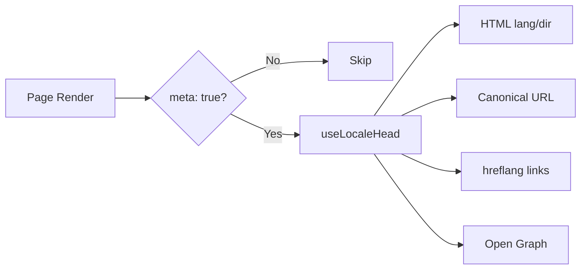

# 🌐 SEO ceļvedis Nuxt I18n Micro

## 📖 Ievads

Efektīvs SEO (meklētājprogrammu optimizācija) ir būtisks, lai nodrošinātu, ka jūsu daudzvalodu vietne ir pieejama un redzama lietotājiem visā pasaulē caur meklētājprogrammām. `Nuxt I18n Micro` vienkāršo SEO pārvaldības procesu daudzvalodu vietnēm, automātiski ģenerējot būtiskus meta tagus un atribūtus, kas informē meklētājprogrammas par jūsu vietnes struktūru un saturu.

Šis ceļvedis paskaidro, kā `Nuxt I18n Micro` apstrādā SEO, lai uzlabotu jūsu vietnes redzamību un lietotāja pieredzi bez papildu konfigurācijas.

## ⚙️ Automātiska SEO apstrāde

### SEO meta ģenerēšanas plūsma



**Ģenerētie tagi:**

| Tags             | Piemērs                                                  |
| --------------- | -------------------------------------------------------- |
| HTML atribūti | `<html lang="en" dir="ltr">`                             |
| Kanoniskais       | `<link rel="canonical" href="...">`                      |
| hreflang        | `<link rel="alternate" hreflang="en" href="...">`        |
| x-default       | `<link rel="alternate" hreflang="x-default" href="...">` |
| Open Graph      | `<meta property="og:locale" content="en_US">`            |

#### `og` katrai lokālei (`og:locale` pret BCP 47)

`<html lang>` un `hreflang` izmanto **BCP 47** caur `locale.iso` (piemēram, `ar-AE`).  
Open Graph pieprasa **`language_TERRITORY`** ar **pasvītrojumu** (`ar_AE`), atbilstoši [OG protokolam](https://ogp.me/).

Pēc noklusējuma `og:locale` tiek atvasināts no `iso`, kad kartējums ir nepārprotams (`en-US` → `en_US`).  
Iestatiet skaidru **`og`** virkni, kad nepieciešama pielāgota vērtība (piemēram, `zh-Hans` → `zh_CN`).  
Ja nav pieejams ne `og`, ne konvertējams `iso`, `og:locale` tagi netiek ģenerēti — izstrādes laikā jūs saņemat konsoles brīdinājumu (ievēro `missingWarn`).

```typescript
i18n: {
  meta: true,
  locales: [
    { code: 'ar', iso: 'ar-AE', og: 'ar_AE', dir: 'rtl' },
    { code: 'en', iso: 'en-US' }, // og:locale → en_US
    { code: 'zh', iso: 'zh-Hans', og: 'zh_CN' }, // script tags need explicit og
  ],
}
```

### 🔑 Galvenās SEO funkcijas

Kad opcija `meta` ir iespējota `Nuxt I18n Micro`, modulis automātiski pārvalda šādus SEO aspektus:

1. **🌍 Valodas un virziena atribūti**:
   - Modulis iestata `lang` un `dir` atribūtus uz `<html>` taga atbilstoši pašreizējai lokālei un teksta virzienam (piemēram, `ltr` angļu valodai vai `rtl` arābu valodai).

2. **🔗 Kanoniskās URL**:
   - Modulis katrai lapai ģenerē kanonisko saiti (`<link rel="canonical">`), nodrošinot, ka meklētājprogrammas atpazīst satura primāro versiju.

3. **🌐 Alternatīvās valodas saites (`hreflang`)**:
   - Modulis automātiski ģenerē `<link rel="alternate" hreflang="">` tagus visām pieejamajām lokālēm. Tas palīdz meklētājprogrammām saprast, kuras jūsu satura valodu versijas ir pieejamas, uzlabojot lietotāja pieredzi globālām auditorijām.
   - Katra lokāle izstaro **vienu** tagu: `hreflang = iso || code`. Kad `iso` ir iestatīts, maršrutēšanas `code` nekad netiek izmantots kā `hreflang` (tāpēc tirgus atslēgas, piemēram, `mx`, nekļūst par nederīgiem valodas tagiem).
   - Izvēles `hreflangBaseLanguage: true` izstaro arī tīras valodas tagu, kas atvasināts no `iso` (piemēram, `es-ES` → `es`), ko pretendē pirmā reģionālā lokāle sarakstā `locales`.

4. **🌏 `x-default` hreflang**:
   - Modulis automātiski ģenerē `<link rel="alternate" hreflang="x-default">` tagu, kas norāda uz noklusējuma lokāles URL. Tas norāda meklētājprogrammām, kuru URL rādīt lietotājiem, kuru valoda neatbilst nevienai no definētajām lokālēm. Papildu konfigurācija nav nepieciešama — tas darbojas automātiski, kad ir iestatīts `meta: true`.

5. **🔖 Open Graph metadati**:
   - Modulis katrai lokālei ģenerē Open Graph meta tagus (`og:locale`, `og:url` u.c.), kas ir īpaši noderīgi sociālo mediju kopīgošanai un meklētājprogrammu indeksācijai.

### 🛠️ Konfigurācija

Lai iespējotu šīs SEO funkcijas, pārliecinieties, ka opcija `meta` ir iestatīta uz `true` jūsu `nuxt.config.ts` failā:

```typescript
export default defineNuxtConfig({
  modules: ['nuxt-i18n-micro'],
  i18n: {
    locales: [
      { code: 'en', iso: 'en-US', dir: 'ltr' },
      { code: 'fr', iso: 'fr-FR', dir: 'ltr' },
      { code: 'ar', iso: 'ar-SA', dir: 'rtl' },
    ],
    defaultLocale: 'en',
    translationDir: 'locales',
    meta: true, // Enables automatic SEO management
  },
})
```

### 🌍 Dinamisks `metaBaseUrl` vairāku domēnu izvietošanai

Kad `metaBaseUrl` nav iestatīts, absolūtie SEO URL tiek atrisināti šajā secībā (#240):

1. `site.url` no [`nuxt-site-config`](https://nuxtseo.com/docs/site-config) (ja šis modulis ir pieejams — piemēram, caur `@nuxtjs/seo`)
2. Pretējā gadījumā resursdatora nosaukums no pašreizējā pieprasījuma (`useRequestURL()` / `window.location.origin`)

Pieprasījuma izcelsmes rezerves opcija ievēro reversā starpniekservera galvenes (`X-Forwarded-Host`, `X-Forwarded-Proto`), tāpēc tā pareizi darbojas aiz nginx, Cloudflare, AWS ALB un līdzīgiem starpniekserveriem.

Tas nozīmē, ka lietotnēm, kas jau iestata `site.url` priekš sitemap / robots / schema.org, **nav** nepieciešama otra `metaBaseUrl` deklarācija:

```typescript
export default defineNuxtConfig({
  site: {
    url: process.env.NUXT_SITE_URL, // also used by micro for canonical / og:url / hreflang
  },
  i18n: {
    meta: true,
    // metaBaseUrl omitted — picks up site.url, then request origin
  },
})
```

Bez `site.url` viena lietotnes instance joprojām var apkalpot **vairākus domēnus** ar pareiziem SEO tagiem katram no tiem caur pieprasījuma izcelsmi:

```typescript
export default defineNuxtConfig({
  i18n: {
    meta: true,
    // metaBaseUrl is undefined by default — resolved dynamically from the request
  },
})
```

Piemēram, pieprasījums uz `https://site-a.com/en/about` radīs:

```html
<link rel="canonical" href="https://site-a.com/en/about" /> <meta property="og:url" content="https://site-a.com/en/about" />
```

Savukārt tā pati lietotne, apkalpojot `https://site-b.com/en/about`, radīs:

```html
<link rel="canonical" href="https://site-b.com/en/about" /> <meta property="og:url" content="https://site-b.com/en/about" />
```

Ja jums nepieciešams fiksēts bāzes URL, kas vienmēr uzvar pār `site.url`, nododiet statisku virkni:

```typescript
metaBaseUrl: 'https://example.com'
```

### 🔍 Kanonisko vaicājumu baltais saraksts

Pēc noklusējuma vaicājuma parametri tiek noņemti no kanoniskā un `og:url`, lai izvairītos no satura dublēšanās. Jūs varat baltajā sarakstā iekļaut konkrētus vaicājuma parametrus, kas jāsaglabā:

```typescript
i18n: {
  canonicalQueryWhitelist: ['page', 'sort', 'filter', 'search', 'q', 'query', 'tag']
}
```

Kanoniskajos URL parādīsies tikai parametri, kas norādīti `canonicalQueryWhitelist`. Visi pārējie vaicājuma parametri (piemēram, izsekošana, sesiju ID) tiek noņemti.

### 🚫 Meta tagu atspējošana katrai lapai

Jūs varat atspējot SEO meta tagu ģenerēšanu konkrētām lapām, izmantojot `defineI18nRoute()`:

```vue
<script setup>
// Disable all SEO meta tags for this page
defineI18nRoute({
  disableMeta: true,
})
</script>
```

Meta tagus var atspējot arī tikai konkrētām lokālēm:

```vue
<script setup>
// Disable meta tags only for English locale on this page
defineI18nRoute({
  disableMeta: ['en'],
})
</script>
```

Kad `disableMeta` ir aktīvs, skartajai lapai/lokālei netiek ģenerēti `hreflang`, `canonical`, `og:locale`, `og:url` vai `x-default` tagi.

### 🔇 Atspējotās lokāles

Lokāles ar `disabled: true` tiek automātiski izslēgtas no visas SEO tagu ģenerēšanas — tām netiek izveidoti `hreflang`, `og:locale:alternate` vai alternatīvās saites:

```typescript
i18n: {
  locales: [
    { code: 'en', iso: 'en-US' },
    { code: 'fr', iso: 'fr-FR', disabled: true }, // excluded from SEO tags
  ]
}
```

### 🙈 Atteikšanās lokāles (`seo: false`)

Lokālēm, kurām jāpaliek maršrutējamām un tulkotām, bet nav jāparādās starp lokāļu atklāšanas tagos, iestatiet `seo: false`. Šīs lokāles tiek izlaistas no `hreflang` alternatīviem un `og:locale:alternate`. Ja jūsu konfigurētajai **noklusējuma** lokālei ir `seo: false`, arī `x-default` saite netiek izstarota.

```typescript
i18n: {
  locales: [
    { code: 'en', iso: 'en-US' },
    { code: 'ru', iso: 'ru-RU', seo: false }, // internal / non-indexed locale
  ]
}
```

### 📌 Stratēģijai specifiska uzvedība

| Stratēģija                | hreflang saites   | x-default             | canonical      | og:url |
| ----------------------- | ---------------- | --------------------- | -------------- | ------ |
| `prefix`                | ✅ Visas lokāles   | ✅ Noklusējuma lokāles URL | ✅ Pašreizējais URL | ✅     |
| `prefix_except_default` | ✅ Visas lokāles   | ✅ URL bez priedēkļa     | ✅ Pašreizējais URL | ✅     |
| `prefix_and_default`    | ✅ Visas lokāles   | ✅ Noklusējuma lokāles URL | ✅ Pašreizējais URL | ✅     |
| `no_prefix`             | ❌ Netiek ģenerēts | ❌ Netiek ģenerēts      | ✅ Pašreizējais URL | ✅     |

`no_prefix` stratēģijai tiek ģenerēti tikai `canonical`, `og:url`, `og:locale` un `html` atribūti (`lang`, `dir`). Alternatīvās valodas saites (`hreflang`) un `x-default` netiek ģenerēti, jo katrai lokālei nav atšķirīgu URL.

## Lapas līmeņa pārrakstīšanas (`useI18nHead`)

**Rakstiem, ceļvežiem vai jebkuram CMS saturam**, kur ne katra lokāle eksistē vai URL nāk no API, lapā izmantojiet [`useI18nHead`](/api/composables/use-i18n-head), nevis pielāgotu i18n head spraudni.

### Raksts ar daļējiem tulkojumiem

```vue
<script setup lang="ts">
const article = await loadArticle()
// article.locales = { en: '...', de: '...' } — only translated locales

useI18nHead({
  meta: [{ property: 'og:title', content: article.title }],
  replace: {
    hreflang: Object.entries(article.locales).map(([locale, href]) => ({
      rel: 'alternate',
      hreflang: locale,
      href,
    })),
    ogAlternates: Object.keys(article.locales),
  },
})
</script>
```

### Lokāles specifiskie slugi ar `$setI18nRouteParams`

Kad slugi atšķiras pa valodām, vispirms iestatiet maršruta parametrus, tad pārrakstiet alternatīvos ar reāliem URL:

```vue
<script setup lang="ts">
const { $defineI18nRoute, $setI18nRouteParams } = useNuxtApp()
const { data: article } = await useFetch(`/api/articles/${slug}`)

$defineI18nRoute({
  localeRoutes: { en: '/blog/[slug]', de: '/de/blog/[slug]' },
})

$setI18nRouteParams({
  en: { slug: article.value.slugEn },
  de: { slug: article.value.slugDe },
})

useI18nHead({
  replace: {
    hreflang: ['en', 'de'].map((locale) => ({
      rel: 'alternate',
      hreflang: locale,
      href: article.value.urls[locale],
    })),
    ogAlternates: ['en', 'de'],
  },
})
</script>
```

### HTTPS izcelsme aiz starpniekservera

Pareiziem absolūtiem URL SSR bez pielāgotas izcelsmes komponējamās funkcijas:

```ts
i18n: {
  meta: true,
  metaBaseUrl: undefined,
  metaTrustForwardedHost: true,
  metaTrustForwardedProto: true,
}
```

Vairāk piemēru (kanoniskā pārrakstīšana, `x-default`, reaktīvs ienesums, koplietoti palīgi): [useI18nHead komponējamā funkcija](/api/composables/use-i18n-head).

### ⚠️ Slīpsvītra beigās

Modulis ģenerē kanoniskos un `hreflang` URL, balstoties uz faktisko ceļu no `useRoute().fullPath`. Ja jūsu lietotne izmanto slīpsvītras beigās (piemēram, caur Nuxt `router.options`), ģenerētie URL to atspoguļos. Tomēr `$switchLocalePath` var normalizēt ceļus un noņemt slīpsvītras beigās. Ja slīpsvītras beigās konsekvence ir kritiska jūsu SEO, pārbaudiet, vai ģenerētie URL atbilst jūsu lietotnes URL struktūrai.

### 🎯 Priekšrocības

Iespējojot opciju `meta`, jūs iegūstat:

- **📈 Uzlabotas meklētājprogrammu vietas**: meklētājprogrammas var labāk indeksēt jūsu vietni, saprotot attiecības starp dažādām valodu versijām.
- **👥 Labāka lietotāja pieredze**: lietotājiem tiek piedāvāta pareizā valodas versija, balstoties uz viņu izvēlēm, kas rada personalizētāku pieredzi.
- **🔧 Samazināta manuālā konfigurācija**: modulis SEO uzdevumus apstrādā automātiski, atbrīvojot jūs no nepieciešamības manuāli pievienot ar SEO saistītus meta tagus un atribūtus.

## 🔗 Nuxt SEO (`@nuxtjs/seo`)

[`@nuxtjs/seo`](https://nuxtseo.com/) apvieno sitemap, robots, schema.org, OG attēlus un saistītos moduļus. Tas integrējas ar **nuxt-i18n-micro** caur [`nuxt-site-config`](https://nuxtseo.com/docs/site-config/guides/i18n) (v4+).

### Prasības

- **`@nuxtjs/seo` 3+** (pašreizējie laidieni izmanto `nuxt-site-config` 4+, kas reģistrē `nuxt-site-config:i18n` spraudni priekš micro)
- **`i18n.meta: true`** (ieteicams — micro piegādā lokāli apzinošus head tagus; Nuxt SEO pievieno sitemap, schema.org u.c.)

### Moduļu secība

Sarakstā ievietojiet **nuxt-i18n-micro pirms `@nuxtjs/seo`**, lai vietnes konfigurācija varētu nolasīt jūsu lokāles iestatījumus:

```typescript
export default defineNuxtConfig({
  modules: ['nuxt-i18n-micro', '@nuxtjs/seo'],
  site: {
    url: 'https://example.com',
    name: 'My Site',
  },
  i18n: {
    meta: true,
    defaultLocale: 'en',
    locales: [
      { code: 'en', iso: 'en-US' },
      { code: 'de', iso: 'de-DE' },
    ],
  },
})
```

### Tulkots vietnes nosaukums un apraksts

Nuxt Site Config no jūsu lokāles failiem nolasa izvēles tulkojumu atslēgas:

```json
{
  "nuxtSiteConfig": {
    "name": "My Site",
    "description": "My site description"
  }
}
```

Katras lokāles vērtības failos `locales/en.json`, `locales/de.json` u.c. tiek uztvertas automātiski.

### Problēmu novēršana

Ja redzat `Plugin nuxt-seo:defaults depends on nuxt-site-config:i18n but they are not registered`, atjauniniet **`@nuxtjs/seo` uz 3+** (skatiet [issue #133](https://github.com/s00d/nuxt-i18n-micro/issues/133)). Vecāks `nuxt-site-config` 3.x pieslēdza i18n tikai priekš `@nuxtjs/i18n`, nevis micro.

Vairāk: [Sitemap i18n ceļvedis](https://nuxtseo.com/docs/sitemap/guides/i18n), [Site Config i18n ceļvedis](https://nuxtseo.com/docs/site-config/guides/i18n).
