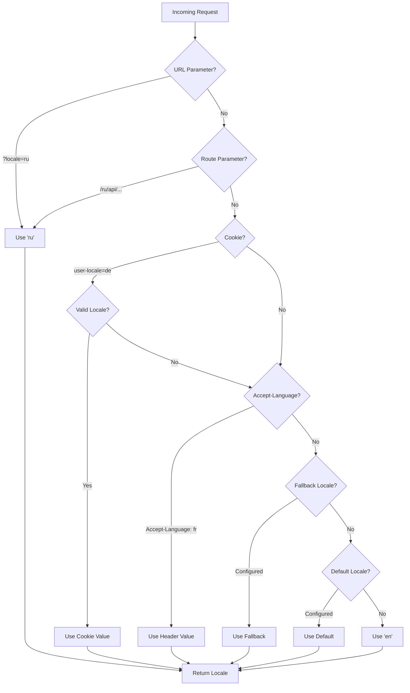

# 🌍 Servera puses tulkojumi un lokāles informācija Nuxt I18n Micro

## 📖 Pārskats

Nuxt I18n Micro atbalsta servera puses tulkojumus un lokāles informāciju, ļaujot jums tulkot saturu un piekļūt lokāles detaļām serverī. Tas ir īpaši noderīgi API vai servera pusē renderētām lietotnēm, kur lokalizācija ir nepieciešama pirms saturs sasniedz klientu.

Tulkojumi izmanto lokāles ziņojumus, kas definēti Nuxt I18n konfigurācijā, un tiek dinamiski atrisināti, balstoties uz noteikto lokāli.

Pēc noklusējuma (`translationPayloads.mode: 'premerged'`) saknes līmeņa faili būvēšanas laikā tiek iesaistīti katras lapas payload kā `\{page\}/\{locale\}/data.json`. Serveris ielādē tos pašus iepriekš izveidotos failus, ko klients izgūst zem `/\{apiBaseUrl\}/...`, tāpēc visas atslēgas (gan koplietotās, gan lapas specifiskās) ir pieejamas servera apstrādātājos.

Ar `translationPayloads.mode: 'source'` kompaktie avota faili tiek sapludināti izpildlaikā, kad tiek izsaukts `loadTranslationsFromServer()` (vai maršruts `/_locales`) — **Edge** vidē caur Nitro `serverAssets`, **Node** vidē no izvēles publiskās kopijas. Detaļas skatiet [Veiktspējas ceļvedis — Bezservera payload izvade](/guides/performance#serverless-payload-output) un [Kešatmiņas un krātuves arhitektūra](/api/cache).

Konsolidētu izpildlaika un servera API sarakstu skatiet [API atsauce](/api/overview).

## 🛠️ Servera puses starpprogrammatūras iestatīšana

Lai iespējotu servera puses tulkojumus un lokāles informāciju, izmantojiet nodrošinātās starpprogrammatūras funkcijas:

- `useTranslationServerMiddleware` — satura tulkošanai
- `useLocaleServerMiddleware` — lokāles informācijas piekļuvei

Abas starpprogrammatūras funkcijas ir automātiski pieejamas visos servera maršrutos.

Lokāles noteikšanas loģika tiek koplietota starp abām starpprogrammatūras funkcijām ar utilītfunkciju `detectCurrentLocale`, lai nodrošinātu konsekvenci visā modulī.

## ✨ Tulkojumu izmantošana servera apstrādātājos

Jūs varat nemanāmi tulkot saturu jebkurā `eventHandler`, izmantojot tulkošanas starpprogrammatūru.

### Piemērs: pamata tulkojumu lietošana

```typescript
import { defineEventHandler } from 'h3'

export default defineEventHandler(async (event) => {
  const t = await useTranslationServerMiddleware(event)
  return {
    message: t('greeting'), // Returns the translated value for the key "greeting"
  }
})
```

Šajā piemērā:

- Lietotāja lokāle tiek noteikta automātiski no vaicājuma parametriem, sīkfailiem vai galvenēm.
- Funkcija `t` izgūst atbilstošu tulkojumu noteiktajai lokālei.

## 🌍 Lokāles informācijas izmantošana servera apstrādātājos

### Pamata lokāles informācijas lietošana

```typescript
import { defineEventHandler } from 'h3'

export default defineEventHandler((event) => {
  const localeInfo = useLocaleServerMiddleware(event)

  return {
    success: true,
    data: localeInfo,
    timestamp: new Date().toISOString(),
  }
})
```

### Pielāgotu lokāles parametru sniegšana

```typescript
import { defineEventHandler } from 'h3'

export default defineEventHandler((event) => {
  // Force specific locale with custom default
  const localeInfo = useLocaleServerMiddleware(event, 'en', 'ru')

  return {
    success: true,
    data: localeInfo,
    timestamp: new Date().toISOString(),
  }
})
```

### Atbildes struktūra

Lokāles starpprogrammatūra atgriež `LocaleInfo` objektu ar šādām īpašībām:

```typescript
interface LocaleInfo {
  current: string // Current detected locale code
  default: string // Default locale code
  fallback: string // Fallback locale code
  available: string[] // Array of all available locale codes
  locale: Locale | null // Full locale configuration object
  isDefault: boolean // Whether current locale is the default
  isFallback: boolean // Whether current locale is the fallback
}
```

### Atbildes piemērs

```json
{
  "success": true,
  "data": {
    "current": "ru",
    "default": "en",
    "fallback": "en",
    "available": ["en", "ru", "de"],
    "locale": {
      "code": "ru",
      "iso": "ru-RU",
      "dir": "ltr",
      "displayName": "Русский"
    },
    "isDefault": false,
    "isFallback": false
  },
  "timestamp": "2024-01-15T10:30:00.000Z"
}
```

## 🌐 Pielāgotas lokāles nodrošināšana

Ja jums nepieciešams norādīt lokāli manuāli (piemēram, testēšanai vai noteiktiem pieprasījumiem), varat to nodot tulkošanas starpprogrammatūrai:

### Piemērs: pielāgota lokāle

```typescript
import { defineEventHandler } from 'h3'

function detectLocale(event): string | null {
  const urlSearchParams = new URLSearchParams(event.node.req.url?.split('?')[1])
  const localeFromQuery = urlSearchParams.get('locale')
  if (localeFromQuery) return localeFromQuery

  return 'en'
}

export default defineEventHandler(async (event) => {
  const t = await useTranslationServerMiddleware(event, 'en', detectLocale(event)) // Force French local, en - default locale
  return {
    message: t('welcome'), // Returns the French translation for "welcome"
  }
})
```

## 📋 Lokāles noteikšanas loģika

Abas starpprogrammatūras funkcijas automātiski nosaka lietotāja lokāli, izmantojot šādu prioritātes secību:



1. **URL parametri**: `?locale=ru`
2. **Maršruta parametri**: `/ru/api/endpoint`
3. **Sīkfaili**: sīkfails `user-locale`
4. **HTTP galvenes**: galvene `Accept-Language`
5. **Rezerves lokāle**: kā konfigurēta moduļa opcijās
6. **Noklusējuma lokāle**: kā konfigurēta moduļa opcijās
7. **Kodā iestrādāta rezerves opcija**: `'en'`

> **Piezīme**: lokāles noteikšanas loģika tiek koplietota starp `useLocaleServerMiddleware` un `useTranslationServerMiddleware`, lai nodrošinātu konsekvenci visā modulī.

## 📋 Padziļināti lietošanas piemēri

### Nosacīta atbilde, balstoties uz lokāli

```typescript
import { defineEventHandler } from 'h3'

export default defineEventHandler((event) => {
  const { current, isDefault, locale } = useLocaleServerMiddleware(event)

  // Return different content based on locale
  if (current === 'ru') {
    return {
      message: 'Привет, мир!',
      locale: current,
      isDefault,
    }
  }

  if (current === 'de') {
    return {
      message: 'Hallo, Welt!',
      locale: current,
      isDefault,
    }
  }

  // Default English response
  return {
    message: 'Hello, World!',
    locale: current,
    isDefault,
  }
})
```

### Pielāgota lokāles noteikšana

```typescript
import { defineEventHandler } from 'h3'

export default defineEventHandler((event) => {
  // Force German locale with English as fallback
  const { current, isDefault, locale } = useLocaleServerMiddleware(event, 'en', 'de')

  return {
    message: 'Hallo, Welt!',
    locale: current,
    isDefault: false, // Will be false since we forced German
  }
})
```

### Lokāli apzinošs API ar validāciju

```typescript
import { defineEventHandler, createError } from 'h3'

export default defineEventHandler((event) => {
  const { current, available, locale } = useLocaleServerMiddleware(event)

  // Validate if the detected locale is supported
  if (!available.includes(current)) {
    throw createError({
      statusCode: 400,
      statusMessage: `Unsupported locale: ${current}. Available locales: ${available.join(', ')}`,
    })
  }

  // Return locale-specific configuration
  return {
    locale: current,
    direction: locale?.dir || 'ltr',
    displayName: locale?.displayName || current,
    availableLocales: available,
  }
})
```

### Integrācija ar tulkošanas starpprogrammatūru

Lokāles informāciju varat apvienot ar tulkošanas starpprogrammatūru vispusīgai internacionalizācijai:

```typescript
import { defineEventHandler } from 'h3'

export default defineEventHandler(async (event) => {
  const localeInfo = useLocaleServerMiddleware(event)
  const t = await useTranslationServerMiddleware(event)

  return {
    locale: localeInfo.current,
    message: t('welcome_message'),
    availableLocales: localeInfo.available,
    isDefault: localeInfo.isDefault,
  }
})
```

## 📝 Labākā prakse

1. **Vienmēr validējiet lokāles**: pārbaudiet, vai noteiktā lokāle ir jūsu pieejamo lokāļu sarakstā.
2. **Izmantojiet rezerves loģiku**: nodrošiniet saprātīgus noklusējumus, kad lokāles noteikšana neizdodas.
3. **Kešojiet lokāles informāciju**: veiktspējas ziņā kritiskām lietotnēm apsveriet iespēju kešot lokāles noteikšanas rezultātus.
4. **Apstrādājiet robežgadījumus**: ņemiet vērā neatbalstītas lokāles un nodrošiniet atbilstošas kļūdu atbildes.
5. **Kombinējiet ar tulkojumiem**: izmantojiet lokāles informāciju kopā ar tulkošanas starpprogrammatūru pilnīgam i18n atbalstam.

## 🚀 Veiktspējas apsvērumi

- Abas starpprogrammatūras funkcijas ir vieglas un paredzētas ātrai izpildei
- Lokāles noteikšana izmanto efektīvas rezerves ķēdes
- Lokāles noteikšanas laikā netiek veikti ārēji API izsaukumi
- Rezultāti tiek aprēķināti sinhroni optimālai veiktspējai
