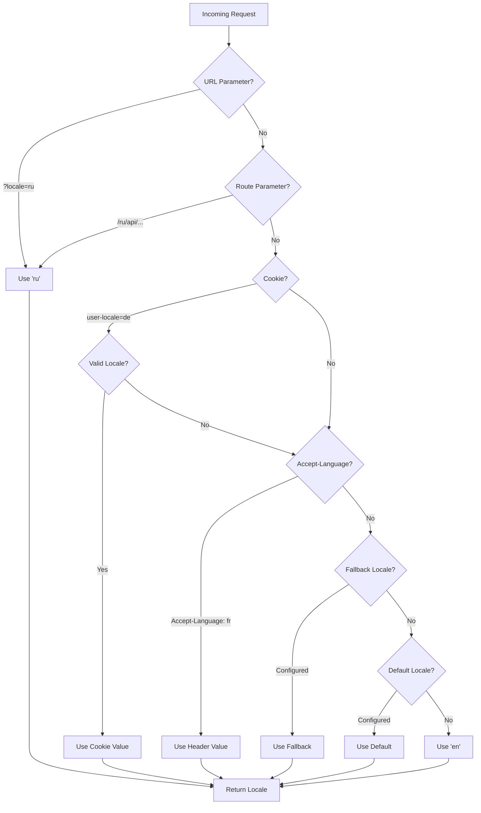

# 🌍 Servera puses tulkojumi un lokalizācijas informācija Nuxt I18n Micro

## 📖 Pārskats

Nuxt I18n Micro atbalsta servera puses tulkojumus un lokalizācijas informāciju, ļaujot tev tulkot saturu un piekļūt lokalizācijas detaļām serverī. Tas ir īpaši noderīgi API vai servera renderētām lietotnēm, kur lokalizācija ir nepieciešama, pirms tā sasniedz klientu.

Tulkojumi izmanto lokalizācijas ziņojumus, kas definēti Nuxt I18n konfigurācijā, un tiek dinamiski atrisināti, pamatojoties uz noteikto lokalizāciju.

Pēc noklusējuma (`translationPayloads.mode: 'premerged'`) saknes līmeņa faili tiek iesapludināti katrā lapas slodzē būvēšanas laikā kā `\{page\}/\{locale\}/data.json`. Serveris ielādē tos pašus iepriekš izveidotos failus, ko klients iegūst zem `/\{apiBaseUrl\}/...`, tāpēc visas atslēgas (gan koplietotās, gan lapām specifiskās) ir pieejamas servera apstrādātājos.

Ar `translationPayloads.mode: 'source'` kompakti avota faili tiek sapludināti izpildlaikā, kad tiek izsaukts `loadTranslationsFromServer()` (vai `/_locales` maršruts) — uz **Edge** caur Nitro `serverAssets`, uz **Node** no neobligātās publiskās kopijas. Detaļas skati [Veiktspējas ceļvedis — Serverless slodzes izvade](/guides/performance#serverless-payload-output) un [Kešatmiņas un krātuves arhitektūra](/api/cache).

Konsolidētu izpildlaika un servera API sarakstu skati [API atsaucē](/api/overview).

## 🛠️ Servera puses starpprogrammatūras iestatīšana

Lai iespējotu servera puses tulkojumus un lokalizācijas informāciju, izmanto nodrošinātās starpprogrammatūras funkcijas:

- `useTranslationServerMiddleware` — satura tulkošanai.
- `useLocaleServerMiddleware` — lokalizācijas informācijas piekļuvei.

Abas starpprogrammatūras funkcijas ir automātiski pieejamas visos servera maršrutos.

Lokalizācijas noteikšanas loģika tiek koplietota starp abām starpprogrammatūras funkcijām caur utilītas funkciju `detectCurrentLocale`, lai nodrošinātu konsekvenci visā modulī.

## ✨ Tulkojumu izmantošana servera apstrādātājos

Vari vienmērīgi tulkot saturu jebkurā `eventHandler`, izmantojot tulkošanas starpprogrammatūru.

### Piemērs: pamata tulkošanas lietojums

```typescript
import { defineEventHandler } from 'h3'

export default defineEventHandler(async (event) => {
  const t = await useTranslationServerMiddleware(event)
  return {
    message: t('greeting'), // Returns the translated value for the key "greeting"
  }
})
```

Šajā piemērā:

- Lietotāja lokalizācija tiek automātiski noteikta no vaicājuma parametriem, sīkdatnēm vai galvenēm.
- Funkcija `t` iegūst atbilstošo tulkojumu noteiktajai lokalizācijai.

## 🌍 Lokalizācijas informācijas izmantošana servera apstrādātājos

### Pamata lokalizācijas informācijas lietojums

```typescript
import { defineEventHandler } from 'h3'

export default defineEventHandler((event) => {
  const localeInfo = useLocaleServerMiddleware(event)

  return {
    success: true,
    data: localeInfo,
    timestamp: new Date().toISOString(),
  }
})
```

### Pielāgotu lokalizācijas parametru nodrošināšana

```typescript
import { defineEventHandler } from 'h3'

export default defineEventHandler((event) => {
  // Force specific locale with custom default
  const localeInfo = useLocaleServerMiddleware(event, 'en', 'ru')

  return {
    success: true,
    data: localeInfo,
    timestamp: new Date().toISOString(),
  }
})
```

### Atbildes struktūra

Lokalizācijas starpprogrammatūra atgriež `LocaleInfo` objektu ar šādām īpašībām:

```typescript
interface LocaleInfo {
  current: string // Current detected locale code
  default: string // Default locale code
  fallback: string // Fallback locale code
  available: string[] // Array of all available locale codes
  locale: Locale | null // Full locale configuration object
  isDefault: boolean // Whether current locale is the default
  isFallback: boolean // Whether current locale is the fallback
}
```

### Atbildes piemērs

```json
{
  "success": true,
  "data": {
    "current": "ru",
    "default": "en",
    "fallback": "en",
    "available": ["en", "ru", "de"],
    "locale": {
      "code": "ru",
      "iso": "ru-RU",
      "dir": "ltr",
      "displayName": "Русский"
    },
    "isDefault": false,
    "isFallback": false
  },
  "timestamp": "2024-01-15T10:30:00.000Z"
}
```

## 🌐 Pielāgotas lokalizācijas nodrošināšana

Ja tev nepieciešams manuāli norādīt lokalizāciju (piemēram, testēšanai vai noteiktiem pieprasījumiem), vari to nodot tulkošanas starpprogrammatūrai:

### Piemērs: pielāgota lokalizācija

```typescript
import { defineEventHandler } from 'h3'

function detectLocale(event): string | null {
  const urlSearchParams = new URLSearchParams(event.node.req.url?.split('?')[1])
  const localeFromQuery = urlSearchParams.get('locale')
  if (localeFromQuery) return localeFromQuery

  return 'en'
}

export default defineEventHandler(async (event) => {
  const t = await useTranslationServerMiddleware(event, 'en', detectLocale(event)) // Force French local, en - default locale
  return {
    message: t('welcome'), // Returns the French translation for "welcome"
  }
})
```

## 📋 Lokalizācijas noteikšanas loģika

Abas starpprogrammatūras funkcijas automātiski nosaka lietotāja lokalizāciju, izmantojot šādu prioritātes secību:



1. **URL parametri**: `?locale=ru`.
2. **Maršruta parametri**: `/ru/api/endpoint`.
3. **Sīkdatnes**: `user-locale` sīkdatne.
4. **HTTP galvenes**: `Accept-Language` galvene.
5. **Atkāpšanās lokalizācija**: kā konfigurēts moduļa opcijās.
6. **Noklusējuma lokalizācija**: kā konfigurēts moduļa opcijās.
7. **Cieti kodēta atkāpšanās**: `'en'`.

> **Piezīme**: lokalizācijas noteikšanas loģika tiek koplietota starp `useLocaleServerMiddleware` un `useTranslationServerMiddleware`, lai nodrošinātu konsekvenci visā modulī.

## 📋 Uzlabotu lietošanas piemēri

### Nosacīta atbilde, pamatojoties uz lokalizāciju

```typescript
import { defineEventHandler } from 'h3'

export default defineEventHandler((event) => {
  const { current, isDefault, locale } = useLocaleServerMiddleware(event)

  // Return different content based on locale
  if (current === 'ru') {
    return {
      message: 'Привет, мир!',
      locale: current,
      isDefault,
    }
  }

  if (current === 'de') {
    return {
      message: 'Hallo, Welt!',
      locale: current,
      isDefault,
    }
  }

  // Default English response
  return {
    message: 'Hello, World!',
    locale: current,
    isDefault,
  }
})
```

### Pielāgota lokalizācijas noteikšana

```typescript
import { defineEventHandler } from 'h3'

export default defineEventHandler((event) => {
  // Force German locale with English as fallback
  const { current, isDefault, locale } = useLocaleServerMiddleware(event, 'en', 'de')

  return {
    message: 'Hallo, Welt!',
    locale: current,
    isDefault: false, // Will be false since we forced German
  }
})
```

### Uz lokalizāciju vērsts API ar validāciju

```typescript
import { defineEventHandler, createError } from 'h3'

export default defineEventHandler((event) => {
  const { current, available, locale } = useLocaleServerMiddleware(event)

  // Validate if the detected locale is supported
  if (!available.includes(current)) {
    throw createError({
      statusCode: 400,
      statusMessage: `Unsupported locale: ${current}. Available locales: ${available.join(', ')}`,
    })
  }

  // Return locale-specific configuration
  return {
    locale: current,
    direction: locale?.dir || 'ltr',
    displayName: locale?.displayName || current,
    availableLocales: available,
  }
})
```

### Integrācija ar tulkošanas starpprogrammatūru

Vari apvienot lokalizācijas informāciju ar tulkošanas starpprogrammatūru, lai iegūtu visaptverošu internacionalizāciju:

```typescript
import { defineEventHandler } from 'h3'

export default defineEventHandler(async (event) => {
  const localeInfo = useLocaleServerMiddleware(event)
  const t = await useTranslationServerMiddleware(event)

  return {
    locale: localeInfo.current,
    message: t('welcome_message'),
    availableLocales: localeInfo.available,
    isDefault: localeInfo.isDefault,
  }
})
```

## 📝 Labākās prakses

1. **Vienmēr validē lokalizācijas**: pārbaudi, vai noteiktā lokalizācija ir tavā pieejamo lokalizāciju sarakstā.
2. **Izmanto atkāpšanās loģiku**: nodrošini saprātīgus noklusējumus, kad lokalizācijas noteikšana neizdodas.
3. **Kešo lokalizācijas informāciju**: veiktspējai kritiskām lietotnēm apsver iespēju kešot lokalizācijas noteikšanas rezultātus.
4. **Apstrādā robežgadījumus**: ņem vērā neatbalstītas lokalizācijas un nodrošini atbilstošas kļūdu atbildes.
5. **Apvieno ar tulkojumiem**: izmanto lokalizācijas informāciju kopā ar tulkošanas starpprogrammatūru pilnīgam i18n atbalstam.

## 🚀 Veiktspējas apsvērumi

- Abas starpprogrammatūras funkcijas ir vieglas un izstrādātas ātrai izpildei.
- Lokalizācijas noteikšana izmanto efektīvas atkāpšanās ķēdes.
- Lokalizācijas noteikšanas laikā netiek veikti ārējie API izsaukumi.
- Rezultāti tiek aprēķināti sinhroni optimālai veiktspējai.
