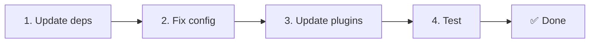

# 📦 Jaunināšana no v2.x uz v3.x

<Tip>
Skati [Migrāciju no nuxt-i18n](/migration/from-nuxtjs-i18n) — šis ceļvedis aptver pārvietošanos no vue-i18n ekosistēmas, nevis no nuxt-i18n-micro v2.
</Tip>

v3.0.0 ievieš fundamentālas arhitekturālas izmaiņas: stratēģiju paketes, jaunu kešošanas sistēmu, centralizētu lokalizācijas pārvaldību caur `useI18nLocale()` un pārveidotu pāradresācijas cauruļvadu. Šī sadaļa aptver visas būtiskās izmaiņas un to, kā atjaunināt savu kodu.

## Migrācijas soļi



## Būtisko izmaiņu kopsavilkums

- **Lokalizācijas stāvoklis** — `useState` / `useCookie` manuāli → `useI18nLocale()` kompozīts.
- **Konfigurācijas piekļuve** — `useRuntimeConfig().public.i18nConfig` → `getI18nConfig()` no `#build/i18n.strategy.mjs`.
- **Pāradresācijas komponents** — `fallbackRedirectComponentPath` opcija → servera pāradresācijas spraudnis + klienta maršruta starpprogrammatūra (automātiski).
- **`includeDefaultLocaleRoute`** — atbalstīts (novecojis) → noņemts, izmanto `strategy` opciju.
- **`experimental.hmr`** — zem `experimental` → saknes līmeņa opcija.
- **`previousPageFallback`** — pilnībā noņemts (kumulatīvās sapludināšanas stratēģija to apstrādā automātiski).
- **Kešošana** — `useStorage('cache')` → `TranslationStorage` singletons (`Symbol.for` uz `globalThis`).
- **SSR pārsūtīšana** — izpildlaika konfigurācija → Nuxt slodze (v3 izmantoja `useState`; daļas tagad atrodas `payload.data`, skati [Veiktspēju](/guides/performance#server-side-payload-transfer)).
- **Stratēģiju klases** — iekšējas → atsevišķas paketes (`@i18n-micro/route-strategy`, `@i18n-micro/path-strategy`).

## Noņemts: `fallbackRedirectComponentPath`

Opcija `fallbackRedirectComponentPath` un atkāpšanās komponents `locale-redirect.vue` ir noņemti. Pāradresācijas loģiku tagad apstrādā:

1. **Servera starpprogrammatūra** (`i18n.global.ts`) — iestata `event.context.i18n.locale`.
2. **Servera pāradresācijas spraudnis** (`06.redirect.ts`, tikai serveris) — 302 pāradresācijas pirms renderēšanas.
3. **Klienta maršruta starpprogrammatūra** (`i18n-redirect.global.ts`) — SPA pāradresācijas pēc hidratācijas.

```diff
 i18n: {
   strategy: 'prefix_except_default',
-  fallbackRedirectComponentPath: '~/components/MyRedirect.vue',
 }
```

Ja tev bija pielāgota pāradresācijas loģika atkāpšanās komponentā, tā vietā ievieto to servera spraudnī:

```ts
// plugins/i18n-loader.server.ts
export default defineNuxtPlugin({
  name: 'i18n-custom-redirect',
  enforce: 'pre',
  order: -10,
  setup() {
    const { setLocale } = useI18nLocale()
    // Your custom detection logic
    setLocale(detectedLocale)
  },
})
```

## Noņemts: `includeDefaultLocaleRoute`

Tā vietā izmanto `strategy` opciju:

- `includeDefaultLocaleRoute: true` → `strategy: 'prefix'`.
- `includeDefaultLocaleRoute: false` → `strategy: 'prefix_except_default'` (noklusējums).

```diff
 i18n: {
-  includeDefaultLocaleRoute: true,
+  strategy: 'prefix',
 }
```

## Konfigurācijas piekļuve: `getI18nConfig()` aizvieto `useRuntimeConfig`

```diff
- const config = useRuntimeConfig()
- const cookieName = config.public.i18nConfig?.localeCookie || 'user-locale'
+ import { getI18nConfig } from '#build/i18n.strategy.mjs'
+ const { localeCookie: configCookie } = getI18nConfig()
+ const cookieName = configCookie ?? 'user-locale'
```

## Lokalizācijas pārvaldība: `useI18nLocale()` aizvieto manuālo stāvokli

V2 tu, iespējams, izmantoji `useState('i18n-locale')` vai `useCookie('user-locale')` tieši. V3 izmanto centralizēto `useI18nLocale()` kompozītu:

```diff
- const locale = useState('i18n-locale')
- const cookie = useCookie('user-locale')
- locale.value = 'fr'
- cookie.value = 'fr'
+ const { setLocale } = useI18nLocale()
+ setLocale('fr') // Updates both state and cookie atomically
```

Detalizētus piemērus skati [Pielāgotā valodas noteikšanā](/guides/custom-language-detection).

## Eksperimentālās opcijas pārvietotas / noņemtas

`hmr` ir pārvietota no `experimental` uz saknes līmeni. `previousPageFallback` ir pilnībā noņemts — modulis tagad izmanto kumulatīvās dziļās sapludināšanas stratēģiju (2 līmeņu dziļumā), kas automātiski saglabā iepriekšējās lapas tulkojumus pārejas animāciju laikā, pat ja lapām ir pārklājošas ligzdotas atslēgas. Pēc pārejas animācijas pabeigšanas `page:transition:finish` āķis iztīra veco lapu atslēgas no atmiņas.

```diff
 i18n: {
-  experimental: {
-    hmr: true,
-    previousPageFallback: true
-  }
+  hmr: true,
+  // previousPageFallback removed — handled automatically
 }
```

## Pāradresācijas arhitektūra (v3)

Pāradresācijas tagad automātiski apstrādā divi komponenti:

1. **Servera pusē** (`06.redirect.ts`, tikai serveris): darbojas SSR laikā, izsniedz 302 pāradresācijas pirms jebkādas lapas renderēšanas — nav "kļūdas zibšņa".
2. **Klienta pusē** (`i18n-redirect.global.ts`): globālā maršruta starpprogrammatūra SPA navigācijā; saglabā vaicājuma virkni un hash.

Lokalizācijas prioritāte pāradresācijām:

1. `useState('i18n-locale')` — iestatīts caur `useI18nLocale().setLocale()`.
2. Sīkdatne — ja `localeCookie` ir konfigurēta.
3. `Accept-Language` galvene — ja `autoDetectLanguage: true`.
4. `defaultLocale` — atkāpšanās.

Standarta iestatījumiem koda izmaiņas nav nepieciešamas.

<Warning>
`prefix` un `prefix_except_default` stratēģijām ar `redirects: true` iestati `localeCookie: 'user-locale'`, lai iespējotu lokalizācijas noturību starp lapas atsvaidzināšanām. Bez tā pāradresācijas izmanto tikai `Accept-Language` vai `defaultLocale`.
</Warning>

## TypeScript: iekšējie moduļa tipi (neobligāti)

Ja saskaries ar tipa kļūdām, kas saistītas ar iekšējiem importiem, piemēram, `#i18n-internal/plural`, `#i18n-internal/strategy` vai `#i18n-internal/config`, pievieno `imports` sadaļu sava projekta `package.json`:

```json
{
  "imports": {
    "#i18n-internal/plural": "nuxt-i18n-micro/internals",
    "#i18n-internal/strategy": "nuxt-i18n-micro/internals",
    "#i18n-internal/config": "nuxt-i18n-micro/internals"
  }
}
```
