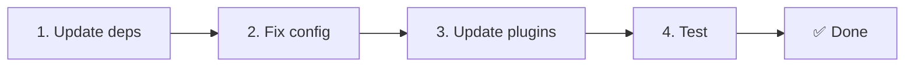

# 📦 Atjaunināšana no v2.x uz v3.x

<Tip>
Skatiet [Migrācija no nuxt-i18n](/migration/from-nuxtjs-i18n) — šis ceļvedis aptver pāreju no vue-i18n ekosistēmas, nevis no nuxt-i18n-micro v2.
</Tip>

v3.0.0 ievieš fundamentālas arhitektūras izmaiņas: stratēģiju pakotnes, jaunu kešošanas sistēmu, centralizētu lokāles pārvaldību caur `useI18nLocale()` un pārprojektētu pāradresācijas konveijeru. Šī sadaļa aptver visas lauzošās izmaiņas un to, kā atjaunināt savu kodu.

## Migrācijas soļi



## Lauzošo izmaiņu kopsavilkums

- **Lokāles stāvoklis** — `useState` / `useCookie` manuāli → `useI18nLocale()` komponējamā funkcija
- **Konfigurācijas piekļuve** — `useRuntimeConfig().public.i18nConfig` → `getI18nConfig()` no `#build/i18n.strategy.mjs`
- **Pāradresācijas komponents** — opcija `fallbackRedirectComponentPath` → servera pāradresācijas spraudnis + klienta maršruta starpprogrammatūra (automātiski)
- **`includeDefaultLocaleRoute`** — atbalstīts (novecojis) → noņemts, izmantojiet opciju `strategy`
- **`experimental.hmr`** — zem `experimental` → saknes līmeņa opcija
- **`previousPageFallback`** — pilnībā noņemts (kumulatīvās sapludināšanas stratēģija to apstrādā automātiski)
- **Kešošana** — `useStorage('cache')` → `TranslationStorage` singleton (`Symbol.for` uz `globalThis`)
- **SSR pārsūtīšana** — Runtime config → Nuxt payload (v3 izmantoja `useState`; gabali tagad atrodas `payload.data`, skatiet [Veiktspēja](/guides/performance#server-side-payload-transfer))
- **Stratēģijas klases** — iekšējas → atsevišķas pakotnes (`@i18n-micro/route-strategy`, `@i18n-micro/path-strategy`)

## Noņemts: `fallbackRedirectComponentPath`

Opcija `fallbackRedirectComponentPath` un rezerves komponents `locale-redirect.vue` ir noņemti. Pāradresācijas loģiku tagad apstrādā:

1. **Servera starpprogrammatūra** (`i18n.global.ts`) — iestata `event.context.i18n.locale`
2. **Servera pāradresācijas spraudnis** (`06.redirect.ts`, tikai serverī) — 302 pāradresācijas pirms renderēšanas
3. **Klienta maršruta starpprogrammatūra** (`i18n-redirect.global.ts`) — SPA pāradresācijas pēc hidratācijas

```diff
 i18n: {
   strategy: 'prefix_except_default',
-  fallbackRedirectComponentPath: '~/components/MyRedirect.vue',
 }
```

Ja jums bija pielāgota pāradresācijas loģika rezerves komponentā, tā vietā ieviesiet to servera spraudnī:

```ts
// plugins/i18n-loader.server.ts
export default defineNuxtPlugin({
  name: 'i18n-custom-redirect',
  enforce: 'pre',
  order: -10,
  setup() {
    const { setLocale } = useI18nLocale()
    // Your custom detection logic
    setLocale(detectedLocale)
  },
})
```

## Noņemts: `includeDefaultLocaleRoute`

Tā vietā izmantojiet opciju `strategy`:

- `includeDefaultLocaleRoute: true` → `strategy: 'prefix'`
- `includeDefaultLocaleRoute: false` → `strategy: 'prefix_except_default'` (noklusējums)

```diff
 i18n: {
-  includeDefaultLocaleRoute: true,
+  strategy: 'prefix',
 }
```

## Konfigurācijas piekļuve: `getI18nConfig()` aizvieto `useRuntimeConfig`

```diff
- const config = useRuntimeConfig()
- const cookieName = config.public.i18nConfig?.localeCookie || 'user-locale'
+ import { getI18nConfig } from '#build/i18n.strategy.mjs'
+ const { localeCookie: configCookie } = getI18nConfig()
+ const cookieName = configCookie ?? 'user-locale'
```

## Lokāles pārvaldība: `useI18nLocale()` aizvieto manuālo stāvokli

Versijā v2 jūs, iespējams, izmantojāt `useState('i18n-locale')` vai `useCookie('user-locale')` tieši. Versijā v3 izmantojiet centralizēto `useI18nLocale()` komponējamo funkciju:

```diff
- const locale = useState('i18n-locale')
- const cookie = useCookie('user-locale')
- locale.value = 'fr'
- cookie.value = 'fr'
+ const { setLocale } = useI18nLocale()
+ setLocale('fr') // Updates both state and cookie atomically
```

Detalizētus piemērus skatiet [Pielāgota valodas noteikšana](/guides/custom-language-detection).

## Eksperimentālās opcijas pārvietotas / noņemtas

`hmr` ir pārvietots no `experimental` uz saknes līmeni. `previousPageFallback` ir pilnībā noņemts — modulis tagad izmanto kumulatīvās dziļās sapludināšanas stratēģiju (2 līmeņu dziļumā), kas automātiski saglabā tulkojumus no iepriekšējās lapas pārejas animāciju laikā, pat kad lapām ir pārklājošas ligzdotas atslēgas. Pēc pārejas animācijas pabeigšanas hook `page:transition:finish` no atmiņas notīra vecās lapas atslēgas.

```diff
 i18n: {
-  experimental: {
-    hmr: true,
-    previousPageFallback: true
-  }
+  hmr: true,
+  // previousPageFallback removed — handled automatically
 }
```

## Pāradresāciju arhitektūra (v3)

Pāradresācijas tagad automātiski apstrādā divi komponenti:

1. **Servera puse** (`06.redirect.ts`, tikai serverī): darbojas SSR laikā, izdod 302 pāradresācijas pirms jebkādas lapas renderēšanas — nav “kļūdas uzplaiksnījuma”
2. **Klienta puse** (`i18n-redirect.global.ts`): globālā maršruta starpprogrammatūra SPA navigācijā; saglabā vaicājuma virkni un hash

Lokāles prioritāte pāradresācijām:

1. `useState('i18n-locale')` — iestatīts caur `useI18nLocale().setLocale()`
2. Sīkfails — ja `localeCookie` ir konfigurēts
3. `Accept-Language` galvene — ja `autoDetectLanguage: true`
4. `defaultLocale` — rezerves opcija

Standarta iestatījumiem koda izmaiņas nav nepieciešamas.

<Warning>
`prefix` un `prefix_except_default` stratēģijām ar `redirects: true` iestatiet `localeCookie: 'user-locale'`, lai iespējotu lokāles noturību starp lapas pārlādēm. Bez tā pāradresācijas izmanto tikai `Accept-Language` vai `defaultLocale`.
</Warning>

## TypeScript: iekšējie moduļa tipi (izvēles)

Ja saskaraties ar tipu kļūdām, kas saistītas ar iekšējiem importiem, piemēram, `#i18n-internal/plural`, `#i18n-internal/strategy` vai `#i18n-internal/config`, pievienojiet sadaļu `imports` sava projekta `package.json`:

```json
{
  "imports": {
    "#i18n-internal/plural": "nuxt-i18n-micro/internals",
    "#i18n-internal/strategy": "nuxt-i18n-micro/internals",
    "#i18n-internal/config": "nuxt-i18n-micro/internals"
  }
}
```

<Tip>

</Tip>
