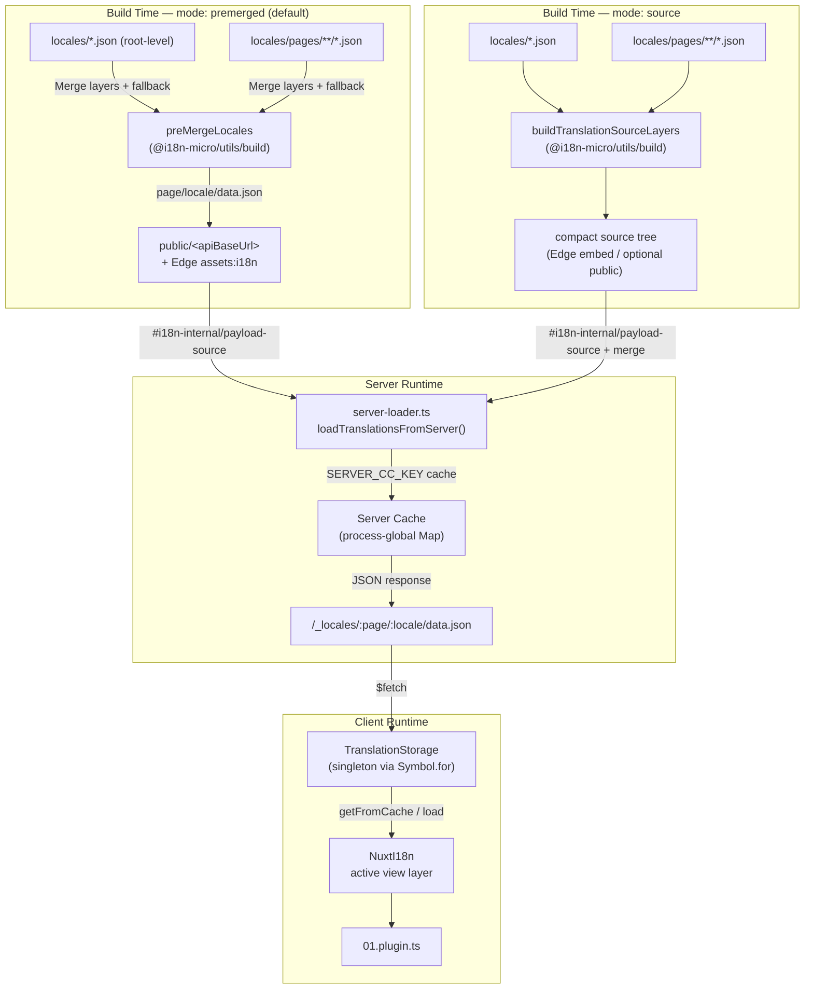

# 🗄️ Architectuur van vertaalcache en opslag

## 📖 Overzicht

Nuxt I18n Micro v3 gebruikt een gelaagde cache-architectuur voor vertalingen. Het laden van payloads hangt af van `translationPayloads.mode`:

- **`premerged`** (standaard) — root-, pagina-, fallback- en laagbestanden worden tijdens de build samengevoegd via `@i18n-micro/utils/build` tot `\{page\}/\{locale\}/data.json`.
- **`source`** — compacte bronbestanden worden bewaard voor runtime-samenvoeging via `@i18n-micro/utils/source-loader` en `@i18n-micro/utils/merge-source` (Edge sluit ze in in `serverAssets` van Nitro; Node leest ze uit `public/` wanneer gekopieerd).

Deze pagina beschrijft hoe de ingebouwde cache werkt en hoe je deze uitbreidt voor eigen use-cases (admin tools, externe API's, cache-invalidatie).

## 📊 Architectuuroverzicht

### Dataflow



## 🧱 Kerncomponenten

### 1. `TranslationStorage` (client + server)

**Bestand**: `src/runtime/utils/storage.ts`

Een singleton-klasse die uniforme vertaalopslag biedt voor zowel client als server. Gebruikt `Symbol.for('__NUXT_I18N_STORAGE_CACHE__')` op `globalThis` om ervoor te zorgen dat er slechts één instantie bestaat, zelfs wanneer meerdere bundels geladen zijn.

**Belangrijkste methoden:**

| Methode                             | Beschrijving                                                                    |
| ----------------------------------- | ------------------------------------------------------------------------------- |
| `getFromCache(locale, routeName?)`  | Synchrone controle: retourneert data uit de in-memory cache, of `null`          |
| `load(locale, routeName?, options)` | Asynchroon laden met caching: eerst cache, daarna ophalen via `$fetch`          |
| `clear()`                           | Wist de volledige cache                                                         |

**Cache-sleutelformaat**: `\{locale\}:\{routeName\}` (bijvoorbeeld `en:index`, `fr:about`)

```typescript
import { translationStorage } from '../utils/storage'

// Synchrone cachecontrole
const cached = translationStorage.getFromCache('en', 'index')

// Asynchroon laden (met automatische caching)
const result = await translationStorage.load('en', 'index', {
  apiBaseUrl: '_locales',
  baseURL: '/',
  dateBuild: '2024-01-01',
})
// result.data — samengevoegde vertalingen
// result.cacheKey — gebruikte cachesleutel
```

### ⚙️ Deterministische cache-busting (`i18n.dateBuild`)

Standaard genereert deze module `dateBuild` tijdens de build met `Date.now()`. De waarde wordt vervolgens in de gegenereerde `#build/i18n.strategy.mjs` ingebed en gebruikt als queryparameter (`?v=...`) om vertaal-fetchcaches na een rebuild te invalideren.

Wanneer je reproduceerbare builds nodig hebt (bijvoorbeeld om chunk-cache-hitratios bij rolling deployments te verbeteren), stel je een stabiele waarde in `nuxt.config` in:

```ts
export default defineNuxtConfig({
  i18n: {
    // Elke stabiele string of nummer (git SHA, CI build-nummer, release-tag, enzovoort)
    dateBuild: process.env.GIT_SHA ?? 'local-dev',
  },
})
```

### 2. `loadTranslationsFromServer()` (alleen server)

**Bestand**: `src/runtime/server/utils/server-loader.ts`

Laadt vertalingen voor een locale/pagina en cachet het samengevoegde resultaat in een process-globale `CacheControl`-map met sleutels uit `@i18n-micro/hmr/cache-keys` (`SERVER_CC_KEY`).

Gedrag: SSR laadt vanuit `#i18n-internal/payload-source` — **Node** gebruikt `readFile` onder `public/<apiBaseUrl>` (`\{page\}/\{locale\}/data.json` in premerged-modus), **Edge** gebruikt `assets:i18n`. `premerged` leest één bestand; `source` voegt root, pagina en fallback samen via `@i18n-micro/utils/source-loader`.

```typescript
import { loadTranslationsFromServer } from '../server/utils/server-loader'

// Retourneert { data: Translations, json: string }
const { data, json } = await loadTranslationsFromServer('en', 'index')
```

### 3. Client-side laden (geen HTML-embed)

Woordenboeken worden **niet** in `nuxtApp.payload` geschreven. De server houdt ze in het geheugen voor de SSR-render; de clientplugin `await`t `switchContext`, die `/\{apiBaseUrl\}/:page/:locale/data.json` laadt (dezelfde standaardhouding als `@nuxtjs/i18n` met `experimental.preload: false`).

`NuxtI18n` bevat het actieve view-layer-woordenboek dat wordt gebruikt door `$t()` en `$has()`. `NuxtTranslationLoader` wisselt de locale- en route-context en voegt chunks samen in die laag.

### 4. Server-API-route

**Route**: `/_locales/\{page\}/\{locale\}/data.json`

**Bestand**: `src/runtime/server/routes/i18n.ts`

Deze Nitro-route serveert samengevoegde vertalingen voor de actieve payload-modus. Hij roept `loadTranslationsFromServer()` aan en retourneert het resultaat als JSON.

In productie stelt hij ook in:

```http
Cache-Control: public, max-age={httpCacheDuration}, immutable
```

Standaard is `httpCacheDuration` `31536000` (1 jaar). Dit is veilig omdat clients payloads opvragen met `?v=\{dateBuild\}` als cachebusting. Stel `httpCacheDuration: 0` in om de header weg te laten. De header wordt niet toegepast tijdens ontwikkeling.

## 📥 Uitbreiden: aangepast laden van vertalingen

### Lezen uit cache (server-route)

```ts
// server/api/i18n/load-cache.[post].ts
import { defineEventHandler, readBody } from 'h3'
import { loadTranslationsFromServer } from '#imports'

export default defineEventHandler(async (event) => {
  const { page, locale } = await readBody<{ page: string; locale: string }>(event)
  const { data } = await loadTranslationsFromServer(locale, page)
  return { locale, page, data }
})
```

### Vertalingen bijwerken (bestand + cache invalideren)

```ts
// server/api/i18n/update.[post].ts
import { defineEventHandler, readBody, createError } from 'h3'
import { join } from 'node:path'
import { readFile, writeFile } from 'node:fs/promises'
import { deepMergeTranslations } from '@i18n-micro/utils/deep-merge'

export default defineEventHandler(async (event) => {
  const { path, updates } = await readBody<{ path: string; updates: Record<string, unknown> }>(event)

  if (!path || !updates) {
    throw createError({ statusCode: 400, statusMessage: 'Missing path or updates' })
  }

  const fullPath = join('locales', path)
  let existing: Record<string, unknown> = {}

  try {
    const content = await readFile(fullPath, 'utf-8')
    existing = JSON.parse(content) as Record<string, unknown>
  } catch {
    // Bestand bestaat niet — nieuw aanmaken
  }

  const merged = deepMergeTranslations(existing, updates)
  await writeFile(fullPath, JSON.stringify(merged, null, 2), 'utf-8')

  return { success: true, path, updated: merged }
})
```


## 🧹 Cache wissen

### Programmatisch cache wissen (client)

Gebruik de ingebouwde methode `$clearCache`:

```vue
<script setup>
const { $clearCache } = useNuxtApp()

// Wist zowel TranslationStorage als de plugin-cache
$clearCache()
</script>
```

### Servercache-gedrag

De server-side cache (`loadTranslationsFromServer`) is process-globaal en blijft bestaan totdat:

- Het serverproces opnieuw wordt gestart.
- Een nieuwe deployment wordt gedetecteerd (andere `dateBuild`-waarde).

Voor serverless-omgevingen heeft elke cold start een verse cache.

## ⚙️ Serverless-configuratie

Voor serverless-omgevingen (Cloudflare Workers, AWS Lambda) gebruikt de ingebouwde cache in-memory `Map`-objecten. Er is geen externe opslagconfiguratie nodig voor de vertaalcache zelf.

Nitro-opslag voor brontransvertaalbestanden kan echter configuratie vereisen:

```ts
export default defineNuxtConfig({
  nitro: {
    storage: {
      // Alleen nodig als de standaard filesystem-opslag niet beschikbaar is
      'assets:server': {
        driver: 'cloudflare-kv-binding',
        binding: 'MY_KV_NAMESPACE',
      },
    },
  },
})
```

## 💡 Belangrijkste verschillen met v2

| Aspect              | v2                                    | v3                                                                       |
| ------------------- | ------------------------------------- | ------------------------------------------------------------------------ |
| Client-cache        | `useStorage('cache')`                 | `TranslationStorage`-singleton (Symbol.for op globalThis)                |
| SSR-overdracht      | Runtime-config                        | Volledige chunks via `payload.data` (v3.0 gebruikte `useState`)          |
| Server-cache        | Nitro-cache-opslag                    | Process-globale `Map` via `Symbol.for`                                   |
| Samenvoeglogica     | Client-side                           | Build-time (`premerged`) of runtime (`source`) via `@i18n-micro/utils/*` |
| Cache-sleutelformaat | `i18n:merged:\{page\}:\{locale\}`         | `\{locale\}:\{routeName\}`                                                   |

## 📚 Gerelateerd

- [Performance-gids](/guides/performance) — Hoe caching de prestaties beïnvloedt
- [Server-side vertalingen](/guides/server-side-translations) — Vertalingen gebruiken in server-routes
- [Firebase-deployment](/guides/firebase) — Deployment-specifieke cache-overwegingen
