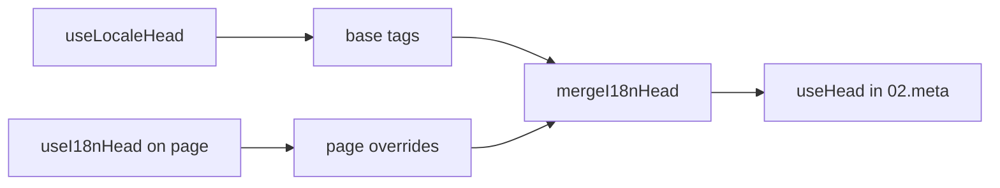

# `useI18nHead`-composable

Met `useI18nHead` pas je i18n-SEO-tags **per pagina** aan zonder een eigen meta-plugin. Wanneer `meta: true`, voegt de module jouw invoer samen bovenop de output van [`useLocaleHead`](/api/composables/use-locale-head).

Typische gevallen:

- **CMS- of blogartikelen** — slechts sommige locales zijn vertaald; alternatieve URL's verschillen per taal (andere slugs of paden).
- **Dynamische canonical** — de canonieke URL moet overeenkomen met de artikel-URL uit de API, niet met `$switchLocalePath`.
- **Extra Open Graph** — `og:title`, `og:description`, `og:image` naast automatisch gegenereerde `og:locale` en `og:url`.
- **Gedeeltelijke controle** — behoud de module-gegenereerde canonical en `og:url`, maar vervang alleen `hreflang` en `og:locale:alternate`.

---

## Signature

{/* generated:symbol:useI18nHead — do not edit; run `pnpm run docs:generate` */}

```ts
useI18nHead(input?: MaybeRefOrGetter<I18nHeadInput | null>): { pageHead: any; resetPageHead: () => void }
```

Registreer overrides op paginaniveau voor i18n-SEO-head-tags.
Wordt door de `02.meta`-plugin samengevoegd bovenop de output van `useLocaleHead`.

| Parameter | Type | Beschrijving |
| --- | --- | --- |
| `input` *(optioneel)* | `MaybeRefOrGetter<I18nHeadInput \| null>` |  |

{/* /generated:symbol:useI18nHead */}

## Hoe het in de pipeline past



Je roept `useI18nHead` aan in een paginacomponent. De `02.meta`-plugin past de overrides toe na elke `updateMeta()` (route-wijziging, `$setI18nRouteParams`, `page:finish` op de client).

---

## Voorbeeld 1 — Artikel met vertalingen in slechts sommige locales

Een veelvoorkomend patroon: de API retourneert welke locales bestaan en hun absolute of relatieve URL's.

```ts
interface Article {
  title: string
  slug: string
  /** Locale-code → pagina-URL (absoluut of site-relatief) */
  locales: Record<string, string>
}
```

```vue
<script setup lang="ts">
const route = useRoute()
const { data: article } = await useFetch<Article>(`/api/articles/${route.params.slug}`)

const localeCodes = computed(() => Object.keys(article.value?.locales ?? {}))

useI18nHead(() => {
  if (!article.value) return null

  return {
    meta: [
      { property: 'og:title', content: article.value.title },
      { property: 'og:type', content: 'article' },
    ],
    replace: {
      hreflang: localeCodes.value.map((locale) => ({
        rel: 'alternate',
        hreflang: locale,
        href: article.value!.locales[locale]!,
      })),
      ogAlternates: localeCodes.value,
    },
  }
})
</script>
```

`ogAlternates` neemt **locale-codes** uit je `i18n.locales`-configuratie. Waarden voor `og:locale:alternate` worden opgelost via `locale.og` of `iso` (Open Graph-formaat `en_US`).

---

## Voorbeeld 2 — Artikel met slugs per locale (`$defineI18nRoute` + `$setI18nRouteParams`)

Wanneer URL's worden opgebouwd uit gelokaliseerde routetemplates en dynamische parameters:

```vue
<script setup lang="ts">
const { $defineI18nRoute, $setI18nRouteParams } = useNuxtApp()
const route = useRoute()

const { data: article } = await useFetch(`/api/articles/${route.params.slug}`)

$defineI18nRoute({
  localeRoutes: {
    en: '/blog/[slug]',
    de: '/de/blog/[slug]',
    fr: '/fr/blog/[slug]',
  },
})

if (article.value) {
  $setI18nRouteParams({
    en: { slug: article.value.slugEn },
    de: { slug: article.value.slugDe },
    fr: { slug: article.value.slugFr },
  })

  const availableLocales = article.value.availableLocales as string[]

  useI18nHead({
    meta: [{ property: 'og:title', content: article.value.title }],
    replace: {
      hreflang: availableLocales.map((locale) => ({
        rel: 'alternate',
        hreflang: locale,
        href: article.value!.urls[locale],
      })),
      ogAlternates: availableLocales,
    },
  })
}
</script>
```

Door de module gegenereerde alternates zouden **alle** geconfigureerde locales opsommen. `replace.hreflang` beperkt tags tot locales die daadwerkelijk een vertaling hebben.

---

## Voorbeeld 3 — Aangepaste `x-default` voor de URL van het standaardlocale-artikel

Standaard verwijst `x-default` naar de URL van de standaardlocale via `$switchLocalePath`. Laat het voor artikelen wijzen naar de URL van de standaardvertaling:

```vue
<script setup lang="ts">
const { $defaultLocale } = useNuxtApp()
const article = await loadArticle()

const defaultLocale = $defaultLocale() ?? 'en'
const defaultHref = article.locales[defaultLocale]

useI18nHead({
  replace: {
    hreflang: Object.entries(article.locales).map(([locale, href]) => ({
      rel: 'alternate',
      hreflang: locale,
      href,
    })),
    xDefault: defaultHref ? { rel: 'alternate', hreflang: 'x-default', href: defaultHref } : false,
    ogAlternates: Object.keys(article.locales),
  },
})
</script>
```

---

## Voorbeeld 4 — Canonical en `og:url` vervangen uit API-data

Wanneer de canonical moet overeenkomen met een door het CMS geleverde URL (multi-domain, aangepast pad of vooraf opgebouwde absolute URL):

```vue
<script setup lang="ts">
const article = await loadArticle()
const canonical = article.canonicalUrl // bijv. https://www.example.com/en/blog/my-post

useI18nHead({
  replace: {
    canonical,
    ogUrl: canonical,
    hreflang: buildAlternateLinks(article),
    ogAlternates: Object.keys(article.locales),
  },
  meta: [
    { property: 'og:title', content: article.title },
    { name: 'description', content: article.excerpt },
  ],
})
</script>
```

---

## Voorbeeld 5 — Behoud automatische canonical en `og:url`, vervang alleen alternates

Als `$switchLocalePath` en `$setI18nRouteParams` al de juiste canonical en `og:url` produceren, vervang je alleen de discovery-tags:

```vue
<script setup lang="ts">
const article = await loadArticle()

useI18nHead({
  replace: {
    hreflang: buildAlternateLinks(article),
    ogAlternates: Object.keys(article.locales),
  },
})
</script>
```

---

## Voorbeeld 6 — Volledige head voor een contentdetailpagina (meta en links)

Patroon vergelijkbaar met het splitsen van "pagina-meta" en "alternate-links" in aparte helpers, hier gecombineerd in één aanroep:

```vue
<script setup lang="ts">
const article = await loadArticle()
const alternates = Object.entries(article.locales).map(([locale, href]) => ({
  rel: 'alternate' as const,
  hreflang: locale,
  href: normalizeSeoUrl(href), // verwijder indien nodig ?query en #hash
}))

useI18nHead({
  meta: [
    { property: 'og:title', content: article.title },
    { property: 'og:description', content: article.description },
    { property: 'og:image', content: article.imageUrl },
    { name: 'twitter:card', content: 'summary_large_image' },
    { name: 'twitter:title', content: article.title },
  ],
  replace: {
    canonical: article.canonicalUrl,
    ogUrl: article.canonicalUrl,
    hreflang: alternates,
    ogAlternates: Object.keys(article.locales),
  },
})
</script>
```

```ts
/** Verwijder query en hash. Handig wanneer CMS-URL's schoon moeten zijn voor SEO */
function normalizeSeoUrl(href: string): string {
  try {
    const url = new URL(href, 'https://placeholder.local')
    url.search = ''
    url.hash = ''
    return href.startsWith('http') ? url.href : `${url.pathname}`
  } catch {
    return href.split(/[?#]/)[0] ?? href
  }
}
```

---

## Voorbeeld 7 — Twee contenttypes, hetzelfde patroon (nieuws vs gidsen)

Zelfde API-vorm, andere routenamen. Hergebruik een kleine helper:

```ts
// composables/useArticleHead.ts
import type { I18nHeadInput } from '@i18n-micro/types'

interface LocalizedContent {
  title: string
  locales: Record<string, string>
  canonicalUrl?: string
}

export function buildArticleHead(content: LocalizedContent): I18nHeadInput {
  const localeCodes = Object.keys(content.locales)
  const canonical = content.canonicalUrl ?? content.locales.en

  return {
    meta: [{ property: 'og:title', content: content.title }],
    replace: {
      canonical,
      ogUrl: canonical,
      hreflang: localeCodes.map((locale) => ({
        rel: 'alternate',
        hreflang: locale,
        href: content.locales[locale]!,
      })),
      ogAlternates: localeCodes,
    },
  }
}
```

```vue
<!-- pages/blog/[slug].vue -->
<script setup lang="ts">
const article = await loadArticle()
useI18nHead(buildArticleHead(article))
</script>
```

```vue
<!-- pages/guides/[slug].vue -->
<script setup lang="ts">
const guide = await loadGuide()
useI18nHead(buildArticleHead(guide))
</script>
```

---

## Voorbeeld 8 — Ingebouwde alternates uitschakelen en je eigen lijst leveren

Equivalent aan het uitschakelen van de hreflang-generator van de module en het meegeven van een aangepaste lijst (geen dubbele alternate-sets):

```vue
<script setup lang="ts">
const article = await loadArticle()

useI18nHead({
  disable: ['hreflang', 'x-default', 'og-alternates'],
  link: Object.entries(article.locales).map(([locale, href]) => ({
    rel: 'alternate',
    hreflang: locale,
    href,
  })),
  replace: {
    ogAlternates: Object.keys(article.locales),
  },
})
</script>
```

Of geef de voorkeur aan `replace.hreflang` zonder `disable` — dit vervangt alle `rel="alternate"`-links in één stap.

---

## Voorbeeld 9 — Landingspagina: alleen extra OG, alle i18n-tags behouden

```vue
<script setup lang="ts">
const { t } = useI18n()

useI18nHead({
  meta: [
    { property: 'og:title', content: t('landing.ogTitle') },
    { property: 'og:description', content: t('landing.ogDescription') },
  ],
})
</script>
```

---

## Voorbeeld 10 — Productpagina: hreflang uitschakelen voor een experiment met één locale

```vue
<script setup lang="ts">
useI18nHead({
  disable: ['hreflang', 'x-default'],
  // canonical, og:locale en og:url worden nog steeds gegenereerd
})
</script>
```

---

## Voorbeeld 11 — Reactieve updates na een client-side fetch

```vue
<script setup lang="ts">
const article = ref<Article | null>(null)

onMounted(async () => {
  article.value = await $fetch('/api/articles/latest')
})

useI18nHead(() => {
  if (!article.value) return null
  return {
    meta: [{ property: 'og:title', content: article.value.title }],
    replace: {
      hreflang: Object.entries(article.value.locales).map(([locale, href]) => ({
        rel: 'alternate',
        hreflang: locale,
        href,
      })),
    },
  }
})
</script>
```

De head wordt vernieuwd bij `page:finish` en wanneer de state van `pageHead` verandert.

---

## Voorbeeld 12 — HTTPS-origin achter een reverse proxy

Als je eerder een composable met "publieke origin" oploste voor absolute canonical- en alternate-URL's, gebruik dan in plaats daarvan de moduleconfiguratie:

```ts
// nuxt.config.ts
export default defineNuxtConfig({
  i18n: {
    meta: true,
    // undefined = origin uit de huidige request (geschikt voor multi-domain)
    metaBaseUrl: undefined,
    metaTrustForwardedHost: true,
    metaTrustForwardedProto: true,
  },
})
```

Geef vervolgens **paden of volledige URL's** door in `replace.hreflang` en `replace.canonical`. De module gebruikt `useRequestURL` met `X-Forwarded-Host` en `X-Forwarded-Proto` op SSR.

---

## API-referentie

### `meta`

Extra `<meta>`-tags. Ontdubbeld op `id`, `property` of `name`.

### `link`

Extra `<link>`-tags. Ontdubbeld op `id` of `rel` + `hreflang`.

### `htmlAttrs`

Samengevoegd met `<html>`-attributen uit `useLocaleHead` (`lang`, `dir`).

### `replace`

| Sleutel        | Type                      | Effect                                             |
| -------------- | ------------------------- | -------------------------------------------------- |
| `canonical`    | `string \| false`         | Vervang of verwijder de canonieke link             |
| `hreflang`     | `I18nHeadLink[] \| false` | Vervang of verwijder alle `rel="alternate"`-links  |
| `xDefault`     | `I18nHeadLink \| false`   | Vervang of verwijder `hreflang="x-default"`        |
| `ogLocale`     | `string \| false`         | Vervang of verwijder `og:locale`                   |
| `ogUrl`        | `string \| false`         | Vervang of verwijder `og:url`                      |
| `ogAlternates` | `string[] \| false`       | Herbouw `og:locale:alternate` voor de locale-codes |

### `disable`

| Waarde          | Verwijdert                                     |
| --------------- | ---------------------------------------------- |
| `hreflang`      | Locale-alternate-links (niet `x-default`)      |
| `x-default`     | `hreflang="x-default"`-link                    |
| `canonical`     | Canonieke link                                 |
| `og`            | `og:locale` en `og:url`                        |
| `og-alternates` | `og:locale:alternate`-tags                     |
| `html`          | `lang` en `dir` op `<html>`                    |

---

## `useLocaleHead` vs. `useI18nHead`

| Composable      | Scope                    | Wanneer te gebruiken                          |
| --------------- | ------------------------ | --------------------------------------------- |
| `useLocaleHead` | Globaal / handmatige head| `meta: false`, volledige eigen `useHead`-setup |
| `useI18nHead`   | Overrides per pagina     | `meta: true`, specifieke pagina's aanpassen   |

Wanneer `meta: true`, heb je op pagina's die alleen `useI18nHead` gebruiken **niet** `useLocaleHead` nodig.

---

## Migreren vanaf een aangepaste i18n-head-plugin

Veel projecten hebben een aangepaste plugin die:

- paginaspecifieke alternate-links uit gedeelde state samenvoegt;
- dubbele regionale `hreflang`-invoer filtert;
- `og:locale`-waarden normaliseert;
- querystrings uit SEO-URL's verwijdert.

Je kunt dat vervangen door `useI18nHead` op elke contentpagina plus de standaardwaarden van de module.

| Vorige aanpak                                                | Met `useI18nHead`                                          |
| ------------------------------------------------------------ | ---------------------------------------------------------- |
| Gedeelde state + "welke locales bestaan voor dit artikel"    | `replace: \{ ogAlternates: localeCodes \}`                   |
| Aparte helper die `rel="alternate"`-links opbouwt            | `replace: \{ hreflang: links \}`                             |
| Aangepaste plugin die pagina-state in head samenvoegt        | Ingebouwde samenvoeging in `02.meta`                       |
| Aangepaste "public origin" voor absolute URL's               | `metaBaseUrl` + forwarded headers (zie Voorbeeld 12)       |
| Korte `og:locale` (`en` in plaats van `en_US`)               | Stel `locale.og` in of gebruik `iso` → `en_US` (OG-protocol) |

**`hreflang` uit `iso`:** elke locale zendt één alternate uit met `hreflang = iso || code`. De routing-`code` wordt nooit gebruikt wanneer `iso` is ingesteld (dit voorkomt ongeldige tags zoals `hreflang="mx"`). Kies voor kale-taalfallbacks (`es-ES` → ook `es`) met `hreflangBaseLanguage: true` — afgeleid van `iso`, niet van `code`. Gebruik `replace.hreflang` voor volledig aangepaste lijsten.

**JSON-LD:** `useI18nHead` genereert geen gestructureerde data. Behoud `useHead(\{ script: [...] \})` of een aparte JSON-LD-helper ernaast.

---

## Zie ook

- [SEO-gids](/guides/seo) — automatische metagenering en overrides op paginaniveau
- [`useLocaleHead`](/api/composables/use-locale-head) — low-level head-API
