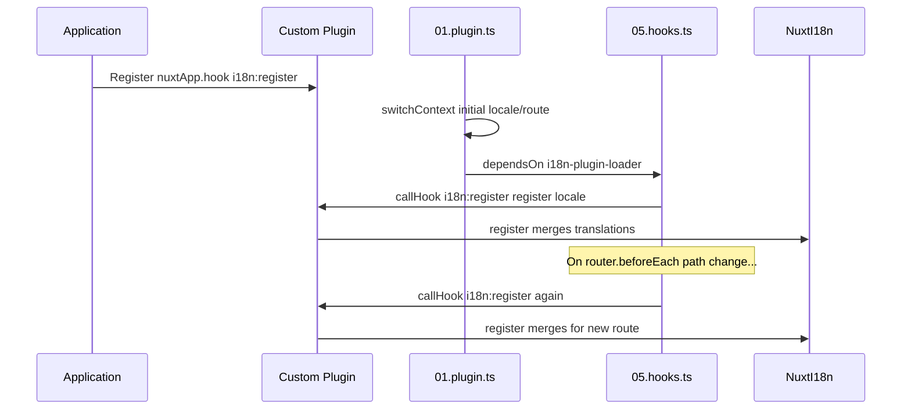

# 📢 Events

## 🔄 `i18n:register`

Met het `i18n:register`-event in `Nuxt I18n Micro` kun je dynamisch vertalingen toevoegen aan de i18n-context van je applicatie, wat het internationalisatieproces naadloos en flexibel maakt. Dit event stelt je in staat om nieuwe vertalingen te integreren waar nodig, wat de lokalisatiemogelijkheden van je applicatie verbetert.

### 📝 Eventdetails

- **Doel**:
  - Maakt dynamische opname van aanvullende vertalingen mogelijk in de bestaande set voor een specifieke locale.

- **Payload**:
  - **`register`**:
    - Een functie die door het event wordt geleverd en twee argumenten aanneemt:
      - **`translations`** (`Translations`):
        - Een object dat sleutel-waarde-paren bevat die vertalingen vertegenwoordigen, georganiseerd volgens de `Translations`-interface.
      - **`locale`** (`string`, optioneel):
        - De localecode (bijv. `'en'`, `'ru'`) waarvoor de vertalingen worden geregistreerd. Standaard de locale die het event levert als deze niet is opgegeven.

- **Gedrag**:
  - Wanneer geactiveerd, voegt de `register`-functie de nieuwe vertalingen samen in de huidige context voor de opgegeven locale, waarbij de beschikbare vertalingen in de hele applicatie worden bijgewerkt.

### ⏱️ Wanneer het vuurt

De hooks-plugin van de module (`05.hooks.ts`, `dependsOn: ['i18n-plugin-loader']`) roept `nuxtApp.callHook('i18n:register', …)` aan:

1. **Eenmalig bij het opstarten** — nadat de hoofdplugin voor i18n (`01.plugin.ts`) vertalingen voor de initiële route heeft geladen
2. **Bij navigatie** — in `router.beforeEach` wanneer het pad verandert, of bij elke navigatie wanneer `strategy: 'no_prefix'`

Registreer je listener in een normale Nuxt-plugin met `nuxtApp.hook('i18n:register', …)`. De hooks-plugin draait nadat de loader klaar is, dus je callback wordt aangeroepen wanneer vertalingen moeten worden uitgebreid.

Stel `hooks: false` in `nuxt.config` in om automatische `i18n:register`-aanroepen uit te schakelen (zie [Configuratie — `hooks`](/guides/configuration#hooks)).

### 💡 Voorbeeldgebruik

Het volgende voorbeeld laat zien hoe je het `i18n:register`-event kunt gebruiken om dynamisch vertalingen toe te voegen:

```typescript
nuxt.hook('i18n:register', async (register: (translations: unknown, locale?: string) => void, locale: string) => {
  register(
    {
      greeting: 'Hello',
      farewell: 'Goodbye',
    },
    locale,
  )
})
```

### 🛠️ Uitleg



- **Het event triggeren**:
  - De hooks-plugin (`05.hooks.ts`) vuurt `i18n:register` af nadat de hoofd-loader klaar is en bij relevante navigaties.

- **Vertalingen toevoegen**:
  - Het voorbeeld registreert Engelse vertalingen voor `"greeting"` en `"farewell"`.
  - De `register`-functie voegt deze vertalingen samen in de bestaande set voor de opgegeven locale.

### 🔗 Belangrijkste voordelen

- **Dynamische updates**:
  - Werk vertalingen eenvoudig bij of voeg ze toe zonder je hele applicatie opnieuw te hoeven deployen.

- **Lokalisatieflexibiliteit**:
  - Ondersteunt real-time lokalisatie-aanpassingen op basis van gebruikers- of applicatiebehoeften.

Door het `i18n:register`-event te gebruiken, kun je ervoor zorgen dat de lokalisatiestrategie van je applicatie flexibel en aanpasbaar blijft, wat de algehele gebruikerservaring verbetert.

---

## 🛠️ Vertalingen wijzigen met plugins

Om vertalingen dynamisch te wijzigen in je Nuxt-applicatie is het aanbevolen om plugins te gebruiken. Plugins bieden een gestructureerde manier om lokalisatie-updates af te handelen, vooral bij het werken met modules of externe vertaalbestanden.

### **De plugin registreren**

Als je een module gebruikt, registreer dan de plugin waar vertaalwijzigingen plaatsvinden door deze toe te voegen aan de configuratie van je module:

```javascript
addPlugin({
  src: resolve('./plugins/extend_locales'),
})
```

Dit registreert de plugin die zich bevindt in `./plugins/extend_locales`, die het dynamisch laden en registreren van vertalingen zal afhandelen.

### **De plugin implementeren**

In de plugin kun je locale-wijzigingen beheren. Hier is een voorbeeldimplementatie in een Nuxt-plugin:

```typescript
import { defineNuxtPlugin } from '#app'

export default defineNuxtPlugin(async (nuxtApp) => {
  // Function to load translations from JSON files and register them
  const loadTranslations = async (lang: string) => {
    try {
      const translations = await import(`../locales/${lang}.json`)
      return translations.default
    } catch (error) {
      console.error(`Error loading translations for language: ${lang}`, error)
      return null
    }
  }

  // Hook into the 'i18n:register' event to dynamically add translations
  // eslint-disable-next-line @typescript-eslint/ban-ts-comment
  // @ts-expect-error
  nuxtApp.hook('i18n:register', async (register: (translations: unknown, locale?: string) => void, locale: string) => {
    const translations = await loadTranslations(locale)
    if (translations) {
      register(translations, locale)
    }
  })
})
```

### 📝 Gedetailleerde uitleg

1. **Vertalingen laden**:

- De functie `loadTranslations` importeert dynamisch vertaalbestanden op basis van de locale. De bestanden worden verwacht in de `locales`-map en worden benoemd volgens de localecodes (bijv. `en.json`, `de.json`).
- Bij een geslaagde laadbeurt worden vertalingen geretourneerd; anders wordt er een fout gelogd.

2. **Vertalingen registreren**:

- De plugin haakt in op het `i18n:register`-event via `nuxtApp.hook`.
- Wanneer het event wordt geactiveerd, wordt de functie `register` aangeroepen met de geladen vertalingen en de bijbehorende locale.
- Dit voegt de nieuwe vertalingen samen in de i18n-context voor de opgegeven locale, waardoor de beschikbare vertalingen in de hele applicatie worden bijgewerkt.

### 🔗 Voordelen van plugins gebruiken voor vertaalwijzigingen

- **Scheiding van verantwoordelijkheden**:
  - Kapseling van lokalisatielogica los van de hoofdapplicatiecode, waardoor beheer en onderhoud eenvoudiger worden.

- **Dynamisch en schaalbaar**:
  - Door vertalingen dynamisch te laden en te registreren, kun je content bijwerken zonder een volledige applicatiedeployment, wat vooral handig is voor applicaties met vaak bijgewerkte of meertalige content.

- **Verbeterde lokalisatieflexibiliteit**:
  - Plugins stellen je in staat om vertalingen naar behoefte te wijzigen of uit te breiden, wat een meer aanpasbare en responsieve lokalisatiestrategie biedt die voldoet aan gebruikersvoorkeuren of bedrijfsvereisten.

Door deze aanpak te volgen, kun je efficiënt de lokalisatie van je applicatie uitbreiden en wijzigen via een gestructureerd en onderhoudbaar proces met plugins, waarbij internationalisatie zich blijft aanpassen aan veranderende behoeften en de algehele gebruikerservaring verbetert.
