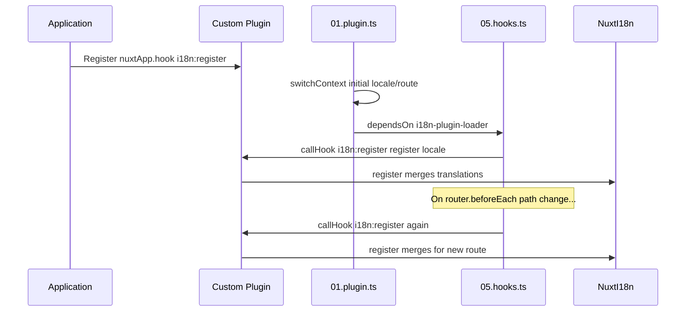

# 📢 Events

## 🔄 `i18n:register`

Het `i18n:register`-event in `Nuxt I18n Micro` maakt het dynamisch toevoegen van vertalingen aan de i18n-context van je applicatie mogelijk, waardoor het internationalisatieproces naadloos en flexibel wordt. Met dit event kun je nieuwe vertalingen integreren wanneer dat nodig is en zo de lokalisatiemogelijkheden van je applicatie versterken.

### 📝 Event-details

- **Doel**:
  - Maakt dynamische opname van extra vertalingen in de bestaande set voor een specifieke locale mogelijk.

- **Payload**:
  - **`register`**:
    - Een functie die door het event wordt geleverd en twee argumenten neemt:
      - **`translations`** (`Translations`):
        - Een object met sleutel-waardeparen die vertalingen vertegenwoordigen, georganiseerd volgens de `Translations`-interface.
      - **`locale`** (`string`, optioneel):
        - De locale-code (bijvoorbeeld `'en'`, `'ru'`) waarvoor de vertalingen worden geregistreerd. Valt terug op de locale die het event levert wanneer niet opgegeven.

- **Gedrag**:
  - Wanneer geactiveerd, voegt de `register`-functie de nieuwe vertalingen samen met de huidige context voor de opgegeven locale en werkt zij de beschikbare vertalingen in de hele applicatie bij.

### ⏱️ Wanneer het event afgaat

De hooks-plugin van de module (`05.hooks.ts`, `dependsOn: ['i18n-plugin-loader']`) roept `nuxtApp.callHook('i18n:register', …)` aan:

1. **Eenmaal bij opstarten** — nadat de hoofd-i18n-plugin (`01.plugin.ts`) vertalingen voor de initiële route heeft geladen.
2. **Bij navigatie** — in `router.beforeEach` wanneer het pad verandert, of bij elke navigatie wanneer `strategy: 'no_prefix'`.

Registreer je listener in een gewone Nuxt-plugin met `nuxtApp.hook('i18n:register', …)`. De hooks-plugin draait pas nadat de loader gereed is, dus je callback wordt aangeroepen wanneer vertalingen moeten worden uitgebreid.

Stel `hooks: false` in `nuxt.config` om automatische `i18n:register`-aanroepen uit te schakelen (zie [Configuratie — `hooks`](/guides/configuration#hooks)).

### 💡 Voorbeeldgebruik

Het volgende voorbeeld laat zien hoe je het `i18n:register`-event gebruikt om dynamisch vertalingen toe te voegen:

```typescript
nuxt.hook('i18n:register', async (register: (translations: unknown, locale?: string) => void, locale: string) => {
  register(
    {
      greeting: 'Hello',
      farewell: 'Goodbye',
    },
    locale,
  )
})
```

### 🛠️ Uitleg



- **Het event activeren**:
  - De hooks-plugin (`05.hooks.ts`) vuurt `i18n:register` af nadat de hoofdloader gereed is en op relevante navigaties.

- **Vertalingen toevoegen**:
  - Het voorbeeld registreert Engelse vertalingen voor `"greeting"` en `"farewell"`.
  - De `register`-functie voegt deze vertalingen samen met de bestaande set voor de opgegeven locale.

### 🔗 Belangrijkste voordelen

- **Dynamische updates**:
  - Werk vertalingen eenvoudig bij of voeg ze toe zonder je hele applicatie opnieuw te hoeven deployen.

- **Lokalisatieflexibiliteit**:
  - Ondersteunt real-time aanpassingen aan de lokalisatie op basis van gebruikers- of applicatiebehoeften.

Door het `i18n:register`-event te gebruiken, blijft de lokalisatiestrategie van je applicatie flexibel en aanpasbaar, wat de algehele gebruikerservaring verbetert.

---

## 🛠️ Vertalingen aanpassen met plugins

Gebruik plugins om vertalingen dynamisch aan te passen in je Nuxt-applicatie. Plugins bieden een gestructureerde manier om lokalisatie-updates af te handelen, vooral bij het werken met modules of externe vertaalbestanden.

### **De plugin registreren**

Als je een module gebruikt, registreer je de plugin waarin de vertaalaanpassingen plaatsvinden door deze aan de moduleconfiguratie toe te voegen:

```javascript
addPlugin({
  src: resolve('./plugins/extend_locales'),
})
```

Dit registreert de plugin die zich in `./plugins/extend_locales` bevindt. Die plugin verzorgt het dynamisch laden en registreren van vertalingen.

### **De plugin implementeren**

In de plugin kun je locale-aanpassingen beheren. Hier is een voorbeeldimplementatie in een Nuxt-plugin:

```typescript
import { defineNuxtPlugin } from '#app'

export default defineNuxtPlugin(async (nuxtApp) => {
  // Functie om vertalingen uit JSON-bestanden te laden en te registreren
  const loadTranslations = async (lang: string) => {
    try {
      const translations = await import(`../locales/${lang}.json`)
      return translations.default
    } catch (error) {
      console.error(`Error loading translations for language: ${lang}`, error)
      return null
    }
  }

  // Haak in op het 'i18n:register'-event om dynamisch vertalingen toe te voegen
  // eslint-disable-next-line @typescript-eslint/ban-ts-comment
  // @ts-expect-error
  nuxtApp.hook('i18n:register', async (register: (translations: unknown, locale?: string) => void, locale: string) => {
    const translations = await loadTranslations(locale)
    if (translations) {
      register(translations, locale)
    }
  })
})
```

### 📝 Gedetailleerde uitleg

1. **Vertalingen laden**:

- De functie `loadTranslations` importeert vertaalbestanden dynamisch op basis van de locale. De bestanden staan in de map `locales` en zijn benoemd naar de locale-codes (bijvoorbeeld `en.json`, `de.json`).
- Bij een succesvolle load worden de vertalingen geretourneerd; anders wordt een fout gelogd.

2. **Vertalingen registreren**:

- De plugin haakt in op het `i18n:register`-event via `nuxtApp.hook`.
- Wanneer het event afgaat, wordt de `register`-functie aangeroepen met de geladen vertalingen en de bijbehorende locale.
- Dit voegt de nieuwe vertalingen samen met de i18n-context voor de opgegeven locale en werkt de beschikbare vertalingen in de hele applicatie bij.

### 🔗 Voordelen van plugins voor vertaalaanpassingen

- **Scheiding van verantwoordelijkheden**:
  - Kapsel de lokalisatielogica los van de hoofdcode van de applicatie in, waardoor beheer en onderhoud eenvoudiger worden.

- **Dynamisch en schaalbaar**:
  - Door dynamisch vertalingen te laden en te registreren, kun je content bijwerken zonder de hele applicatie opnieuw te hoeven deployen. Dit is vooral nuttig voor applicaties met vaak bijgewerkte of meertalige content.

- **Grotere lokalisatieflexibiliteit**:
  - Plugins laten je vertalingen naar behoefte aanpassen of uitbreiden, wat een responsievere lokalisatiestrategie oplevert die aansluit bij gebruikersvoorkeuren of bedrijfseisen.

Door deze aanpak kun je de lokalisatie van je applicatie efficiënt uitbreiden en aanpassen met een gestructureerd en onderhoudbaar proces via plugins. Zo blijft internationalisatie inspelen op veranderende behoeften en verbeter je de algehele gebruikerservaring.
