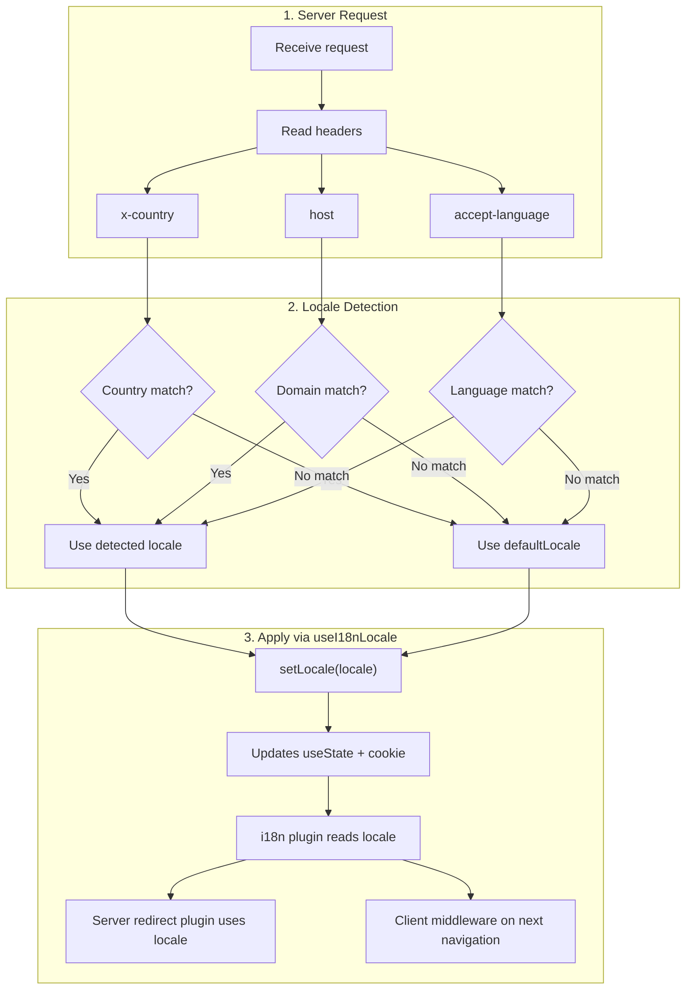

# 🔧 Aangepaste taaldetectie in Nuxt I18n Micro

## 📖 Overzicht

Nuxt I18n Micro v3 biedt een centrale composable — `useI18nLocale()` — voor al het localebeheer. Dit vervangt de handmatige `useState`/`useCookie`-patronen uit v2. Door `useI18nLocale().setLocale()` te gebruiken in een serverplugin kun je elke aangepaste detectielogica implementeren en tegelijkertijd volledige compatibiliteit met de redirect- en cookiesystemen van de module behouden.

## 🏗️ Architectuur

```mermaid
flowchart TB
    subgraph Plugins["Plugin Execution Order"]
        A["Your plugin<br/>order: -10"] -->|setLocale()| B["01.plugin.ts<br/>order: -5"]
        B --> C["06.redirect.ts server<br/>order: 10"]
    end

    subgraph Client["Client SPA Navigation"]
        D["i18n-redirect.global.ts<br/>route middleware"]
    end

    subgraph State["Locale State"]
        E["useState('i18n-locale')"]
        F["localeCookie"]
    end

    A -->|"setLocale() updates both"| E
    A -->|"setLocale() updates both"| F
    B -->|reads| E
    C -->|reads| E
    C -->|reads| F
    D -->|reads target route +| E
```

**Kernprincipe**: Roep `useI18nLocale().setLocale()` aan in een serverplugin met `order: -10`. Dit werkt zowel `useState('i18n-locale')` als de locale-cookie atomair bij, zodat de i18n-plugin (`order: -5`) en de server-redirectplugin (`order: 10`) de juiste locale zien bij het eerste SSR-verzoek. Client-side auto-redirects draaien bij volgende navigaties in de globale route-middleware.

## 🛠️ Ingebouwde auto-detectie uitschakelen

Als je volledige controle wilt over locale-detectie, schakel dan het ingebouwde mechanisme uit:

```ts
export default defineNuxtConfig({
  i18n: {
    autoDetectLanguage: false,
  },
})
```

## ✨ Voorbeeld: server-side detectie met `useI18nLocale`

Dit is de **aanbevolen aanpak** voor alle strategieën.

### Stap 1: configureer `nuxt.config.ts`

```ts
export default defineNuxtConfig({
  modules: ['nuxt-i18n-micro'],
  i18n: {
    strategy: 'no_prefix', // Works with ANY strategy
    defaultLocale: 'en',
    localeCookie: 'user-locale',
    autoDetectLanguage: false,
    locales: [
      { code: 'en', iso: 'en-US' },
      { code: 'de', iso: 'de-DE' },
      { code: 'ja', iso: 'ja-JP' },
    ],
  },
})
```

### Stap 2: maak `plugins/i18n-loader.server.ts`

```ts
import { defineNuxtPlugin, useRequestHeaders } from '#imports'

export default defineNuxtPlugin({
  name: 'i18n-custom-loader',
  enforce: 'pre',
  order: -10, // Execute BEFORE the i18n plugin (which has order -5)

  setup() {
    const { setLocale } = useI18nLocale()
    const headers = useRequestHeaders(['host', 'x-country', 'accept-language'])
    let detectedLocale = 'en'

    // --- YOUR DETECTION LOGIC ---

    // Example 1: By domain
    const host = headers['host']
    if (host?.includes('example.de')) {
      detectedLocale = 'de'
    }
    // Example 2: By custom header
    else if (headers['x-country'] === 'JP') {
      detectedLocale = 'ja'
    }
    // Example 3: By Accept-Language header
    else if (headers['accept-language']?.includes('de')) {
      detectedLocale = 'de'
    }

    // --- APPLY THE LOCALE ---
    setLocale(detectedLocale)
  },
})
```

### Hoe het werkt



1. **Plugin draait eerst** (`order: -10`) — detecteert locale uit headers, domein of andere bronnen
2. **`setLocale()` werkt beide bij**: `useState('i18n-locale')` en cookie — zorgt voor onmiddellijke zichtbaarheid voor alle volgende plugins
3. **i18n-plugin** (`order: -5`) leest de locale en laadt de juiste vertalingen
4. **Server-redirectplugin** (`order: 10`) gebruikt de locale voor redirect-beslissingen bij SSR
5. **Client route-middleware** (`i18n-redirect`) past redirects toe bij SPA-navigatie wanneer de URL-locale niet overeenkomt met de voorkeur

## 🌐 Strategie-specifiek gedrag

`useI18nLocale().setLocale()` werkt met **alle strategieën**. Het redirect-gedrag hangt af van de strategie:

<Tip>
| Strategie | Effect van `setLocale('de')` |
|----------|---------------------------|
| `no_prefix` | Rendert in het Duits, geen URL-wijziging |
| `prefix` | 302 → `/de/` (server-side redirect) |
| `prefix_except_default` | 302 → `/de/` als `de` ≠ standaard; geen redirect als `de` = standaard |
| `prefix_and_default` | Geen redirect (zowel `/` als `/de/` zijn geldig) |
</Tip>

**Belangrijke opmerkingen:**

- Cookiegebaseerde localedetectie is standaard uitgeschakeld (`localeCookie: null`)
- Stel `localeCookie: 'user-locale'` in om cookiepersistentie in te schakelen
- Als de cookie-/statewaarde niet in de `locales`-lijst staat, wordt teruggevallen op `defaultLocale`

## 🏢 Geavanceerd: domeinbasis-detectie

Voor multi-domein-opzetten waar elk domein een andere locale bedient:

```ts
import { defineNuxtPlugin, useRequestHeaders } from '#imports'

export default defineNuxtPlugin({
  name: 'i18n-domain-loader',
  enforce: 'pre',
  order: -10,

  setup() {
    const { setLocale } = useI18nLocale()
    const headers = useRequestHeaders(['host'])
    const host = headers['host'] || ''

    let detectedLocale = 'en'

    if (host.endsWith('.de') || host.includes('german.')) {
      detectedLocale = 'de'
    } else if (host.endsWith('.fr') || host.includes('french.')) {
      detectedLocale = 'fr'
    } else if (host.endsWith('.jp') || host.includes('japanese.')) {
      detectedLocale = 'ja'
    }

    setLocale(detectedLocale)
  },
})
```

## 🔄 Geavanceerd: gebruikersvoorkeur respecteren

Als gebruikers handmatig van taal kunnen wisselen, respecteer hun keuze boven auto-detectie:

```ts
import { defineNuxtPlugin, useRequestHeaders } from '#imports'

export default defineNuxtPlugin({
  name: 'i18n-smart-loader',
  enforce: 'pre',
  order: -10,

  setup() {
    const { getLocale, setLocale } = useI18nLocale()

    // If user already has a preference (from cookie), respect it
    if (getLocale()) {
      return
    }

    // Otherwise, detect locale from headers
    const headers = useRequestHeaders(['accept-language'])
    let detectedLocale = 'en'

    const acceptLanguage = headers['accept-language'] || ''
    if (acceptLanguage.includes('de')) {
      detectedLocale = 'de'
    } else if (acceptLanguage.includes('ja')) {
      detectedLocale = 'ja'
    }

    setLocale(detectedLocale)
  },
})
```

## ⚙️ Alleen-server- of alleen-client-plugins

Gebruik [Nuxt-bestandsnaamconventies](https://nuxt.com/docs/getting-started/directory-structure#plugins) om te bepalen waar je plugin draait:

- **Alleen server**: `i18n-loader.server.ts` — draait alleen tijdens SSR (aanbevolen voor headergebaseerde detectie)
- **Alleen client**: `i18n-loader.client.ts` — draait alleen in de browser (voor `localStorage`- of DOM-gebaseerde detectie)

<Tip>

</Tip>

## ✅ Samenvatting

| Feature                                | Beschrijving                                                       |
| -------------------------------------- | ----------------------------------------------------------------- |
| `useI18nLocale().setLocale()`          | Werkt `useState` + cookie atomair bij; werkt met alle strategieën |
| `useI18nLocale().getLocale()`          | Retourneert de huidige locale uit state of cookie                       |
| `useI18nLocale().getPreferredLocale()` | Retourneert de voorkeurslocale (gevalideerd tegen de `locales`-lijst)       |
| Plugin `order: -10`                    | Zorgt ervoor dat je plugin vóór de i18n-initialisatie draait               |
| `enforce: 'pre'`                       | Draait in de "pre"-plugin-groep                                    |

**Doe NIET:**

- Gebruik `useCookie('user-locale')` niet direct — `useI18nLocale()` beheert cookies intern
- Gebruik `useState('i18n-locale')` niet direct — gebruik in plaats daarvan `useI18nLocale().setLocale()`
- Stel `order` niet in >= -5 — je plugin moet vóór de i18n-plugin draaien
