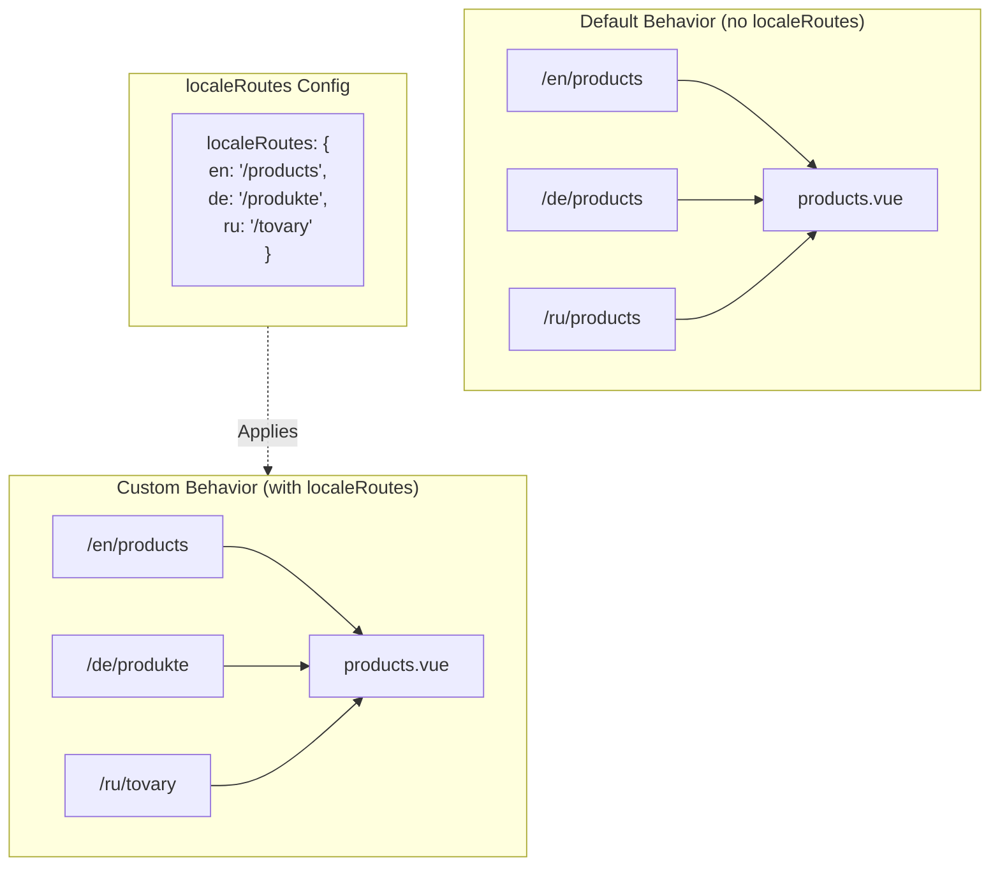

# 🔗 Aangepaste gelokaliseerde routes met `localeRoutes` in `Nuxt I18n Micro`

## 📖 Inleiding tot `localeRoutes`

De `localeRoutes`-feature in `Nuxt I18n Micro` stelt je in staat aangepaste routes te definiëren voor specifieke locales, wat flexibiliteit en controle biedt over de routingstructuur van je applicatie. Deze feature is vooral nuttig wanneer bepaalde locales verschillende URL-structuren, op maat gemaakte paden of specifieke regionale of linguïstische conventies vereisen.

## 🚀 Primaire use-case van `localeRoutes`

De primaire use-case voor `localeRoutes` is het bieden van aparte routes voor verschillende locales, wat de gebruikerservaring verbetert door ervoor te zorgen dat URL's intuïtief en relevant zijn voor het doelpubliek. Zo kun je bijvoorbeeld verschillende paden hebben voor Engelse en Russische versies van een pagina, waarbij de Russische locale een gelokaliseerd URL-formaat volgt.

### 📄 Voorbeeld: `localeRoutes` definiëren in `$defineI18nRoute`

Hier is een voorbeeld van hoe je aangepaste routes voor specifieke locales kunt definiëren met `localeRoutes` in je `$defineI18nRoute`-functie:

```typescript
import { useNuxtApp } from '#imports'

const { $defineI18nRoute } = useNuxtApp()

$defineI18nRoute({
  localeRoutes: {
    ru: '/localesubpage', // Custom route path for the Russian locale
    de: '/lokaleseite', // Custom route path for the German locale
  },
})
```

> [!IMPORTANT]
> `$defineI18nRoute` is geen globale functie. In `script setup` haal je deze eerst op uit `useNuxtApp()` en roept hem daarna aan.

### 🔄 Hoe `localeRoutes` werken



- **Standaardgedrag**: Zonder `localeRoutes` gebruiken alle locales een gemeenschappelijke routestructuur die is gedefinieerd door het primaire pad.
- **Aangepast gedrag**: Met `localeRoutes` kunnen specifieke locales eigen routes hebben, die het standaardpad overschrijven met locale-specifieke routes uit de configuratie.

## 🌱 Use-cases voor `localeRoutes`

### 📄 Voorbeeld: `localeRoutes` gebruiken op een pagina

Hier is een eenvoudig Vue-component dat het gebruik van `$defineI18nRoute` met `localeRoutes` demonstreert:

```vue
<template>
  <div>
    <!-- Display greeting message based on the current locale -->
    <p>{{ $t('greeting') }}</p>

    <!-- Navigation links -->
    <div>
      <NuxtLink :to="$localeRoute({ name: 'index' })"> Go to Index </NuxtLink>
      |
      <NuxtLink :to="$localeRoute({ name: 'about' })"> Go to About Page </NuxtLink>
    </div>
  </div>
</template>

<script setup>
import { useNuxtApp } from '#imports'

const { $getLocale, $switchLocale, $getLocales, $localeRoute, $t, $defineI18nRoute } = useNuxtApp()

// Define translations and custom routes for specific locales
$defineI18nRoute({
  localeRoutes: {
    ru: '/localesubpage', // Custom route path for Russian locale
  },
})
</script>
```

### 🛠️ `localeRoutes` gebruiken in verschillende contexten

- **Landingspagina's**: Gebruik aangepaste routes om URL's van landingspagina's te lokaliseren, zodat ze aansluiten bij marketingcampagnes.
- **Documentatiesites**: Bied aparte routes voor elke locale om beter aan te sluiten bij de gelokaliseerde inhoudsstructuur.
- **E-commercesites**: Pas product- of categorie-URL's aan per locale voor verbeterde SEO en gebruikerservaring.

## Navigatie gebruiken met `localeRoutes`

Omdat gelokaliseerde routes niet direct overeenkomen met bestandsnamen in de pages-map, moet je je navigatie via object refereren in plaats van via naam.

```vue
<template>
  /**
   * Exemple page: /pages/about-us.vue
   * EN /about-us
   * ES /sobre-nosotros
   * FR /a-propos
   */

  // Using NuxtLink
  <NuxtLink :to="$localeRoute({ name: 'about-us' })">
    Go to About Page
  </NuxtLink>

  // Using I18nLink
  <I18nLink :to="{ name: 'about-us' }">
    Go to About Page
  </NuxtLink>

  // The string literal navigation wouldn't work for any locale but english
  <I18nLink to="/about-us">
    Go to About Page
  </NuxtLink>
</template>
```

### Naamgeving van geneste pagina's

Standaard worden je pagina's benoemd op basis van hun bestand- en padnaam. Dat betekent:

- `/pages/about-us.vue` is toegankelijk met `$localeRoute(\{ name: 'about-us' \})`
- `/pages/about-us/physical-stores.vue` is toegankelijk met `$localeRoute(\{ name: 'about-us-physical-stores' \})`

Om dit gedrag te overschrijven, benoem je je pagina expliciet met `definePageMeta`.

```vue
// /pages/about-us/physical-stores.vue
<script setup>
definePageMeta({
  name: 'our-stores'
})
```

Deze pagina kan nu worden verwezen met `$localeRoute` of `I18nLink` via de naam `:to='\{ name: "our-stores" \}'`.

## 🎯 Dynamische routes met slugs en `$setI18nRouteParams`

Wanneer je werkt met dynamische routes die slugs of parameters bevatten, kun je `localeRoutes` combineren met dynamische segmenten en `$setI18nRouteParams` gebruiken om locale-specifieke slugs voor elke locale te geven.

### Dynamische routeparameters in `localeRoutes`

Je kunt dynamische routes definiëren met Nuxt-routeparametersyntaxis (`[...slug]` voor catch-all-routes, `[param]` voor enkele parameters of `:param()` voor benoemde parameters):

```vue
<script setup lang="ts">
import { useNuxtApp, useRoute, useFetch, createError } from '#imports'

const { $defineI18nRoute, $setI18nRouteParams } = useNuxtApp()

// Define custom routes with dynamic segments
$defineI18nRoute({
  localeRoutes: {
    en: '/our-products/[...slug]',
    es: '/nuestros-productos/[...slug]',
  },
})
</script>
```

### Locale-specifieke routeparameters instellen

Met de functie `$setI18nRouteParams` kun je verschillende parameterwaarden (zoals slugs) instellen voor elke locale. Dit is vooral nuttig wanneer je content locale-specifieke URL's heeft.

**Belangrijk**: `$setI18nRouteParams` moet worden aangeroepen nadat data is opgehaald die locale-specifieke slugs bevat, meestal binnen `useFetch` of `useAsyncData`.

```vue
<script setup lang="ts">
import { useNuxtApp, useRoute, useFetch, createError } from '#imports'

interface Product {
  title: string
  price: string
  urlEn: string // English slug
  urlEs: string // Spanish slug
}

const { $defineI18nRoute, $setI18nRouteParams } = useNuxtApp()

const route = useRoute()
const slug = Array.isArray(route.params.slug) ? route.params.slug[0] : route.params.slug

// Fetch product data that includes locale-specific slugs
const { data: product, error } = await useFetch<Product>(`/api/product/${slug}`)
if (error.value)
  throw createError({
    statusCode: error.value?.statusCode,
    statusMessage: error.value?.statusMessage,
    fatal: true,
  })

// Define custom routes with dynamic segments
$defineI18nRoute({
  localeRoutes: {
    en: '/our-products/[...slug]',
    es: '/nuestros-productos/[...slug]',
  },
})

// Set different slugs for different locales
if (product.value) {
  $setI18nRouteParams({
    en: { slug: product.value.urlEn },
    es: { slug: product.value.urlEs },
  })
}
</script>
```

### Volledig voorbeeld: productpagina's met locale-specifieke slugs

Hier is een volledig voorbeeld dat laat zien hoe je `localeRoutes` en `$setI18nRouteParams` samen kunt gebruiken voor een productdetailpagina:

```vue
<template>
  <div v-if="product">
    <h1>{{ product.title }}</h1>
    <p>{{ $t('price') }}: {{ product.price }}</p>
    <div class="locale-switcher">
      <a :href="$switchLocalePath('en')">English</a>
      <a :href="$switchLocalePath('es')">Español</a>
    </div>
  </div>
</template>

<script setup lang="ts">
import { useNuxtApp, useRoute, useFetch, createError } from '#imports'

interface Product {
  title: string
  price: string
  urlEn: string
  urlEs: string
}

const { $t, $defineI18nRoute, $setI18nRouteParams, $switchLocalePath } = useNuxtApp()

// Set page name for easier navigation
definePageMeta({ name: 'product-slug' })

const route = useRoute()
const slug = Array.isArray(route.params.slug) ? route.params.slug[0] : route.params.slug

// Fetch product data
const { data: product, error } = await useFetch<Product>(`/api/product/${slug}`)
if (error.value)
  throw createError({
    statusCode: error.value?.statusCode,
    statusMessage: error.value?.statusMessage,
    fatal: true,
  })

// Define locale-specific routes with dynamic segments
$defineI18nRoute({
  localeRoutes: {
    en: '/our-products/[...slug]',
    es: '/nuestros-productos/[...slug]',
  },
})

// Set locale-specific slugs so $switchLocalePath works correctly
if (product.value) {
  $setI18nRouteParams({
    en: { slug: product.value.urlEn },
    es: { slug: product.value.urlEs },
  })
}
</script>
```

### Voorbeeld: productlijst-pagina

Bij het linken naar dynamische routes vanaf een lijstpagina, gebruik je de routenaam met parameters:

```vue
<template>
  <div>
    <h1>{{ $t('title') }}</h1>
    <ul>
      <li v-for="product in products?.[$getLocale()] || []" :key="product.id">
        <I18nLink :to="{ name: 'product-slug', params: { slug: product.url } }"> {{ product.title }} – {{ product.price }} </I18nLink>
      </li>
    </ul>
  </div>
</template>

<script setup lang="ts">
import { useNuxtApp, useFetch, createError } from '#imports'

interface Product {
  id: string
  title: string
  price: string
  url: string
}

type ProductsByLocale = Record<string, Product[]>

const { $t, $defineI18nRoute, $getLocale } = useNuxtApp()

const { data: products, error } = await useFetch<ProductsByLocale>('/api/product')
if (error.value)
  throw createError({
    statusCode: error.value?.statusCode,
    statusMessage: error.value?.statusMessage,
    fatal: true,
  })

$defineI18nRoute({
  locales: {
    en: {
      title: 'Our Product Range',
      description: 'Discover our collection of high-quality products.',
    },
    es: {
      title: 'Nuestra Gama de Productos',
      description: 'Descubra nuestra colección de productos de alta calidad.',
    },
  },
  localeRoutes: {
    en: '/our-products',
    es: '/nuestros-productos',
  },
})
</script>
```

### Hoe het werkt

1. **Routedefinitie**: `localeRoutes` definieert de basispadstructuur voor elke locale, inclusief dynamische segmenten zoals `[...slug]` of `[id]`.

2. **Parameterinstelling**: `$setI18nRouteParams` stelt de daadwerkelijke parameterwaarden in voor elke locale. Wanneer een gebruiker van locale wisselt met `$switchLocalePath`, gebruikt de module deze parameters om de juiste URL op te bouwen.

3. **Parameterformaat**: Het parameterobject moet overeenkomen met de structuur:

   ```typescript
   {
     [localeCode]: {
       [paramName]: paramValue
     }
   }
   ```

4. **Navigatie**: Gebruik `I18nLink` of `$localeRoute` met de routenaam en parameters om te navigeren tussen gelokaliseerde versies van dynamische routes.

### Belangrijke opmerkingen

- **Timing**: `$setI18nRouteParams` moet worden aangeroepen nadat data is opgehaald die locale-specifieke slugs bevat, meestal binnen `useFetch` of `useAsyncData`.

- **Parameternamen**: De parameternamen in `$setI18nRouteParams` moeten overeenkomen met de routeparameternamen (bijv. `slug` voor `[...slug]` of `id` voor `[id]`).

- **Routenamen**: Gebruik bij `definePageMeta(\{ name: 'route-name' \})` deze naam wanneer je linkt naar de route met `I18nLink` of `$localeRoute`.

- **Catch-all-routes**: Voor catch-all-routes (`[...slug]`) moet de slug-parameter een array zijn of een string die naar een array wordt geconverteerd.

## 🧩 Programmatische routes (`pages:extend`) — #244

Routes die in `pages:extend` worden aangemaakt, hebben geen plek voor `defineI18nRoute()`, en meerdere routes delen vaak één wrapper-SFC. Bestandsgekoppelde scanning laat ze dan samenklappen tot één entry.

Zet gelokaliseerde paden **niet** in `route.meta` (die worden dan mee-geshipd in de client-routetabel). Houd één register aan en projecteer het tweemaal:

1. naar `pages:extend` (maakt de Nuxt-routes)
2. naar `i18n.globalLocaleRoutes` gekoppeld op route-**naam** (niet bestandspad)

Gebruik `splitLocaleRoutes` uit `@i18n-micro/utils/split-locale-routes`:

```typescript
import { splitLocaleRoutes } from '@i18n-micro/utils/split-locale-routes'

const dynamic = splitLocaleRoutes([
  {
    name: 'products_tag',
    path: '/products/:tag',
    file: '~/pages/_dynamic.vue',
    paths: { fr: '/produits/:tag', de: '/produkte/:tag' },
  },
  {
    name: 'products_category',
    path: '/products/category/:category',
    file: '~/pages/_dynamic.vue',
    paths: { fr: '/produits/categorie/:category' },
  },
  // Disable localization for a programmatic route:
  // { name: 'internal', path: '/internal', file: '~/pages/_dynamic.vue', paths: false },
])

export default defineNuxtConfig({
  hooks: {
    'pages:extend'(pages) {
      pages.push(...dynamic.pages)
    },
  },
  i18n: {
    globalLocaleRoutes: dynamic.globalLocaleRoutes,
  },
})
```

Beide helften blijven in sync; gedeelde wrappers overschrijven elkaar niet meer. `globalLocaleRoutes` alleen is niet genoeg — het past alleen paden aan voor routes die al in de Nuxt-paginatabel bestaan.

## 📝 Best practices voor het gebruik van `localeRoutes`

- **🚀 Gebruik voor relevante locales**: Pas `localeRoutes` voornamelijk toe waar de URL-structuur een aanzienlijke impact heeft op de gebruikerservaring of SEO. Vermijd overmatig gebruik voor kleine verschillen.
- **🔧 Behoud consistentie**: Houd een consistent routingpatroon aan tussen locales, tenzij er een sterke reden is om af te wijken. Deze aanpak helpt duidelijkheid te behouden en complexiteit te verminderen.
- **📚 Documenteer aangepaste routes**: Documenteer duidelijk elke aangepaste route die je definieert met `localeRoutes`, vooral in modulaire applicaties, zodat teamleden de routinglogica begrijpen.
