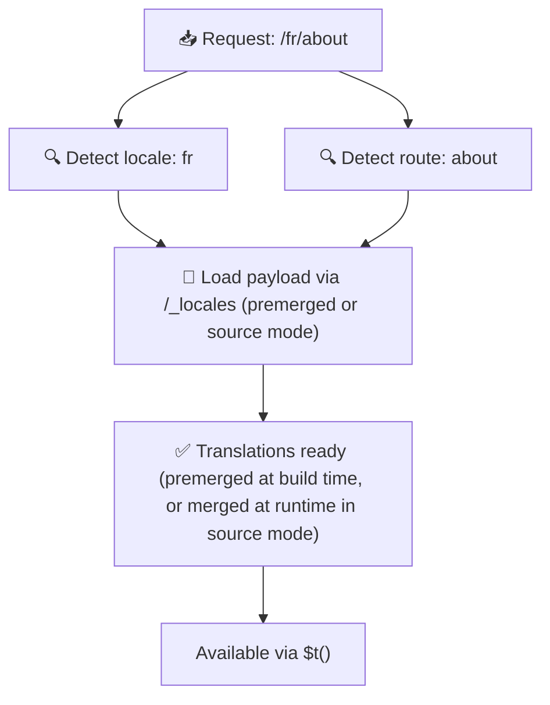

# 📂 Gids voor mapstructuur

## 📖 Inleiding

Je vertaalbestanden effectief organiseren is essentieel voor een schaalbaar en efficiënt internationalisatiesysteem (i18n). `Nuxt I18n Micro` vereenvoudigt dit door een duidelijke aanpak te bieden voor het beheren van root- en paginaspecifieke vertalingen. Deze gids loodst je door de aanbevolen mapstructuur en legt uit hoe `Nuxt I18n Micro` deze vertalingen verwerkt.

## 🗂️ Aanbevolen mapstructuur

`Nuxt I18n Micro` organiseert vertalingen in root-bestanden en paginaspecifieke bestanden binnen de map `pages`. Met `translationPayloads.mode: 'premerged'` (standaard) worden root-vertalingen tijdens de build automatisch samengevoegd met elk paginabestand, zodat elke pagina beschikt over een volledige set vertalingen zonder runtime-overhead voor samenvoeging.

Met `mode: 'source'` blijven bronbestanden gescheiden in Nitro-assets en worden ze tijdens runtime samengevoegd via de `/_locales`-route. Zie [Serverless payload-output](/guides/performance#serverless-payload-output).

### 🔧 Basisstructuur

Hier is een basisvoorbeeld van de mapstructuur die je zou moeten volgen:

```text
locales/
├── pages/
│   ├── index/
│   │   ├── en.json
│   │   ├── fr.json
│   │   └── ar.json
│   ├── about/
│   │   ├── en.json
│   │   ├── fr.json
│   │   └── ar.json
├── en.json
├── fr.json
└── ar.json

```

### 📄 Uitleg van de structuur

#### 1. 🌍 Root-vertaalbestanden

- **Pad:** `/locales/\{locale\}.json` (bijvoorbeeld `/locales/en.json`)
- **Doel:** Deze bestanden bevatten vertalingen die in de hele applicatie worden gedeeld (navigatiemenu's, headers, footers, enzovoort). Met `mode: 'premerged'` (standaard) worden ze tijdens de build automatisch samengevoegd met elk paginaspecifiek bestand, zodat de server per pagina één vooraf gebouwd bestand teruggeeft.

  **Voorbeeldinhoud (`/locales/en.json`):**

  ```json
  {
    "menu": {
      "home": "Home",
      "about": "About Us",
      "contact": "Contact"
    },
    "footer": {
      "copyright": "© 2024 Your Company"
    }
  }
  ```

#### 2. 📄 Paginaspecifieke vertaalbestanden

- **Pad:** `/locales/pages/\{routeName\}/\{locale\}.json` (bijvoorbeeld `/locales/pages/index/en.json`)
- **Doel:** Deze bestanden bevatten vertalingen die specifiek zijn voor individuele pagina's. Met `mode: 'premerged'` (standaard) worden root-vertalingen tijdens de build als basis meegenomen, zodat elk paginabestand zelfstandig is.

  **Voorbeeldinhoud (`/locales/pages/index/en.json`):**

  ```json
  {
    "title": "Welcome to Our Website",
    "description": "We offer a wide range of products and services to meet your needs."
  }
  ```

  **Voorbeeldinhoud (`/locales/pages/about/en.json`):**

  ```json
  {
    "title": "About Us",
    "description": "Learn more about our mission, vision, and values."
  }
  ```

### 📂 Omgaan met dynamische routes en geneste paden

`Nuxt I18n Micro` transformeert dynamische segmenten en geneste paden in routes automatisch tot een platte mapstructuur volgens een specifieke naamgevingsconventie. Zo blijven alle vertalingen op een consistente en makkelijk toegankelijke manier opgeslagen.

#### Mapstructuur voor dynamische routes

Bij dynamische routes zoals `/products/[id]` converteert de module het dynamische segment `[id]` naar een statisch formaat in de bestandsstructuur.

**Voorbeeld van de mapstructuur voor dynamische routes:**

Voor een route als `/products/[id]` staan de vertaalbestanden in een map genaamd `products-id`:

```text
locales/pages/
├── products-id/
│   ├── en.json
│   ├── fr.json
│   └── ar.json

```

**Voorbeeld van de mapstructuur voor geneste dynamische routes:**

Voor een geneste route als `/products/key/[id]` staan de vertaalbestanden in een map genaamd `products-key-id`:

```text
locales/pages/
├── products-key-id/
│   ├── en.json
│   ├── fr.json
│   └── ar.json

```

**Voorbeeld van de mapstructuur voor genestede routes op meerdere niveaus:**

Voor een complexere geneste route als `/products/category/[id]/details` staan de vertaalbestanden in een map genaamd `products-category-id-details`:

```text
locales/pages/
├── products-category-id-details/
│   ├── en.json
│   ├── fr.json
│   └── ar.json

```

### 🛠 De mapstructuur aanpassen

Als je vertalingen liever in een andere map opslaat, kun je met `Nuxt I18n Micro` de map waar vertaalbestanden staan aanpassen. Configureer dit in je `nuxt.config.ts`-bestand.

**Voorbeeld: de vertaalmap aanpassen**

```typescript
export default defineNuxtConfig({
  i18n: {
    translationDir: 'i18n', // Aangepast padnaar de map
  },
})
```

Dit instrueert `Nuxt I18n Micro` om vertaalbestanden te zoeken in de map `/i18n` in plaats van in de standaardmap `/locales`.

## ⚙️ Hoe vertalingen worden geladen

### 🌍 Dynamische locale-routes

`Nuxt I18n Micro` gebruikt dynamische locale-routes om vertalingen efficiënt te laden. Wanneer een gebruiker een pagina bezoekt, bepaalt de module de juiste locale en laadt de bijbehorende vertaalbestanden op basis van de huidige route en locale.



Bijvoorbeeld:

- `/en/index` bezoeken laadt vertalingen uit `/locales/pages/index/en.json`.
- `/fr/about` bezoeken laadt vertalingen uit `/locales/pages/about/fr.json`.

Deze methode zorgt ervoor dat alleen de nodige vertalingen worden geladen, wat zowel de serverbelasting als de client-side prestaties optimaliseert.

### 💾 Caching en pre-rendering

Voor extra prestaties ondersteunt `Nuxt I18n Micro` caching en pre-rendering van vertaalbestanden:

- **Caching**: Zodra een vertaalbestand is geladen, wordt het gecached voor volgende verzoeken, zodat dezelfde data niet steeds opnieuw hoeft te worden opgehaald.
- **Pre-rendering**: Tijdens het buildproces kun je vertaalbestanden vooraf renderen voor alle geconfigureerde locales en routes. Deze kunnen dan rechtstreeks vanaf de server worden geserveerd zonder runtime-vertraging.

## 📝 Best practices

### 📂 Gebruik paginaspecifieke bestanden verstandig

Benut paginaspecifieke bestanden om vertalingen georganiseerd te houden. Zo blijven de vertalingen van elke pagina beperkt en snel te laden. Dit is vooral belangrijk voor pagina's met complexe of veel inhoud.

### 🔑 Houd vertaalsleutels consistent

Gebruik consistente naamgevingsconventies voor vertaalsleutels in alle bestanden. Dit behoudt de duidelijkheid en voorkomt problemen bij het beheer van vertalingen, vooral naarmate je applicatie groeit.

### 🗂️ Organiseer vertalingen op context

Groepeer gerelateerde vertalingen samen in je bestanden. Bijvoorbeeld: groepeer alle knoplabels onder een `buttons`-sleutel en alle formulierteksten onder een `forms`-sleutel. Dit verbetert niet alleen de leesbaarheid, maar maakt het ook eenvoudiger om vertalingen over verschillende locales te beheren.

### ⚠️ Aanbevolen maximale nesting-diepte (2 niveaus)

Tijdens client-side navigatie gebruikt `Nuxt I18n Micro` een geoptimaliseerde deep-merge op 2 niveaus om vertalingen van de vertrekkende en de binnenkomende pagina te combineren. Zo blijven overlappende geneste sleutels (bijvoorbeeld beide pagina's hebben sleutels onder `common.*`) tijdens transitie-animaties bewaard.

**Dit werkt correct voor de standaardstructuur `Section → Key → Value` (2 niveaus):**

```json
// Vertalingen van pagina A
{ "common": { "fromA": "Text A" } }

// Vertalingen van pagina B
{ "common": { "fromB": "Text B" } }

// Tijdens de transitie zijn beide beschikbaar:
// { "common": { "fromA": "Text A", "fromB": "Text B" } }
```

**Bij drie of meer niveaus van nesting kunnen diepere sleutels tijdens transities echter worden overschreven:**

```json
// Vertalingen van pagina A
{ "auth": { "form": { "login": "Login" } } }

// Vertalingen van pagina B
{ "auth": { "form": { "register": "Register" } } }

// Tijdens de transitie: de sleutel "login" gaat verloren
// { "auth": { "form": { "register": "Register" } } }
```


### 🧹 Ruim ongebruikte vertalingen regelmatig op

Na verloop van tijd kan je applicatie ongebruikte vertaalsleutels verzamelen, vooral als features worden verwijderd of geherstructureerd. Bekijk en ruim je vertaalbestanden periodiek op om ze beknopt en onderhoudbaar te houden.
