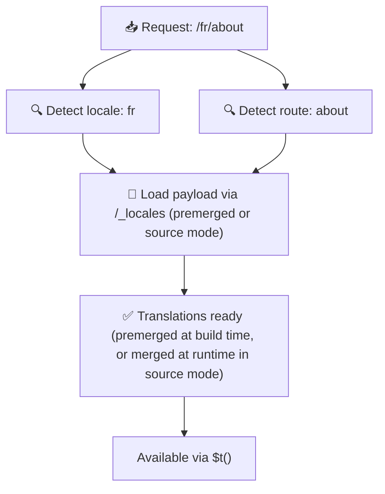

# 📂 Mappenstructuurgids

## 📖 Inleiding

Het effectief organiseren van je vertaalbestanden is essentieel voor het onderhouden van een schaalbaar en efficiënt internationalisatiesysteem (i18n). `Nuxt I18n Micro` vereenvoudigt dit proces door een duidelijke aanpak te bieden voor het beheren van root-level en pagina-specifieke vertalingen. Deze gids leidt je door de aanbevolen mappenstructuur en legt uit hoe `Nuxt I18n Micro` deze vertalingen afhandelt.

## 🗂️ Aanbevolen mappenstructuur

`Nuxt I18n Micro` organiseert vertalingen in root-level bestanden en pagina-specifieke bestanden binnen de `pages`-map. Met `translationPayloads.mode: 'premerged'` (standaard) worden root-level vertalingen automatisch bij het builden in elk paginabestand samengevoegd, zodat elke pagina een complete set vertalingen heeft zonder runtime-merge-overhead.

Met `mode: 'source'` blijven bronbestanden apart in Nitro-assets en worden ze tijdens runtime samengevoegd via de `/_locales`-route. Zie [Serverless Payload Output](/guides/performance#serverless-payload-output).

### 🔧 Basisstructuur

Hier is een basisvoorbeeld van de mappenstructuur die je moet volgen:

```text
locales/
├── pages/
│   ├── index/
│   │   ├── en.json
│   │   ├── fr.json
│   │   └── ar.json
│   ├── about/
│   │   ├── en.json
│   │   ├── fr.json
│   │   └── ar.json
├── en.json
├── fr.json
└── ar.json

```

### 📄 Uitleg van de structuur

#### 1. 🌍 Root-level vertaalbestanden

- **Pad:** `/locales/\{locale\}.json` (bijv. `/locales/en.json`)
- **Doel:** Deze bestanden bevatten vertalingen die door de hele applicatie worden gedeeld (navigatiemenu's, headers, footers, enz.). Met `mode: 'premerged'` (standaard) worden ze bij het builden automatisch samengevoegd in elk pagina-specifiek bestand, zodat de server één vooraf gebouwd bestand per pagina retourneert.

  **Voorbeeldinhoud (`/locales/en.json`):**

  ```json
  {
    "menu": {
      "home": "Home",
      "about": "About Us",
      "contact": "Contact"
    },
    "footer": {
      "copyright": "© 2024 Your Company"
    }
  }
  ```

#### 2. 📄 Pagina-specifieke vertaalbestanden

- **Pad:** `/locales/pages/\{routeName\}/\{locale\}.json` (bijv. `/locales/pages/index/en.json`)
- **Doel:** Deze bestanden bevatten vertalingen die specifiek zijn voor individuele pagina's. Met `mode: 'premerged'` (standaard) worden root-level vertalingen bij het builden als basis samengevoegd, waardoor elk paginabestand zelfstandig wordt.

  **Voorbeeldinhoud (`/locales/pages/index/en.json`):**

  ```json
  {
    "title": "Welcome to Our Website",
    "description": "We offer a wide range of products and services to meet your needs."
  }
  ```

  **Voorbeeldinhoud (`/locales/pages/about/en.json`):**

  ```json
  {
    "title": "About Us",
    "description": "Learn more about our mission, vision, and values."
  }
  ```

### 📂 Dynamische routes en geneste paden afhandelen

`Nuxt I18n Micro` transformeert dynamische segmenten en geneste paden in routes automatisch naar een platte mappenstructuur met een specifieke hernoemingsconventie. Dit zorgt ervoor dat alle vertalingen op een consistente en gemakkelijk toegankelijke manier worden opgeslagen.

#### Mappenstructuur voor vertalingen van dynamische routes

Bij dynamische routes, zoals `/products/[id]`, converteert de module het dynamische segment `[id]` naar een statisch formaat binnen de bestandsstructuur.

**Voorbeeld van mappenstructuur voor dynamische routes:**

Voor een route als `/products/[id]` worden de vertaalbestanden opgeslagen in een map genaamd `products-id`:

```text
locales/pages/
├── products-id/
│   ├── en.json
│   ├── fr.json
│   └── ar.json

```

**Voorbeeld van mappenstructuur voor geneste dynamische routes:**

Voor een geneste route als `/products/key/[id]` worden de vertaalbestanden opgeslagen in een map genaamd `products-key-id`:

```text
locales/pages/
├── products-key-id/
│   ├── en.json
│   ├── fr.json
│   └── ar.json

```

**Voorbeeld van mappenstructuur voor meerlaagse geneste routes:**

Voor een complexere geneste route als `/products/category/[id]/details` worden de vertaalbestanden opgeslagen in een map genaamd `products-category-id-details`:

```text
locales/pages/
├── products-category-id-details/
│   ├── en.json
│   ├── fr.json
│   └── ar.json

```

### 🛠 De mappenstructuur aanpassen

Als je vertalingen liever in een andere map opslaat, kun je met `Nuxt I18n Micro` de map aanpassen waar vertaalbestanden worden opgeslagen. Je kunt dit configureren in je `nuxt.config.ts`-bestand.

**Voorbeeld: de vertaalmap aanpassen**

```typescript
export default defineNuxtConfig({
  i18n: {
    translationDir: 'i18n', // Custom directory path
  },
})
```

Dit instrueert `Nuxt I18n Micro` om vertaalbestanden te zoeken in de map `/i18n` in plaats van de standaardmap `/locales`.

## ⚙️ Hoe vertalingen worden geladen

### 🌍 Dynamische localeroutes

`Nuxt I18n Micro` gebruikt dynamische localeroutes om vertalingen efficiënt te laden. Wanneer een gebruiker een pagina bezoekt, bepaalt de module de juiste locale en laadt hij de bijbehorende vertaalbestanden op basis van de huidige route en locale.



Bijvoorbeeld:

- Het bezoeken van `/en/index` laadt vertalingen uit `/locales/pages/index/en.json`.
- Het bezoeken van `/fr/about` laadt vertalingen uit `/locales/pages/about/fr.json`.

Deze methode zorgt ervoor dat alleen de nodige vertalingen worden geladen, wat zowel serverbelasting als client-side prestaties optimaliseert.

### 💾 Caching en pre-rendering

Om prestaties verder te verbeteren, ondersteunt `Nuxt I18n Micro` caching en pre-rendering van vertaalbestanden:

- **Caching**: Zodra een vertaalbestand is geladen, wordt het gecachet voor volgende verzoeken, waardoor herhaaldelijk dezelfde data ophalen niet meer nodig is.
- **Pre-rendering**: Tijdens het buildproces kun je vertaalbestanden voor alle geconfigureerde locales en routes pre-renderen, zodat ze rechtstreeks vanaf de server kunnen worden geserveerd zonder runtime-vertragingen.

## 📝 Best practices

### 📂 Gebruik pagina-specifieke bestanden verstandig

Gebruik pagina-specifieke bestanden om vertalingen georganiseerd te houden. Dit houdt de vertalingen van elke pagina compact en snel te laden, wat vooral belangrijk is voor pagina's met complexe of grote inhoud.

### 🔑 Houd vertaalsleutels consistent

Gebruik consistente naamgevingsconventies voor je vertaalsleutels in alle bestanden. Dit helpt duidelijkheid te behouden en voorkomt problemen bij het beheren van vertalingen, vooral naarmate je applicatie groeit.

### 🗂️ Organiseer vertalingen op context

Groepeer gerelateerde vertalingen samen binnen je bestanden. Groepeer bijvoorbeeld alle knoplabels onder een `buttons`-sleutel en alle formuliergerelateerde teksten onder een `forms`-sleutel. Dit verbetert niet alleen de leesbaarheid, maar maakt het ook eenvoudiger om vertalingen tussen verschillende locales te beheren.

### ⚠️ Diepte-limiet voor nesting (2 niveaus aanbevolen)

Tijdens client-side navigatie gebruikt `Nuxt I18n Micro` een geoptimaliseerde deep merge van 2 niveaus om vertalingen van de vertrekkende en binnenkomende pagina's te combineren. Dit zorgt ervoor dat overlappende geneste sleutels (bijv. beide pagina's hebben sleutels onder `common.*`) tijdens overgangsanimaties behouden blijven.

**Dit werkt correct voor de standaardstructuur `Section → Key → Value` (2 niveaus):**

```json
// Page A translations
{ "common": { "fromA": "Text A" } }

// Page B translations
{ "common": { "fromB": "Text B" } }

// During transition, both are available:
// { "common": { "fromA": "Text A", "fromB": "Text B" } }
```

**Als je echter 3+ niveaus nesting gebruikt, kunnen diepere sleutels tijdens overgangen worden overschreven:**

```json
// Page A translations
{ "auth": { "form": { "login": "Login" } } }

// Page B translations
{ "auth": { "form": { "register": "Register" } } }

// During transition: "login" key is lost
// { "auth": { "form": { "register": "Register" } } }
```

<Tip>

</Tip>

### 🧹 Ruim ongebruikte vertalingen regelmatig op

In de loop van de tijd kan je applicatie ongebruikte vertaalsleutels verzamelen, vooral als features worden verwijderd of geherstructureerd. Controleer en ruim je vertaalbestanden periodiek op om ze compact en onderhoudbaar te houden.
