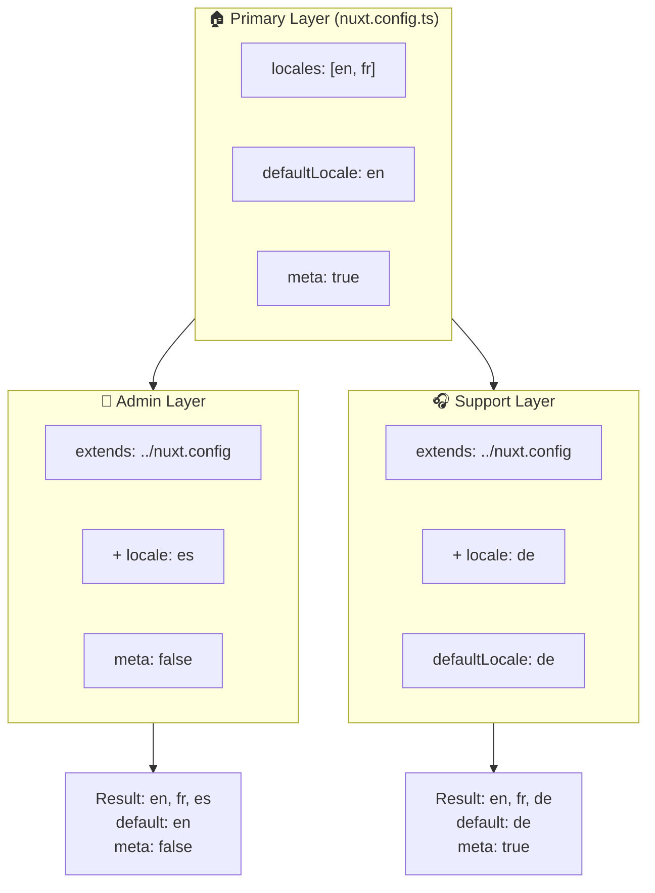

# 🗂️ Lagen in `Nuxt I18n Micro`

## 📖 Introductie tot lagen

Lagen in `Nuxt I18n Micro` maken het mogelijk om lokalisatie-instellingen flexibel te beheren en aan te passen over verschillende delen van je applicatie. Door verschillende lagen te definiëren kun je de configuratie voor verschillende contexten aanpassen, bijvoorbeeld door instellingen voor specifieke secties van je site te overschrijven of door herbruikbare basisconfiguraties te maken die door andere delen van je applicatie kunnen worden uitgebreid.

### Overervingsstroom van lagen



## 🛠️ Primaire configuratielaag

De **primaire configuratielaag** is waar je de standaard lokalisatie-instellingen voor je hele applicatie instelt. Deze laag is essentieel omdat zij de globale configuratie definieert, inclusief de ondersteunde locales, de standaardtaal en andere kritieke i18n-instellingen.

### 📄 Voorbeeld: de primaire configuratielaag definiëren

Hier is een voorbeeld van hoe je de primaire configuratielaag in je `nuxt.config.ts`-bestand kunt definiëren:

```typescript
export default defineNuxtConfig({
  i18n: {
    locales: [
      { code: 'en', iso: 'en-EN', dir: 'ltr' },
      { code: 'fr', iso: 'fr-FR', dir: 'ltr' },
      { code: 'ar', iso: 'ar-SA', dir: 'rtl' },
    ],
    defaultLocale: 'en', // De standaardlocale voor de hele app
    translationDir: 'locales', // Map waarin vertalingen worden opgeslagen
    meta: true, // Genereer automatisch SEO-gerelateerde metatags zoals `alternate`
    autoDetectLanguage: true, // Detecteer en gebruik automatisch de voorkeurstaal van de gebruiker
  },
})
```

## 🌱 Onderliggende lagen

Onderliggende lagen worden gebruikt om de primaire configuratie voor specifieke delen van je applicatie uit te breiden of te overschrijven. Je kunt bijvoorbeeld extra locales toevoegen of de standaardlocale voor een bepaalde sectie van je site aanpassen. Onderliggende lagen zijn vooral nuttig in modulaire applicaties waar verschillende delen van de applicatie andere lokalisatiebehoeften hebben.

### 📄 Voorbeeld: de primaire laag uitbreiden in een onderliggende laag

Stel dat je een sectie van je site hebt die extra locales moet ondersteunen, of dat je een specifieke locale in een bepaalde context wilt uitschakelen. Zo bereik je dat door de primaire configuratielaag uit te breiden:

```typescript
// basic/nuxt.config.ts (primaire laag)
export default defineNuxtConfig({
  i18n: {
    locales: [
      { code: 'en', iso: 'en-EN', dir: 'ltr' },
      { code: 'fr', iso: 'fr-FR', dir: 'ltr' },
    ],
    defaultLocale: 'en',
    meta: true,
    translationDir: 'locales',
  },
})
```

```typescript
// extended/nuxt.config.ts (onderliggende laag)
export default defineNuxtConfig({
  extends: '../basic', // Erf de basisconfiguratie van de 'basic'-laag
  i18n: {
    locales: [
      { code: 'en', iso: 'en-EN', dir: 'ltr' }, // Overgeërfd
      { code: 'fr', iso: 'fr-FR', dir: 'ltr' }, // Overgeërfd
      { code: 'de', iso: 'de-DE', dir: 'ltr' }, // Toegevoegd in de onderliggende laag
    ],
    defaultLocale: 'fr', // Overschrijf de standaardlocale naar Frans voor deze sectie
    autoDetectLanguage: false, // Schakel automatische taaldetectie uit in deze sectie
  },
})
```

### 🌐 Lagen gebruiken in een modulaire applicatie

In een grotere, modulaire Nuxt-applicatie heb je mogelijk meerdere secties, elk met eigen i18n-instellingen. Door lagen te gebruiken houd je een schone en schaalbare configuratiestructuur.

### 📄 Voorbeeld: gelaagde configuratie in een modulaire applicatie

Stel dat je een e-commerce-site hebt met aparte secties zoals de hoofdsite, het beheerpaneel en het klantenserviceportaal. Elke sectie kan een andere set locales of andere i18n-instellingen nodig hebben.

#### **Primaire laag (globale configuratie):**

```typescript
// nuxt.config.ts
export default defineNuxtConfig({
  i18n: {
    locales: [
      { code: 'en', iso: 'en-EN', dir: 'ltr' },
      { code: 'fr', iso: 'fr-FR', dir: 'ltr' },
    ],
    defaultLocale: 'en',
    meta: true,
    translationDir: 'locales',
    autoDetectLanguage: true,
  },
})
```

#### **Onderliggende laag voor het beheerpaneel:**

```typescript
// admin/nuxt.config.ts
export default defineNuxtConfig({
  extends: '../nuxt.config', // Erf de globale instellingen
  i18n: {
    locales: [
      { code: 'en', iso: 'en-EN', dir: 'ltr' }, // Overgeërfd
      { code: 'fr', iso: 'fr-FR', dir: 'ltr' }, // Overgeërfd
      { code: 'es', iso: 'es-ES', dir: 'ltr' }, // Specifiek voor het beheerpaneel
    ],
    defaultLocale: 'en',
    meta: false, // Schakel automatische metageneratie uit in het beheerpaneel
  },
})
```

#### **Onderliggende laag voor het klantenserviceportaal:**

```typescript
// support/nuxt.config.ts
export default defineNuxtConfig({
  extends: '../nuxt.config', // Erf de globale instellingen
  i18n: {
    locales: [
      { code: 'en', iso: 'en-EN', dir: 'ltr' }, // Overgeërfd
      { code: 'fr', iso: 'fr-FR', dir: 'ltr' }, // Overgeërfd
      { code: 'de', iso: 'de-DE', dir: 'ltr' }, // Specifiek voor het supportportaal
    ],
    defaultLocale: 'de', // Standaardlocale Duits in het supportportaal
    autoDetectLanguage: false, // Schakel automatische taaldetectie uit
  },
})
```

In dit modulaire voorbeeld:

- Heeft elke sectie (admin, support) eigen i18n-instellingen, maar erven ze allemaal de basisconfiguratie.
- Voegt het beheerpaneel Spaans (`es`) toe als locale en schakelt metatag-generatie uit.
- Voegt het supportportaal Duits (`de`) toe als locale en gebruikt Duits als standaardtaal voor de UI.

## 📝 Best practices voor het gebruik van lagen

- **🔧 Houd de primaire laag simpel:** De primaire laag moet de meest gebruikte instellingen bevatten die globaal in je applicatie gelden. Houd het eenvoudig voor consistentie.
- **⚙️ Gebruik onderliggende lagen voor specifieke aanpassingen:** Overschrijf of breid instellingen alleen uit in onderliggende lagen wanneer dat nodig is. Zo voorkom je onnodige complexiteit in je configuratie.
- **📚 Documenteer je lagen:** Documenteer duidelijk het doel en de specifieke inhoud van elke laag in je project. Dit houdt de configuratie overzichtelijk en helpt anderen (of jij in de toekomst) om deze te begrijpen.
