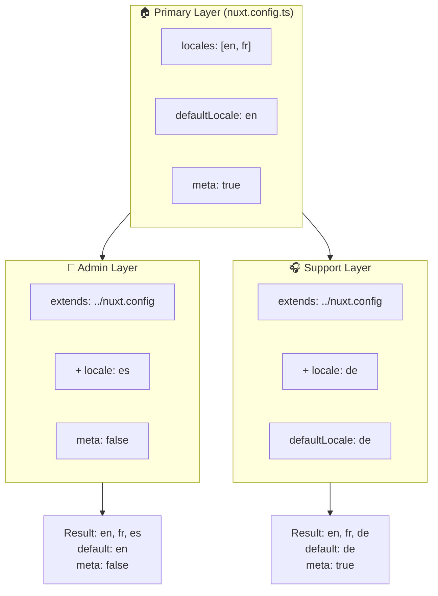

# 🗂️ Layers in `Nuxt I18n Micro`

## 📖 Inleiding tot layers

Layers in `Nuxt I18n Micro` stellen je in staat om lokalisatie-instellingen flexibel te beheren en aan te passen in verschillende delen van je applicatie. Door verschillende layers te definiëren kun je de configuratie aanpassen voor verschillende contexten, zoals het overschrijven van instellingen voor specifieke onderdelen van je site of het maken van herbruikbare basisconfiguraties die door andere delen van je applicatie kunnen worden uitgebreid.

### Overervingsstroom van layers



## 🛠️ Primaire configuratielayer

De **primaire configuratielayer** is waar je de standaard lokalisatie-instellingen voor je hele applicatie instelt. Deze layer is essentieel omdat hij de globale configuratie definieert, inclusief de ondersteunde locales, standaardtaal en andere kritieke i18n-instellingen.

### 📄 Voorbeeld: de primaire configuratielayer definiëren

Hier is een voorbeeld van hoe je de primaire configuratielayer in je `nuxt.config.ts`-bestand kunt definiëren:

```typescript
export default defineNuxtConfig({
  i18n: {
    locales: [
      { code: 'en', iso: 'en-EN', dir: 'ltr' },
      { code: 'fr', iso: 'fr-FR', dir: 'ltr' },
      { code: 'ar', iso: 'ar-SA', dir: 'rtl' },
    ],
    defaultLocale: 'en', // The default locale for the entire app
    translationDir: 'locales', // Directory where translations are stored
    meta: true, // Automatically generate SEO-related meta tags like `alternate`
    autoDetectLanguage: true, // Automatically detect and use the user's preferred language
  },
})
```

## 🌱 Child-layers

Child-layers worden gebruikt om de primaire configuratie uit te breiden of te overschrijven voor specifieke delen van je applicatie. Zo wil je bijvoorbeeld extra locales toevoegen of de standaardlocale voor een specifiek onderdeel van je site wijzigen. Child-layers zijn vooral nuttig in modulaire applicaties waar verschillende onderdelen andere lokalisatievereisten hebben.

### 📄 Voorbeeld: de primaire layer uitbreiden in een child-layer

Stel dat je een sectie van je site hebt die aanvullende locales moet ondersteunen, of dat je in een bepaalde context een bepaalde locale wilt uitschakelen. Zo kun je dat bereiken door de primaire configuratielayer uit te breiden:

```typescript
// basic/nuxt.config.ts (Primary Layer)
export default defineNuxtConfig({
  i18n: {
    locales: [
      { code: 'en', iso: 'en-EN', dir: 'ltr' },
      { code: 'fr', iso: 'fr-FR', dir: 'ltr' },
    ],
    defaultLocale: 'en',
    meta: true,
    translationDir: 'locales',
  },
})
```

```typescript
// extended/nuxt.config.ts (Child Layer)
export default defineNuxtConfig({
  extends: '../basic', // Inherit the base configuration from the 'basic' layer
  i18n: {
    locales: [
      { code: 'en', iso: 'en-EN', dir: 'ltr' }, // Inherited from the base layer
      { code: 'fr', iso: 'fr-FR', dir: 'ltr' }, // Inherited from the base layer
      { code: 'de', iso: 'de-DE', dir: 'ltr' }, // Added in the child layer
    ],
    defaultLocale: 'fr', // Override the default locale to French for this section
    autoDetectLanguage: false, // Disable automatic language detection in this section
  },
})
```

### 🌐 Layers gebruiken in een modulaire applicatie

In een grotere, modulaire Nuxt-applicatie heb je mogelijk meerdere secties, elk met eigen i18n-instellingen. Door layers te gebruiken kun je een schone en schaalbare configuratiestructuur behouden.

### 📄 Voorbeeld: gelaagde configuratie in een modulaire applicatie

Stel je hebt een e-commercesite met aparte secties zoals de hoofdwebsite, het beheerderspaneel en het klantenondersteuningsportaal. Elke sectie heeft mogelijk een andere set locales of andere i18n-instellingen nodig.

#### **Primaire layer (globale configuratie):**

```typescript
// nuxt.config.ts
export default defineNuxtConfig({
  i18n: {
    locales: [
      { code: 'en', iso: 'en-EN', dir: 'ltr' },
      { code: 'fr', iso: 'fr-FR', dir: 'ltr' },
    ],
    defaultLocale: 'en',
    meta: true,
    translationDir: 'locales',
    autoDetectLanguage: true,
  },
})
```

#### **Child-layer voor beheerderspaneel:**

```typescript
// admin/nuxt.config.ts
export default defineNuxtConfig({
  extends: '../nuxt.config', // Inherit the global settings
  i18n: {
    locales: [
      { code: 'en', iso: 'en-EN', dir: 'ltr' }, // Inherited
      { code: 'fr', iso: 'fr-FR', dir: 'ltr' }, // Inherited
      { code: 'es', iso: 'es-ES', dir: 'ltr' }, // Specific to the admin panel
    ],
    defaultLocale: 'en',
    meta: false, // Disable automatic meta generation in the admin panel
  },
})
```

#### **Child-layer voor klantenondersteuningsportaal:**

```typescript
// support/nuxt.config.ts
export default defineNuxtConfig({
  extends: '../nuxt.config', // Inherit the global settings
  i18n: {
    locales: [
      { code: 'en', iso: 'en-EN', dir: 'ltr' }, // Inherited
      { code: 'fr', iso: 'fr-FR', dir: 'ltr' }, // Inherited
      { code: 'de', iso: 'de-DE', dir: 'ltr' }, // Specific to the support portal
    ],
    defaultLocale: 'de', // Default to German in the support portal
    autoDetectLanguage: false, // Disable automatic language detection
  },
})
```

In dit modulaire voorbeeld:

- Elke sectie (admin, support) heeft eigen i18n-instellingen, maar ze erven allemaal de basisconfiguratie.
- Het beheerderspaneel voegt Spaans (`es`) toe als locale en schakelt metatag-generatie uit.
- Het ondersteuningsportaal voegt Duits (`de`) toe als locale en gebruikt Duits als standaard voor de gebruikersinterface.

## 📝 Best practices voor het gebruik van layers

- **🔧 Houd de primaire layer eenvoudig:** De primaire layer moet de meest gebruikte instellingen bevatten die globaal in je applicatie gelden. Houd het eenvoudig om consistentie te garanderen.
- **⚙️ Gebruik child-layers voor specifieke aanpassingen:** Overschrijf of breid alleen instellingen uit in child-layers wanneer dat nodig is. Deze aanpak voorkomt onnodige complexiteit in je configuratie.
- **📚 Documenteer je layers:** Documenteer duidelijk het doel en de specifieke details van elke layer in je project. Dit helpt bij het behouden van duidelijkheid en maakt het voor anderen (of jezelf in de toekomst) makkelijker om de configuratie te begrijpen.
