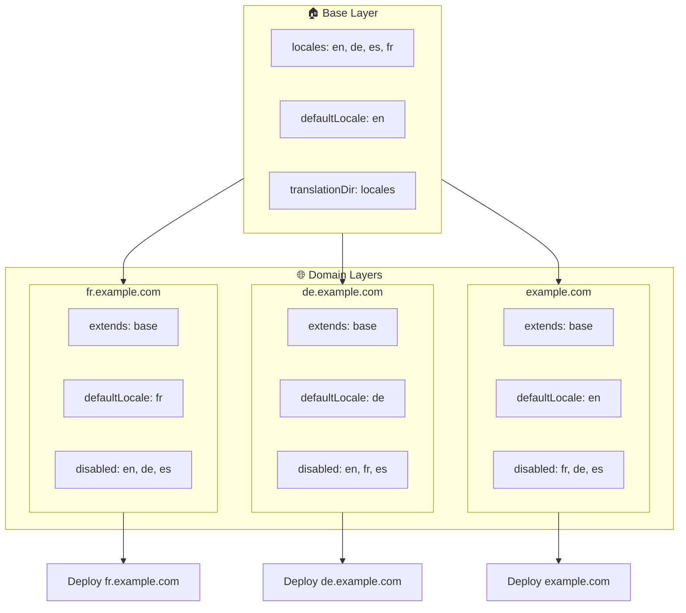

# 🌍 Multi-domein-locales opzetten met `Nuxt I18n Micro` via layers

## 📝 Inleiding

Door layers in `Nuxt I18n Micro` te gebruiken, kun je een flexibele en onderhoudbare multi-domein-lokalisatieopzet maken. Deze aanpak vereenvoudigt niet alleen het domeinbeheer door complexe functionaliteiten overbodig te maken, maar zorgt ook voor efficiënte lastverdeling en verminderde projectcomplexiteit. Door aparte projecten voor verschillende locales te draaien, kan je applicatie eenvoudig schalen en zich aanpassen aan variërende locale-eisen over meerdere domeinen, wat een robuuste en schaalbare oplossing biedt voor globale applicaties.

## 🎯 Doel

Een opzet creëren waarbij verschillende domeinen specifieke locales bedienen door configuraties in child-layers aan te passen. Deze methode gebruikt Nuxts layering-systeem, waardoor je een basisconfiguratie kunt behouden terwijl je deze voor elk domein uitbreidt of aanpast.

### Multi-domein-architectuur



## 🛠 Stappen om multi-domein-locales te implementeren

### 1. **Creëer de baselayer**

Begin met het maken van een basisconfiguratielayer die alle gemeenschappelijke locale-instellingen voor je applicatie bevat. Deze configuratie dient als fundament voor andere domeinspecifieke configuraties.

#### **Baselayer-configuratie**

Maak het basisconfiguratiebestand `base/nuxt.config.ts` aan:

```typescript
// base/nuxt.config.ts

export default defineNuxtConfig({
  i18n: {
    locales: [
      { code: 'en', iso: 'en-US', dir: 'ltr' },
      { code: 'de', iso: 'de-DE', dir: 'ltr' },
      { code: 'es', iso: 'es-ES', dir: 'ltr' },
    ],
    defaultLocale: 'en',
    translationDir: 'locales',
    meta: true,
    autoDetectLanguage: true,
  },
})
```

### 2. **Creëer domeinspecifieke child-layers**

Maak voor elk domein een child-layer die de basisconfiguratie aanpast aan de specifieke eisen van dat domein. Je kunt locales uitschakelen die niet nodig zijn voor een specifiek domein.

#### **Voorbeeld: configuratie voor het Franse domein**

Maak een child-layerconfiguratie voor het Franse domein in `fr/nuxt.config.ts`:

```typescript
// fr/nuxt.config.ts

export default defineNuxtConfig({
  extends: '../base', // Inherit from the base configuration

  i18n: {
    locales: [
      { code: 'en', iso: 'en-US', dir: 'ltr', disabled: true }, // Disable English
      { code: 'fr', iso: 'fr-FR', dir: 'ltr' }, // Add and enable the French locale
      { code: 'de', iso: 'de-DE', dir: 'ltr', disabled: true }, // Disable German
      { code: 'es', iso: 'es-ES', dir: 'ltr', disabled: true }, // Disable Spanish
    ],
    defaultLocale: 'fr', // Set French as the default locale
    autoDetectLanguage: false, // Disable automatic language detection
  },
})
```

#### **Voorbeeld: configuratie voor het Duitse domein**

Maak op vergelijkbare wijze een child-layerconfiguratie voor het Duitse domein in `de/nuxt.config.ts`:

```typescript
// de/nuxt.config.ts

export default defineNuxtConfig({
  extends: '../base', // Inherit from the base configuration

  i18n: {
    locales: [
      { code: 'en', iso: 'en-US', dir: 'ltr', disabled: true }, // Disable English
      { code: 'fr', iso: 'fr-FR', dir: 'ltr', disabled: true }, // Disable French
      { code: 'de', iso: 'de-DE', dir: 'ltr' }, // Use the German locale
      { code: 'es', iso: 'es-ES', dir: 'ltr', disabled: true }, // Disable Spanish
    ],
    defaultLocale: 'de', // Set German as the default locale
    autoDetectLanguage: false, // Disable automatic language detection
  },
})
```

### 3. **Deploy de applicatie voor elk domein**

Deploy de applicatie met de juiste configuratie voor elk domein. Bijvoorbeeld:

- Deploy de `fr`-layerconfiguratie naar `fr.example.com`.
- Deploy de `de`-layerconfiguratie naar `de.example.com`.

### 4. **Zet meerdere projecten op voor verschillende locales**

Voor elke locale en elk domein moet je een aparte instantie van de applicatie draaien. Dit zorgt ervoor dat elk domein de juiste localeconfiguratie serveert, optimaliseert de lastverdeling en vereenvoudigt de projectstructuur. Door meerdere projecten te draaien die zijn afgestemd op elke locale, kun je een schone scheiding tussen configuraties behouden en de complexiteit van de algehele opzet verminderen.

### 5. **Configureer routing op basis van domein**

Zorg ervoor dat je routing zo is geconfigureerd dat gebruikers naar het juiste project worden geleid op basis van het domein dat ze bezoeken. Dit zorgt ervoor dat elk domein de juiste locale serveert, wat de gebruikerservaring verbetert en de consistentie over verschillende regio's behoudt.

### 6. **Deployen en verifiëren**

Zorg er na het configureren van de layers en het deployen ervan naar hun respectieve domeinen voor dat elk domein de juiste locale serveert. Test de applicatie grondig om te bevestigen dat de juiste locale wordt geladen, afhankelijk van het domein.

## 📝 Best practices

- **Houd de basisconfiguratie generiek**: De basisconfiguratie moet algemene instellingen bevatten die van toepassing zijn op alle domeinen.
- **Isoleer domeinspecifieke logica**: Houd domeinspecifieke configuraties in hun respectievelijke layers om duidelijkheid en scheiding van verantwoordelijkheden te behouden.

## 🎉 Conclusie

Door layers in `Nuxt I18n Micro` te gebruiken, kun je een flexibele en onderhoudbare multi-domein-lokalisatieopzet maken. Deze aanpak elimineert niet alleen de behoefte aan complexe domeinbeheerfunctionaliteiten, maar stelt je ook in staat om de last efficiënt te verdelen en de projectcomplexiteit te verminderen. Het draaien van aparte projecten voor verschillende locales zorgt ervoor dat je applicatie eenvoudig kan schalen en zich kan aanpassen aan verschillende localevereisten over verschillende domeinen, en biedt zo een robuuste en schaalbare oplossing voor globale applicaties.
