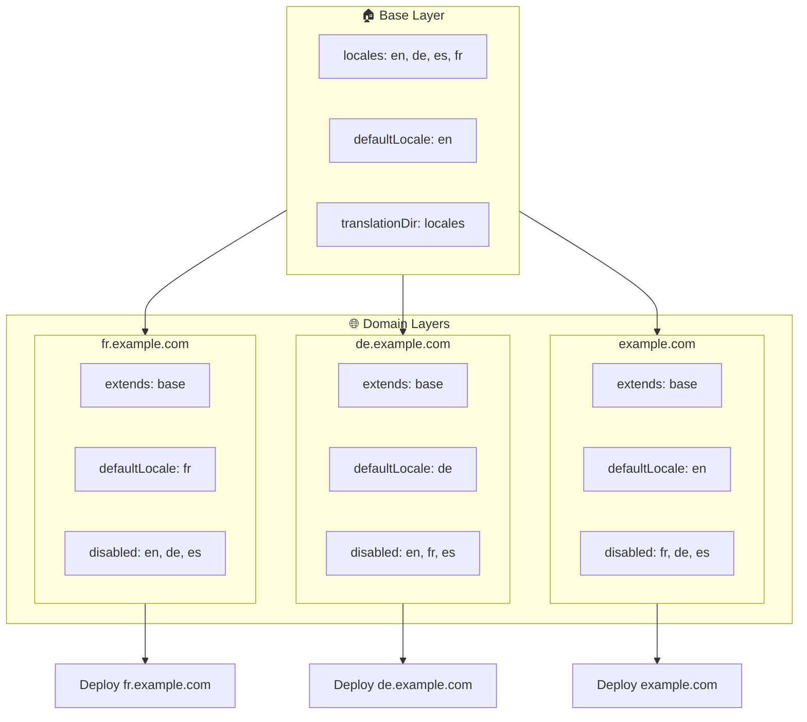

# 🌍 Multi-domain locales opzetten met `Nuxt I18n Micro` via lagen

## 📝 Inleiding

Door gebruik te maken van lagen in `Nuxt I18n Micro` kun je een flexibele en onderhoudbare multi-domain lokalisatie-setup opzetten. Deze aanpak vereenvoudigt domeinbeheer omdat complexe functionaliteit niet meer nodig is, verdeelt de belasting efficiënt en verlaagt de complexiteit van het project. Door aparte projecten voor verschillende locales te draaien, kan je applicatie eenvoudig opschalen en zich aanpassen aan uiteenlopende locale-vereisten over meerdere domeinen. Dit biedt een robuuste en schaalbare oplossing voor wereldwijde applicaties.

## 🎯 Doel

Een setup maken waarin verschillende domeinen specifieke locales serveren door configuraties in onderliggende lagen aan te passen. Deze methode benut het lagensysteem van Nuxt, waarmee je een basisconfiguratie kunt behouden en die per domein kunt uitbreiden of aanpassen.

### Multi-domain-architectuur



## 🛠 Stappen om multi-domain locales te implementeren

### 1. **Maak de basislaag**

Begin met een basisconfiguratielaag die alle gemeenschappelijke locale-instellingen voor je applicatie bevat. Deze configuratie fungeert als fundament voor andere domeinspecifieke configuraties.

#### **Basislaag-configuratie**

Maak het basisconfiguratiebestand `base/nuxt.config.ts`:

```typescript
// base/nuxt.config.ts

export default defineNuxtConfig({
  i18n: {
    locales: [
      { code: 'en', iso: 'en-US', dir: 'ltr' },
      { code: 'de', iso: 'de-DE', dir: 'ltr' },
      { code: 'es', iso: 'es-ES', dir: 'ltr' },
    ],
    defaultLocale: 'en',
    translationDir: 'locales',
    meta: true,
    autoDetectLanguage: true,
  },
})
```

### 2. **Maak domeinspecifieke onderliggende lagen**

Maak voor elk domein een onderliggende laag die de basisconfiguratie aanpast aan de specifieke vereisten van dat domein. Je kunt locales uitschakelen die niet nodig zijn voor een specifiek domein.

#### **Voorbeeld: configuratie voor het Franse domein**

Maak een configuratie voor de onderliggende laag voor het Franse domein in `fr/nuxt.config.ts`:

```typescript
// fr/nuxt.config.ts

export default defineNuxtConfig({
  extends: '../base', // Erf van de basisconfiguratie

  i18n: {
    locales: [
      { code: 'en', iso: 'en-US', dir: 'ltr', disabled: true }, // Schakel Engels uit
      { code: 'fr', iso: 'fr-FR', dir: 'ltr' }, // Voeg de Franse locale toe en zet die aan
      { code: 'de', iso: 'de-DE', dir: 'ltr', disabled: true }, // Schakel Duits uit
      { code: 'es', iso: 'es-ES', dir: 'ltr', disabled: true }, // Schakel Spaans uit
    ],
    defaultLocale: 'fr', // Stel Frans in als standaardlocale
    autoDetectLanguage: false, // Schakel automatische taaldetectie uit
  },
})
```

#### **Voorbeeld: configuratie voor het Duitse domein**

Maak op vergelijkbare wijze een configuratie voor de onderliggende laag voor het Duitse domein in `de/nuxt.config.ts`:

```typescript
// de/nuxt.config.ts

export default defineNuxtConfig({
  extends: '../base', // Erf van de basisconfiguratie

  i18n: {
    locales: [
      { code: 'en', iso: 'en-US', dir: 'ltr', disabled: true }, // Schakel Engels uit
      { code: 'fr', iso: 'fr-FR', dir: 'ltr', disabled: true }, // Schakel Frans uit
      { code: 'de', iso: 'de-DE', dir: 'ltr' }, // Gebruik de Duitse locale
      { code: 'es', iso: 'es-ES', dir: 'ltr', disabled: true }, // Schakel Spaans uit
    ],
    defaultLocale: 'de', // Stel Duits in als standaardlocale
    autoDetectLanguage: false, // Schakel automatische taaldetectie uit
  },
})
```

### 3. **Deploy de applicatie voor elk domein**

Deploy de applicatie met de juiste configuratie voor elk domein. Bijvoorbeeld:

- Deploy de `fr`-laagconfiguratie naar `fr.example.com`.
- Deploy de `de`-laagconfiguratie naar `de.example.com`.

### 4. **Zet meerdere projecten op voor verschillende locales**

Voor elke locale en elk domein moet je een aparte instantie van de applicatie draaien. Zo garandeert elk domein de juiste locale-configuratie, optimaliseer je de belastingsverdeling en vereenvoudig je de projectstructuur. Door meerdere projecten te draaien die op elke locale zijn afgestemd, houd je een schone scheiding tussen configuraties en verlaag je de complexiteit van de gehele setup.

### 5. **Configureer routering op basis van domein**

Zorg dat je routering gebruikers naar het juiste project stuurt op basis van het domein dat ze bezoeken. Zo serveert elk domein de juiste locale, wat de gebruikerservaring verbetert en consistentie tussen regio's behoudt.

### 6. **Deploy en verifieer**

Nadat je de lagen hebt geconfigureerd en naar de bijbehorende domeinen hebt gedeployed, controleer je of elk domein de juiste locale serveert. Test de applicatie grondig om te bevestigen dat de juiste locale wordt geladen op basis van het domein.

## 📝 Best practices

- **Houd de basisconfiguratie generiek**: De basisconfiguratie moet algemene instellingen bevatten die op alle domeinen van toepassing zijn.
- **Isoleer domeinspecifieke logica**: Houd domeinspecifieke configuraties in de bijbehorende lagen om duidelijkheid en scheiding van verantwoordelijkheden te behouden.

## 🎉 Conclusie

Door lagen in `Nuxt I18n Micro` te gebruiken, kun je een flexibele en onderhoudbare multi-domain lokalisatie-setup opzetten. Deze aanpak elimineert de noodzaak voor complexe domeinbeheerfunctionaliteit, verdeelt de belasting efficiënt en verlaagt de projectcomplexiteit. Aparte projecten voor verschillende locales draaien, zorgt ervoor dat je applicatie eenvoudig kan opschalen en zich kan aanpassen aan verschillende locale-vereisten over diverse domeinen, wat een robuuste en schaalbare oplossing biedt voor wereldwijde applicaties.
