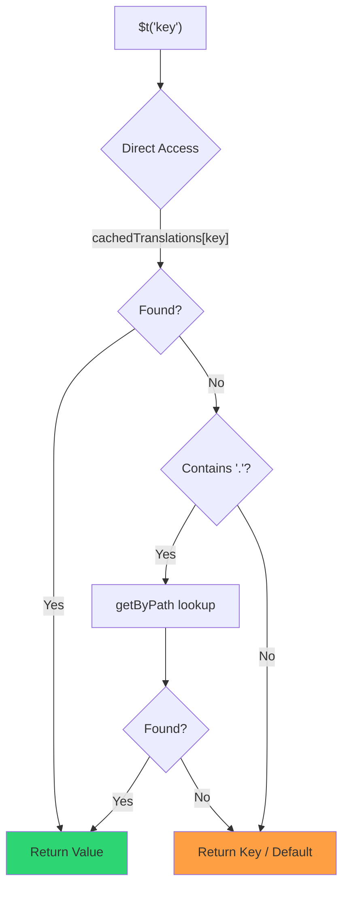

# 🚀 Prestatiegids

## 📖 Inleiding

`Nuxt I18n Micro` is ontworpen met prestaties in gedachten en biedt een aanzienlijke verbetering ten opzichte van traditionele internationalisatiemodules (i18n) zoals `nuxt-i18n`. Deze gids biedt een diepgaand overzicht van de prestatievoordelen van het gebruik van `Nuxt I18n Micro` en hoe het zich verhoudt tot andere oplossingen.

## 🤔 Waarom focussen op prestaties?

In grootschalige projecten en omgevingen met veel verkeer kunnen prestatiebottlenecks leiden tot trage buildtijden, hoger geheugengebruik en slechte serverresponstijden. Deze problemen worden nog groter bij complexe i18n-opzetten met grote vertaalbestanden. `Nuxt I18n Micro` is gebouwd om deze uitdagingen direct aan te pakken door te optimaliseren voor snelheid, geheugenefficiëntie en minimale impact op de bundlegrootte van je applicatie.

## 📊 Prestatievergelijking

We hebben een reeks tests uitgevoerd op identieke fixtures via `pnpm test:performance` (`pnpm -C scripts cli performance`) tegen **`@nuxtjs/i18n@10.6.0`**. Volledige methodologie en grafieken: [Prestatietestresultaten](/guides/performance-results).

Standaard CLI-profiel: **4 locales** × **2 pagina's** (`index`, `page`) × ~10k index leaf keys. Verhoog `--locales` / `--keys` voor een zwaardere regressie-radar-belasting. Het rapport splitst **code**, **translations** (inclusief `@nuxtjs/i18n` `chunks/raw/*`) en **totaal** deploybare output.

```bash
pnpm test:performance
pnpm -C scripts cli performance --only micro --skip-stress
pnpm -C scripts cli performance --locales 12 --keys 100000 --runs 3
```

### ⏱️ Buildtijd en resourceverbruik

<Accordion title="**@nuxtjs/i18n v10.6**">
- **Code Bundle**: 2,16 MB
- **Translations**: 7,21 MB (message chunks + locale-payloads)
- **Totaal deploybaar**: 9,37 MB
- **Max. geheugengebruik**: 1.821 MB
- **Verstreken tijd**: 8,34s (gemiddelde van 3)
</Accordion>

<Tip>
- **Code Bundle**: 1,74 MB — **~19% kleinere code dan `@nuxtjs/i18n` v10.6**
- **Translations**: 6,8 MB (lazy-loaded JSON)
- **Totaal deploybaar**: 8,54 MB
- **Max. geheugengebruik**: 1.065 MB — **~41% minder geheugen dan `@nuxtjs/i18n` v10.6**
- **Verstreken tijd**: 5,34s — **~36% sneller dan `@nuxtjs/i18n` v10.6** (≈ plain-nuxt baseline)
</Tip>

> Oudere docs die "code ≈ 15 MB / vertalingen 0 B" toonden voor `@nuxtjs/i18n`, telden `chunks/raw` message-bestanden mee als app-code. De huidige classifier scheidt ze; het verschil in **code** is kleiner, en micro blijft leiden op buildtijd, peak RSS en loadtests.

Zie het [volledige benchmarkrapport](/guides/performance-results) voor grafieken, Autocannon-resultaten en fixture-details.

### 🌐 Serverprestaties onder belasting

Artillery (6s@6 + 60s@60) en Autocannon (10c / 10s), gemiddelde van 3 opeenvolgende runs per fixture.

<Accordion title="**@nuxtjs/i18n v10.6**">
- **Verzoeken per seconde (Artillery)**: 143 [#/sec]
- **Gemiddelde responstijd**: 956 ms
- **Autocannon RPS / gem. latency**: 72 / 139 ms
</Accordion>

<Tip>
- **Verzoeken per seconde (Artillery)**: 275 [#/sec] — **~93% meer dan `@nuxtjs/i18n` v10.6**
- **Gemiddelde responstijd**: 483 ms — **~49% sneller dan `@nuxtjs/i18n` v10.6**
- **Autocannon RPS / gem. latency**: 162 / 62 ms
</Tip>

### 📈 Visuele vergelijking

<Note>
Interactieve grafiek weggelaten in Mintlify-docs. Zie de benchmarktabellen op deze pagina of de [VitePress-docs](https://s00d.github.io/nuxt-i18n-micro/guide/performance-results) voor grafiek: `chart`.
</Note>

<Note>
Interactieve grafiek weggelaten in Mintlify-docs. Zie de benchmarktabellen op deze pagina of de [VitePress-docs](https://s00d.github.io/nuxt-i18n-micro/guide/performance-results) voor grafiek: `chart`.
</Note>

| Metriek          | @nuxtjs/i18n v10.6 | i18n-micro | Verbetering        |
| --------------- | ------------------ | ---------- | ------------------ |
| Buildtijd      | 8,34s              | 5,34s      | **~36% sneller**    |
| Geheugen (build)  | 1.821 MB           | 1.065 MB   | **~41% minder**      |
| Code Bundle     | 2,16 MB            | 1,74 MB    | **~19% kleiner**   |
| Responstijd   | 956 ms             | 483 ms     | **~49% sneller**    |
| RPS (Artillery) | 143                | 275        | **~93% meer**      |

### 🔍 Interpretatie van resultaten

Tegen de huidige `@nuxtjs/i18n` **v10.6** (standaard CLI-profiel, gemiddelde van 3):

- 🗜️ **Kleinere codegraaf**: ~1,74 MB versus ~2,16 MB zodra message chunks niet meer verkeerd als "code" worden gelabeld.
- 🧠 **Lager build-RSS**: ~1,1 GB piek versus ~1,8 GB.
- 🕒 **Snellere builds**: ~5,3s versus ~8,3s (micro matcht de plain-Nuxt-baseline op dit profiel).
- ⚡ **Veel beter onder belasting**: ~275 versus ~143 Artillery RPS, ~162 versus ~72 Autocannon RPS, lagere gemiddelde latency.

Absolute getallen verschillen van eerder gepubliceerde tabellen (kleinere woordenboeken, oudere Nuxt en een oneerlijke "0 B translations"-splitsing voor `@nuxtjs/i18n`). Richtinggevend hetzelfde: micro blijft voor op buildkosten en request-throughput.

## ⚙️ Belangrijkste optimalisaties

### 🛠️ Minimalistisch ontwerp

`Nuxt I18n Micro` is gebouwd rond een minimalistische architectuur met een kleine kern en toegewijde strategiepakketten. Dit vermindert de overhead en vereenvoudigt de interne logica, wat leidt tot betere prestaties.

### 🚦 Efficiënte routing

In v3 zijn routegeneratie en runtime-padlogica opgesplitst in speciale pakketten voor optimale tree-shaking:

- **`@i18n-micro/route-strategy`** — Buildtime-routegeneratie: breidt Nuxt-pagina's uit met gelokaliseerde routes. Alleen de geselecteerde strategie (`no_prefix`, `prefix`, `prefix_except_default`, `prefix_and_default`) wordt meegenomen.
- **`@i18n-micro/path-strategy`** — Runtime-padresolutie, redirects en linkgeneratie. Gebruikt pure functies en vooraf berekende contextvlaggen om allocaties op hot paths te minimaliseren. Subpath-exports (`/prefix`, `/no-prefix`, enz.) zorgen ervoor dat alleen de gekozen implementatie wordt gebundeld.

Deze aanpak houdt de routingconfiguratie lichtgewicht en zorgt voor snelle route-resolutie, ongeacht het aantal locales.

### 📂 Gestroomlijnd laden van vertalingen

De module ondersteunt alleen JSON-bestanden voor vertalingen, met een duidelijke scheiding tussen globale en pagina-specifieke bestanden. Dit zorgt ervoor dat alleen de nodige vertaaldata op elk moment wordt geladen, wat de prestaties verder verbetert.

### 🔒 GlobalThis-singletoncache

Vanaf v3.0.0 gebruikt de module een `globalThis`-singletonpatroon met `Symbol.for` om één cache-instantie voor het hele Node.js-proces te garanderen. Dit voorkomt:

- Cache-duplicatie wanneer dezelfde module meerdere keren wordt gebundeld
- Objectenrecreatie per verzoek die garbage-collection-druk veroorzaakt
- Geheugenlekken door verweesde cache-instanties

```mermaid
flowchart LR
    subgraph Process["Node.js Process"]
        G["globalThis[Symbol.for('CACHE')]"]

        subgraph R1["SSR Request 1"]
            P1[Plugin Instance] --> G
        end

        subgraph R2["SSR Request 2"]
            P2[Plugin Instance] --> G
        end

        subgraph R3["SSR Request 3"]
            P3[Plugin Instance] --> G
        end
    end

    G --> Cache["Single Map Instance"]
    Cache --> D1["en:index → translations"]
    Cache --> D2["en:about → translations"
```

```typescript
// Internal implementation pattern
const CACHE_KEY = Symbol.for('__NUXT_I18N_STORAGE_CACHE__')
if (!globalThis[CACHE_KEY]) {
  globalThis[CACHE_KEY] = new Map()
}
```

### ⚡ Geoptimaliseerde vertaalfunctie (tFast)

De `$t()`-functie gebruikt een directe lookup-strategie die is geoptimaliseerd voor snelheid:

1. **Vooraf berekende context**: Locale en routenaam worden één keer berekend tijdens navigatie, niet bij elke `$t()`-aanroep
2. **Single-source lookup**: Alle vertalingen (root + pagina-specifiek + fallback) worden bij het builden vooraf samengevoegd in één bestand per pagina — geen gelaagde zoekactie nodig
3. **Cumulatieve deep merge bij navigatie**: Bij navigatie binnen dezelfde locale worden vertalingen van de nieuwe pagina deep-merged (2 niveaus diep) in het actieve woordenboek, zodat sleutels van de vorige pagina zichtbaar blijven tijdens overgangsanimaties — zelfs wanneer pagina's overlappende geneste prefixes delen (bijv. beide pagina's hebben sleutels onder `common.*`)
4. **Garbage collection via `page:transition:finish`**: Nadat de overgangsanimatie volledig is voltooid, wordt het samengevoegde woordenboek vervangen door de schone vertalingen voor alleen de nieuwe pagina, waardoor geheugen van oude-paginasleutels vrijkomt
5. **Directe eigenschapstoegang**: Gebruikt `obj[key]` in plaats van Map-lookups voor hot paths



```typescript
// Simplified lookup logic — single active dictionary
let val = cachedTranslations[key]
if (val === undefined && key.includes('.')) {
  val = getByPath(cachedTranslations, key)
}
```

### 💉 Server-side load (geen HTML-embed)

Vertalingen die tijdens SSR worden geladen, blijven in het **servergeheugen** voor `$t` tijdens rendering. Ze worden **niet** gekopieerd naar `nuxtApp.payload` / het HTML-document (hetzelfde idee als `@nuxtjs/i18n` met `experimental.preload: false`).

Op de client `await`t `01.plugin.ts` `switchContext`, die `/\{apiBaseUrl\}/:page/:locale/data.json` laadt voordat de app verdergaat — één verzoek, geen inline blob van 8 MB.

`NuxtI18n` houdt nog steeds het actieve samengevoegde woordenboek (`cachedTranslations`) voor `$t()` / `$has()`. Navigaties binnen dezelfde locale deep-mergen paginachunks totdat `page:transition:finish` verouderde sleutels opruimt.

#### Waar het vandaag staat

De onderstaande getallen worden gelezen uit het budgetbestand dat `pnpm run budget:payload` meet en handhaaft.

{/* generated:payload-budget — do not edit; run `pnpm run docs:generate` */}

Gemeten op `playground` over `/`, `/de`:

| Meting | Grootte |
| --- | --- |
| Vertaalbronnen op schijf | 15,2 MB |
| Als aparte payload-bestanden geserveerd | 76,3 MB |
| Grootste inline `__NUXT_DATA__` | 6,9 MB |
| Client-assets | 449,5 KB |

De playground draagt een bewust overdreven woordenboek mee, dus dit zijn geen getallen om van een echte
applicatie te verwachten — ze zijn een vast punt om tegen af te meten. Het budget faalt wanneer ze
onverwacht groeien, en zo wordt een onbedoelde wijziging in wat de payload meedraagt opgemerkt.

{/* /generated:payload-budget */}

### 💾 Caching en pre-rendering

Vertalingen doorlopen verschillende caches, en weten welke een verzoek heeft beantwoord is het
verschil tussen een debugsessie van vijf minuten en vijf uur. Er zijn er vier, in de
volgorde waarin een verzoek ze tegenkomt:

| Laag | Waar | Levensduur | Gewist door |
| --- | --- | --- | --- |
| Browser / CDN | `Cache-Control` op `/\{apiBaseUrl\}/**` | `httpCacheDuration`, `immutable` | een nieuwe `?v=` — d.w.z. een deploy die vertalingen wijzigde |
| Nitro-routecache | `routeRules['/\{apiBaseUrl\}/**'].cache` | 60 s, stale-while-revalidate | server-restart |
| Serverloader | in-process `CacheControl`, gekaart op `locale:routeName` | proceslevensduur, of `cacheTtl` | server-restart, HMR in dev |
| Client-store | `translationStorage` + de actieve chunk in `NuxtI18n` | paginalevensduur | reload |

Twee regels voorkomen dat ze elkaar tegenspreken:

- **De Nitro-routecache bestaat alleen wanneer `?v=` bestaat.** Met een cache-buster is elke URL
  uniek voor zijn inhoud, dus die server-side cachen is vrij van staleness. Stel
  `dateBuild: 0` in en die laag wordt uitgeschakeld, want de URL is dan stabiel en de
  response zegt `must-revalidate` — een server-side cache zou tot een minuut lang uit een verouderde
  entry antwoorden en het stilletjes ondermijnen.
- **`immutable` vereist ook `?v=`.** Zonder buster is de header
  `public, max-age=0, must-revalidate`, wat `httpCacheDuration` ook zegt: een lange
  `max-age` op een URL die nooit verandert, pint de eerste response die een browser ooit zag.

<Warning>
Met `translationPayloads.publicAssets` (standaard in premerged-modus) worden payloads gekopieerd naar
`public/<apiBaseUrl>/\{page\}/\{locale\}/data.json`. Een platform dat die map zelf serveert
(Cloudflare Pages, Firebase Hosting, `npx serve`) past zijn eigen headers toe — de Nitro
`routeRules`-header bereikt alleen responses die via de server gaan. Stel het cachebeleid voor
die statische bestanden in in de eigen configuratie van het platform.
</Warning>

🏁 **Pre-rendering**: in premerged-modus schrijft `publicAssets` de client-URL-boom al naar
`public/`. Kies alleen voor `prerenderRoutes` als je Nitro handler-routes wilt laten materialiseren
wanneer die kopie is uitgeschakeld.

### 🗜️ Gecomprimeerde publieke payloads

Wanneer `nitro.compressPublicAssets` is ingeschakeld, krijgen de vertaalpayloads die naar de publieke
map worden gekopieerd ook `.gz`- en `.br`-broers en -zussen:

```ts
export default defineNuxtConfig({
  nitro: { compressPublicAssets: true },
})
```

Nitro comprimeert publieke assets vóór de hook die de payloads kopieert, dus zonder deze zouden ze
het ene ongecomprimeerde onderdeel van een statische build zijn. De module zet compressie niet zelf aan —
het past alleen de instelling toe die jij hebt gekozen. Selectie per encoding (`\{ gzip: true, brotli: false \}`) wordt
gerespecteerd.

Playground-indexpayload: 6.651.984 B raw, 1.012.831 B gzip, 821.617 B brotli.

### ☁️ Serverless payload-output

Op **Node** leest SSR vertaal-JSON uit `public/<apiBaseUrl>` (`readFile`, geen Nitro `serverAssets` / Rollup `raw:`). Op **Edge** embed Nitro `serverAssets` dezelfde boom (geef de voorkeur aan `mode: 'source'` voor grote catalogi).

```typescript
export default defineNuxtConfig({
  i18n: {
    translationPayloads: {
      serverAssets: true, // default — Node → public copy; Edge → serverAssets embed
      publicAssets: true, // default in premerged mode
    },
  },
})
```

Gebruik `translationPayloads.mode: 'source'` voor compacte Edge-embeds (en optionele compacte publieke kopieën):

```typescript
export default defineNuxtConfig({
  i18n: {
    translationPayloads: {
      mode: 'source',
    },
  },
})
```

`mode: 'source'` houdt layer-merged bronbestanden compact en merge root/pagina/fallback tijdens runtime via de ingebouwde `/_locales`-route (of Edge `assets:i18n`). Standaard schakelt het publieke asset-kopieën en geprerenderde payload-routes uit.

<Warning>
`prerenderRoutes` staat standaard op `false`. Met `mode: 'source'` staat ook `publicAssets` standaard op `false`. Pure statische hosting zonder Nitro/edge-runtime kan daarom geen vertalingen laden op de client, tenzij je één van deze outputs inschakelt, `serverHandler` beschikbaar houdt tijdens runtime of payloads extern host.

Standaard premerged + `publicAssets` plaatst `/\{apiBaseUrl\}/\{page\}/\{locale\}/data.json` al onder `public/`, zodat statische hosts client-fetches zonder Nitro kunnen serveren.
</Warning>

<Warning>
Het instellen van `apiBaseServerHost` of `apiBaseClientHost` verplaatst het serveren van payloads naar die origin, wat zijn eigen vereisten met zich meebrengt — zie [Configuratie → Externe CDN-hosts](/guides/configuration#external-cdn-hosts).
</Warning>

Of schakel afzonderlijke HTTP-/publieke outputs uit en host payloads extern:

```typescript
export default defineNuxtConfig({
  i18n: {
    apiBaseClientHost: 'https://cdn.example.com',
    apiBaseServerHost: 'https://cdn.example.com',
    translationPayloads: {
      serverHandler: false,
      publicAssets: false,
      prerenderRoutes: false,
    },
  },
})
```

Houd `serverHandler` ingeschakeld wanneer je vertrouwt op de ingebouwde lokale `/\{apiBaseUrl\}/:page/:locale/data.json`-route. Schakel het uit wanneer payloads extern worden gehost en `apiBaseServerHost` naar die externe origin verwijst. Schakel `prerenderRoutes` alleen in wanneer je Nitro nodig hebt om statische payload-routes te materialiseren en `publicAssets` ze niet al heeft geschreven.

Tijdens het builden waarschuwt de module wanneer de gegenereerde payload-output groter is dan `translationPayloads.warnFileCount` (standaard 500) of `translationPayloads.warnSizeBytes` (standaard 10 MB). Het waarschuwt ook wanneer alle lokale outputs zijn uitgeschakeld zonder dat externe payloadhosts zijn geconfigureerd.

## 📝 Tips om prestaties te maximaliseren

Hier zijn een paar tips om de beste prestaties uit `Nuxt I18n Micro` te halen:

- 📉 **Beperk locale-data**: Neem alleen de locales op die je nodig hebt in je project om de bundlegrootte klein te houden.
- 🗂️ **Gebruik pagina-specifieke vertalingen**: Organiseer je vertaalbestanden per pagina om onnodige data-laden te voorkomen.
- 💾 **Schakel caching in**: Gebruik de cachefuncties om serverbelasting te verminderen en responstijden te verbeteren.
- 🏁 **Maak gebruik van pre-rendering**: Pre-render je vertalingen om paginalaadtijden te versnellen en runtime-overhead te verminderen.

Voor gedetailleerde resultaten van de prestatietests, zie de [Prestatietestresultaten](/guides/performance-results).
