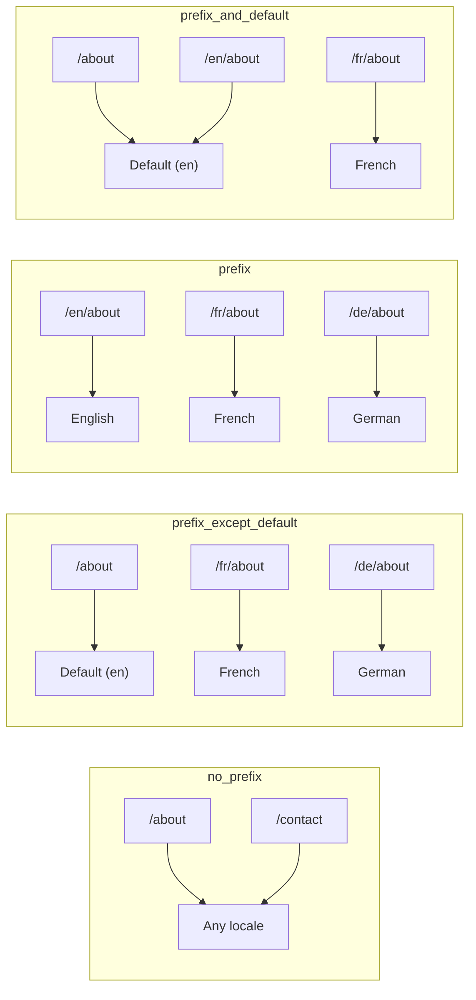
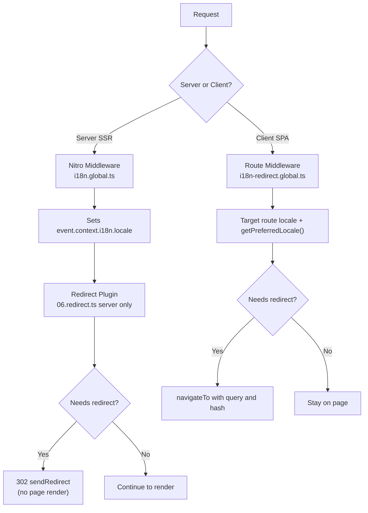

# 🗂️ Routingstrategieën in Nuxt I18n Micro

## 📖 Overzicht

Nuxt I18n Micro bepaalt hoe localeprefixes in URL's verschijnen via de optie `strategy`. Onder de motorkap implementeren twee pakketten dit:

- **`@i18n-micro/route-strategy`** — buildtime-routegeneratie (breidt Nuxt-pagina's uit met gelokaliseerde routes)
- **`@i18n-micro/path-strategy`** — runtime-padresolutie, redirects, SEO-attributen en linkgeneratie

De Nuxt-module selecteert bij het builden de juiste strategieklasse en aliast deze via `#i18n-strategy`, zodat alleen de gekozen implementatie wordt gebundeld.

## 🚦 Beschikbare strategieën

{/* generated:option:strategy — do not edit; run `pnpm run docs:generate` */}

**Type** `Strategies` · **Standaard** `'prefix_except_default'`

URL-routingstrategie voor localeprefixes.

- `'no_prefix'` — geen locale in URL; locale opgeslagen in cookie.
- `'prefix_except_default'` — prefix alle locales behalve de standaard.
- `'prefix'` — altijd prefixen, inclusief de standaardlocale.
- `'prefix_and_default'` — zoals `prefix`, maar de standaardlocale is ook toegankelijk zonder prefix.

{/* /generated:option:strategy */}

### Strategie-vergelijking



### 🛑 `no_prefix`

URL's hebben geen localesegment. Locale wordt bepaald door cookies, `useI18nLocale()`-state of browserdetectie.

- **Routes**: `/about`, `/contact` — hetzelfde URL-patroon voor alle locales (geen `/en/`, `/fr/`-prefix)
- **Localepersistentie**: Via `localeCookie` (automatisch ingesteld op `'user-locale'` als niet opgegeven)
- **Aangepaste paden**: Ondersteund via [`globalLocaleRoutes`](/guides/configuration#globallocaleroutes) en [`defineI18nRoute`](/guides/custom-locale-routes) — gelokaliseerde slugs worden gegenereerd zonder een localeprefix aan URL's toe te voegen (bijv. `/about` versus `/ueber-uns`). Geneste routes, aliassen en beperkingen per locale zijn eenvoudiger dan in `prefix_except_default`.

<Tip>
Bij gebruik van `no_prefix` wordt `localeCookie` automatisch ingesteld op `'user-locale'` als deze niet is opgegeven. Dit is vereist omdat de URL geen locale-informatie bevat.
</Tip>

```typescript
i18n: {
  strategy: 'no_prefix'
  // localeCookie is automatically set to 'user-locale'
}
```

### 🚧 `prefix_except_default`

Alle routes hebben een localeprefix **behalve** de standaardlocale.

- **Standaardlocale**: `/about`, `/contact`
- **Andere locales**: `/fr/about`, `/de/contact`
- **Standaardlocale met prefix geeft 404**: `/en/about` → 404 (wanneer `en` de standaard is)

```typescript
i18n: {
  strategy: 'prefix_except_default' // This is the default
}
```

### 🌍 `prefix`

Elke route heeft een localeprefix, inclusief de standaardlocale.

- **Alle locales**: `/en/about`, `/fr/about`, `/de/about`
- **Root `/`**: Redirect naar `/\{locale\}/` op basis van gebruikersvoorkeur

```typescript
i18n: {
  strategy: 'prefix'
}
```

### 🔄 `prefix_and_default`

Standaardlocale is zowel mét als zonder prefix beschikbaar. Niet-standaardlocales hebben altijd een prefix.

- **Standaardlocale**: zowel `/about` als `/en/about` zijn geldig
- **Andere locales**: `/fr/about`, `/de/about`
- **Geen redirect vanaf `/`**: Zowel `/` als `/en/` serveren de standaardlocale

```typescript
i18n: {
  strategy: 'prefix_and_default'
}
```

## 🔀 Redirect-architectuur (v3)

In v3 is redirect-logica opgesplitst in twee lagen voor optimale prestaties:

### Hoe het werkt



### Server-side (geen flash)

1. **Nitro-middleware** (`i18n.global.ts`) draait als eerste — detecteert locale uit URL, cookie of `Accept-Language`-header en stelt `event.context.i18n.locale` in
2. **Redirect-plugin** (`06.redirect.ts`, alleen server) controleert of het huidige pad een redirect nodig heeft via `i18nStrategy.getClientRedirect()` en geeft een 302 uit **voordat** enige paginarendering plaatsvindt
3. Dit voorkomt de "error flash" waarbij gebruikers kort een verkeerde pagina zien vóór een redirect

### Client-side (SPA-navigatie)

1. Globale route-middleware (`i18n-redirect.global.ts`) draait bij elke client-navigatie wanneer `redirects` is ingeschakeld
2. Leidt de voorkeurslocale eerst af uit de **doelroute** en valt daarna terug op `useI18nLocale().getPreferredLocale()`
3. Gebruikt `i18nStrategy.getClientRedirect()` om te bepalen of een redirect nodig is
4. Behoudt `query` en `hash` bij het redirecten

### Volgorde van localeprioriteit

Op de server bepaalt de redirect-plugin de voorkeurslocale in deze volgorde:

1. **`useState('i18n-locale')`** — hoogste prioriteit (programmatisch ingesteld via `useI18nLocale().setLocale()`)
2. **Cookie** — als `localeCookie` is geconfigureerd
3. **`Accept-Language`-header** — als `autoDetectLanguage: true`
4. **`defaultLocale`** — laatste fallback

Op de client geeft de route-middleware de voorkeur aan de locale uit de doelroute en gebruikt daarna dezelfde state-/cookie-fallback-keten.

### Redirect-gedrag per strategie

| Strategie                | Gedrag `GET /`                              | Cookie vereist? |
| ----------------------- | --------------------------------------------- | ---------------- |
| `no_prefix`             | Geen redirect (locale uit cookie/state)        | Auto-ingesteld         |
| `prefix`                | 302 → `/\{locale\}/`                            | Aanbevolen      |
| `prefix_except_default` | 302 → `/\{locale\}/` als locale ≠ standaard        | Aanbevolen      |
| `prefix_and_default`    | Geen redirect (zowel `/` als `/\{locale\}/` geldig) | Optioneel         |

### Redirects uitschakelen

```typescript
i18n: {
  redirects: false // Disables automatic locale redirects
}
```

Wanneer `redirects: false`, worden automatische locale-redirects uitgeschakeld:

- **Server**: de redirect-plugin (`06.redirect.ts`, alleen server) blijft geregistreerd, maar slaat redirect-logica over. Het voert nog steeds **404-checks** uit voor ongeldige localeprefixes (bijv. `/xx/about` waar `xx` geen geldige locale is) en **cookie-synchronisatie** vanuit de URL-prefix (bijv. het bezoek van `/fr/about` synchroniseert de cookie naar `fr`)
- **Client**: de globale route-middleware `i18n-redirect` is **niet geregistreerd** — geen SPA auto-redirects

## 🍪 Cookiegebaseerde localepersistentie

<Warning>
Bij gebruik van `prefix` of `prefix_except_default` met `redirects: true` (de standaard) **moet** je `localeCookie` instellen om redirects correct te laten werken. Zonder cookie kan de redirect-plugin de localevoorkeur van de gebruiker niet onthouden tussen paginalaadbeurten.

```typescript
i18n: {
  strategy: 'prefix_except_default',
  localeCookie: 'user-locale' // Required for redirects to work properly
}
```
</Warning>

**Hoe `localeCookie` werkt in v3:**

- Intern beheerd door `useI18nLocale()` — **stel deze niet handmatig in** via `useCookie()`
- Wanneer een gebruiker een geprefixte URL bezoekt (bijv. `/fr/about`), wordt de cookie automatisch gesynchroniseerd naar `fr`
- Bij een volgend bezoek aan `/` wordt de cookiewaarde gebruikt om te redirecten naar `/\{locale\}/`
- Als de cookie een ongeldige locale bevat (niet in de `locales`-lijst), wordt teruggevallen op `defaultLocale`

| Strategie                | `localeCookie`-standaard | Opmerkingen                                |
| ----------------------- | ---------------------- | ------------------------------------ |
| `no_prefix`             | Auto: `'user-locale'`  | Vereist; automatisch ingesteld          |
| `prefix`                | `null` (uitgeschakeld)      | Zet op `'user-locale'` voor redirects |
| `prefix_except_default` | `null` (uitgeschakeld)      | Zet op `'user-locale'` voor redirects |
| `prefix_and_default`    | `null` (uitgeschakeld)      | Optioneel                             |

## 🔍 `autoDetectLanguage` en `autoDetectPath`

### `autoDetectLanguage`

{/* generated:option:autoDetectLanguage — do not edit; run `pnpm run docs:generate` */}

**Type** `boolean` · **Standaard** `true`

Detecteert automatisch de voorkeurstaal van de gebruiker uit de HTTP-header `Accept-Language`.
Wordt gecombineerd met `autoDetectPath` om te bepalen wanneer detectie plaatsvindt.

{/* /generated:option:autoDetectLanguage */}

De check draait in de server-middleware en is een fallback: een cookie of bestaande state wint.

```typescript
i18n: {
  autoDetectLanguage: true
}
```

### `autoDetectPath`

{/* generated:option:autoDetectPath — do not edit; run `pnpm run docs:generate` */}

**Type** `string` · **Standaard** `'/'`

Waar cookie- / Accept-Language-voorkeur-redirects mogen draaien (wanneer `redirects` is ingeschakeld).

- `'/'` — alleen `/` (deep links in de standaardlocale blijven bereikbaar; standaard)
- `'no_prefix'` — alleen paden zonder localeprefix
- `'*'` — elk pad, inclusief het herschrijven van een expliciete localeprefix
  (bijv. `/fr/about` → `/de/about` wanneer de cookie `de` verkiest)

- elke andere string — exacte padmatch (bijv. `'/welcome'`)

Opruimen van geprefixte strategieën (bijv. `/en` → `/` onder `prefix_except_default`) wordt niet gefilterd.

{/* /generated:option:autoDetectPath */}

```typescript
i18n: {
  autoDetectPath: '/' // Default: only root
  // autoDetectPath: '*' // All paths — redirects even /fr/about to /de/about
}
```

<Warning>
Met `autoDetectPath: '*'` worden zelfs URL's met een expliciete localeprefix (bijv. `/fr/about`) geredirect als de voorkeurslocale van de gebruiker verschilt. Dit kan nuttig zijn voor domeingebaseerde opzetten, maar kan gebruikers verwarren die URL's delen.
</Warning>

Met de standaard `autoDetectPath: '/'` en een locale-cookie:

| verzoek | cookie | resultaat |
| --- | --- | --- |
| `/` | `de` | 302 → `/de` |
| `/about` | `de` | 200, standaardlocale (geen rewrite) |

```typescript
i18n: {
  localeCookie: 'user-locale',
  strategy: 'prefix_except_default',
  // Default — remember language on entry, keep deep links stable
  autoDetectPath: '/',
  // Or redirect on every unprefixed path (but not /de/… → /fr/…):
  // autoDetectPath: 'no_prefix',
}
```

## ⚠️ Bekende problemen en best practices

### 1. Hydratie-mismatch in `no_prefix`-strategie

Bij gebruik van `no_prefix` wordt de locale dynamisch bepaald. Als server en client het niet eens zijn over de locale, zie je een hydratie-mismatch.

**Oplossing**: Gebruik `useI18nLocale().setLocale()` in een serverplugin (met `order: -10`) om de locale in te stellen vóór de i18n-initialisatie:

```ts
// plugins/i18n-loader.server.ts
export default defineNuxtPlugin({
  name: 'i18n-custom-loader',
  enforce: 'pre',
  order: -10,
  setup() {
    const { setLocale } = useI18nLocale()
    setLocale('ja') // Your detection logic here
  },
})
```

Zie [Aangepaste taaldetectie](/guides/custom-language-detection) voor gedetailleerde voorbeelden.

### 2. Gebruik benoemde routes met `localeRoute`

Padgebaseerde routing kan problemen met route-resolutie veroorzaken:

```typescript
// May cause issues
$localeRoute('/page')

// Preferred approach
$localeRoute({ name: 'page' })
```

### 3. `pages: false` met i18n gebruiken

Bij gebruik van Nuxt met `pages: false`:

```typescript
export default defineNuxtConfig({
  pages: false,
  i18n: {
    strategy: 'no_prefix', // Recommended
    disablePageLocales: true, // Required
    localeCookie: 'user-locale', // Required for persistence
  },
})
```

**Beperkingen met `pages: false`:**

- Geen automatische redirects
- Geen URL-gebaseerde localedetectie
- Client-side localewisseling vereist een paginaherlaad of handmatige vertaal-laadbeurt

### 4. Ongeldige cookie-afhandeling

Als een cookie een ongeldige locale bevat (niet in de `locales`-lijst), valt de module gracieus terug op `defaultLocale`. Er worden geen fouten gegooid.

## 📝 Samenvatting van best practices

| Aanbeveling            | Details                                                                             |
| ------------------------- | ----------------------------------------------------------------------------------- |
| **Stel `localeCookie` in**    | Stel deze altijd in voor prefix-strategieën met `redirects: true`                             |
| **Gebruik `useI18nLocale()`** | De gecentraliseerde manier om localestate te beheren (vervangt handmatige `useState`/`useCookie`) |
| **Gebruik benoemde routes**      | `$localeRoute(\{ name: 'page' \})` boven `$localeRoute('/page')`                       |
| **Programmatische locale**   | Gebruik `useI18nLocale().setLocale()` in een serverplugin met `order: -10`              |
| **Vermijd handmatige cookies**  | Gebruik `useCookie('user-locale')` niet direct — `useI18nLocale()` beheert dit      |
