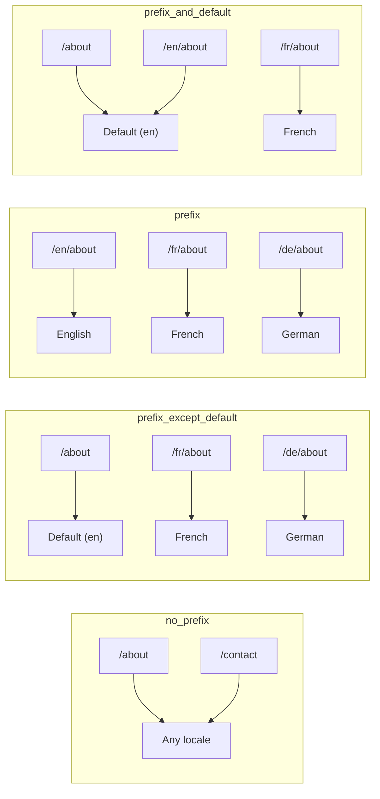
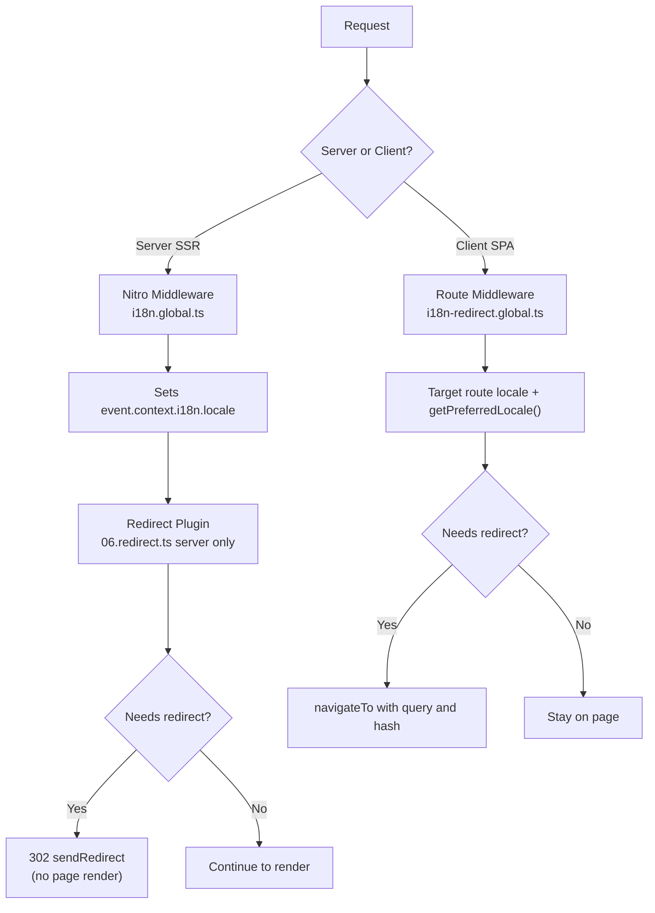

# 🗂️ Routeringsstrategieën in Nuxt I18n Micro

## 📖 Overzicht

Nuxt I18n Micro bepaalt via de optie `strategy` hoe locale-prefixen in URL's verschijnen. Onder de motorkap implementeren twee pakketten dit:

- **`@i18n-micro/route-strategy`** — build-time routegeneratie (breidt Nuxt-pagina's uit met gelokaliseerde routes)
- **`@i18n-micro/path-strategy`** — runtime padresolutie, redirects, SEO-attributen en linkgeneratie

De Nuxt-module selecteert de juiste strategieklasse tijdens de build en aliast deze via `#i18n-strategy`, zodat alleen de gekozen implementatie wordt gebundeld.

## 🚦 Beschikbare strategieën

{/* generated:option:strategy — do not edit; run `pnpm run docs:generate` */}

**Type** `Strategies` · **Default** `'prefix_except_default'`

URL-routeringsstrategie voor locale-prefixen.

- `'no_prefix'` — geen locale in URL; locale opgeslagen in een cookie.
- `'prefix_except_default'` — prefix alle locales behalve de standaard.
- `'prefix'` — altijd prefixen, inclusief de standaardlocale.
- `'prefix_and_default'` — zoals `prefix`, maar de standaardlocale is ook zonder prefix toegankelijk.

{/* /generated:option:strategy */}

### Vergelijking van strategieën



### 🛑 `no_prefix`

URL's hebben geen locale-segment. De locale wordt bepaald door cookies, de state van `useI18nLocale()` of browserdetectie.

- **Routes**: `/about`, `/contact` — hetzelfde URL-patroon voor alle locales (geen `/en/`- of `/fr/`-prefix)
- **Localepersistentie**: Via `localeCookie` (automatisch ingesteld op `'user-locale'` als niet opgegeven)
- **Custom paths**: Supported via [`globalLocaleRoutes`](/guides/configuration#globallocaleroutes) and [`defineI18nRoute`](/guides/custom-locale-routes) — localized slugs are generated without adding a locale prefix to URLs (bijv. `/about` vs `/ueber-uns`). Nested routes, aliases, and per-locale restrictions are simpler than in `prefix_except_default`.

<Tip>
Bij gebruik van `no_prefix`, `localeCookie` wordt automatisch ingesteld op `'user-locale'` als deze niet is opgegeven. Dit is vereist omdat de URL geen locale-informatie bevat.
</Tip>

```typescript
i18n: {
  strategy: 'no_prefix'
  // localeCookie is automatically set to 'user-locale'
}
```

### 🚧 `prefix_except_default`

Alle routes hebben een locale-prefix **behalve** de standaardlocale.

- **Standaardlocale**: `/about`, `/contact`
- **Andere locales**: `/fr/about`, `/de/contact`
- **Standaardlocale met prefix retourneert 404**: `/en/about` → 404 (wanneer `en` de standaard is)

```typescript
i18n: {
  strategy: 'prefix_except_default' // This is the default
}
```

### 🌍 `prefix`

Elke route heeft een locale-prefix, ook de standaardlocale.

- **All locales**: `/en/about`, `/fr/about`, `/de/about`
- **Root `/`**: Redirects to `/\{locale\}/` based on user preference

```typescript
i18n: {
  strategy: 'prefix'
}
```

### 🔄 `prefix_and_default`

Default locale is available both with and without prefix. Non-standaardlocales altijd have a prefix.

- **Default locale**: both `/about` and `/en/about` are valid
- **Other locales**: `/fr/about`, `/de/about`
- **No redirect from `/`**: Both `/` and `/en/` serve de standaardlocale

```typescript
i18n: {
  strategy: 'prefix_and_default'
}
```

## 🔀 Redirect Architecture (v3)

In v3, redirect logic is split into two layers for optimal performance:

### How It Works



### Server-Side (No Flash)

1. **Nitro middleware** (`i18n.global.ts`) runs first — detects locale from URL, cookie, or `Accept-Language` header and sets `event.context.i18n.locale`
2. **Redirect plugin** (`06.redirect.ts`, server-only) checks if the current path needs a redirect using `i18nStrategy.getClientRedirect()` and issues a 302 **before** any page rendering occurs
3. This prevents the "error flash" where users briefly see a wrong page before redirect

### Client-Side (SPA Navigation)

1. Global route middleware (`i18n-redirect.global.ts`) runs on each client navigation when `redirects` is enabled
2. Derives the preferred locale from the **target route** first, then falls back to `useI18nLocale().getPreferredLocale()`
3. Uses `i18nStrategy.getClientRedirect()` to decide whether a redirect is needed
4. Preserves `query` and `hash` when redirecting

### Locale Priority Order

On the server, the redirect plugin determines the preferred locale in this order:

1. **`useState('i18n-locale')`** — highest priority (set programmatisch via `useI18nLocale().setLocale()`)
2. **Cookie** — if `localeCookie` is configured
3. **`Accept-Language` header** — if `autoDetectLanguage: true`
4. **`defaultLocale`** — final fallback

On the client, the route middleware prefers the locale from the target route, then uses the same state/cookie fallback chain.

### Redirect Behavior Per Strategy

| Strategy                | `GET /` behavior                              | Cookie required? |
| ----------------------- | --------------------------------------------- | ---------------- |
| `no_prefix`             | No redirect (locale from cookie/state)        | Auto-set         |
| `prefix`                | 302 → `/\{locale\}/`                            | Recommended      |
| `prefix_except_default` | 302 → `/\{locale\}/` if locale ≠ default        | Recommended      |
| `prefix_and_default`    | No redirect (both `/` and `/\{locale\}/` valid) | Optional         |

### Disabling Redirects

```typescript
i18n: {
  redirects: false // Disables automatic locale redirects
}
```

When `redirects: false`, automatic locale redirects are disabled:

- **Server**: the redirect plugin (`06.redirect.ts`, server-only) remains registered but skips redirect logic. It still performs **404 checks** for invalid locale prefixes (bijv. `/xx/about` where `xx` is not a valid locale) and **cookie synchronization** from URL prefix (bijv. visiting `/fr/about` syncs the cookie to `fr`)
- **Client**: the `i18n-redirect` global route middleware is **not registered** — no SPA auto-redirects

## 🍪 Cookie-Based Locale Persistence

<Warning>
Bij gebruik van `prefix` or `prefix_except_default` with `redirects: true` (the default), you **must** set `localeCookie` for redirects to work correctly. Without a cookie, the redirect plugin cannot remember the user's locale preference across page reloads.

```typescript
i18n: {
  strategy: 'prefix_except_default',
  localeCookie: 'user-locale' // Required for redirects to work properly
}
```
</Warning>

**How `localeCookie` works in v3:**

- Managed internally by `useI18nLocale()` — **do not set it handmatig** via `useCookie()`
- Wanneer een user visits a prefixed URL (bijv., `/fr/about`), the cookie is automatisch synced to `fr`
- On next visit to `/`, the cookie value wordt gebruikt om redirect to `/\{locale\}/`
- If the cookie contains an invalid locale (not in `locales` list), it falls back to `defaultLocale`

| Strategy                | `localeCookie` default | Notes                                |
| ----------------------- | ---------------------- | ------------------------------------ |
| `no_prefix`             | Auto: `'user-locale'`  | Required; set automatisch          |
| `prefix`                | `null` (disabled)      | Set to `'user-locale'` for redirects |
| `prefix_except_default` | `null` (disabled)      | Set to `'user-locale'` for redirects |
| `prefix_and_default`    | `null` (disabled)      | Optional                             |

## 🔍 `autoDetectLanguage` and `autoDetectPath`

### `autoDetectLanguage`

{/* generated:option:autoDetectLanguage — do not edit; run `pnpm run docs:generate` */}

**Type** `boolean` · **Default** `true`

Automatically detect the user's preferred language from the `Accept-Language` HTTP header.
Used in combination with `autoDetectPath` to decide when detection occurs.

{/* /generated:option:autoDetectLanguage */}

The check runs in the server middleware and is a fallback: a cookie or existing state wins.

```typescript
i18n: {
  autoDetectLanguage: true
}
```

### `autoDetectPath`

{/* generated:option:autoDetectPath — do not edit; run `pnpm run docs:generate` */}

**Type** `string` · **Default** `'/'`

Where cookie / Accept-Language preference redirects may run (when `redirects` is enabled).

- `'/'` — only `/` (deep links in de standaardlocale stay reachable; default)
- `'no_prefix'` — only paths without a locale prefix
- `'*'` — every path, including rewriting an explicit locale prefix
  (bijv. `/fr/about` → `/de/about` when the cookie prefers `de`)

- any other string — exact path match (bijv. `'/welcome'`)

Prefixed strategy cleanup (bijv. `/en` → `/` under `prefix_except_default`) is not gated.

{/* /generated:option:autoDetectPath */}

```typescript
i18n: {
  autoDetectPath: '/' // Default: only root
  // autoDetectPath: '*' // All paths — redirects even /fr/about to /de/about
}
```

<Warning>
With `autoDetectPath: '*'`, even URLs with an explicit locale prefix (bijv., `/fr/about`) zal worden redirected if the user's preferred locale differs. Dit kan zijn useful for domain-based setups but may confuse users who share URLs.
</Warning>

With the default `autoDetectPath: '/'` and a locale cookie:

| request | cookie | result |
| --- | --- | --- |
| `/` | `de` | 302 → `/de` |
| `/about` | `de` | 200, standaardlocale (no rewrite) |

```typescript
i18n: {
  localeCookie: 'user-locale',
  strategy: 'prefix_except_default',
  // Default — remember language on entry, keep deep links stable
  autoDetectPath: '/',
  // Or redirect on every unprefixed path (but not /de/… → /fr/…):
  // autoDetectPath: 'no_prefix',
}
```

## ⚠️ Known Issues and Best Practices

### 1. Hydration Mismatch in `no_prefix` Strategy

Bij gebruik van `no_prefix`, the locale is determined dynamisch. If server and client disagree on the locale, you'll see a hydration mismatch.

**Solution**: Gebruik `useI18nLocale().setLocale()` in a server plugin (with `order: -10`) to set the locale before i18n initialization:

```ts
// plugins/i18n-loader.server.ts
export default defineNuxtPlugin({
  name: 'i18n-custom-loader',
  enforce: 'pre',
  order: -10,
  setup() {
    const { setLocale } = useI18nLocale()
    setLocale('ja') // Your detection logic here
  },
})
```

See [Custom Language Detection](/guides/custom-language-detection) for detailed examples.

### 2. Use Named Routes with `localeRoute`

Path-based routing can cause issues with route resolution:

```typescript
// May cause issues
$localeRoute('/page')

// Preferred approach
$localeRoute({ name: 'page' })
```

### 3. Using `pages: false` with i18n

Bij gebruik van Nuxt with `pages: false`:

```typescript
export default defineNuxtConfig({
  pages: false,
  i18n: {
    strategy: 'no_prefix', // Recommended
    disablePageLocales: true, // Required
    localeCookie: 'user-locale', // Required for persistence
  },
})
```

**Limitations with `pages: false`:**

- No automatic redirects
- No URL-based localedetectie
- Client-side localewisseling requires page reload or manual translation loading

### 4. Invalid Cookie Handling

If a cookie contains an invalid locale (not in the `locales` list), de module gracefully falls back to `defaultLocale`. No errors are thrown.

## 📝 Best Practices Summary

| Recommendation            | Details                                                                             |
| ------------------------- | ----------------------------------------------------------------------------------- |
| **Set `localeCookie`**    | Always set for prefix strategies with `redirects: true`                             |
| **Gebruik `useI18nLocale()`** | The centralized way to manage locale state (replaces manual `useState`/`useCookie`) |
| **Use named routes**      | `$localeRoute(\{ name: 'page' \})` over `$localeRoute('/page')`                       |
| **Programmatic locale**   | Gebruik `useI18nLocale().setLocale()` in a server plugin with `order: -10`              |
| **Avoid manual cookies**  | Don't use `useCookie('user-locale')` directly — `useI18nLocale()` manages this      |
