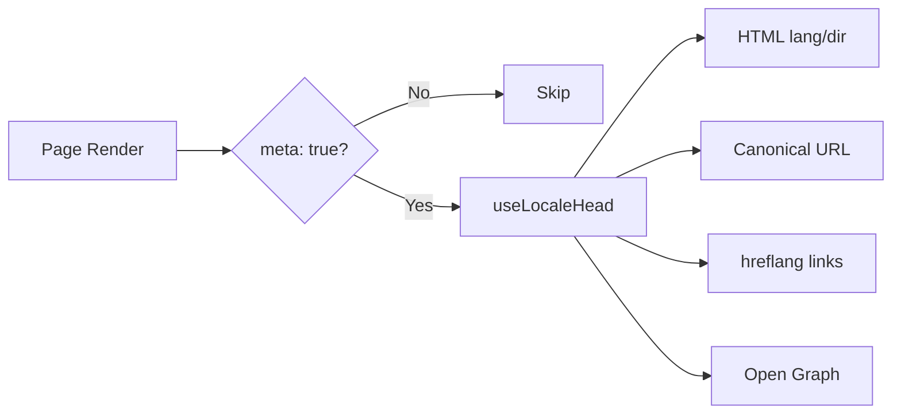

# 🌐 SEO-gids voor Nuxt I18n Micro

## 📖 Inleiding

Effectieve SEO (Search Engine Optimization) is essentieel om ervoor te zorgen dat je meertalige site wereldwijd toegankelijk en zichtbaar is voor gebruikers via zoekmachines. `Nuxt I18n Micro` vereenvoudigt het beheer van SEO voor meertalige sites door automatisch essentiële meta-tags en attributen te genereren die zoekmachines informeren over de structuur en inhoud van je site.

Deze gids legt uit hoe `Nuxt I18n Micro` SEO afhandelt om de zichtbaarheid en gebruikerservaring van je site te verbeteren zonder extra configuratie.

## ⚙️ Automatische SEO-afhandeling

### Stroom van SEO-metagegevensgeneratie



**Gegenereerde tags:**

| Tag             | Voorbeeld                                                  |
| --------------- | -------------------------------------------------------- |
| HTML-attributen | `<html lang="en" dir="ltr">`                             |
| Canonical       | `<link rel="canonical" href="...">`                      |
| hreflang        | `<link rel="alternate" hreflang="en" href="...">`        |
| x-default       | `<link rel="alternate" hreflang="x-default" href="...">` |
| Open Graph      | `<meta property="og:locale" content="en_US">`            |

#### `og` per locale (`og:locale` vs BCP 47)

`<html lang>` en `hreflang` gebruiken **BCP 47** via `locale.iso` (bijv. `ar-AE`).  
Open Graph vereist **`language_TERRITORY`** met een **underscore** (`ar_AE`), volgens het [OG-protocol](https://ogp.me/).

Standaard wordt `og:locale` afgeleid uit `iso` wanneer de mapping ondubbelzinnig is (`en-US` → `en_US`).  
Stel een expliciete **`og`**-string in wanneer je een aangepaste waarde nodig hebt (bijv. `zh-Hans` → `zh_CN`).  
Als noch `og` noch een converteerbare `iso` beschikbaar is, worden er geen `og:locale`-tags gegenereerd — in development krijg je een consolewaarschuwing (respecteert `missingWarn`).

```typescript
i18n: {
  meta: true,
  locales: [
    { code: 'ar', iso: 'ar-AE', og: 'ar_AE', dir: 'rtl' },
    { code: 'en', iso: 'en-US' }, // og:locale → en_US
    { code: 'zh', iso: 'zh-Hans', og: 'zh_CN' }, // script tags need explicit og
  ],
}
```

### 🔑 Belangrijkste SEO-functies

Wanneer de optie `meta` is ingeschakeld in `Nuxt I18n Micro`, beheert de module automatisch de volgende SEO-aspecten:

1. **🌍 Taal- en richtingattributen**:
   - De module stelt de `lang`- en `dir`-attributen op de `<html>`-tag in volgens de huidige locale en tekstrichting (bijv. `ltr` voor Engels of `rtl` voor Arabisch).

2. **🔗 Canonieke URL's**:
   - De module genereert een canonieke link (`<link rel="canonical">`) voor elke pagina, zodat zoekmachines de primaire versie van de inhoud herkennen.

3. **🌐 Alternatieve taallinks (`hreflang`)**:
   - De module genereert automatisch `<link rel="alternate" hreflang="">`-tags voor alle beschikbare locales. Dit helpt zoekmachines te begrijpen welke taalversies van je inhoud beschikbaar zijn, wat de gebruikerservaring voor een wereldwijd publiek verbetert.
   - Elke locale zendt **één** tag uit: `hreflang = iso || code`. Wanneer `iso` is ingesteld, wordt routing-`code` nooit gebruikt als `hreflang` (dus marktsleutels zoals `mx` worden geen ongeldige taalcodes).
   - Optionele `hreflangBaseLanguage: true` zendt ook een kale-taal-tag uit die is afgeleid van `iso` (bijv. `es-ES` → `es`), geclaimd door de eerste regionale locale in `locales`.

4. **🌏 `x-default`-hreflang**:
   - De module genereert automatisch een `<link rel="alternate" hreflang="x-default">`-tag die naar de URL van de standaardlocale wijst. Dit vertelt zoekmachines welke URL ze moeten tonen aan gebruikers wiens taal niet overeenkomt met een van de gedefinieerde locales. Geen extra configuratie nodig — het werkt automatisch wanneer `meta: true` is ingesteld.

5. **🔖 Open Graph-metadata**:
   - De module genereert Open Graph-metatags (`og:locale`, `og:url`, enz.) voor elke locale, wat vooral handig is voor het delen op sociale media en indexering door zoekmachines.

### 🛠️ Configuratie

Zorg ervoor dat de optie `meta` is ingesteld op `true` in je `nuxt.config.ts`-bestand om deze SEO-functies in te schakelen:

```typescript
export default defineNuxtConfig({
  modules: ['nuxt-i18n-micro'],
  i18n: {
    locales: [
      { code: 'en', iso: 'en-US', dir: 'ltr' },
      { code: 'fr', iso: 'fr-FR', dir: 'ltr' },
      { code: 'ar', iso: 'ar-SA', dir: 'rtl' },
    ],
    defaultLocale: 'en',
    translationDir: 'locales',
    meta: true, // Enables automatic SEO management
  },
})
```

### 🌍 Dynamische `metaBaseUrl` voor multi-domein-deployments

Wanneer `metaBaseUrl` niet is ingesteld, worden absolute SEO-URL's in deze volgorde opgelost (#240):

1. `site.url` van [`nuxt-site-config`](https://nuxtseo.com/docs/site-config) (als die module aanwezig is — bijv. via `@nuxtjs/seo`)
2. Anders de hostname uit het huidige verzoek (`useRequestURL()` / `window.location.origin`)

De request-origin-fallback respecteert reverse-proxy-headers (`X-Forwarded-Host`, `X-Forwarded-Proto`), dus werkt correct achter nginx, Cloudflare, AWS ALB en soortgelijke proxies.

Dit betekent dat apps die al `site.url` instellen voor sitemap / robots / schema.org **geen** tweede `metaBaseUrl`-declaratie nodig hebben:

```typescript
export default defineNuxtConfig({
  site: {
    url: process.env.NUXT_SITE_URL, // also used by micro for canonical / og:url / hreflang
  },
  i18n: {
    meta: true,
    // metaBaseUrl omitted — picks up site.url, then request origin
  },
})
```

Zonder `site.url` kan één applicatie-instantie nog steeds **meerdere domeinen** bedienen met correcte SEO-tags voor elk via de request-origin:

```typescript
export default defineNuxtConfig({
  i18n: {
    meta: true,
    // metaBaseUrl is undefined by default — resolved dynamically from the request
  },
})
```

Zo produceert een verzoek naar `https://site-a.com/en/about`:

```html
<link rel="canonical" href="https://site-a.com/en/about" /> <meta property="og:url" content="https://site-a.com/en/about" />
```

Terwijl dezelfde app die `https://site-b.com/en/about` bedient produceert:

```html
<link rel="canonical" href="https://site-b.com/en/about" /> <meta property="og:url" content="https://site-b.com/en/about" />
```

Als je een vaste base-URL nodig hebt die altijd voorrang heeft op `site.url`, geef een statische string door:

```typescript
metaBaseUrl: 'https://example.com'
```

### 🔍 Canonieke query-whitelist

Standaard worden queryparameters uit canonical en `og:url` gestript om duplicate content te voorkomen. Je kunt specifieke queryparameters whitelisten die behouden moeten blijven:

```typescript
i18n: {
  canonicalQueryWhitelist: ['page', 'sort', 'filter', 'search', 'q', 'query', 'tag']
}
```

Alleen parameters die in `canonicalQueryWhitelist` staan, verschijnen in canonieke URL's. Alle andere queryparameters (bijv. tracking, sessie-ID's) worden verwijderd.

### 🚫 Metatags uitschakelen per pagina

Je kunt SEO-metatag-generatie voor specifieke pagina's uitschakelen met `defineI18nRoute()`:

```vue
<script setup>
// Disable all SEO meta tags for this page
defineI18nRoute({
  disableMeta: true,
})
</script>
```

Je kunt meta ook alleen voor specifieke locales uitschakelen:

```vue
<script setup>
// Disable meta tags only for English locale on this page
defineI18nRoute({
  disableMeta: ['en'],
})
</script>
```

Wanneer `disableMeta` actief is, worden er geen `hreflang`-, `canonical`-, `og:locale`-, `og:url`- of `x-default`-tags gegenereerd voor de betreffende pagina/locale.

### 🔇 Uitgeschakelde locales

Locales met `disabled: true` worden automatisch uitgesloten van alle SEO-taggeneratie — er worden geen `hreflang`-, `og:locale:alternate`- of alternate-links voor gecreëerd:

```typescript
i18n: {
  locales: [
    { code: 'en', iso: 'en-US' },
    { code: 'fr', iso: 'fr-FR', disabled: true }, // excluded from SEO tags
  ]
}
```

### 🙈 Opt-out-locales (`seo: false`)

Voor locales die routeerbaar en vertaald moeten blijven, maar niet mogen verschijnen in cross-locale ontdekkingstags, stel `seo: false` in. Die locales worden weggelaten uit `hreflang`-alternates en `og:locale:alternate`. Als je geconfigureerde **standaard**-locale `seo: false` heeft, wordt de `x-default`-link ook niet uitgezonden.

```typescript
i18n: {
  locales: [
    { code: 'en', iso: 'en-US' },
    { code: 'ru', iso: 'ru-RU', seo: false }, // internal / non-indexed locale
  ]
}
```

### 📌 Strategie-specifiek gedrag

| Strategie                | hreflang-links   | x-default             | canonical      | og:url |
| ----------------------- | ---------------- | --------------------- | -------------- | ------ |
| `prefix`                | ✅ Alle locales   | ✅ URL van standaardlocale | ✅ Huidige URL | ✅     |
| `prefix_except_default` | ✅ Alle locales   | ✅ Niet-geprefixte URL     | ✅ Huidige URL | ✅     |
| `prefix_and_default`    | ✅ Alle locales   | ✅ URL van standaardlocale | ✅ Huidige URL | ✅     |
| `no_prefix`             | ❌ Niet gegenereerd | ❌ Niet gegenereerd      | ✅ Huidige URL | ✅     |

Voor de `no_prefix`-strategie worden alleen `canonical`, `og:url`, `og:locale` en `html`-attributen (`lang`, `dir`) gegenereerd. Alternatieve taallinks (`hreflang`) en `x-default` worden niet gegenereerd omdat er geen aparte URL's per locale zijn.

## Overrides op paginaniveau (`useI18nHead`)

Voor **artikelen, gidsen of andere CMS-inhoud** waar niet elke locale bestaat of URL's van een API komen, gebruik [`useI18nHead`](/api/composables/use-i18n-head) op de pagina in plaats van een aangepaste i18n-head-plugin.

### Artikel met gedeeltelijke vertalingen

```vue
<script setup lang="ts">
const article = await loadArticle()
// article.locales = { en: '...', de: '...' } — only translated locales

useI18nHead({
  meta: [{ property: 'og:title', content: article.title }],
  replace: {
    hreflang: Object.entries(article.locales).map(([locale, href]) => ({
      rel: 'alternate',
      hreflang: locale,
      href,
    })),
    ogAlternates: Object.keys(article.locales),
  },
})
</script>
```

### Slugs per locale met `$setI18nRouteParams`

Wanneer slugs per taal verschillen, stel eerst routeparameters in en overschrijf vervolgens de alternates met echte URL's:

```vue
<script setup lang="ts">
const { $defineI18nRoute, $setI18nRouteParams } = useNuxtApp()
const { data: article } = await useFetch(`/api/articles/${slug}`)

$defineI18nRoute({
  localeRoutes: { en: '/blog/[slug]', de: '/de/blog/[slug]' },
})

$setI18nRouteParams({
  en: { slug: article.value.slugEn },
  de: { slug: article.value.slugDe },
})

useI18nHead({
  replace: {
    hreflang: ['en', 'de'].map((locale) => ({
      rel: 'alternate',
      hreflang: locale,
      href: article.value.urls[locale],
    })),
    ogAlternates: ['en', 'de'],
  },
})
</script>
```

### HTTPS-origin achter een proxy

Voor correcte absolute URL's bij SSR zonder een aangepaste origin-composable:

```ts
i18n: {
  meta: true,
  metaBaseUrl: undefined,
  metaTrustForwardedHost: true,
  metaTrustForwardedProto: true,
}
```

Meer voorbeelden (canonical override, `x-default`, reactive fetch, gedeelde helpers): [useI18nHead-composable](/api/composables/use-i18n-head).

### ⚠️ Trailing slash

De module genereert canonical- en `hreflang`-URL's op basis van het werkelijke pad uit `useRoute().fullPath`. Als je applicatie trailing slashes gebruikt (bijv. via Nuxts `router.options`), zullen de gegenereerde URL's dit weerspiegelen. `$switchLocalePath` kan echter paden normaliseren en trailing slashes verwijderen. Als consistentie van trailing slashes cruciaal is voor je SEO, controleer dan of de gegenereerde URL's overeenkomen met de URL-structuur van je applicatie.

### 🎯 Voordelen

Door de optie `meta` in te schakelen, profiteer je van:

- **📈 Verbeterde zoekmachine-rankings**: Zoekmachines kunnen je site beter indexeren en begrijpen de relaties tussen verschillende taalversies.
- **👥 Betere gebruikerservaring**: Gebruikers krijgen de juiste taalversie aangeboden op basis van hun voorkeuren, wat leidt tot een meer gepersonaliseerde ervaring.
- **🔧 Minder handmatige configuratie**: De module handelt SEO-taken automatisch af, waardoor je geen SEO-gerelateerde metatags en attributen handmatig hoeft toe te voegen.

## 🔗 Nuxt SEO (`@nuxtjs/seo`)

[`@nuxtjs/seo`](https://nuxtseo.com/) bundelt sitemap, robots, schema.org, OG-afbeeldingen en gerelateerde modules. Het integreert met **nuxt-i18n-micro** via [`nuxt-site-config`](https://nuxtseo.com/docs/site-config/guides/i18n) (v4+).

### Vereisten

- **`@nuxtjs/seo` 3+** (huidige releases gebruiken `nuxt-site-config` 4+, dat de plugin `nuxt-site-config:i18n` voor micro registreert)
- **`i18n.meta: true`** (aanbevolen — micro levert locale-bewuste head-tags; Nuxt SEO voegt sitemap, schema.org, enz. toe)

### Modulevolgorde

Vermeld **nuxt-i18n-micro vóór `@nuxtjs/seo`** zodat site-config je locale-opzet kan lezen:

```typescript
export default defineNuxtConfig({
  modules: ['nuxt-i18n-micro', '@nuxtjs/seo'],
  site: {
    url: 'https://example.com',
    name: 'My Site',
  },
  i18n: {
    meta: true,
    defaultLocale: 'en',
    locales: [
      { code: 'en', iso: 'en-US' },
      { code: 'de', iso: 'de-DE' },
    ],
  },
})
```

### Vertaalde sitenaam & beschrijving

Nuxt Site Config leest optionele vertaalsleutels uit je localebestanden:

```json
{
  "nuxtSiteConfig": {
    "name": "My Site",
    "description": "My site description"
  }
}
```

Waarden per locale in `locales/en.json`, `locales/de.json`, enz. worden automatisch opgepakt.

### Troubleshooting

Als je `Plugin nuxt-seo:defaults depends on nuxt-site-config:i18n but they are not registered` ziet, upgrade dan **`@nuxtjs/seo` naar 3+** (zie [issue #133](https://github.com/s00d/nuxt-i18n-micro/issues/133)). Oudere `nuxt-site-config` 3.x heeft alleen i18n voor `@nuxtjs/i18n` aangesloten, niet voor micro.

Meer: [Sitemap i18n-gids](https://nuxtseo.com/docs/sitemap/guides/i18n), [Site Config i18n-gids](https://nuxtseo.com/docs/site-config/guides/i18n).
