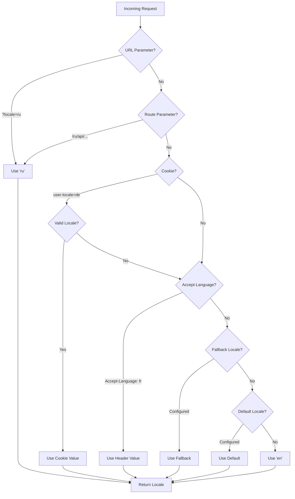

# 🌍 Server-side vertalingen en locale-informatie in Nuxt I18n Micro

## 📖 Overzicht

Nuxt I18n Micro ondersteunt server-side vertalingen en locale-informatie, waardoor je content kunt vertalen en localedetails op de server kunt benaderen. Dit is vooral handig voor API's of server-gerenderde applicaties waar lokalisatie nodig is voordat de client wordt bereikt.

De vertalingen gebruiken locale-berichten die zijn gedefinieerd in de Nuxt I18n-configuratie en worden dynamisch opgelost op basis van de gedetecteerde locale.

Standaard (`translationPayloads.mode: 'premerged'`) worden root-level bestanden bij het builden in elke pagina-payload gebakken als `\{page\}/\{locale\}/data.json`. De server laadt dezelfde vooraf gebouwde bestanden die de client ophaalt via `/\{apiBaseUrl\}/...`, zodat alle sleutels (zowel gedeeld als pagina-specifiek) beschikbaar zijn in serverhandlers.

Met `translationPayloads.mode: 'source'` worden compacte bronbestanden tijdens runtime samengevoegd wanneer `loadTranslationsFromServer()` (of de `/_locales`-route) wordt aangeroepen — op **Edge** via Nitro `serverAssets`, op **Node** vanuit de optionele publieke kopie. Zie de [Prestatiegids — Serverless Payload Output](/guides/performance#serverless-payload-output) en [Cache- & opslagarchitectuur](/api/cache) voor details.

Voor een gebundelde lijst van runtime- en server-API's, zie de [API-referentie](/api/overview).

## 🛠️ Server-side middleware opzetten

Om server-side vertalingen en locale-informatie in te schakelen, gebruik de geleverde middleware-functies:

- `useTranslationServerMiddleware` - voor het vertalen van content
- `useLocaleServerMiddleware` - voor toegang tot locale-informatie

Beide middleware-functies zijn automatisch beschikbaar in alle serverroutes.

De localedetectielogica wordt gedeeld tussen beide middleware-functies via de utilityfunctie `detectCurrentLocale` om consistentie in de module te waarborgen.

## ✨ Vertalingen gebruiken in serverhandlers

Je kunt naadloos content vertalen in elke `eventHandler` door de vertaal-middleware te gebruiken.

### Voorbeeld: basisgebruik van vertaling

```typescript
import { defineEventHandler } from 'h3'

export default defineEventHandler(async (event) => {
  const t = await useTranslationServerMiddleware(event)
  return {
    message: t('greeting'), // Returns the translated value for the key "greeting"
  }
})
```

In dit voorbeeld:

- De locale van de gebruiker wordt automatisch gedetecteerd uit queryparameters, cookies of headers.
- De functie `t` haalt de juiste vertaling op voor de gedetecteerde locale.

## 🌍 Locale-informatie gebruiken in serverhandlers

### Basisgebruik van locale-informatie

```typescript
import { defineEventHandler } from 'h3'

export default defineEventHandler((event) => {
  const localeInfo = useLocaleServerMiddleware(event)

  return {
    success: true,
    data: localeInfo,
    timestamp: new Date().toISOString(),
  }
})
```

### Aangepaste localeparameters opgeven

```typescript
import { defineEventHandler } from 'h3'

export default defineEventHandler((event) => {
  // Force specific locale with custom default
  const localeInfo = useLocaleServerMiddleware(event, 'en', 'ru')

  return {
    success: true,
    data: localeInfo,
    timestamp: new Date().toISOString(),
  }
})
```

### Responsstructuur

De locale-middleware retourneert een `LocaleInfo`-object met de volgende eigenschappen:

```typescript
interface LocaleInfo {
  current: string // Current detected locale code
  default: string // Default locale code
  fallback: string // Fallback locale code
  available: string[] // Array of all available locale codes
  locale: Locale | null // Full locale configuration object
  isDefault: boolean // Whether current locale is the default
  isFallback: boolean // Whether current locale is the fallback
}
```

### Voorbeeldrespons

```json
{
  "success": true,
  "data": {
    "current": "ru",
    "default": "en",
    "fallback": "en",
    "available": ["en", "ru", "de"],
    "locale": {
      "code": "ru",
      "iso": "ru-RU",
      "dir": "ltr",
      "displayName": "Русский"
    },
    "isDefault": false,
    "isFallback": false
  },
  "timestamp": "2024-01-15T10:30:00.000Z"
}
```

## 🌐 Een aangepaste locale opgeven

Als je handmatig een locale wilt opgeven (bijv. voor tests of bepaalde verzoeken), kun je deze doorgeven aan de vertaal-middleware:

### Voorbeeld: aangepaste locale

```typescript
import { defineEventHandler } from 'h3'

function detectLocale(event): string | null {
  const urlSearchParams = new URLSearchParams(event.node.req.url?.split('?')[1])
  const localeFromQuery = urlSearchParams.get('locale')
  if (localeFromQuery) return localeFromQuery

  return 'en'
}

export default defineEventHandler(async (event) => {
  const t = await useTranslationServerMiddleware(event, 'en', detectLocale(event)) // Force French local, en - default locale
  return {
    message: t('welcome'), // Returns the French translation for "welcome"
  }
})
```

## 📋 Localedetectielogica

Beide middleware-functies bepalen automatisch de locale van de gebruiker op basis van de volgende prioriteitsvolgorde:



1. **URL-parameters**: `?locale=ru`
2. **Routeparameters**: `/ru/api/endpoint`
3. **Cookies**: `user-locale`-cookie
4. **HTTP-headers**: `Accept-Language`-header
5. **Fallback-locale**: Zoals geconfigureerd in de module-opties
6. **Standaardlocale**: Zoals geconfigureerd in de module-opties
7. **Hardgecodeerde fallback**: `'en'`

> **Opmerking**: De localedetectielogica wordt gedeeld tussen `useLocaleServerMiddleware` en `useTranslationServerMiddleware` om consistentie in de module te waarborgen.

## 📋 Geavanceerde gebruiksvoorbeelden

### Voorwaardelijke respons op basis van locale

```typescript
import { defineEventHandler } from 'h3'

export default defineEventHandler((event) => {
  const { current, isDefault, locale } = useLocaleServerMiddleware(event)

  // Return different content based on locale
  if (current === 'ru') {
    return {
      message: 'Привет, мир!',
      locale: current,
      isDefault,
    }
  }

  if (current === 'de') {
    return {
      message: 'Hallo, Welt!',
      locale: current,
      isDefault,
    }
  }

  // Default English response
  return {
    message: 'Hello, World!',
    locale: current,
    isDefault,
  }
})
```

### Aangepaste localedetectie

```typescript
import { defineEventHandler } from 'h3'

export default defineEventHandler((event) => {
  // Force German locale with English as fallback
  const { current, isDefault, locale } = useLocaleServerMiddleware(event, 'en', 'de')

  return {
    message: 'Hallo, Welt!',
    locale: current,
    isDefault: false, // Will be false since we forced German
  }
})
```

### Locale-bewuste API met validatie

```typescript
import { defineEventHandler, createError } from 'h3'

export default defineEventHandler((event) => {
  const { current, available, locale } = useLocaleServerMiddleware(event)

  // Validate if the detected locale is supported
  if (!available.includes(current)) {
    throw createError({
      statusCode: 400,
      statusMessage: `Unsupported locale: ${current}. Available locales: ${available.join(', ')}`,
    })
  }

  // Return locale-specific configuration
  return {
    locale: current,
    direction: locale?.dir || 'ltr',
    displayName: locale?.displayName || current,
    availableLocales: available,
  }
})
```

### Integratie met vertaal-middleware

Je kunt locale-informatie combineren met vertaal-middleware voor uitgebreide internationalisatie:

```typescript
import { defineEventHandler } from 'h3'

export default defineEventHandler(async (event) => {
  const localeInfo = useLocaleServerMiddleware(event)
  const t = await useTranslationServerMiddleware(event)

  return {
    locale: localeInfo.current,
    message: t('welcome_message'),
    availableLocales: localeInfo.available,
    isDefault: localeInfo.isDefault,
  }
})
```

## 📝 Best practices

1. **Valideer locales altijd**: Controleer of de gedetecteerde locale in je lijst met beschikbare locales staat
2. **Gebruik fallback-logica**: Bied verstandige standaardwaarden wanneer localedetectie faalt
3. **Cache locale-informatie**: Voor performance-kritische applicaties, overweeg het cachen van localedetectie-resultaten
4. **Behandel edge cases**: Houd rekening met niet-ondersteunde locales en bied passende foutresponses
5. **Combineer met vertalingen**: Gebruik locale-informatie naast vertaal-middleware voor complete i18n-ondersteuning

## 🚀 Prestatie-overwegingen

- Beide middleware-functies zijn lichtgewicht en ontworpen voor snelle uitvoering
- Localedetectie gebruikt efficiënte fallback-ketens
- Er worden geen externe API-oproepen gedaan tijdens localedetectie
- Resultaten worden synchroon berekend voor optimale prestaties
