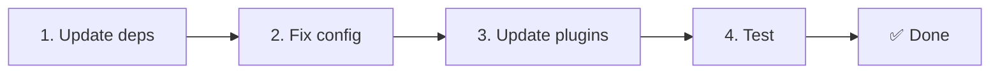

# 📦 Upgraden van v2.x naar v3.x

<Tip>
Zie [Migratie vanaf nuxt-i18n](/migration/from-nuxtjs-i18n) — die gids behandelt het overstappen vanaf het vue-i18n-ecosysteem, niet vanaf nuxt-i18n-micro v2.
</Tip>

v3.0.0 introduceert fundamentele architectuurwijzigingen: strategiepakketten, een nieuw cachingsysteem, gecentraliseerd localebeheer via `useI18nLocale()` en een opnieuw ontworpen redirect-pipeline. Deze sectie behandelt alle breaking changes en hoe je je code bijwerkt.

## Migratiestappen



## Overzicht van breaking changes

- **Locale-state** — Handmatig `useState` / `useCookie` → `useI18nLocale()`-composable
- **Toegang tot config** — `useRuntimeConfig().public.i18nConfig` → `getI18nConfig()` uit `#build/i18n.strategy.mjs`
- **Redirect-component** — Optie `fallbackRedirectComponentPath` → Server-redirect-plugin en client-route-middleware (automatisch)
- **`includeDefaultLocaleRoute`** — Ondersteund (deprecated) → Verwijderd, gebruik de `strategy`-optie
- **`experimental.hmr`** — Onder `experimental` → Optie op rootniveau
- **`previousPageFallback`** — Volledig verwijderd (de cumulatieve merge-strategie regelt dit automatisch)
- **Caching** — `useStorage('cache')` → `TranslationStorage`-singleton (`Symbol.for` op `globalThis`)
- **SSR-overdracht** — Runtime-config → Nuxt-payload (v3 gebruikte `useState`; chunks staan nu in `payload.data`, zie [Performance](/guides/performance#server-side-payload-transfer))
- **Strategieklassen** — Intern → Aparte pakketten (`@i18n-micro/route-strategy`, `@i18n-micro/path-strategy`)

## Verwijderd: `fallbackRedirectComponentPath`

De optie `fallbackRedirectComponentPath` en het fallback-component `locale-redirect.vue` zijn verwijderd. Redirect-logica wordt nu afgehandeld door:

1. **Server-middleware** (`i18n.global.ts`) — stelt `event.context.i18n.locale` in.
2. **Server-redirect-plugin** (`06.redirect.ts`, alleen server) — 302-redirects vóór render.
3. **Client-route-middleware** (`i18n-redirect.global.ts`) — SPA-redirects na hydratie.

```diff
 i18n: {
   strategy: 'prefix_except_default',
-  fallbackRedirectComponentPath: '~/components/MyRedirect.vue',
 }
```

Als je aangepaste redirect-logica in het fallback-component had staan, implementeer die dan in een server-plugin:

```ts
// plugins/i18n-loader.server.ts
export default defineNuxtPlugin({
  name: 'i18n-custom-redirect',
  enforce: 'pre',
  order: -10,
  setup() {
    const { setLocale } = useI18nLocale()
    // Je aangepaste detectielogica
    setLocale(detectedLocale)
  },
})
```

## Verwijderd: `includeDefaultLocaleRoute`

Gebruik in plaats daarvan de optie `strategy`:

- `includeDefaultLocaleRoute: true` → `strategy: 'prefix'`
- `includeDefaultLocaleRoute: false` → `strategy: 'prefix_except_default'` (de standaard)

```diff
 i18n: {
-  includeDefaultLocaleRoute: true,
+  strategy: 'prefix',
 }
```

## Toegang tot config: `getI18nConfig()` vervangt `useRuntimeConfig`

```diff
- const config = useRuntimeConfig()
- const cookieName = config.public.i18nConfig?.localeCookie || 'user-locale'
+ import { getI18nConfig } from '#build/i18n.strategy.mjs'
+ const { localeCookie: configCookie } = getI18nConfig()
+ const cookieName = configCookie ?? 'user-locale'
```

## Localebeheer: `useI18nLocale()` vervangt handmatige state

In v2 gebruikte je mogelijk `useState('i18n-locale')` of `useCookie('user-locale')` rechtstreeks. Gebruik in v3 de gecentraliseerde composable `useI18nLocale()`:

```diff
- const locale = useState('i18n-locale')
- const cookie = useCookie('user-locale')
- locale.value = 'fr'
- cookie.value = 'fr'
+ const { setLocale } = useI18nLocale()
+ setLocale('fr') // Werkt state en cookie atomair bij
```

Zie [Aangepaste taaldetectie](/guides/custom-language-detection) voor uitgewerkte voorbeelden.

## Experimentele opties verplaatst of verwijderd

`hmr` is verplaatst van `experimental` naar rootniveau. `previousPageFallback` is volledig verwijderd. De module gebruikt nu een cumulatieve deep-merge-strategie (dieptenveau 2) die vertalingen van de vorige pagina tijdens transitie-animaties automatisch behoudt, zelfs wanneer pagina's overlappende geneste sleutels delen. Na de transitie-animatie ruimt de `page:transition:finish`-hook oude sleutels op uit het geheugen.

```diff
 i18n: {
-  experimental: {
-    hmr: true,
-    previousPageFallback: true
-  }
+  hmr: true,
+  // previousPageFallback verwijderd — automatisch afgehandeld
 }
```

## Redirect-architectuur (v3)

Redirects worden nu automatisch afgehandeld door twee componenten:

1. **Server-side** (`06.redirect.ts`, alleen server): Draait tijdens SSR, geeft 302-redirects vóór elke paginarendering — geen "error flash".
2. **Client-side** (`i18n-redirect.global.ts`): Globale route-middleware bij SPA-navigatie; behoudt querystring en hash.

Localeprioriteit voor redirects:

1. `useState('i18n-locale')` — ingesteld via `useI18nLocale().setLocale()`.
2. Cookie — als `localeCookie` is geconfigureerd.
3. `Accept-Language`-header — als `autoDetectLanguage: true`.
4. `defaultLocale` — fallback.

Er zijn geen codewijzigingen nodig voor standaard-setups.

<Warning>
Voor `prefix`- en `prefix_except_default`-strategieën met `redirects: true`, stel je `localeCookie: 'user-locale'` in om locale-persistentie over paginaladingen mogelijk te maken. Zonder deze instelling gebruiken redirects alleen `Accept-Language` of `defaultLocale`.
</Warning>

## TypeScript: interne moduletypes (optioneel)

Als je type-fouten krijgt voor interne imports zoals `#i18n-internal/plural`, `#i18n-internal/strategy` of `#i18n-internal/config`, voeg dan de `imports`-sectie toe aan de `package.json` van je project:

```json
{
  "imports": {
    "#i18n-internal/plural": "nuxt-i18n-micro/internals",
    "#i18n-internal/strategy": "nuxt-i18n-micro/internals",
    "#i18n-internal/config": "nuxt-i18n-micro/internals"
  }
}
```
