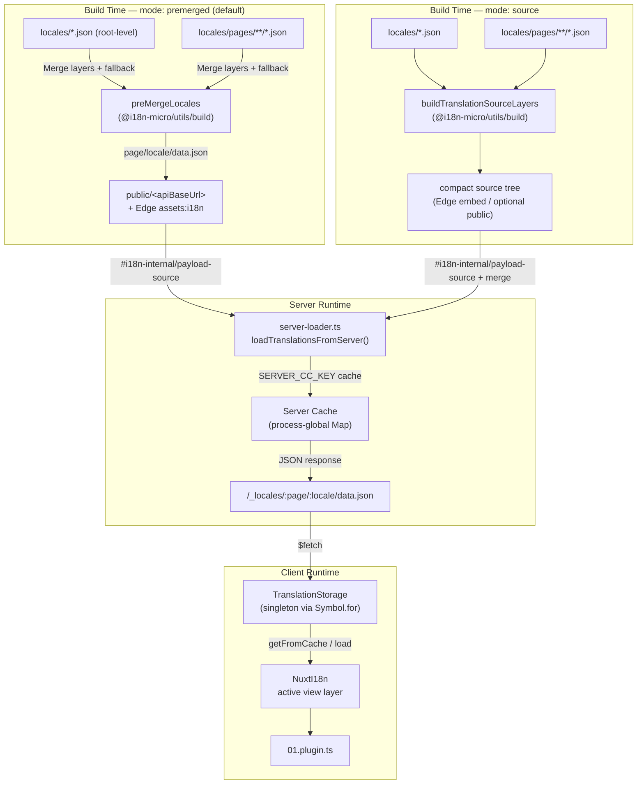

# 🗄️ Arkitektur for oversettelses-cache og lagring

## 📖 Oversikt

Nuxt I18n Micro v3 bruker en flerlags cachearkitektur for oversettelser. Payload-lasting avhenger av `translationPayloads.mode`:

- **`premerged`** (standard) — rot-, side-, fallback- og lagfiler flettes ved byggetid via `@i18n-micro/utils/build` til `\{page\}/\{locale\}/data.json`
- **`source`** — kompakte kildefiler beholdes for runtime-fletting via `@i18n-micro/utils/source-loader` og `@i18n-micro/utils/merge-source` (Edge inkluderer dem i Nitro `serverAssets`; Node leser dem fra `public/` når kopiert)

Denne siden beskriver hvordan den innebygde cachen fungerer og hvordan du utvider den for egendefinerte brukstilfeller (adminverktøy, eksterne API-er, cache-invalidering).

## 📊 Arkitekturoversikt

### Dataflyt



## 🧱 Kjernekomponenter

### 1. `TranslationStorage` (klient + server)

**Fil**: `src/runtime/utils/storage.ts`

En singleton-klasse som gir enhetlig oversettelseslagring for både klient og server. Bruker `Symbol.for('__NUXT_I18N_STORAGE_CACHE__')` på `globalThis` for å sikre at bare én instans eksisterer, selv når flere bundler er lastet.

**Nøkkelmetoder:**

| Metode                              | Beskrivelse                                                            |
| ----------------------------------- | ---------------------------------------------------------------------- |
| `getFromCache(locale, routeName?)`  | Synkron sjekk: returnerer cachet in-memory-data, eller `null`          |
| `load(locale, routeName?, options)` | Async-lasting med caching: sjekker cache først, henter deretter via `$fetch` |
| `clear()`                           | Tømmer hele cachen                                                     |

**Cache-nøkkelformat**: `\{locale\}:\{routeName\}` (f.eks. `en:index`, `fr:about`)

```typescript
import { translationStorage } from '../utils/storage'

// Synchronous cache check
const cached = translationStorage.getFromCache('en', 'index')

// Async load (with automatic caching)
const result = await translationStorage.load('en', 'index', {
  apiBaseUrl: '_locales',
  baseURL: '/',
  dateBuild: '2024-01-01',
})
// result.data — merged translations
// result.cacheKey — cache key used
```

### ⚙️ Deterministisk cache-busting (`i18n.dateBuild`)

Som standard genererer denne modulen `dateBuild` under byggetid ved hjelp av `Date.now()`. Den bygges deretter inn i den genererte `#build/i18n.strategy.mjs` og brukes som spørringsparameter (`?v=...`) for å invalidere fetchete oversettelses-cacher etter ombygging.

Hvis du trenger reproduserbare bygg (for eksempel for å forbedre chunk-cache-treffprosent i rullende utrullinger), sett en stabil verdi i `nuxt.config`:

```ts
export default defineNuxtConfig({
  i18n: {
    // Any stable string/number (git SHA, CI build number, release tag, etc.)
    dateBuild: process.env.GIT_SHA ?? 'local-dev',
  },
})
```

### 2. `loadTranslationsFromServer()` (kun server)

**Fil**: `src/runtime/server/utils/server-loader.ts`

Laster oversettelser for en lokale/side og cacher det flettede resultatet i en prosess-global `CacheControl`-map nøklet av `@i18n-micro/hmr/cache-keys` (`SERVER_CC_KEY`).

Atferd: SSR laster fra `#i18n-internal/payload-source` — **Node** `readFile` under `public/<apiBaseUrl>` (`\{page\}/\{locale\}/data.json` i premerged-modus), **Edge** `assets:i18n`. `premerged` leser én fil; `source` fletter rot/side/fallback via `@i18n-micro/utils/source-loader`.

```typescript
import { loadTranslationsFromServer } from '../server/utils/server-loader'

// Returns { data: Translations, json: string }
const { data, json } = await loadTranslationsFromServer('en', 'index')
```

### 3. Klient-lasting (ingen HTML-embed)

Ordbøker skrives **ikke** inn i `nuxtApp.payload`. Serveren holder dem i minnet for SSR-rendering; klientpluginen `await`-er `switchContext`, som laster `/\{apiBaseUrl\}/:page/:locale/data.json` (samme standardposisjonering som `@nuxtjs/i18n` med `experimental.preload: false`).

`NuxtI18n` holder den aktive view-lag-ordboken som brukes av `$t()` og `$has()`. `NuxtTranslationLoader` bytter lokale/rute-kontekst og fletter chunker inn i det laget.

### 4. Server-API-rute

**Rute**: `/_locales/\{page\}/\{locale\}/data.json`

**Fil**: `src/runtime/server/routes/i18n.ts`

Denne Nitro-ruten leverer flettede oversettelser for den aktive payload-modusen. Den kaller `loadTranslationsFromServer()` og returnerer resultatet som JSON.

I produksjon setter den også:

```http
Cache-Control: public, max-age={httpCacheDuration}, immutable
```

Standard `httpCacheDuration` er `31536000` (1 år). Dette er trygt fordi klienter forespør payloads med `?v=\{dateBuild\}` cache-busting. Sett `httpCacheDuration: 0` for å utelate headeren. Headeren brukes ikke i utvikling.

## 📥 Utvidelse: egendefinert oversettelseslasting

### Les fra cache (server-rute)

```ts
// server/api/i18n/load-cache.[post].ts
import { defineEventHandler, readBody } from 'h3'
import { loadTranslationsFromServer } from '#imports'

export default defineEventHandler(async (event) => {
  const { page, locale } = await readBody<{ page: string; locale: string }>(event)
  const { data } = await loadTranslationsFromServer(locale, page)
  return { locale, page, data }
})
```

### Oppdater oversettelser (fil + invalider cache)

```ts
// server/api/i18n/update.[post].ts
import { defineEventHandler, readBody, createError } from 'h3'
import { join } from 'node:path'
import { readFile, writeFile } from 'node:fs/promises'
import { deepMergeTranslations } from '@i18n-micro/utils/deep-merge'

export default defineEventHandler(async (event) => {
  const { path, updates } = await readBody<{ path: string; updates: Record<string, unknown> }>(event)

  if (!path || !updates) {
    throw createError({ statusCode: 400, statusMessage: 'Missing path or updates' })
  }

  const fullPath = join('locales', path)
  let existing: Record<string, unknown> = {}

  try {
    const content = await readFile(fullPath, 'utf-8')
    existing = JSON.parse(content) as Record<string, unknown>
  } catch {
    // File does not exist — create new
  }

  const merged = deepMergeTranslations(existing, updates)
  await writeFile(fullPath, JSON.stringify(merged, null, 2), 'utf-8')

  return { success: true, path, updated: merged }
})
```


## 🧹 Tømme cache

### Programmatisk cache-tømming (klient)

Bruk den innebygde `$clearCache`-metoden:

```vue
<script setup>
const { $clearCache } = useNuxtApp()

// Clears both TranslationStorage and plugin-level cache
$clearCache()
</script>
```

### Cacheatferd på server

Server-side-cachen (`loadTranslationsFromServer`) er prosess-global og består til:

- Server-prosessen starter på nytt
- En ny utrulling detekteres (annen `dateBuild`-verdi)

For serverless-miljøer får hver kaldstart en fersk cache.

## ⚙️ Serverless-konfigurasjon

For serverless-miljøer (Cloudflare Workers, AWS Lambda) bruker den innebygde cachen in-memory `Map`-objekter. Ingen ekstern lagringskonfigurasjon er nødvendig for selve oversettelses-cachen.

Nitro-lagring for kilde-oversettelsesfiler kan imidlertid trenge konfigurasjon:

```ts
export default defineNuxtConfig({
  nitro: {
    storage: {
      // Only needed if default file-system storage is unavailable
      'assets:server': {
        driver: 'cloudflare-kv-binding',
        binding: 'MY_KV_NAMESPACE',
      },
    },
  },
})
```

## 💡 Viktige forskjeller fra v2

| Aspekt           | v2                            | v3                                                                       |
| ---------------- | ----------------------------- | ------------------------------------------------------------------------ |
| Klient-cache     | `useStorage('cache')`         | `TranslationStorage`-singleton (Symbol.for på globalThis)                |
| SSR-overføring   | Runtime-konfigurasjon         | Fulle chunker via `payload.data` (v3.0 brukte `useState`)                |
| Server-cache     | Nitro cache-lagring           | Prosess-global `Map` via `Symbol.for`                                    |
| Flettelogikk     | Klient-side                   | Byggetid (`premerged`) eller kjøretid (`source`) via `@i18n-micro/utils/*` |
| Cache-nøkkelformat | `i18n:merged:\{page\}:\{locale\}` | `\{locale\}:\{routeName\}`                                                |

## 📚 Relatert

- [Ytelsesguide](/guides/performance) — Hvordan caching påvirker ytelse
- [Server-side oversettelser](/guides/server-side-translations) — Bruk av oversettelser i server-ruter
- [Firebase-utrulling](/guides/firebase) — Utrullingsspesifikke cachehensyn
