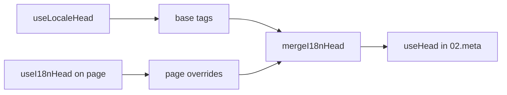

# `useI18nHead`-composable

`useI18nHead` lar deg tilpasse i18n SEO-tagger **per side** uten en egendefinert meta-plugin. Når `meta: true`, fletter modulen inputen din oppå utdataene fra [`useLocaleHead`](/api/composables/use-locale-head).

Typiske tilfeller:

- **CMS / blogg-artikler** — bare enkelte lokaler er oversatt; alternative URL-er avviker per språk (ulike slugs eller stier).
- **Dynamisk canonical** — canonical-URL-en må samsvare med artikkel-URL-en fra API-et, ikke `$switchLocalePath`.
- **Ekstra Open Graph** — `og:title`, `og:description`, `og:image` ved siden av autogenererte `og:locale` / `og:url`.
- **Delvis kontroll** — behold modul-generert canonical og `og:url`, men erstatt kun `hreflang` og `og:locale:alternate`.

---

## Signatur

{/* generated:symbol:useI18nHead — do not edit; run `pnpm run docs:generate` */}

```ts
useI18nHead(input?: MaybeRefOrGetter<I18nHeadInput | null>): { pageHead: any; resetPageHead: () => void }
```

Registrer overstyringer på sidenivå for i18n SEO-head-tagger.
Flettet oppå utdataene fra `useLocaleHead` av `02.meta`-pluginen.

| Parameter | Type | Beskrivelse |
| --- | --- | --- |
| `input` *(valgfri)* | `MaybeRefOrGetter<I18nHeadInput \| null>` |  |

{/* /generated:symbol:useI18nHead */}

## Hvordan den passer inn i pipelinen



Du kaller `useI18nHead` i en sidekomponent. `02.meta`-pluginen anvender overstyringene etter hver `updateMeta()` (ruteendring, `$setI18nRouteParams`, `page:finish` på klienten).

---

## Eksempel 1 — Artikkel med oversettelser bare i enkelte lokaler

Vanlig mønster: API-et returnerer hvilke lokaler som finnes og deres absolutte eller relative URL-er.

```ts
interface Article {
  title: string
  slug: string
  /** Locale code → page URL (absolute or site-relative) */
  locales: Record<string, string>
}
```

```vue
<script setup lang="ts">
const route = useRoute()
const { data: article } = await useFetch<Article>(`/api/articles/${route.params.slug}`)

const localeCodes = computed(() => Object.keys(article.value?.locales ?? {}))

useI18nHead(() => {
  if (!article.value) return null

  return {
    meta: [
      { property: 'og:title', content: article.value.title },
      { property: 'og:type', content: 'article' },
    ],
    replace: {
      hreflang: localeCodes.value.map((locale) => ({
        rel: 'alternate',
        hreflang: locale,
        href: article.value!.locales[locale]!,
      })),
      ogAlternates: localeCodes.value,
    },
  }
})
</script>
```

`ogAlternates` tar **lokale-koder** fra din `i18n.locales`-konfigurasjon. Verdier for `og:locale:alternate` løses via `locale.og` eller `iso` (Open Graph-formatet `en_US`).

---

## Eksempel 2 — Artikkel med per-lokale slugs (`$defineI18nRoute` + `$setI18nRouteParams`)

Når URL-er bygges fra lokaliserte rute-maler og dynamiske parametere:

```vue
<script setup lang="ts">
const { $defineI18nRoute, $setI18nRouteParams } = useNuxtApp()
const route = useRoute()

const { data: article } = await useFetch(`/api/articles/${route.params.slug}`)

$defineI18nRoute({
  localeRoutes: {
    en: '/blog/[slug]',
    de: '/de/blog/[slug]',
    fr: '/fr/blog/[slug]',
  },
})

if (article.value) {
  $setI18nRouteParams({
    en: { slug: article.value.slugEn },
    de: { slug: article.value.slugDe },
    fr: { slug: article.value.slugFr },
  })

  const availableLocales = article.value.availableLocales as string[]

  useI18nHead({
    meta: [{ property: 'og:title', content: article.value.title }],
    replace: {
      hreflang: availableLocales.map((locale) => ({
        rel: 'alternate',
        hreflang: locale,
        href: article.value!.urls[locale],
      })),
      ogAlternates: availableLocales,
    },
  })
}
</script>
```

Modul-genererte alternates ville listet **alle** konfigurerte lokaler. `replace.hreflang` begrenser tagger til lokaler som faktisk har en oversettelse.

---

## Eksempel 3 — Egendefinert `x-default` for artikkel-URL i standardlokalen

Som standard peker `x-default` på standardlokalens URL fra `$switchLocalePath`. For artikler, pek den mot standardoversettelsens URL:

```vue
<script setup lang="ts">
const { $defaultLocale } = useNuxtApp()
const article = await loadArticle()

const defaultLocale = $defaultLocale() ?? 'en'
const defaultHref = article.locales[defaultLocale]

useI18nHead({
  replace: {
    hreflang: Object.entries(article.locales).map(([locale, href]) => ({
      rel: 'alternate',
      hreflang: locale,
      href,
    })),
    xDefault: defaultHref ? { rel: 'alternate', hreflang: 'x-default', href: defaultHref } : false,
    ogAlternates: Object.keys(article.locales),
  },
})
</script>
```

---

## Eksempel 4 — Erstatt canonical og `og:url` fra API-data

Når canonical må samsvare med en CMS-levert URL (multi-domene, egendefinert sti eller forhåndsbygget absolutt URL):

```vue
<script setup lang="ts">
const article = await loadArticle()
const canonical = article.canonicalUrl // e.g. https://www.example.com/en/blog/my-post

useI18nHead({
  replace: {
    canonical,
    ogUrl: canonical,
    hreflang: buildAlternateLinks(article),
    ogAlternates: Object.keys(article.locales),
  },
  meta: [
    { property: 'og:title', content: article.title },
    { name: 'description', content: article.excerpt },
  ],
})
</script>
```

---

## Eksempel 5 — Behold auto canonical / `og:url`, erstatt kun alternates

Hvis `$switchLocalePath` + `$setI18nRouteParams` allerede produserer korrekt canonical og `og:url`, erstatt kun oppdagelses-tagger:

```vue
<script setup lang="ts">
const article = await loadArticle()

useI18nHead({
  replace: {
    hreflang: buildAlternateLinks(article),
    ogAlternates: Object.keys(article.locales),
  },
})
</script>
```

---

## Eksempel 6 — Full head for en innholdsdetalj-side (meta + lenker)

Mønster tilsvarende å splitte "sidemeta" og "alternate-lenker" i separate hjelpere — kombinert i ett kall:

```vue
<script setup lang="ts">
const article = await loadArticle()
const alternates = Object.entries(article.locales).map(([locale, href]) => ({
  rel: 'alternate' as const,
  hreflang: locale,
  href: normalizeSeoUrl(href), // strip ?query and #hash if needed
}))

useI18nHead({
  meta: [
    { property: 'og:title', content: article.title },
    { property: 'og:description', content: article.description },
    { property: 'og:image', content: article.imageUrl },
    { name: 'twitter:card', content: 'summary_large_image' },
    { name: 'twitter:title', content: article.title },
  ],
  replace: {
    canonical: article.canonicalUrl,
    ogUrl: article.canonicalUrl,
    hreflang: alternates,
    ogAlternates: Object.keys(article.locales),
  },
})
</script>
```

```ts
/** Remove query and hash — useful when CMS URLs must be clean for SEO */
function normalizeSeoUrl(href: string): string {
  try {
    const url = new URL(href, 'https://placeholder.local')
    url.search = ''
    url.hash = ''
    return href.startsWith('http') ? url.href : `${url.pathname}`
  } catch {
    return href.split(/[?#]/)[0] ?? href
  }
}
```

---

## Eksempel 7 — To innholdstyper, samme mønster (nyheter vs guider)

Samme API-form, ulike rutenavn — gjenbruk en liten hjelper:

```ts
// composables/useArticleHead.ts
import type { I18nHeadInput } from '@i18n-micro/types'

interface LocalizedContent {
  title: string
  locales: Record<string, string>
  canonicalUrl?: string
}

export function buildArticleHead(content: LocalizedContent): I18nHeadInput {
  const localeCodes = Object.keys(content.locales)
  const canonical = content.canonicalUrl ?? content.locales.en

  return {
    meta: [{ property: 'og:title', content: content.title }],
    replace: {
      canonical,
      ogUrl: canonical,
      hreflang: localeCodes.map((locale) => ({
        rel: 'alternate',
        hreflang: locale,
        href: content.locales[locale]!,
      })),
      ogAlternates: localeCodes,
    },
  }
}
```

```vue
<!-- pages/blog/[slug].vue -->
<script setup lang="ts">
const article = await loadArticle()
useI18nHead(buildArticleHead(article))
</script>
```

```vue
<!-- pages/guides/[slug].vue -->
<script setup lang="ts">
const guide = await loadGuide()
useI18nHead(buildArticleHead(guide))
</script>
```

---

## Eksempel 8 — Deaktiver innebygde alternates, oppgi egen liste

Ekvivalent med å deaktivere modulens hreflang-generator og sende en egendefinert liste (ingen duplikate alternate-sett):

```vue
<script setup lang="ts">
const article = await loadArticle()

useI18nHead({
  disable: ['hreflang', 'x-default', 'og-alternates'],
  link: Object.entries(article.locales).map(([locale, href]) => ({
    rel: 'alternate',
    hreflang: locale,
    href,
  })),
  replace: {
    ogAlternates: Object.keys(article.locales),
  },
})
</script>
```

Eller foretrekk `replace.hreflang` uten `disable` — den erstatter alle `rel="alternate"`-lenker i ett steg.

---

## Eksempel 9 — Landingsside: bare ekstra OG, behold alle i18n-tagger

```vue
<script setup lang="ts">
const { t } = useI18n()

useI18nHead({
  meta: [
    { property: 'og:title', content: t('landing.ogTitle') },
    { property: 'og:description', content: t('landing.ogDescription') },
  ],
})
</script>
```

---

## Eksempel 10 — Produktside: deaktiver hreflang for et eksperiment i én lokale

```vue
<script setup lang="ts">
useI18nHead({
  disable: ['hreflang', 'x-default'],
  // canonical, og:locale, og:url still generated
})
</script>
```

---

## Eksempel 11 — Reaktive oppdateringer etter klient-side fetch

```vue
<script setup lang="ts">
const article = ref<Article | null>(null)

onMounted(async () => {
  article.value = await $fetch('/api/articles/latest')
})

useI18nHead(() => {
  if (!article.value) return null
  return {
    meta: [{ property: 'og:title', content: article.value.title }],
    replace: {
      hreflang: Object.entries(article.value.locales).map(([locale, href]) => ({
        rel: 'alternate',
        hreflang: locale,
        href,
      })),
    },
  }
})
</script>
```

Head oppdateres på `page:finish` og når `pageHead`-tilstanden endres.

---

## Eksempel 12 — HTTPS-origin bak en reverse proxy

Hvis du tidligere løste en "public origin"-composable for canonical / alternate absolutte URL-er, bruk modul-konfigurasjon i stedet:

```ts
// nuxt.config.ts
export default defineNuxtConfig({
  i18n: {
    meta: true,
    // undefined = origin from current request (multi-domain friendly)
    metaBaseUrl: undefined,
    metaTrustForwardedHost: true,
    metaTrustForwardedProto: true,
  },
})
```

Send deretter **stier eller fulle URL-er** i `replace.hreflang` / `replace.canonical`. Modulen bruker `useRequestURL` med `X-Forwarded-Host` / `X-Forwarded-Proto` på SSR.

---

## API-referanse

### `meta`

Ekstra `<meta>`-tagger. Dedupliseres etter `id`, `property` eller `name`.

### `link`

Ekstra `<link>`-tagger. Dedupliseres etter `id` eller `rel` + `hreflang`.

### `htmlAttrs`

Flettet inn i `<html>`-attributter fra `useLocaleHead` (`lang`, `dir`).

### `replace`

| Nøkkel         | Type                      | Effekt                                         |
| -------------- | ------------------------- | ---------------------------------------------- |
| `canonical`    | `string \| false`         | Erstatt eller fjern canonical-lenke            |
| `hreflang`     | `I18nHeadLink[] \| false` | Erstatt eller fjern alle `rel="alternate"`-lenker |
| `xDefault`     | `I18nHeadLink \| false`   | Erstatt eller fjern `hreflang="x-default"`     |
| `ogLocale`     | `string \| false`         | Erstatt eller fjern `og:locale`                |
| `ogUrl`        | `string \| false`         | Erstatt eller fjern `og:url`                   |
| `ogAlternates` | `string[] \| false`       | Bygg `og:locale:alternate` på nytt for lokale-koder |

### `disable`

| Verdi           | Fjerner                                  |
| --------------- | ---------------------------------------- |
| `hreflang`      | Lokale alternate-lenker (ikke `x-default`) |
| `x-default`     | `hreflang="x-default"`-lenke             |
| `canonical`     | Canonical-lenke                          |
| `og`            | `og:locale` og `og:url`                  |
| `og-alternates` | `og:locale:alternate`-tagger             |
| `html`          | `lang` / `dir` på `<html>`               |

---

## `useLocaleHead` vs `useI18nHead`

| Composable      | Omfang                | Når du skal bruke                          |
| --------------- | -------------------- | ------------------------------------------ |
| `useLocaleHead` | Globalt / manuell head | `meta: false`, fullt egendefinert `useHead`-oppsett |
| `useI18nHead`   | Overstyringer per side | `meta: true`, tilpass spesifikke sider     |

Når `meta: true`, trenger du **ikke** `useLocaleHead` på sider som bare bruker `useI18nHead`.

---

## Migrere fra en egendefinert i18n-head-plugin

Mange prosjekter vedlikeholder en egendefinert plugin som:

- fletter sidespesifikke alternate-lenker fra delt state;
- filtrerer dupliserte regionale `hreflang`-oppføringer;
- normaliserer `og:locale`-verdier;
- fjerner spørringsstrenger fra SEO-URL-er.

Du kan erstatte det med `useI18nHead` på hver innholdsside og modul-standarder.

| Tidligere tilnærming                                  | Med `useI18nHead`                                    |
| ----------------------------------------------------- | ---------------------------------------------------- |
| Delt state + "hvilke lokaler finnes for denne artikkelen" | `replace: \{ ogAlternates: localeCodes \}`         |
| Separat hjelper som bygger `rel="alternate"`-lenker   | `replace: \{ hreflang: links \}`                    |
| Egendefinert plugin som fletter sidestate inn i head  | Innebygd fletting i `02.meta`                        |
| Egendefinert "public origin" for absolutte URL-er     | `metaBaseUrl` + videresendte headere (se Eksempel 12) |
| Kort `og:locale` (`en` i stedet for `en_US`)          | Sett `locale.og` eller bruk `iso` → `en_US` (OG-protokoll) |

**`hreflang` fra `iso`:** hver lokale utsteder én alternate med `hreflang = iso || code`. Ruting-`code` brukes aldri når `iso` er satt (unngår ugyldige tagger som `hreflang="mx"`). Meld deg på bar-språk-fallbacks (`es-ES` → også `es`) med `hreflangBaseLanguage: true` — avledet fra `iso`, ikke `code`. For fullt egendefinerte lister, bruk `replace.hreflang`.

**JSON-LD:** `useI18nHead` genererer ikke strukturert data. Behold `useHead(\{ script: [...] \})` eller en dedikert JSON-LD-hjelper ved siden av.

---

## Se også

- [SEO-guide](/guides/seo) — automatisk meta-generering og overstyringer på sidenivå
- [`useLocaleHead`](/api/composables/use-locale-head) — lavnivå-head-API
